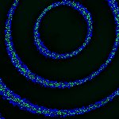
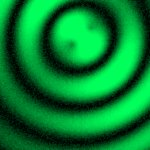

|  Method            | Parameters       | Quick Start Reader | Original Reader | Delta  |
| -------------------|------------------|--------------------|-----------------|------- |
| Initialization     |                  |18 ms|25 ms|        |
| Reader Size (Mb)     |                  |1.97|2.58|        |
| getStageLabelName| Image 0 | P1| Scene position #0| |
# [S=1_CH=2.czi](https://zenodo.org/record/7015307/files/S%3D1_CH%3D2.czi) report
 - **Autostitch** = false
 - ZeissCZIReader v7.1.0
 - ZeissQuickStartCZIReader v0.2.4-SNAPSHOT

# Images 

| Series            | Quick Start Reader | Size | Original Reader | Size | #Diffs |
|-------------------|--------------------|------|-----------------|------|--------|
| Read time (all)   |45 ms|------|56 ms|------|--------|
|0||X:256 Y:256 C:2 Z:1 T:1||X:256 Y:256 C:2 Z:1 T:1|0|

# Metadata

