# [S=2_2x2_T=1_Z=4_CH=1.czi](https://zenodo.org/record/7015307/files/S%3D2_2x2_T%3D1_Z%3D4_CH%3D1.czi) report
 - **Autostitch** = false
 - ZeissCZIReader v6.14.0
 - ZeissQuickStartCZIReader v0.1.8-SNAPSHOT

# Images 

| Series            | Quick Start Reader | Size | Original Reader | Size | #Diffs |
|-------------------|--------------------|------|-----------------|------|--------|
| Read time (all)   |111 ms|------|117 ms|------|--------|
|0|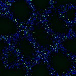|X:256 Y:256 C:1 Z:4 T:1||X:256 Y:256 C:1 Z:4 T:1|0|
|1|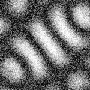|X:256 Y:256 C:1 Z:4 T:1|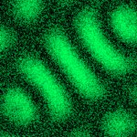|X:256 Y:256 C:1 Z:4 T:1|0|
|2||X:256 Y:256 C:1 Z:4 T:1|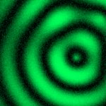|X:256 Y:256 C:1 Z:4 T:1|0|
|3|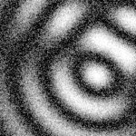|X:256 Y:256 C:1 Z:4 T:1|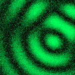|X:256 Y:256 C:1 Z:4 T:1|0|
|4|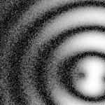|X:256 Y:256 C:1 Z:4 T:1||X:256 Y:256 C:1 Z:4 T:1|0|
|5|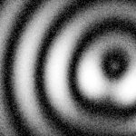|X:256 Y:256 C:1 Z:4 T:1|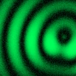|X:256 Y:256 C:1 Z:4 T:1|0|
|6|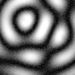|X:256 Y:256 C:1 Z:4 T:1|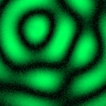|X:256 Y:256 C:1 Z:4 T:1|0|
|7|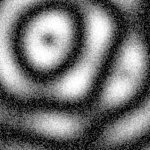|X:256 Y:256 C:1 Z:4 T:1|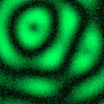|X:256 Y:256 C:1 Z:4 T:1|0|

# Metadata

|  Method            | Parameters       | Quick Start Reader | Original Reader | Delta  |
| -------------------|------------------|--------------------|-----------------|------- |
| Initialization     |                  |20 ms|19 ms|        |
| Reader Size (Mb)     |                  |2.03|2.64|        |
| getStageLabelName| Image 0 | B2| Scene position #0| |
| getStageLabelName| Image 1 | B2| Scene position #1| |
| getStageLabelName| Image 2 | B2| Scene position #2| |
| getStageLabelName| Image 3 | B2| Scene position #3| |
| getStageLabelName| Image 4 | B3| Scene position #4| |
| getStageLabelName| Image 5 | B3| Scene position #5| |
| getStageLabelName| Image 6 | B3| Scene position #6| |
| getStageLabelName| Image 7 | B3| Scene position #7| |
| getPlaneDeltaT| Image 0 Plane 1 |  0.766 s |  0.757 s | 0.009 s |
| getPlaneDeltaT| Image 0 Plane 2 |  0.961 s |  0.958 s | 0.003 s |
| getPlaneDeltaT| Image 1 Plane 1 |  1.874 s |  1.878 s | 0.004 s |
| getPlaneDeltaT| Image 1 Plane 2 |  2.069 s |  2.064 s | 0.005 s |
| getPlaneDeltaT| Image 2 Plane 1 |  2.980 s |  2.976 s | 0.004 s |
| getPlaneDeltaT| Image 2 Plane 2 |  3.170 s |  3.162 s | 0.008 s |
| getPlaneDeltaT| Image 3 Plane 1 |  4.042 s |  4.057 s | 0.015 s |
| getPlaneDeltaT| Image 3 Plane 2 |  4.228 s |  4.229 s | 0.001 s |
| getPlaneDeltaT| Image 4 Plane 1 |  5.101 s |  5.110 s | 0.009 s |
| getPlaneDeltaT| Image 4 Plane 2 |  5.292 s |  5.297 s | 0.005 s |
| getPlaneDeltaT| Image 5 Plane 2 |  6.366 s |  6.365 s | 0.001 s |
