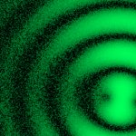

# [S=2_2x2_T=1_Z=4_CH=1.czi](https://zenodo.org/record/7015307/files/S%3D2_2x2_T%3D1_Z%3D4_CH%3D1.czi) report
 - **Autostitch** = false
 - ZeissCZIReader v6.13.0
 - ZeissQuickStartCZIReader v0.1.4-SNAPSHOT

# Images 

| Series            | Quick Start Reader | Size | Original Reader | Size |
|-------------------|--------------------|------|-----------------|------|
| Read time (all)   |107 ms|------|115 ms|------|
|0||X:256 Y:256 C:1 Z:4 T:1||X:256 Y:256 C:1 Z:4 T:1|
|1||X:256 Y:256 C:1 Z:4 T:1||X:256 Y:256 C:1 Z:4 T:1|
|2||X:256 Y:256 C:1 Z:4 T:1||X:256 Y:256 C:1 Z:4 T:1|
|3||X:256 Y:256 C:1 Z:4 T:1||X:256 Y:256 C:1 Z:4 T:1|
|4||X:256 Y:256 C:1 Z:4 T:1||X:256 Y:256 C:1 Z:4 T:1|
|5||X:256 Y:256 C:1 Z:4 T:1||X:256 Y:256 C:1 Z:4 T:1|
|6||X:256 Y:256 C:1 Z:4 T:1||X:256 Y:256 C:1 Z:4 T:1|
|7||X:256 Y:256 C:1 Z:4 T:1||X:256 Y:256 C:1 Z:4 T:1|

# Metadata

|  Method            | Parameters       | Quick Start Reader | Original Reader | Delta  |
| -------------------|------------------|--------------------|-----------------|------- |
| Initialization     |                  |21 ms|19 ms|        |
| getStageLabelName| Image 0 | B2| Scene position #0| |
| getStageLabelName| Image 1 | B2| Scene position #1| |
| getStageLabelName| Image 2 | B2| Scene position #2| |
| getStageLabelName| Image 3 | B2| Scene position #3| |
| getStageLabelName| Image 4 | B3| Scene position #4| |
| getStageLabelName| Image 5 | B3| Scene position #5| |
| getStageLabelName| Image 6 | B3| Scene position #6| |
| getStageLabelName| Image 7 | B3| Scene position #7| |
| getPlaneDeltaT| Image 0 Plane 1 |  0.717 s |  0.757 s | 0.040 s |
| getPlaneDeltaT| Image 0 Plane 2 |  0.863 s |  0.958 s | 0.095 s |
| getPlaneDeltaT| Image 0 Plane 3 |  1.010 s |  1.156 s | 0.146 s |
| getPlaneDeltaT| Image 1 Plane 1 |  1.825 s |  1.878 s | 0.053 s |
| getPlaneDeltaT| Image 1 Plane 2 |  1.971 s |  2.064 s | 0.092 s |
| getPlaneDeltaT| Image 1 Plane 3 |  2.118 s |  2.265 s | 0.147 s |
| getPlaneDeltaT| Image 2 Plane 1 |  2.932 s |  2.976 s | 0.043 s |
| getPlaneDeltaT| Image 2 Plane 2 |  3.075 s |  3.162 s | 0.087 s |
| getPlaneDeltaT| Image 2 Plane 3 |  3.217 s |  3.360 s | 0.142 s |
| getPlaneDeltaT| Image 3 Plane 1 |  3.996 s |  4.057 s | 0.061 s |
| getPlaneDeltaT| Image 3 Plane 2 |  4.135 s |  4.229 s | 0.094 s |
| getPlaneDeltaT| Image 3 Plane 3 |  4.274 s |  4.413 s | 0.139 s |
| getPlaneDeltaT| Image 4 Plane 1 |  5.053 s |  5.110 s | 0.057 s |
| getPlaneDeltaT| Image 4 Plane 2 |  5.196 s |  5.297 s | 0.100 s |
| getPlaneDeltaT| Image 4 Plane 3 |  5.340 s |  5.484 s | 0.144 s |
| getPlaneDeltaT| Image 5 Plane 1 |  6.134 s |  6.181 s | 0.047 s |
| getPlaneDeltaT| Image 5 Plane 2 |  6.273 s |  6.365 s | 0.092 s |
| getPlaneDeltaT| Image 5 Plane 3 |  6.413 s |  6.552 s | 0.139 s |
| getPlaneDeltaT| Image 6 Plane 1 |  7.199 s |  7.245 s | 0.046 s |
| getPlaneDeltaT| Image 6 Plane 2 |  7.337 s |  7.430 s | 0.092 s |
| getPlaneDeltaT| Image 6 Plane 3 |  7.476 s |  7.615 s | 0.139 s |
| getPlaneDeltaT| Image 7 Plane 1 |  8.255 s |  8.305 s | 0.049 s |
| getPlaneDeltaT| Image 7 Plane 2 |  8.405 s |  8.504 s | 0.099 s |
| getPlaneDeltaT| Image 7 Plane 3 |  8.554 s |  8.704 s | 0.150 s |
