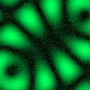
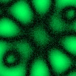

# [S=2_2x2_T=3_CH=1.czi](https://zenodo.org/record/7015307/files/S%3D2_2x2_T%3D3_CH%3D1.czi) report
 - **Autostitch** = false
 - ZeissCZIReader v6.14.0
 - ZeissQuickStartCZIReader v0.1.7-SNAPSHOT

# Images 

| Series            | Quick Start Reader | Size | Original Reader | Size |
|-------------------|--------------------|------|-----------------|------|
| Read time (all)   |116 ms|------|113 ms|------|
|0||X:256 Y:256 C:1 Z:1 T:3||X:256 Y:256 C:1 Z:1 T:3|
|1||X:256 Y:256 C:1 Z:1 T:3||X:256 Y:256 C:1 Z:1 T:3|
|2||X:256 Y:256 C:1 Z:1 T:3||X:256 Y:256 C:1 Z:1 T:3|
|3||X:256 Y:256 C:1 Z:1 T:3||X:256 Y:256 C:1 Z:1 T:3|
|4||X:256 Y:256 C:1 Z:1 T:3||X:256 Y:256 C:1 Z:1 T:3|
|5||X:256 Y:256 C:1 Z:1 T:3||X:256 Y:256 C:1 Z:1 T:3|
|6||X:256 Y:256 C:1 Z:1 T:3||X:256 Y:256 C:1 Z:1 T:3|
|7||X:256 Y:256 C:1 Z:1 T:3||X:256 Y:256 C:1 Z:1 T:3|

# Metadata

|  Method            | Parameters       | Quick Start Reader | Original Reader | Delta  |
| -------------------|------------------|--------------------|-----------------|------- |
| Initialization     |                  |24 ms|19 ms|        |
| Reader Size (Mb)     |                  |2.02|2.60|        |
| getStageLabelName| Image 0 | B2| Scene position #0| |
| getStageLabelName| Image 1 | B2| Scene position #1| |
| getStageLabelName| Image 2 | B2| Scene position #2| |
| getStageLabelName| Image 3 | B2| Scene position #3| |
| getStageLabelName| Image 4 | B3| Scene position #4| |
| getStageLabelName| Image 5 | B3| Scene position #5| |
| getStageLabelName| Image 6 | B3| Scene position #6| |
| getStageLabelName| Image 7 | B3| Scene position #7| |
| getPlaneDeltaT| Image 0 Plane 1 |  1.339 s |  1.870 s | 0.531 s |
| getPlaneDeltaT| Image 0 Plane 2 |  2.415 s |  3.490 s | 1.075 s |
| getPlaneDeltaT| Image 1 Plane 1 |  1.530 s |  2.083 s | 0.553 s |
| getPlaneDeltaT| Image 1 Plane 2 |  2.595 s |  3.660 s | 1.065 s |
| getPlaneDeltaT| Image 2 Plane 1 |  1.725 s |  2.286 s | 0.561 s |
| getPlaneDeltaT| Image 2 Plane 2 |  2.786 s |  3.846 s | 1.060 s |
| getPlaneDeltaT| Image 3 Plane 1 |  1.926 s |  2.472 s | 0.546 s |
| getPlaneDeltaT| Image 3 Plane 2 |  2.986 s |  4.045 s | 1.059 s |
| getPlaneDeltaT| Image 4 Plane 1 |  2.143 s |  2.673 s | 0.530 s |
| getPlaneDeltaT| Image 4 Plane 2 |  3.201 s |  4.260 s | 1.059 s |
| getPlaneDeltaT| Image 5 Plane 1 |  2.322 s |  2.888 s | 0.566 s |
| getPlaneDeltaT| Image 5 Plane 2 |  3.390 s |  4.459 s | 1.069 s |
| getPlaneDeltaT| Image 6 Plane 1 |  2.529 s |  3.090 s | 0.561 s |
| getPlaneDeltaT| Image 6 Plane 2 |  3.603 s |  4.677 s | 1.074 s |
| getPlaneDeltaT| Image 7 Plane 1 |  2.728 s |  3.277 s | 0.549 s |
| getPlaneDeltaT| Image 7 Plane 2 |  3.803 s |  4.878 s | 1.075 s |
