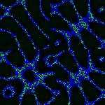

# [S=2_2x2_T=3_CH=1.czi](https://zenodo.org/record/7015307/files/S%3D2_2x2_T%3D3_CH%3D1.czi) report
 - **Autostitch** = true
 - ZeissCZIReader v6.14.0
 - ZeissQuickStartCZIReader v0.1.8-SNAPSHOT

# Images 

| Series            | Quick Start Reader | Size | Original Reader | Size | #Diffs |
|-------------------|--------------------|------|-----------------|------|--------|
| Read time (all)   |70 ms|------|116 ms|------|--------|
|0||X:486 Y:486 C:1 Z:1 T:3||X:486 Y:486 C:1 Z:1 T:3|0|
|1||X:243 Y:243 C:1 Z:1 T:3||X:243 Y:243 C:1 Z:1 T:3|0|
|2||X:486 Y:486 C:1 Z:1 T:3||X:486 Y:486 C:1 Z:1 T:3|0|
|3||X:243 Y:243 C:1 Z:1 T:3||X:243 Y:243 C:1 Z:1 T:3|0|

# Metadata

|  Method            | Parameters       | Quick Start Reader | Original Reader | Delta  |
| -------------------|------------------|--------------------|-----------------|------- |
| Initialization     |                  |19 ms|19 ms|        |
| Reader Size (Mb)     |                  |2.00|2.59|        |
| getStageLabelName| Image 0 | B2| Scene position #0| |
| getStageLabelX| Image 0 | 26975.700 um | 13500.000 um | 13475.700 um |
| getStageLabelY| Image 0 | 34975.700 um | 17500.000 um | 17475.700 um |
| getStageLabelName| Image 1 | B2| Scene position #1| |
| getStageLabelX| Image 1 | 26975.700 um | 13500.000 um | 13475.700 um |
| getStageLabelY| Image 1 | 34975.700 um | 17500.000 um | 17475.700 um |
| getPixelsPhysicalSizeX| Image 1 | 0.200 um | 0.100 um | 0.100 um |
| getPixelsPhysicalSizeY| Image 1 | 0.200 um | 0.100 um | 0.100 um |
| getStageLabelName| Image 2 | B3| Scene position #2| |
| getStageLabelX| Image 2 | 35975.700 um | 22500.000 um | 13475.700 um |
| getStageLabelY| Image 2 | 34975.700 um | 17500.000 um | 17475.700 um |
| getStageLabelName| Image 3 | B3| Scene position #3| |
| getStageLabelX| Image 3 | 35975.700 um | 22500.000 um | 13475.700 um |
| getStageLabelY| Image 3 | 34975.700 um | 17500.000 um | 17475.700 um |
| getPixelsPhysicalSizeX| Image 3 | 0.200 um | 0.100 um | 0.100 um |
| getPixelsPhysicalSizeY| Image 3 | 0.200 um | 0.100 um | 0.100 um |
| getPlanePositionX| Image 0 Plane 0 | 26975.700 um | 13500.000 um | 13475.700 um |
| getPlanePositionY| Image 0 Plane 0 | 34975.700 um | 17500.000 um | 17475.700 um |
| getPlanePositionX| Image 0 Plane 1 | 26975.700 um | 13500.000 um | 13475.700 um |
| getPlanePositionY| Image 0 Plane 1 | 34975.700 um | 17500.000 um | 17475.700 um |
| getPlanePositionX| Image 0 Plane 2 | 26975.700 um | 13500.000 um | 13475.700 um |
| getPlanePositionY| Image 0 Plane 2 | 34975.700 um | 17500.000 um | 17475.700 um |
| getPlanePositionX| Image 1 Plane 0 | 26975.700 um | 13500.000 um | 13475.700 um |
| getPlanePositionY| Image 1 Plane 0 | 34975.700 um | 17500.000 um | 17475.700 um |
| getPlanePositionX| Image 1 Plane 1 | 26975.700 um | 13500.000 um | 13475.700 um |
| getPlanePositionY| Image 1 Plane 1 | 34975.700 um | 17500.000 um | 17475.700 um |
| getPlanePositionX| Image 1 Plane 2 | 26975.700 um | 13500.000 um | 13475.700 um |
| getPlanePositionY| Image 1 Plane 2 | 34975.700 um | 17500.000 um | 17475.700 um |
| getPlanePositionX| Image 2 Plane 0 | 35975.700 um | 22500.000 um | 13475.700 um |
| getPlanePositionY| Image 2 Plane 0 | 34975.700 um | 17500.000 um | 17475.700 um |
| getPlanePositionX| Image 2 Plane 1 | 35975.700 um | 22500.000 um | 13475.700 um |
| getPlanePositionY| Image 2 Plane 1 | 34975.700 um | 17500.000 um | 17475.700 um |
| getPlanePositionX| Image 2 Plane 2 | 35975.700 um | 22500.000 um | 13475.700 um |
| getPlanePositionY| Image 2 Plane 2 | 34975.700 um | 17500.000 um | 17475.700 um |
| getPlaneDeltaT| Image 3 Plane 0 |  1.084 s |  0.265 s | 0.819 s |
| getPlanePositionX| Image 3 Plane 0 | 35975.700 um | 22500.000 um | 13475.700 um |
| getPlanePositionY| Image 3 Plane 0 | 34975.700 um | 17500.000 um | 17475.700 um |
| getPlaneDeltaT| Image 3 Plane 1 |  2.673 s |  1.870 s | 0.803 s |
| getPlanePositionX| Image 3 Plane 1 | 35975.700 um | 22500.000 um | 13475.700 um |
| getPlanePositionY| Image 3 Plane 1 | 34975.700 um | 17500.000 um | 17475.700 um |
| getPlaneDeltaT| Image 3 Plane 2 |  4.260 s |  3.491 s | 0.769 s |
| getPlanePositionX| Image 3 Plane 2 | 35975.700 um | 22500.000 um | 13475.700 um |
| getPlanePositionY| Image 3 Plane 2 | 34975.700 um | 17500.000 um | 17475.700 um |
