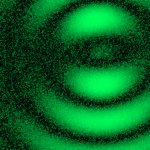
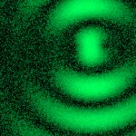

# [S=2_2x2_T=3_Z=4_CH=1.czi](https://zenodo.org/record/7015307/files/S%3D2_2x2_T%3D3_Z%3D4_CH%3D1.czi) report
 - **Autostitch** = false
 - ZeissCZIReader v6.14.0
 - ZeissQuickStartCZIReader v0.1.8-SNAPSHOT

# Images 

| Series            | Quick Start Reader | Size | Original Reader | Size | #Diffs |
|-------------------|--------------------|------|-----------------|------|--------|
| Read time (all)   |112 ms|------|164 ms|------|--------|
|0||X:256 Y:256 C:1 Z:4 T:3||X:256 Y:256 C:1 Z:4 T:3|0|
|1||X:256 Y:256 C:1 Z:4 T:3||X:256 Y:256 C:1 Z:4 T:3|0|
|2||X:256 Y:256 C:1 Z:4 T:3||X:256 Y:256 C:1 Z:4 T:3|0|
|3||X:256 Y:256 C:1 Z:4 T:3||X:256 Y:256 C:1 Z:4 T:3|0|
|4||X:256 Y:256 C:1 Z:4 T:3||X:256 Y:256 C:1 Z:4 T:3|0|
|5||X:256 Y:256 C:1 Z:4 T:3||X:256 Y:256 C:1 Z:4 T:3|0|
|6||X:256 Y:256 C:1 Z:4 T:3||X:256 Y:256 C:1 Z:4 T:3|0|
|7||X:256 Y:256 C:1 Z:4 T:3||X:256 Y:256 C:1 Z:4 T:3|0|

# Metadata

|  Method            | Parameters       | Quick Start Reader | Original Reader | Delta  |
| -------------------|------------------|--------------------|-----------------|------- |
| Initialization     |                  |24 ms|26 ms|        |
| Reader Size (Mb)     |                  |2.06|2.74|        |
| getStageLabelName| Image 0 | B2| Scene position #0| |
| getStageLabelName| Image 1 | B2| Scene position #1| |
| getStageLabelName| Image 2 | B2| Scene position #2| |
| getStageLabelName| Image 3 | B2| Scene position #3| |
| getStageLabelName| Image 4 | B3| Scene position #4| |
| getStageLabelName| Image 5 | B3| Scene position #5| |
| getStageLabelName| Image 6 | B3| Scene position #6| |
| getStageLabelName| Image 7 | B3| Scene position #7| |
| getPlaneDeltaT| Image 0 Plane 2 |  0.770 s |  0.767 s | 0.003 s |
| getPlaneDeltaT| Image 0 Plane 4 |  9.053 s |  9.022 s | 0.032 s |
| getPlaneDeltaT| Image 0 Plane 5 |  9.238 s |  9.207 s | 0.031 s |
| getPlaneDeltaT| Image 0 Plane 6 |  9.423 s |  9.393 s | 0.031 s |
| getPlaneDeltaT| Image 0 Plane 7 |  9.609 s |  9.578 s | 0.030 s |
| getPlaneDeltaT| Image 0 Plane 10 |  18.077 s |  18.078 s | 0.001 s |
| getPlaneDeltaT| Image 0 Plane 11 |  18.262 s |  18.264 s | 0.002 s |
| getPlaneDeltaT| Image 1 Plane 1 |  1.663 s |  1.665 s | 0.002 s |
| getPlaneDeltaT| Image 1 Plane 4 |  10.118 s |  10.104 s | 0.014 s |
| getPlaneDeltaT| Image 1 Plane 7 |  10.675 s |  10.690 s | 0.015 s |
| getPlaneDeltaT| Image 1 Plane 9 |  18.945 s |  18.960 s | 0.015 s |
| getPlaneDeltaT| Image 1 Plane 10 |  19.130 s |  19.144 s | 0.014 s |
| getPlaneDeltaT| Image 1 Plane 11 |  19.316 s |  19.328 s | 0.012 s |
| getPlaneDeltaT| Image 2 Plane 1 |  2.718 s |  2.730 s | 0.012 s |
| getPlaneDeltaT| Image 2 Plane 2 |  2.907 s |  2.914 s | 0.007 s |
| getPlaneDeltaT| Image 2 Plane 4 |  11.182 s |  11.217 s | 0.035 s |
| getPlaneDeltaT| Image 2 Plane 5 |  11.372 s |  11.417 s | 0.045 s |
| getPlaneDeltaT| Image 2 Plane 6 |  11.562 s |  11.604 s | 0.042 s |
| getPlaneDeltaT| Image 2 Plane 7 |  11.751 s |  11.789 s | 0.038 s |
| getPlaneDeltaT| Image 2 Plane 9 |  20.027 s |  20.037 s | 0.010 s |
| getPlaneDeltaT| Image 2 Plane 10 |  20.216 s |  20.222 s | 0.006 s |
| getPlaneDeltaT| Image 3 Plane 1 |  3.793 s |  3.791 s | 0.002 s |
| getPlaneDeltaT| Image 3 Plane 2 |  3.979 s |  3.978 s | 0.001 s |
| getPlaneDeltaT| Image 3 Plane 4 |  12.252 s |  12.299 s | 0.047 s |
| getPlaneDeltaT| Image 3 Plane 5 |  12.439 s |  12.486 s | 0.047 s |
| getPlaneDeltaT| Image 3 Plane 6 |  12.626 s |  12.670 s | 0.044 s |
| getPlaneDeltaT| Image 3 Plane 7 |  12.812 s |  12.855 s | 0.043 s |
| getPlaneDeltaT| Image 3 Plane 10 |  21.272 s |  21.271 s | 0.001 s |
| getPlaneDeltaT| Image 3 Plane 11 |  21.459 s |  21.470 s | 0.011 s |
| getPlaneDeltaT| Image 4 Plane 2 |  5.081 s |  5.082 s | 0.001 s |
| getPlaneDeltaT| Image 4 Plane 4 |  13.343 s |  13.381 s | 0.038 s |
| getPlaneDeltaT| Image 4 Plane 5 |  13.529 s |  13.567 s | 0.038 s |
| getPlaneDeltaT| Image 4 Plane 6 |  13.716 s |  13.752 s | 0.036 s |
| getPlaneDeltaT| Image 4 Plane 7 |  13.902 s |  13.923 s | 0.021 s |
| getPlaneDeltaT| Image 4 Plane 9 |  22.164 s |  22.163 s | 0.001 s |
| getPlaneDeltaT| Image 4 Plane 11 |  22.537 s |  22.549 s | 0.012 s |
| getPlaneDeltaT| Image 5 Plane 1 |  5.959 s |  5.965 s | 0.006 s |
| getPlaneDeltaT| Image 5 Plane 2 |  6.156 s |  6.150 s | 0.006 s |
| getPlaneDeltaT| Image 5 Plane 4 |  14.404 s |  14.431 s | 0.027 s |
| getPlaneDeltaT| Image 5 Plane 5 |  14.600 s |  14.629 s | 0.029 s |
| getPlaneDeltaT| Image 5 Plane 6 |  14.797 s |  14.846 s | 0.049 s |
| getPlaneDeltaT| Image 5 Plane 7 |  14.993 s |  15.031 s | 0.038 s |
| getPlaneDeltaT| Image 5 Plane 9 |  23.241 s |  23.244 s | 0.003 s |
| getPlaneDeltaT| Image 5 Plane 10 |  23.438 s |  23.430 s | 0.008 s |
| getPlaneDeltaT| Image 5 Plane 11 |  23.634 s |  23.629 s | 0.005 s |
| getPlaneDeltaT| Image 6 Plane 1 |  7.073 s |  7.078 s | 0.005 s |
| getPlaneDeltaT| Image 6 Plane 2 |  7.268 s |  7.262 s | 0.006 s |
| getPlaneDeltaT| Image 6 Plane 4 |  15.502 s |  15.542 s | 0.041 s |
| getPlaneDeltaT| Image 6 Plane 5 |  15.696 s |  15.743 s | 0.047 s |
| getPlaneDeltaT| Image 6 Plane 6 |  15.890 s |  15.929 s | 0.039 s |
| getPlaneDeltaT| Image 6 Plane 7 |  16.084 s |  16.115 s | 0.031 s |
| getPlaneDeltaT| Image 6 Plane 9 |  24.318 s |  24.325 s | 0.007 s |
| getPlaneDeltaT| Image 6 Plane 10 |  24.513 s |  24.527 s | 0.014 s |
| getPlaneDeltaT| Image 6 Plane 11 |  24.707 s |  24.712 s | 0.005 s |
| getPlaneDeltaT| Image 7 Plane 1 |  8.156 s |  8.169 s | 0.013 s |
| getPlaneDeltaT| Image 7 Plane 2 |  8.341 s |  8.355 s | 0.014 s |
| getPlaneDeltaT| Image 7 Plane 4 |  16.602 s |  16.627 s | 0.024 s |
| getPlaneDeltaT| Image 7 Plane 5 |  16.788 s |  16.827 s | 0.039 s |
| getPlaneDeltaT| Image 7 Plane 6 |  16.974 s |  17.026 s | 0.052 s |
| getPlaneDeltaT| Image 7 Plane 7 |  17.159 s |  17.211 s | 0.052 s |
| getPlaneDeltaT| Image 7 Plane 9 |  25.421 s |  25.422 s | 0.001 s |
| getPlaneDeltaT| Image 7 Plane 11 |  25.792 s |  25.808 s | 0.016 s |
