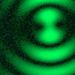
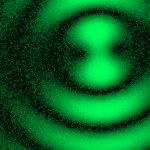

# [S=2_2x2_T=3_Z=4_CH=1.czi](https://zenodo.org/record/7015307/files/S%3D2_2x2_T%3D3_Z%3D4_CH%3D1.czi) report
 - **Autostitch** = false
 - ZeissCZIReader v6.14.0
 - ZeissQuickStartCZIReader v0.1.8-SNAPSHOT

# Images 

| Series            | Quick Start Reader | Size | Original Reader | Size | #Diffs |
|-------------------|--------------------|------|-----------------|------|--------|
| Read time (all)   |119 ms|------|127 ms|------|--------|
|0||X:256 Y:256 C:1 Z:4 T:3||X:256 Y:256 C:1 Z:4 T:3|0|
|1||X:256 Y:256 C:1 Z:4 T:3||X:256 Y:256 C:1 Z:4 T:3|0|
|2||X:256 Y:256 C:1 Z:4 T:3||X:256 Y:256 C:1 Z:4 T:3|0|
|3||X:256 Y:256 C:1 Z:4 T:3||X:256 Y:256 C:1 Z:4 T:3|0|
|4||X:256 Y:256 C:1 Z:4 T:3||X:256 Y:256 C:1 Z:4 T:3|0|
|5||X:256 Y:256 C:1 Z:4 T:3||X:256 Y:256 C:1 Z:4 T:3|0|
|6||X:256 Y:256 C:1 Z:4 T:3||X:256 Y:256 C:1 Z:4 T:3|0|
|7||X:256 Y:256 C:1 Z:4 T:3||X:256 Y:256 C:1 Z:4 T:3|0|

# Metadata

|  Method            | Parameters       | Quick Start Reader | Original Reader | Delta  |
| -------------------|------------------|--------------------|-----------------|------- |
| Initialization     |                  |27 ms|25 ms|        |
| Reader Size (Mb)     |                  |2.06|2.74|        |
| getStageLabelName| Image 0 | B2| Scene position #0| |
| getStageLabelX| Image 0 | 26975.700 um | 13488.480 um | 13487.220 um |
| getStageLabelY| Image 0 | 34975.700 um | 17488.480 um | 17487.220 um |
| getStageLabelName| Image 1 | B2| Scene position #1| |
| getStageLabelX| Image 1 | 26998.700 um | 13511.520 um | 13487.180 um |
| getStageLabelY| Image 1 | 34975.700 um | 17488.480 um | 17487.220 um |
| getStageLabelName| Image 2 | B2| Scene position #2| |
| getStageLabelX| Image 2 | 26998.700 um | 13511.520 um | 13487.180 um |
| getStageLabelY| Image 2 | 34998.700 um | 17511.520 um | 17487.180 um |
| getStageLabelName| Image 3 | B2| Scene position #3| |
| getStageLabelX| Image 3 | 26975.700 um | 13488.480 um | 13487.220 um |
| getStageLabelY| Image 3 | 34998.700 um | 17511.520 um | 17487.180 um |
| getStageLabelName| Image 4 | B3| Scene position #4| |
| getStageLabelX| Image 4 | 35975.700 um | 22488.480 um | 13487.220 um |
| getStageLabelY| Image 4 | 34975.700 um | 17488.480 um | 17487.220 um |
| getStageLabelName| Image 5 | B3| Scene position #5| |
| getStageLabelX| Image 5 | 35998.700 um | 22511.520 um | 13487.180 um |
| getStageLabelY| Image 5 | 34975.700 um | 17488.480 um | 17487.220 um |
| getStageLabelName| Image 6 | B3| Scene position #6| |
| getStageLabelX| Image 6 | 35998.700 um | 22511.520 um | 13487.180 um |
| getStageLabelY| Image 6 | 34998.700 um | 17511.520 um | 17487.180 um |
| getStageLabelName| Image 7 | B3| Scene position #7| |
| getStageLabelX| Image 7 | 35975.700 um | 22488.480 um | 13487.220 um |
| getStageLabelY| Image 7 | 34998.700 um | 17511.520 um | 17487.180 um |
| getPlanePositionX| Image 0 Plane 0 | 26975.700 um | 13488.480 um | 13487.220 um |
| getPlanePositionY| Image 0 Plane 0 | 34975.700 um | 17488.480 um | 17487.220 um |
| getPlanePositionX| Image 0 Plane 1 | 26975.700 um | 13488.480 um | 13487.220 um |
| getPlanePositionY| Image 0 Plane 1 | 34975.700 um | 17488.480 um | 17487.220 um |
| getPlanePositionX| Image 0 Plane 2 | 26975.700 um | 13488.480 um | 13487.220 um |
| getPlanePositionY| Image 0 Plane 2 | 34975.700 um | 17488.480 um | 17487.220 um |
| getPlanePositionX| Image 0 Plane 3 | 26975.700 um | 13488.480 um | 13487.220 um |
| getPlanePositionY| Image 0 Plane 3 | 34975.700 um | 17488.480 um | 17487.220 um |
| getPlanePositionX| Image 0 Plane 4 | 26975.700 um | 13488.480 um | 13487.220 um |
| getPlanePositionY| Image 0 Plane 4 | 34975.700 um | 17488.480 um | 17487.220 um |
| getPlanePositionX| Image 0 Plane 5 | 26975.700 um | 13488.480 um | 13487.220 um |
| getPlanePositionY| Image 0 Plane 5 | 34975.700 um | 17488.480 um | 17487.220 um |
| getPlanePositionX| Image 0 Plane 6 | 26975.700 um | 13488.480 um | 13487.220 um |
| getPlanePositionY| Image 0 Plane 6 | 34975.700 um | 17488.480 um | 17487.220 um |
| getPlanePositionX| Image 0 Plane 7 | 26975.700 um | 13488.480 um | 13487.220 um |
| getPlanePositionY| Image 0 Plane 7 | 34975.700 um | 17488.480 um | 17487.220 um |
| getPlanePositionX| Image 0 Plane 8 | 26975.700 um | 13488.480 um | 13487.220 um |
| getPlanePositionY| Image 0 Plane 8 | 34975.700 um | 17488.480 um | 17487.220 um |
| getPlanePositionX| Image 0 Plane 9 | 26975.700 um | 13488.480 um | 13487.220 um |
| getPlanePositionY| Image 0 Plane 9 | 34975.700 um | 17488.480 um | 17487.220 um |
| getPlanePositionX| Image 0 Plane 10 | 26975.700 um | 13488.480 um | 13487.220 um |
| getPlanePositionY| Image 0 Plane 10 | 34975.700 um | 17488.480 um | 17487.220 um |
| getPlanePositionX| Image 0 Plane 11 | 26975.700 um | 13488.480 um | 13487.220 um |
| getPlanePositionY| Image 0 Plane 11 | 34975.700 um | 17488.480 um | 17487.220 um |
| getPlanePositionX| Image 1 Plane 0 | 26998.700 um | 13511.520 um | 13487.180 um |
| getPlanePositionY| Image 1 Plane 0 | 34975.700 um | 17488.480 um | 17487.220 um |
| getPlanePositionX| Image 1 Plane 1 | 26998.700 um | 13511.520 um | 13487.180 um |
| getPlanePositionY| Image 1 Plane 1 | 34975.700 um | 17488.480 um | 17487.220 um |
| getPlanePositionX| Image 1 Plane 2 | 26998.700 um | 13511.520 um | 13487.180 um |
| getPlanePositionY| Image 1 Plane 2 | 34975.700 um | 17488.480 um | 17487.220 um |
| getPlanePositionX| Image 1 Plane 3 | 26998.700 um | 13511.520 um | 13487.180 um |
| getPlanePositionY| Image 1 Plane 3 | 34975.700 um | 17488.480 um | 17487.220 um |
| getPlanePositionX| Image 1 Plane 4 | 26998.700 um | 13511.520 um | 13487.180 um |
| getPlanePositionY| Image 1 Plane 4 | 34975.700 um | 17488.480 um | 17487.220 um |
| getPlanePositionX| Image 1 Plane 5 | 26998.700 um | 13511.520 um | 13487.180 um |
| getPlanePositionY| Image 1 Plane 5 | 34975.700 um | 17488.480 um | 17487.220 um |
| getPlanePositionX| Image 1 Plane 6 | 26998.700 um | 13511.520 um | 13487.180 um |
| getPlanePositionY| Image 1 Plane 6 | 34975.700 um | 17488.480 um | 17487.220 um |
| getPlanePositionX| Image 1 Plane 7 | 26998.700 um | 13511.520 um | 13487.180 um |
| getPlanePositionY| Image 1 Plane 7 | 34975.700 um | 17488.480 um | 17487.220 um |
| getPlanePositionX| Image 1 Plane 8 | 26998.700 um | 13511.520 um | 13487.180 um |
| getPlanePositionY| Image 1 Plane 8 | 34975.700 um | 17488.480 um | 17487.220 um |
| getPlanePositionX| Image 1 Plane 9 | 26998.700 um | 13511.520 um | 13487.180 um |
| getPlanePositionY| Image 1 Plane 9 | 34975.700 um | 17488.480 um | 17487.220 um |
| getPlanePositionX| Image 1 Plane 10 | 26998.700 um | 13511.520 um | 13487.180 um |
| getPlanePositionY| Image 1 Plane 10 | 34975.700 um | 17488.480 um | 17487.220 um |
| getPlanePositionX| Image 1 Plane 11 | 26998.700 um | 13511.520 um | 13487.180 um |
| getPlanePositionY| Image 1 Plane 11 | 34975.700 um | 17488.480 um | 17487.220 um |
| getPlanePositionX| Image 2 Plane 0 | 26998.700 um | 13511.520 um | 13487.180 um |
| getPlanePositionY| Image 2 Plane 0 | 34998.700 um | 17511.520 um | 17487.180 um |
| getPlanePositionX| Image 2 Plane 1 | 26998.700 um | 13511.520 um | 13487.180 um |
| getPlanePositionY| Image 2 Plane 1 | 34998.700 um | 17511.520 um | 17487.180 um |
| getPlanePositionX| Image 2 Plane 2 | 26998.700 um | 13511.520 um | 13487.180 um |
| getPlanePositionY| Image 2 Plane 2 | 34998.700 um | 17511.520 um | 17487.180 um |
| getPlanePositionX| Image 2 Plane 3 | 26998.700 um | 13511.520 um | 13487.180 um |
| getPlanePositionY| Image 2 Plane 3 | 34998.700 um | 17511.520 um | 17487.180 um |
| getPlanePositionX| Image 2 Plane 4 | 26998.700 um | 13511.520 um | 13487.180 um |
| getPlanePositionY| Image 2 Plane 4 | 34998.700 um | 17511.520 um | 17487.180 um |
| getPlanePositionX| Image 2 Plane 5 | 26998.700 um | 13511.520 um | 13487.180 um |
| getPlanePositionY| Image 2 Plane 5 | 34998.700 um | 17511.520 um | 17487.180 um |
| getPlanePositionX| Image 2 Plane 6 | 26998.700 um | 13511.520 um | 13487.180 um |
| getPlanePositionY| Image 2 Plane 6 | 34998.700 um | 17511.520 um | 17487.180 um |
| getPlanePositionX| Image 2 Plane 7 | 26998.700 um | 13511.520 um | 13487.180 um |
| getPlanePositionY| Image 2 Plane 7 | 34998.700 um | 17511.520 um | 17487.180 um |
| getPlanePositionX| Image 2 Plane 8 | 26998.700 um | 13511.520 um | 13487.180 um |
| getPlanePositionY| Image 2 Plane 8 | 34998.700 um | 17511.520 um | 17487.180 um |
| getPlanePositionX| Image 2 Plane 9 | 26998.700 um | 13511.520 um | 13487.180 um |
| getPlanePositionY| Image 2 Plane 9 | 34998.700 um | 17511.520 um | 17487.180 um |
| getPlanePositionX| Image 2 Plane 10 | 26998.700 um | 13511.520 um | 13487.180 um |
| getPlanePositionY| Image 2 Plane 10 | 34998.700 um | 17511.520 um | 17487.180 um |
| getPlanePositionX| Image 2 Plane 11 | 26998.700 um | 13511.520 um | 13487.180 um |
| getPlanePositionY| Image 2 Plane 11 | 34998.700 um | 17511.520 um | 17487.180 um |
| getPlanePositionX| Image 3 Plane 0 | 26975.700 um | 13488.480 um | 13487.220 um |
| getPlanePositionY| Image 3 Plane 0 | 34998.700 um | 17511.520 um | 17487.180 um |
| getPlanePositionX| Image 3 Plane 1 | 26975.700 um | 13488.480 um | 13487.220 um |
| getPlanePositionY| Image 3 Plane 1 | 34998.700 um | 17511.520 um | 17487.180 um |
| getPlanePositionX| Image 3 Plane 2 | 26975.700 um | 13488.480 um | 13487.220 um |
| getPlanePositionY| Image 3 Plane 2 | 34998.700 um | 17511.520 um | 17487.180 um |
| getPlanePositionX| Image 3 Plane 3 | 26975.700 um | 13488.480 um | 13487.220 um |
| getPlanePositionY| Image 3 Plane 3 | 34998.700 um | 17511.520 um | 17487.180 um |
| getPlanePositionX| Image 3 Plane 4 | 26975.700 um | 13488.480 um | 13487.220 um |
| getPlanePositionY| Image 3 Plane 4 | 34998.700 um | 17511.520 um | 17487.180 um |
| getPlanePositionX| Image 3 Plane 5 | 26975.700 um | 13488.480 um | 13487.220 um |
| getPlanePositionY| Image 3 Plane 5 | 34998.700 um | 17511.520 um | 17487.180 um |
| getPlanePositionX| Image 3 Plane 6 | 26975.700 um | 13488.480 um | 13487.220 um |
| getPlanePositionY| Image 3 Plane 6 | 34998.700 um | 17511.520 um | 17487.180 um |
| getPlanePositionX| Image 3 Plane 7 | 26975.700 um | 13488.480 um | 13487.220 um |
| getPlanePositionY| Image 3 Plane 7 | 34998.700 um | 17511.520 um | 17487.180 um |
| getPlanePositionX| Image 3 Plane 8 | 26975.700 um | 13488.480 um | 13487.220 um |
| getPlanePositionY| Image 3 Plane 8 | 34998.700 um | 17511.520 um | 17487.180 um |
| getPlanePositionX| Image 3 Plane 9 | 26975.700 um | 13488.480 um | 13487.220 um |
| getPlanePositionY| Image 3 Plane 9 | 34998.700 um | 17511.520 um | 17487.180 um |
| getPlanePositionX| Image 3 Plane 10 | 26975.700 um | 13488.480 um | 13487.220 um |
| getPlanePositionY| Image 3 Plane 10 | 34998.700 um | 17511.520 um | 17487.180 um |
| getPlanePositionX| Image 3 Plane 11 | 26975.700 um | 13488.480 um | 13487.220 um |
| getPlanePositionY| Image 3 Plane 11 | 34998.700 um | 17511.520 um | 17487.180 um |
| getPlanePositionX| Image 4 Plane 0 | 35975.700 um | 22488.480 um | 13487.220 um |
| getPlanePositionY| Image 4 Plane 0 | 34975.700 um | 17488.480 um | 17487.220 um |
| getPlanePositionX| Image 4 Plane 1 | 35975.700 um | 22488.480 um | 13487.220 um |
| getPlanePositionY| Image 4 Plane 1 | 34975.700 um | 17488.480 um | 17487.220 um |
| getPlanePositionX| Image 4 Plane 2 | 35975.700 um | 22488.480 um | 13487.220 um |
| getPlanePositionY| Image 4 Plane 2 | 34975.700 um | 17488.480 um | 17487.220 um |
| getPlanePositionX| Image 4 Plane 3 | 35975.700 um | 22488.480 um | 13487.220 um |
| getPlanePositionY| Image 4 Plane 3 | 34975.700 um | 17488.480 um | 17487.220 um |
| getPlanePositionX| Image 4 Plane 4 | 35975.700 um | 22488.480 um | 13487.220 um |
| getPlanePositionY| Image 4 Plane 4 | 34975.700 um | 17488.480 um | 17487.220 um |
| getPlanePositionX| Image 4 Plane 5 | 35975.700 um | 22488.480 um | 13487.220 um |
| getPlanePositionY| Image 4 Plane 5 | 34975.700 um | 17488.480 um | 17487.220 um |
| getPlanePositionX| Image 4 Plane 6 | 35975.700 um | 22488.480 um | 13487.220 um |
| getPlanePositionY| Image 4 Plane 6 | 34975.700 um | 17488.480 um | 17487.220 um |
| getPlanePositionX| Image 4 Plane 7 | 35975.700 um | 22488.480 um | 13487.220 um |
| getPlanePositionY| Image 4 Plane 7 | 34975.700 um | 17488.480 um | 17487.220 um |
| getPlanePositionX| Image 4 Plane 8 | 35975.700 um | 22488.480 um | 13487.220 um |
| getPlanePositionY| Image 4 Plane 8 | 34975.700 um | 17488.480 um | 17487.220 um |
| getPlanePositionX| Image 4 Plane 9 | 35975.700 um | 22488.480 um | 13487.220 um |
| getPlanePositionY| Image 4 Plane 9 | 34975.700 um | 17488.480 um | 17487.220 um |
| getPlanePositionX| Image 4 Plane 10 | 35975.700 um | 22488.480 um | 13487.220 um |
| getPlanePositionY| Image 4 Plane 10 | 34975.700 um | 17488.480 um | 17487.220 um |
| getPlanePositionX| Image 4 Plane 11 | 35975.700 um | 22488.480 um | 13487.220 um |
| getPlanePositionY| Image 4 Plane 11 | 34975.700 um | 17488.480 um | 17487.220 um |
| getPlanePositionX| Image 5 Plane 0 | 35998.700 um | 22511.520 um | 13487.180 um |
| getPlanePositionY| Image 5 Plane 0 | 34975.700 um | 17488.480 um | 17487.220 um |
| getPlanePositionX| Image 5 Plane 1 | 35998.700 um | 22511.520 um | 13487.180 um |
| getPlanePositionY| Image 5 Plane 1 | 34975.700 um | 17488.480 um | 17487.220 um |
| getPlanePositionX| Image 5 Plane 2 | 35998.700 um | 22511.520 um | 13487.180 um |
| getPlanePositionY| Image 5 Plane 2 | 34975.700 um | 17488.480 um | 17487.220 um |
| getPlanePositionX| Image 5 Plane 3 | 35998.700 um | 22511.520 um | 13487.180 um |
| getPlanePositionY| Image 5 Plane 3 | 34975.700 um | 17488.480 um | 17487.220 um |
| getPlanePositionX| Image 5 Plane 4 | 35998.700 um | 22511.520 um | 13487.180 um |
| getPlanePositionY| Image 5 Plane 4 | 34975.700 um | 17488.480 um | 17487.220 um |
| getPlanePositionX| Image 5 Plane 5 | 35998.700 um | 22511.520 um | 13487.180 um |
| getPlanePositionY| Image 5 Plane 5 | 34975.700 um | 17488.480 um | 17487.220 um |
| getPlanePositionX| Image 5 Plane 6 | 35998.700 um | 22511.520 um | 13487.180 um |
| getPlanePositionY| Image 5 Plane 6 | 34975.700 um | 17488.480 um | 17487.220 um |
| getPlanePositionX| Image 5 Plane 7 | 35998.700 um | 22511.520 um | 13487.180 um |
| getPlanePositionY| Image 5 Plane 7 | 34975.700 um | 17488.480 um | 17487.220 um |
| getPlanePositionX| Image 5 Plane 8 | 35998.700 um | 22511.520 um | 13487.180 um |
| getPlanePositionY| Image 5 Plane 8 | 34975.700 um | 17488.480 um | 17487.220 um |
| getPlanePositionX| Image 5 Plane 9 | 35998.700 um | 22511.520 um | 13487.180 um |
| getPlanePositionY| Image 5 Plane 9 | 34975.700 um | 17488.480 um | 17487.220 um |
| getPlanePositionX| Image 5 Plane 10 | 35998.700 um | 22511.520 um | 13487.180 um |
| getPlanePositionY| Image 5 Plane 10 | 34975.700 um | 17488.480 um | 17487.220 um |
| getPlanePositionX| Image 5 Plane 11 | 35998.700 um | 22511.520 um | 13487.180 um |
| getPlanePositionY| Image 5 Plane 11 | 34975.700 um | 17488.480 um | 17487.220 um |
| getPlanePositionX| Image 6 Plane 0 | 35998.700 um | 22511.520 um | 13487.180 um |
| getPlanePositionY| Image 6 Plane 0 | 34998.700 um | 17511.520 um | 17487.180 um |
| getPlanePositionX| Image 6 Plane 1 | 35998.700 um | 22511.520 um | 13487.180 um |
| getPlanePositionY| Image 6 Plane 1 | 34998.700 um | 17511.520 um | 17487.180 um |
| getPlanePositionX| Image 6 Plane 2 | 35998.700 um | 22511.520 um | 13487.180 um |
| getPlanePositionY| Image 6 Plane 2 | 34998.700 um | 17511.520 um | 17487.180 um |
| getPlanePositionX| Image 6 Plane 3 | 35998.700 um | 22511.520 um | 13487.180 um |
| getPlanePositionY| Image 6 Plane 3 | 34998.700 um | 17511.520 um | 17487.180 um |
| getPlanePositionX| Image 6 Plane 4 | 35998.700 um | 22511.520 um | 13487.180 um |
| getPlanePositionY| Image 6 Plane 4 | 34998.700 um | 17511.520 um | 17487.180 um |
| getPlanePositionX| Image 6 Plane 5 | 35998.700 um | 22511.520 um | 13487.180 um |
| getPlanePositionY| Image 6 Plane 5 | 34998.700 um | 17511.520 um | 17487.180 um |
| getPlanePositionX| Image 6 Plane 6 | 35998.700 um | 22511.520 um | 13487.180 um |
| getPlanePositionY| Image 6 Plane 6 | 34998.700 um | 17511.520 um | 17487.180 um |
| getPlanePositionX| Image 6 Plane 7 | 35998.700 um | 22511.520 um | 13487.180 um |
| getPlanePositionY| Image 6 Plane 7 | 34998.700 um | 17511.520 um | 17487.180 um |
| getPlanePositionX| Image 6 Plane 8 | 35998.700 um | 22511.520 um | 13487.180 um |
| getPlanePositionY| Image 6 Plane 8 | 34998.700 um | 17511.520 um | 17487.180 um |
| getPlanePositionX| Image 6 Plane 9 | 35998.700 um | 22511.520 um | 13487.180 um |
| getPlanePositionY| Image 6 Plane 9 | 34998.700 um | 17511.520 um | 17487.180 um |
| getPlanePositionX| Image 6 Plane 10 | 35998.700 um | 22511.520 um | 13487.180 um |
| getPlanePositionY| Image 6 Plane 10 | 34998.700 um | 17511.520 um | 17487.180 um |
| getPlanePositionX| Image 6 Plane 11 | 35998.700 um | 22511.520 um | 13487.180 um |
| getPlanePositionY| Image 6 Plane 11 | 34998.700 um | 17511.520 um | 17487.180 um |
| getPlanePositionX| Image 7 Plane 0 | 35975.700 um | 22488.480 um | 13487.220 um |
| getPlanePositionY| Image 7 Plane 0 | 34998.700 um | 17511.520 um | 17487.180 um |
| getPlanePositionX| Image 7 Plane 1 | 35975.700 um | 22488.480 um | 13487.220 um |
| getPlanePositionY| Image 7 Plane 1 | 34998.700 um | 17511.520 um | 17487.180 um |
| getPlanePositionX| Image 7 Plane 2 | 35975.700 um | 22488.480 um | 13487.220 um |
| getPlanePositionY| Image 7 Plane 2 | 34998.700 um | 17511.520 um | 17487.180 um |
| getPlanePositionX| Image 7 Plane 3 | 35975.700 um | 22488.480 um | 13487.220 um |
| getPlanePositionY| Image 7 Plane 3 | 34998.700 um | 17511.520 um | 17487.180 um |
| getPlanePositionX| Image 7 Plane 4 | 35975.700 um | 22488.480 um | 13487.220 um |
| getPlanePositionY| Image 7 Plane 4 | 34998.700 um | 17511.520 um | 17487.180 um |
| getPlanePositionX| Image 7 Plane 5 | 35975.700 um | 22488.480 um | 13487.220 um |
| getPlanePositionY| Image 7 Plane 5 | 34998.700 um | 17511.520 um | 17487.180 um |
| getPlanePositionX| Image 7 Plane 6 | 35975.700 um | 22488.480 um | 13487.220 um |
| getPlanePositionY| Image 7 Plane 6 | 34998.700 um | 17511.520 um | 17487.180 um |
| getPlanePositionX| Image 7 Plane 7 | 35975.700 um | 22488.480 um | 13487.220 um |
| getPlanePositionY| Image 7 Plane 7 | 34998.700 um | 17511.520 um | 17487.180 um |
| getPlanePositionX| Image 7 Plane 8 | 35975.700 um | 22488.480 um | 13487.220 um |
| getPlanePositionY| Image 7 Plane 8 | 34998.700 um | 17511.520 um | 17487.180 um |
| getPlanePositionX| Image 7 Plane 9 | 35975.700 um | 22488.480 um | 13487.220 um |
| getPlanePositionY| Image 7 Plane 9 | 34998.700 um | 17511.520 um | 17487.180 um |
| getPlanePositionX| Image 7 Plane 10 | 35975.700 um | 22488.480 um | 13487.220 um |
| getPlanePositionY| Image 7 Plane 10 | 34998.700 um | 17511.520 um | 17487.180 um |
| getPlanePositionX| Image 7 Plane 11 | 35975.700 um | 22488.480 um | 13487.220 um |
| getPlanePositionY| Image 7 Plane 11 | 34998.700 um | 17511.520 um | 17487.180 um |
