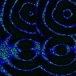
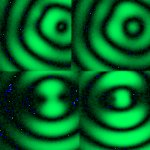
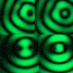
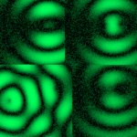
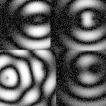

# [S=2_2x2_T=3_Z=4_CH=1.czi](https://zenodo.org/record/7015307/files/S%3D2_2x2_T%3D3_Z%3D4_CH%3D1.czi) report
 - **Autostitch** = true
 - ZeissCZIReader v6.14.0
 - ZeissQuickStartCZIReader v0.1.8-SNAPSHOT

# Images 

| Series            | Quick Start Reader | Size | Original Reader | Size | #Diffs |
|-------------------|--------------------|------|-----------------|------|--------|
| Read time (all)   |74 ms|------|93 ms|------|--------|
|0||X:486 Y:486 C:1 Z:4 T:3||X:486 Y:486 C:1 Z:4 T:3|0|
|1||X:243 Y:243 C:1 Z:4 T:3||X:243 Y:243 C:1 Z:4 T:3|0|
|2||X:486 Y:486 C:1 Z:4 T:3||X:486 Y:486 C:1 Z:4 T:3|0|
|3||X:243 Y:243 C:1 Z:4 T:3||X:243 Y:243 C:1 Z:4 T:3|0|

# Metadata

|  Method            | Parameters       | Quick Start Reader | Original Reader | Delta  |
| -------------------|------------------|--------------------|-----------------|------- |
| Initialization     |                  |18 ms|21 ms|        |
| Reader Size (Mb)     |                  |2.02|2.71|        |
| getStageLabelName| Image 0 | B2| Scene position #0| |
| getStageLabelX| Image 0 | 13488.480 um | 13500.000 um | 11.520 um |
| getStageLabelY| Image 0 | 17488.480 um | 17500.000 um | 11.520 um |
| getStageLabelName| Image 1 | B2| Scene position #1| |
| getStageLabelX| Image 1 |  1: null| 2: ome.units.quantity.Length: value[13500.0], unit[µm] stored as java.lang.Double |
| getStageLabelY| Image 1 |  1: null| 2: ome.units.quantity.Length: value[17500.0], unit[µm] stored as java.lang.Double |
| getStageLabelZ| Image 1 |  1: ome.units.quantity.Length: value[0.0], unit[µm] stored as java.lang.Double| 2: null |
| getPixelsPhysicalSizeX| Image 1 | 0.200 um | 0.100 um | 0.100 um |
| getPixelsPhysicalSizeY| Image 1 | 0.200 um | 0.100 um | 0.100 um |
| getStageLabelName| Image 2 | B3| Scene position #2| |
| getStageLabelX| Image 2 | 22488.480 um | 22500.000 um | 11.520 um |
| getStageLabelY| Image 2 | 17488.480 um | 17500.000 um | 11.520 um |
| getStageLabelName| Image 3 | B3| Scene position #3| |
| getStageLabelX| Image 3 |  1: null| 2: ome.units.quantity.Length: value[22500.0], unit[µm] stored as java.lang.Double |
| getStageLabelY| Image 3 |  1: null| 2: ome.units.quantity.Length: value[17500.0], unit[µm] stored as java.lang.Double |
| getStageLabelZ| Image 3 |  1: ome.units.quantity.Length: value[0.0], unit[µm] stored as java.lang.Double| 2: null |
| getPixelsPhysicalSizeX| Image 3 | 0.200 um | 0.100 um | 0.100 um |
| getPixelsPhysicalSizeY| Image 3 | 0.200 um | 0.100 um | 0.100 um |
| getPlanePositionX| Image 0 Plane 0 | 13488.480 um | 13500.000 um | 11.520 um |
| getPlanePositionY| Image 0 Plane 0 | 17488.480 um | 17500.000 um | 11.520 um |
| getPlanePositionX| Image 0 Plane 1 | 13488.480 um | 13500.000 um | 11.520 um |
| getPlanePositionY| Image 0 Plane 1 | 17488.480 um | 17500.000 um | 11.520 um |
| getPlanePositionX| Image 0 Plane 2 | 13488.480 um | 13500.000 um | 11.520 um |
| getPlanePositionY| Image 0 Plane 2 | 17488.480 um | 17500.000 um | 11.520 um |
| getPlanePositionX| Image 0 Plane 3 | 13488.480 um | 13500.000 um | 11.520 um |
| getPlanePositionY| Image 0 Plane 3 | 17488.480 um | 17500.000 um | 11.520 um |
| getPlaneDeltaT| Image 0 Plane 4 |  9.053 s |  9.022 s | 0.032 s |
| getPlanePositionX| Image 0 Plane 4 | 13488.480 um | 13500.000 um | 11.520 um |
| getPlanePositionY| Image 0 Plane 4 | 17488.480 um | 17500.000 um | 11.520 um |
| getPlaneDeltaT| Image 0 Plane 5 |  9.238 s |  9.207 s | 0.031 s |
| getPlanePositionX| Image 0 Plane 5 | 13488.480 um | 13500.000 um | 11.520 um |
| getPlanePositionY| Image 0 Plane 5 | 17488.480 um | 17500.000 um | 11.520 um |
| getPlaneDeltaT| Image 0 Plane 6 |  9.423 s |  9.393 s | 0.031 s |
| getPlanePositionX| Image 0 Plane 6 | 13488.480 um | 13500.000 um | 11.520 um |
| getPlanePositionY| Image 0 Plane 6 | 17488.480 um | 17500.000 um | 11.520 um |
| getPlaneDeltaT| Image 0 Plane 7 |  9.609 s |  9.578 s | 0.030 s |
| getPlanePositionX| Image 0 Plane 7 | 13488.480 um | 13500.000 um | 11.520 um |
| getPlanePositionY| Image 0 Plane 7 | 17488.480 um | 17500.000 um | 11.520 um |
| getPlanePositionX| Image 0 Plane 8 | 13488.480 um | 13500.000 um | 11.520 um |
| getPlanePositionY| Image 0 Plane 8 | 17488.480 um | 17500.000 um | 11.520 um |
| getPlanePositionX| Image 0 Plane 9 | 13488.480 um | 13500.000 um | 11.520 um |
| getPlanePositionY| Image 0 Plane 9 | 17488.480 um | 17500.000 um | 11.520 um |
| getPlanePositionX| Image 0 Plane 10 | 13488.480 um | 13500.000 um | 11.520 um |
| getPlanePositionY| Image 0 Plane 10 | 17488.480 um | 17500.000 um | 11.520 um |
| getPlanePositionX| Image 0 Plane 11 | 13488.480 um | 13500.000 um | 11.520 um |
| getPlanePositionY| Image 0 Plane 11 | 17488.480 um | 17500.000 um | 11.520 um |
| getPlaneDeltaT| Image 1 Plane 0 |  1: null| 2: ome.units.quantity.Time: value[0.4001147], unit[s] stored as java.lang.Double |
| getPlaneExposureTime| Image 1 Plane 0 |  1: null| 2: ome.units.quantity.Time: value[10.0], unit[s] stored as java.lang.Double |
| getPlanePositionX| Image 1 Plane 0 |  1: null| 2: ome.units.quantity.Length: value[13500.0], unit[µm] stored as java.lang.Double |
| getPlanePositionY| Image 1 Plane 0 |  1: null| 2: ome.units.quantity.Length: value[17500.0], unit[µm] stored as java.lang.Double |
| getPlaneDeltaT| Image 1 Plane 1 |  1: null| 2: ome.units.quantity.Time: value[0.4001147], unit[s] stored as java.lang.Double |
| getPlaneExposureTime| Image 1 Plane 1 |  1: null| 2: ome.units.quantity.Time: value[10.0], unit[s] stored as java.lang.Double |
| getPlanePositionX| Image 1 Plane 1 |  1: null| 2: ome.units.quantity.Length: value[13500.0], unit[µm] stored as java.lang.Double |
| getPlanePositionY| Image 1 Plane 1 |  1: null| 2: ome.units.quantity.Length: value[17500.0], unit[µm] stored as java.lang.Double |
| getPlaneDeltaT| Image 1 Plane 2 |  1: null| 2: ome.units.quantity.Time: value[0.4001147], unit[s] stored as java.lang.Double |
| getPlaneExposureTime| Image 1 Plane 2 |  1: null| 2: ome.units.quantity.Time: value[10.0], unit[s] stored as java.lang.Double |
| getPlanePositionX| Image 1 Plane 2 |  1: null| 2: ome.units.quantity.Length: value[13500.0], unit[µm] stored as java.lang.Double |
| getPlanePositionY| Image 1 Plane 2 |  1: null| 2: ome.units.quantity.Length: value[17500.0], unit[µm] stored as java.lang.Double |
| getPlaneDeltaT| Image 1 Plane 3 |  1: null| 2: ome.units.quantity.Time: value[0.4001147], unit[s] stored as java.lang.Double |
| getPlaneExposureTime| Image 1 Plane 3 |  1: null| 2: ome.units.quantity.Time: value[10.0], unit[s] stored as java.lang.Double |
| getPlanePositionX| Image 1 Plane 3 |  1: null| 2: ome.units.quantity.Length: value[13500.0], unit[µm] stored as java.lang.Double |
| getPlanePositionY| Image 1 Plane 3 |  1: null| 2: ome.units.quantity.Length: value[17500.0], unit[µm] stored as java.lang.Double |
| getPlaneDeltaT| Image 1 Plane 4 |  1: null| 2: ome.units.quantity.Time: value[9.0215293], unit[s] stored as java.lang.Double |
| getPlaneExposureTime| Image 1 Plane 4 |  1: null| 2: ome.units.quantity.Time: value[10.0], unit[s] stored as java.lang.Double |
| getPlanePositionX| Image 1 Plane 4 |  1: null| 2: ome.units.quantity.Length: value[13500.0], unit[µm] stored as java.lang.Double |
| getPlanePositionY| Image 1 Plane 4 |  1: null| 2: ome.units.quantity.Length: value[17500.0], unit[µm] stored as java.lang.Double |
| getPlaneDeltaT| Image 1 Plane 5 |  1: null| 2: ome.units.quantity.Time: value[9.0215293], unit[s] stored as java.lang.Double |
| getPlaneExposureTime| Image 1 Plane 5 |  1: null| 2: ome.units.quantity.Time: value[10.0], unit[s] stored as java.lang.Double |
| getPlanePositionX| Image 1 Plane 5 |  1: null| 2: ome.units.quantity.Length: value[13500.0], unit[µm] stored as java.lang.Double |
| getPlanePositionY| Image 1 Plane 5 |  1: null| 2: ome.units.quantity.Length: value[17500.0], unit[µm] stored as java.lang.Double |
| getPlaneDeltaT| Image 1 Plane 6 |  1: null| 2: ome.units.quantity.Time: value[9.0215293], unit[s] stored as java.lang.Double |
| getPlaneExposureTime| Image 1 Plane 6 |  1: null| 2: ome.units.quantity.Time: value[10.0], unit[s] stored as java.lang.Double |
| getPlanePositionX| Image 1 Plane 6 |  1: null| 2: ome.units.quantity.Length: value[13500.0], unit[µm] stored as java.lang.Double |
| getPlanePositionY| Image 1 Plane 6 |  1: null| 2: ome.units.quantity.Length: value[17500.0], unit[µm] stored as java.lang.Double |
| getPlaneDeltaT| Image 1 Plane 7 |  1: null| 2: ome.units.quantity.Time: value[9.0215293], unit[s] stored as java.lang.Double |
| getPlaneExposureTime| Image 1 Plane 7 |  1: null| 2: ome.units.quantity.Time: value[10.0], unit[s] stored as java.lang.Double |
| getPlanePositionX| Image 1 Plane 7 |  1: null| 2: ome.units.quantity.Length: value[13500.0], unit[µm] stored as java.lang.Double |
| getPlanePositionY| Image 1 Plane 7 |  1: null| 2: ome.units.quantity.Length: value[17500.0], unit[µm] stored as java.lang.Double |
| getPlaneDeltaT| Image 1 Plane 8 |  1: null| 2: ome.units.quantity.Time: value[17.7068343], unit[s] stored as java.lang.Double |
| getPlaneExposureTime| Image 1 Plane 8 |  1: null| 2: ome.units.quantity.Time: value[10.0], unit[s] stored as java.lang.Double |
| getPlanePositionX| Image 1 Plane 8 |  1: null| 2: ome.units.quantity.Length: value[13500.0], unit[µm] stored as java.lang.Double |
| getPlanePositionY| Image 1 Plane 8 |  1: null| 2: ome.units.quantity.Length: value[17500.0], unit[µm] stored as java.lang.Double |
| getPlaneDeltaT| Image 1 Plane 9 |  1: null| 2: ome.units.quantity.Time: value[17.7068343], unit[s] stored as java.lang.Double |
| getPlaneExposureTime| Image 1 Plane 9 |  1: null| 2: ome.units.quantity.Time: value[10.0], unit[s] stored as java.lang.Double |
| getPlanePositionX| Image 1 Plane 9 |  1: null| 2: ome.units.quantity.Length: value[13500.0], unit[µm] stored as java.lang.Double |
| getPlanePositionY| Image 1 Plane 9 |  1: null| 2: ome.units.quantity.Length: value[17500.0], unit[µm] stored as java.lang.Double |
| getPlaneDeltaT| Image 1 Plane 10 |  1: null| 2: ome.units.quantity.Time: value[17.7068343], unit[s] stored as java.lang.Double |
| getPlaneExposureTime| Image 1 Plane 10 |  1: null| 2: ome.units.quantity.Time: value[10.0], unit[s] stored as java.lang.Double |
| getPlanePositionX| Image 1 Plane 10 |  1: null| 2: ome.units.quantity.Length: value[13500.0], unit[µm] stored as java.lang.Double |
| getPlanePositionY| Image 1 Plane 10 |  1: null| 2: ome.units.quantity.Length: value[17500.0], unit[µm] stored as java.lang.Double |
| getPlaneDeltaT| Image 1 Plane 11 |  1: null| 2: ome.units.quantity.Time: value[17.7068343], unit[s] stored as java.lang.Double |
| getPlaneExposureTime| Image 1 Plane 11 |  1: null| 2: ome.units.quantity.Time: value[10.0], unit[s] stored as java.lang.Double |
| getPlanePositionX| Image 1 Plane 11 |  1: null| 2: ome.units.quantity.Length: value[13500.0], unit[µm] stored as java.lang.Double |
| getPlanePositionY| Image 1 Plane 11 |  1: null| 2: ome.units.quantity.Length: value[17500.0], unit[µm] stored as java.lang.Double |
| getPlanePositionX| Image 2 Plane 0 | 22488.480 um | 22500.000 um | 11.520 um |
| getPlanePositionY| Image 2 Plane 0 | 17488.480 um | 17500.000 um | 11.520 um |
| getPlanePositionX| Image 2 Plane 1 | 22488.480 um | 22500.000 um | 11.520 um |
| getPlanePositionY| Image 2 Plane 1 | 17488.480 um | 17500.000 um | 11.520 um |
| getPlanePositionX| Image 2 Plane 2 | 22488.480 um | 22500.000 um | 11.520 um |
| getPlanePositionY| Image 2 Plane 2 | 17488.480 um | 17500.000 um | 11.520 um |
| getPlanePositionX| Image 2 Plane 3 | 22488.480 um | 22500.000 um | 11.520 um |
| getPlanePositionY| Image 2 Plane 3 | 17488.480 um | 17500.000 um | 11.520 um |
| getPlaneDeltaT| Image 2 Plane 4 |  13.343 s |  13.381 s | 0.038 s |
| getPlanePositionX| Image 2 Plane 4 | 22488.480 um | 22500.000 um | 11.520 um |
| getPlanePositionY| Image 2 Plane 4 | 17488.480 um | 17500.000 um | 11.520 um |
| getPlaneDeltaT| Image 2 Plane 5 |  13.529 s |  13.567 s | 0.038 s |
| getPlanePositionX| Image 2 Plane 5 | 22488.480 um | 22500.000 um | 11.520 um |
| getPlanePositionY| Image 2 Plane 5 | 17488.480 um | 17500.000 um | 11.520 um |
| getPlaneDeltaT| Image 2 Plane 6 |  13.716 s |  13.752 s | 0.036 s |
| getPlanePositionX| Image 2 Plane 6 | 22488.480 um | 22500.000 um | 11.520 um |
| getPlanePositionY| Image 2 Plane 6 | 17488.480 um | 17500.000 um | 11.520 um |
| getPlaneDeltaT| Image 2 Plane 7 |  13.902 s |  13.923 s | 0.021 s |
| getPlanePositionX| Image 2 Plane 7 | 22488.480 um | 22500.000 um | 11.520 um |
| getPlanePositionY| Image 2 Plane 7 | 17488.480 um | 17500.000 um | 11.520 um |
| getPlanePositionX| Image 2 Plane 8 | 22488.480 um | 22500.000 um | 11.520 um |
| getPlanePositionY| Image 2 Plane 8 | 17488.480 um | 17500.000 um | 11.520 um |
| getPlanePositionX| Image 2 Plane 9 | 22488.480 um | 22500.000 um | 11.520 um |
| getPlanePositionY| Image 2 Plane 9 | 17488.480 um | 17500.000 um | 11.520 um |
| getPlanePositionX| Image 2 Plane 10 | 22488.480 um | 22500.000 um | 11.520 um |
| getPlanePositionY| Image 2 Plane 10 | 17488.480 um | 17500.000 um | 11.520 um |
| getPlaneDeltaT| Image 2 Plane 11 |  22.537 s |  22.549 s | 0.012 s |
| getPlanePositionX| Image 2 Plane 11 | 22488.480 um | 22500.000 um | 11.520 um |
| getPlanePositionY| Image 2 Plane 11 | 17488.480 um | 17500.000 um | 11.520 um |
| getPlaneDeltaT| Image 3 Plane 0 |  1: null| 2: ome.units.quantity.Time: value[0.4001147], unit[s] stored as java.lang.Double |
| getPlaneExposureTime| Image 3 Plane 0 |  1: null| 2: ome.units.quantity.Time: value[10.0], unit[s] stored as java.lang.Double |
| getPlanePositionX| Image 3 Plane 0 |  1: null| 2: ome.units.quantity.Length: value[22500.0], unit[µm] stored as java.lang.Double |
| getPlanePositionY| Image 3 Plane 0 |  1: null| 2: ome.units.quantity.Length: value[17500.0], unit[µm] stored as java.lang.Double |
| getPlaneDeltaT| Image 3 Plane 1 |  1: null| 2: ome.units.quantity.Time: value[0.4001147], unit[s] stored as java.lang.Double |
| getPlaneExposureTime| Image 3 Plane 1 |  1: null| 2: ome.units.quantity.Time: value[10.0], unit[s] stored as java.lang.Double |
| getPlanePositionX| Image 3 Plane 1 |  1: null| 2: ome.units.quantity.Length: value[22500.0], unit[µm] stored as java.lang.Double |
| getPlanePositionY| Image 3 Plane 1 |  1: null| 2: ome.units.quantity.Length: value[17500.0], unit[µm] stored as java.lang.Double |
| getPlaneDeltaT| Image 3 Plane 2 |  1: null| 2: ome.units.quantity.Time: value[0.4001147], unit[s] stored as java.lang.Double |
| getPlaneExposureTime| Image 3 Plane 2 |  1: null| 2: ome.units.quantity.Time: value[10.0], unit[s] stored as java.lang.Double |
| getPlanePositionX| Image 3 Plane 2 |  1: null| 2: ome.units.quantity.Length: value[22500.0], unit[µm] stored as java.lang.Double |
| getPlanePositionY| Image 3 Plane 2 |  1: null| 2: ome.units.quantity.Length: value[17500.0], unit[µm] stored as java.lang.Double |
| getPlaneDeltaT| Image 3 Plane 3 |  1: null| 2: ome.units.quantity.Time: value[0.4001147], unit[s] stored as java.lang.Double |
| getPlaneExposureTime| Image 3 Plane 3 |  1: null| 2: ome.units.quantity.Time: value[10.0], unit[s] stored as java.lang.Double |
| getPlanePositionX| Image 3 Plane 3 |  1: null| 2: ome.units.quantity.Length: value[22500.0], unit[µm] stored as java.lang.Double |
| getPlanePositionY| Image 3 Plane 3 |  1: null| 2: ome.units.quantity.Length: value[17500.0], unit[µm] stored as java.lang.Double |
| getPlaneDeltaT| Image 3 Plane 4 |  1: null| 2: ome.units.quantity.Time: value[9.0215293], unit[s] stored as java.lang.Double |
| getPlaneExposureTime| Image 3 Plane 4 |  1: null| 2: ome.units.quantity.Time: value[10.0], unit[s] stored as java.lang.Double |
| getPlanePositionX| Image 3 Plane 4 |  1: null| 2: ome.units.quantity.Length: value[22500.0], unit[µm] stored as java.lang.Double |
| getPlanePositionY| Image 3 Plane 4 |  1: null| 2: ome.units.quantity.Length: value[17500.0], unit[µm] stored as java.lang.Double |
| getPlaneDeltaT| Image 3 Plane 5 |  1: null| 2: ome.units.quantity.Time: value[9.0215293], unit[s] stored as java.lang.Double |
| getPlaneExposureTime| Image 3 Plane 5 |  1: null| 2: ome.units.quantity.Time: value[10.0], unit[s] stored as java.lang.Double |
| getPlanePositionX| Image 3 Plane 5 |  1: null| 2: ome.units.quantity.Length: value[22500.0], unit[µm] stored as java.lang.Double |
| getPlanePositionY| Image 3 Plane 5 |  1: null| 2: ome.units.quantity.Length: value[17500.0], unit[µm] stored as java.lang.Double |
| getPlaneDeltaT| Image 3 Plane 6 |  1: null| 2: ome.units.quantity.Time: value[9.0215293], unit[s] stored as java.lang.Double |
| getPlaneExposureTime| Image 3 Plane 6 |  1: null| 2: ome.units.quantity.Time: value[10.0], unit[s] stored as java.lang.Double |
| getPlanePositionX| Image 3 Plane 6 |  1: null| 2: ome.units.quantity.Length: value[22500.0], unit[µm] stored as java.lang.Double |
| getPlanePositionY| Image 3 Plane 6 |  1: null| 2: ome.units.quantity.Length: value[17500.0], unit[µm] stored as java.lang.Double |
| getPlaneDeltaT| Image 3 Plane 7 |  1: null| 2: ome.units.quantity.Time: value[9.0215293], unit[s] stored as java.lang.Double |
| getPlaneExposureTime| Image 3 Plane 7 |  1: null| 2: ome.units.quantity.Time: value[10.0], unit[s] stored as java.lang.Double |
| getPlanePositionX| Image 3 Plane 7 |  1: null| 2: ome.units.quantity.Length: value[22500.0], unit[µm] stored as java.lang.Double |
| getPlanePositionY| Image 3 Plane 7 |  1: null| 2: ome.units.quantity.Length: value[17500.0], unit[µm] stored as java.lang.Double |
| getPlaneDeltaT| Image 3 Plane 8 |  1: null| 2: ome.units.quantity.Time: value[17.7068343], unit[s] stored as java.lang.Double |
| getPlaneExposureTime| Image 3 Plane 8 |  1: null| 2: ome.units.quantity.Time: value[10.0], unit[s] stored as java.lang.Double |
| getPlanePositionX| Image 3 Plane 8 |  1: null| 2: ome.units.quantity.Length: value[22500.0], unit[µm] stored as java.lang.Double |
| getPlanePositionY| Image 3 Plane 8 |  1: null| 2: ome.units.quantity.Length: value[17500.0], unit[µm] stored as java.lang.Double |
| getPlaneDeltaT| Image 3 Plane 9 |  1: null| 2: ome.units.quantity.Time: value[17.7068343], unit[s] stored as java.lang.Double |
| getPlaneExposureTime| Image 3 Plane 9 |  1: null| 2: ome.units.quantity.Time: value[10.0], unit[s] stored as java.lang.Double |
| getPlanePositionX| Image 3 Plane 9 |  1: null| 2: ome.units.quantity.Length: value[22500.0], unit[µm] stored as java.lang.Double |
| getPlanePositionY| Image 3 Plane 9 |  1: null| 2: ome.units.quantity.Length: value[17500.0], unit[µm] stored as java.lang.Double |
| getPlaneDeltaT| Image 3 Plane 10 |  1: null| 2: ome.units.quantity.Time: value[17.7068343], unit[s] stored as java.lang.Double |
| getPlaneExposureTime| Image 3 Plane 10 |  1: null| 2: ome.units.quantity.Time: value[10.0], unit[s] stored as java.lang.Double |
| getPlanePositionX| Image 3 Plane 10 |  1: null| 2: ome.units.quantity.Length: value[22500.0], unit[µm] stored as java.lang.Double |
| getPlanePositionY| Image 3 Plane 10 |  1: null| 2: ome.units.quantity.Length: value[17500.0], unit[µm] stored as java.lang.Double |
| getPlaneDeltaT| Image 3 Plane 11 |  1: null| 2: ome.units.quantity.Time: value[17.7068343], unit[s] stored as java.lang.Double |
| getPlaneExposureTime| Image 3 Plane 11 |  1: null| 2: ome.units.quantity.Time: value[10.0], unit[s] stored as java.lang.Double |
| getPlanePositionX| Image 3 Plane 11 |  1: null| 2: ome.units.quantity.Length: value[22500.0], unit[µm] stored as java.lang.Double |
| getPlanePositionY| Image 3 Plane 11 |  1: null| 2: ome.units.quantity.Length: value[17500.0], unit[µm] stored as java.lang.Double |
