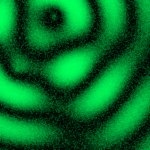

|  Method            | Parameters       | Quick Start Reader | Original Reader | Delta  |
| -------------------|------------------|--------------------|-----------------|------- |
| Initialization     |                  |25 ms|18 ms|        |
| Reader Size (Mb)     |                  |2.03|2.62|        |
| getStageLabelName| Image 0 | B2| Scene position #0| |
| getStageLabelName| Image 1 | B2| Scene position #1| |
| getStageLabelX| Image 1 | 13511.480 um | 13511.520 um | 0.040 um |
| getStageLabelName| Image 2 | B2| Scene position #2| |
| getStageLabelX| Image 2 | 13511.480 um | 13511.520 um | 0.040 um |
| getStageLabelY| Image 2 | 17511.480 um | 17511.520 um | 0.040 um |
| getStageLabelName| Image 3 | B2| Scene position #3| |
| getStageLabelY| Image 3 | 17511.480 um | 17511.520 um | 0.040 um |
| getStageLabelName| Image 4 | B3| Scene position #4| |
| getStageLabelName| Image 5 | B3| Scene position #5| |
| getStageLabelX| Image 5 | 22511.480 um | 22511.520 um | 0.040 um |
| getStageLabelName| Image 6 | B3| Scene position #6| |
| getStageLabelX| Image 6 | 22511.480 um | 22511.520 um | 0.040 um |
| getStageLabelY| Image 6 | 17511.480 um | 17511.520 um | 0.040 um |
| getStageLabelName| Image 7 | B3| Scene position #7| |
| getStageLabelY| Image 7 | 17511.480 um | 17511.520 um | 0.040 um |
| getPlanePositionX| Image 1 Plane 0 | 13511.480 um | 13511.520 um | 0.040 um |
| getPlanePositionX| Image 1 Plane 1 | 13511.480 um | 13511.520 um | 0.040 um |
| getPlanePositionX| Image 1 Plane 2 | 13511.480 um | 13511.520 um | 0.040 um |
| getPlanePositionX| Image 1 Plane 3 | 13511.480 um | 13511.520 um | 0.040 um |
| getPlanePositionX| Image 2 Plane 0 | 13511.480 um | 13511.520 um | 0.040 um |
| getPlanePositionY| Image 2 Plane 0 | 17511.480 um | 17511.520 um | 0.040 um |
| getPlanePositionX| Image 2 Plane 1 | 13511.480 um | 13511.520 um | 0.040 um |
| getPlanePositionY| Image 2 Plane 1 | 17511.480 um | 17511.520 um | 0.040 um |
| getPlanePositionX| Image 2 Plane 2 | 13511.480 um | 13511.520 um | 0.040 um |
| getPlanePositionY| Image 2 Plane 2 | 17511.480 um | 17511.520 um | 0.040 um |
| getPlanePositionX| Image 2 Plane 3 | 13511.480 um | 13511.520 um | 0.040 um |
| getPlanePositionY| Image 2 Plane 3 | 17511.480 um | 17511.520 um | 0.040 um |
| getPlanePositionY| Image 3 Plane 0 | 17511.480 um | 17511.520 um | 0.040 um |
| getPlanePositionY| Image 3 Plane 1 | 17511.480 um | 17511.520 um | 0.040 um |
| getPlanePositionY| Image 3 Plane 2 | 17511.480 um | 17511.520 um | 0.040 um |
| getPlanePositionY| Image 3 Plane 3 | 17511.480 um | 17511.520 um | 0.040 um |
| getPlanePositionX| Image 5 Plane 0 | 22511.480 um | 22511.520 um | 0.040 um |
| getPlanePositionX| Image 5 Plane 1 | 22511.480 um | 22511.520 um | 0.040 um |
| getPlanePositionX| Image 5 Plane 2 | 22511.480 um | 22511.520 um | 0.040 um |
| getPlanePositionX| Image 5 Plane 3 | 22511.480 um | 22511.520 um | 0.040 um |
| getPlanePositionX| Image 6 Plane 0 | 22511.480 um | 22511.520 um | 0.040 um |
| getPlanePositionY| Image 6 Plane 0 | 17511.480 um | 17511.520 um | 0.040 um |
| getPlanePositionX| Image 6 Plane 1 | 22511.480 um | 22511.520 um | 0.040 um |
| getPlanePositionY| Image 6 Plane 1 | 17511.480 um | 17511.520 um | 0.040 um |
| getPlanePositionX| Image 6 Plane 2 | 22511.480 um | 22511.520 um | 0.040 um |
| getPlanePositionY| Image 6 Plane 2 | 17511.480 um | 17511.520 um | 0.040 um |
| getPlanePositionX| Image 6 Plane 3 | 22511.480 um | 22511.520 um | 0.040 um |
| getPlanePositionY| Image 6 Plane 3 | 17511.480 um | 17511.520 um | 0.040 um |
| getPlanePositionY| Image 7 Plane 0 | 17511.480 um | 17511.520 um | 0.040 um |
| getPlanePositionY| Image 7 Plane 1 | 17511.480 um | 17511.520 um | 0.040 um |
| getPlanePositionY| Image 7 Plane 2 | 17511.480 um | 17511.520 um | 0.040 um |
| getPlanePositionY| Image 7 Plane 3 | 17511.480 um | 17511.520 um | 0.040 um |
# [S=2_2x2_Z=4_CH=1.czi](https://zenodo.org/record/7015307/files/S%3D2_2x2_Z%3D4_CH%3D1.czi) report
 - **Autostitch** = false
 - ZeissCZIReader v6.14.0
 - ZeissQuickStartCZIReader v0.2.1-SNAPSHOT

# Images 

| Series            | Quick Start Reader | Size | Original Reader | Size | #Diffs |
|-------------------|--------------------|------|-----------------|------|--------|
| Read time (all)   |88 ms|------|116 ms|------|--------|
|0||X:256 Y:256 C:1 Z:4 T:1||X:256 Y:256 C:1 Z:4 T:1|0|
|1||X:256 Y:256 C:1 Z:4 T:1||X:256 Y:256 C:1 Z:4 T:1|0|
|2||X:256 Y:256 C:1 Z:4 T:1||X:256 Y:256 C:1 Z:4 T:1|0|
|3||X:256 Y:256 C:1 Z:4 T:1||X:256 Y:256 C:1 Z:4 T:1|0|
|4||X:256 Y:256 C:1 Z:4 T:1||X:256 Y:256 C:1 Z:4 T:1|0|
|5||X:256 Y:256 C:1 Z:4 T:1||X:256 Y:256 C:1 Z:4 T:1|0|
|6||X:256 Y:256 C:1 Z:4 T:1||X:256 Y:256 C:1 Z:4 T:1|0|
|7||X:256 Y:256 C:1 Z:4 T:1||X:256 Y:256 C:1 Z:4 T:1|0|

# Metadata

