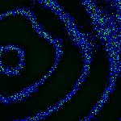

# [S=2_2x2_Z=4_CH=1.czi](https://zenodo.org/record/7015307/files/S%3D2_2x2_Z%3D4_CH%3D1.czi) report
 - **Autostitch** = false
 - ZeissCZIReader v6.14.0
 - ZeissQuickStartCZIReader v0.1.7-SNAPSHOT

# Images 

| Series            | Quick Start Reader | Size | Original Reader | Size |
|-------------------|--------------------|------|-----------------|------|
| Read time (all)   |94 ms|------|111 ms|------|
|0||X:256 Y:256 C:1 Z:4 T:1||X:256 Y:256 C:1 Z:4 T:1|
|1||X:256 Y:256 C:1 Z:4 T:1||X:256 Y:256 C:1 Z:4 T:1|
|2||X:256 Y:256 C:1 Z:4 T:1||X:256 Y:256 C:1 Z:4 T:1|
|3||X:256 Y:256 C:1 Z:4 T:1||X:256 Y:256 C:1 Z:4 T:1|
|4||X:256 Y:256 C:1 Z:4 T:1||X:256 Y:256 C:1 Z:4 T:1|
|5||X:256 Y:256 C:1 Z:4 T:1||X:256 Y:256 C:1 Z:4 T:1|
|6||X:256 Y:256 C:1 Z:4 T:1||X:256 Y:256 C:1 Z:4 T:1|
|7||X:256 Y:256 C:1 Z:4 T:1||X:256 Y:256 C:1 Z:4 T:1|

# Metadata

|  Method            | Parameters       | Quick Start Reader | Original Reader | Delta  |
| -------------------|------------------|--------------------|-----------------|------- |
| Initialization     |                  |24 ms|20 ms|        |
| Reader Size (Mb)     |                  |2.03|2.62|        |
| getStageLabelName| Image 0 | B2| Scene position #0| |
| getStageLabelName| Image 1 | B2| Scene position #1| |
| getStageLabelName| Image 2 | B2| Scene position #2| |
| getStageLabelName| Image 3 | B2| Scene position #3| |
| getStageLabelName| Image 4 | B3| Scene position #4| |
| getStageLabelName| Image 5 | B3| Scene position #5| |
| getStageLabelName| Image 6 | B3| Scene position #6| |
| getStageLabelName| Image 7 | B3| Scene position #7| |
| getPlaneDeltaT| Image 0 Plane 1 |  0.709 s |  0.760 s | 0.051 s |
| getPlaneDeltaT| Image 0 Plane 2 |  0.845 s |  0.946 s | 0.101 s |
| getPlaneDeltaT| Image 0 Plane 3 |  0.981 s |  1.117 s | 0.136 s |
| getPlaneDeltaT| Image 1 Plane 1 |  1.756 s |  1.799 s | 0.043 s |
| getPlaneDeltaT| Image 1 Plane 2 |  1.899 s |  1.983 s | 0.084 s |
| getPlaneDeltaT| Image 1 Plane 3 |  2.042 s |  2.185 s | 0.143 s |
| getPlaneDeltaT| Image 2 Plane 1 |  2.850 s |  2.898 s | 0.048 s |
| getPlaneDeltaT| Image 2 Plane 2 |  2.990 s |  3.083 s | 0.093 s |
| getPlaneDeltaT| Image 2 Plane 3 |  3.130 s |  3.269 s | 0.140 s |
| getPlaneDeltaT| Image 3 Plane 1 |  3.892 s |  3.952 s | 0.060 s |
| getPlaneDeltaT| Image 3 Plane 2 |  4.031 s |  4.139 s | 0.108 s |
| getPlaneDeltaT| Image 3 Plane 3 |  4.170 s |  4.310 s | 0.139 s |
| getPlaneDeltaT| Image 4 Plane 1 |  4.974 s |  5.032 s | 0.058 s |
| getPlaneDeltaT| Image 4 Plane 2 |  5.116 s |  5.216 s | 0.100 s |
| getPlaneDeltaT| Image 4 Plane 3 |  5.259 s |  5.401 s | 0.142 s |
| getPlaneDeltaT| Image 5 Plane 1 |  6.022 s |  6.066 s | 0.044 s |
| getPlaneDeltaT| Image 5 Plane 2 |  6.165 s |  6.265 s | 0.100 s |
| getPlaneDeltaT| Image 5 Plane 3 |  6.308 s |  6.451 s | 0.143 s |
| getPlaneDeltaT| Image 6 Plane 1 |  7.100 s |  7.156 s | 0.055 s |
| getPlaneDeltaT| Image 6 Plane 2 |  7.244 s |  7.343 s | 0.099 s |
| getPlaneDeltaT| Image 6 Plane 3 |  7.387 s |  7.531 s | 0.143 s |
| getPlaneDeltaT| Image 7 Plane 1 |  8.194 s |  8.241 s | 0.047 s |
| getPlaneDeltaT| Image 7 Plane 2 |  8.334 s |  8.425 s | 0.091 s |
| getPlaneDeltaT| Image 7 Plane 3 |  8.473 s |  8.612 s | 0.139 s |
