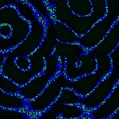
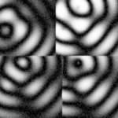
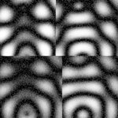
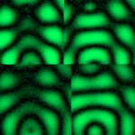

# [S=2_2x2_Z=4_CH=1.czi](https://zenodo.org/record/7015307/files/S%3D2_2x2_Z%3D4_CH%3D1.czi) report
 - **Autostitch** = true
 - ZeissCZIReader v6.14.0
 - ZeissQuickStartCZIReader v0.1.8-SNAPSHOT

# Images 

| Series            | Quick Start Reader | Size | Original Reader | Size | #Diffs |
|-------------------|--------------------|------|-----------------|------|--------|
| Read time (all)   |65 ms|------|83 ms|------|--------|
|0||X:486 Y:486 C:1 Z:4 T:1||X:486 Y:486 C:1 Z:4 T:1|0|
|1||X:243 Y:243 C:1 Z:4 T:1||X:243 Y:243 C:1 Z:4 T:1|0|
|2||X:486 Y:486 C:1 Z:4 T:1||X:486 Y:486 C:1 Z:4 T:1|0|
|3||X:243 Y:243 C:1 Z:4 T:1||X:243 Y:243 C:1 Z:4 T:1|0|

# Metadata

|  Method            | Parameters       | Quick Start Reader | Original Reader | Delta  |
| -------------------|------------------|--------------------|-----------------|------- |
| Initialization     |                  |17 ms|18 ms|        |
| Reader Size (Mb)     |                  |2.00|2.60|        |
| getStageLabelName| Image 0 | B2| Scene position #0| |
| getStageLabelX| Image 0 | 26975.700 um | 13500.000 um | 13475.700 um |
| getStageLabelY| Image 0 | 34975.700 um | 17500.000 um | 17475.700 um |
| getStageLabelName| Image 1 | B2| Scene position #1| |
| getStageLabelX| Image 1 | 26975.700 um | 13500.000 um | 13475.700 um |
| getStageLabelY| Image 1 | 34975.700 um | 17500.000 um | 17475.700 um |
| getPixelsPhysicalSizeX| Image 1 | 0.200 um | 0.100 um | 0.100 um |
| getPixelsPhysicalSizeY| Image 1 | 0.200 um | 0.100 um | 0.100 um |
| getStageLabelName| Image 2 | B3| Scene position #2| |
| getStageLabelX| Image 2 | 35975.700 um | 22500.000 um | 13475.700 um |
| getStageLabelY| Image 2 | 34975.700 um | 17500.000 um | 17475.700 um |
| getStageLabelName| Image 3 | B3| Scene position #3| |
| getStageLabelX| Image 3 | 35975.700 um | 22500.000 um | 13475.700 um |
| getStageLabelY| Image 3 | 34975.700 um | 17500.000 um | 17475.700 um |
| getPixelsPhysicalSizeX| Image 3 | 0.200 um | 0.100 um | 0.100 um |
| getPixelsPhysicalSizeY| Image 3 | 0.200 um | 0.100 um | 0.100 um |
| getPlanePositionX| Image 0 Plane 0 | 26975.700 um | 13500.000 um | 13475.700 um |
| getPlanePositionY| Image 0 Plane 0 | 34975.700 um | 17500.000 um | 17475.700 um |
| getPlanePositionX| Image 0 Plane 1 | 26975.700 um | 13500.000 um | 13475.700 um |
| getPlanePositionY| Image 0 Plane 1 | 34975.700 um | 17500.000 um | 17475.700 um |
| getPlanePositionX| Image 0 Plane 2 | 26975.700 um | 13500.000 um | 13475.700 um |
| getPlanePositionY| Image 0 Plane 2 | 34975.700 um | 17500.000 um | 17475.700 um |
| getPlanePositionX| Image 0 Plane 3 | 26975.700 um | 13500.000 um | 13475.700 um |
| getPlanePositionY| Image 0 Plane 3 | 34975.700 um | 17500.000 um | 17475.700 um |
| getPlanePositionX| Image 1 Plane 0 | 26975.700 um | 13500.000 um | 13475.700 um |
| getPlanePositionY| Image 1 Plane 0 | 34975.700 um | 17500.000 um | 17475.700 um |
| getPlaneDeltaT| Image 1 Plane 1 |  0.760 s |  0.573 s | 0.187 s |
| getPlanePositionX| Image 1 Plane 1 | 26975.700 um | 13500.000 um | 13475.700 um |
| getPlanePositionY| Image 1 Plane 1 | 34975.700 um | 17500.000 um | 17475.700 um |
| getPlaneDeltaT| Image 1 Plane 2 |  0.946 s |  0.573 s | 0.373 s |
| getPlanePositionX| Image 1 Plane 2 | 26975.700 um | 13500.000 um | 13475.700 um |
| getPlanePositionY| Image 1 Plane 2 | 34975.700 um | 17500.000 um | 17475.700 um |
| getPlaneDeltaT| Image 1 Plane 3 |  1.117 s |  0.573 s | 0.544 s |
| getPlanePositionX| Image 1 Plane 3 | 26975.700 um | 13500.000 um | 13475.700 um |
| getPlanePositionY| Image 1 Plane 3 | 34975.700 um | 17500.000 um | 17475.700 um |
| getPlanePositionX| Image 2 Plane 0 | 35975.700 um | 22500.000 um | 13475.700 um |
| getPlanePositionY| Image 2 Plane 0 | 34975.700 um | 17500.000 um | 17475.700 um |
| getPlanePositionX| Image 2 Plane 1 | 35975.700 um | 22500.000 um | 13475.700 um |
| getPlanePositionY| Image 2 Plane 1 | 34975.700 um | 17500.000 um | 17475.700 um |
| getPlanePositionX| Image 2 Plane 2 | 35975.700 um | 22500.000 um | 13475.700 um |
| getPlanePositionY| Image 2 Plane 2 | 34975.700 um | 17500.000 um | 17475.700 um |
| getPlanePositionX| Image 2 Plane 3 | 35975.700 um | 22500.000 um | 13475.700 um |
| getPlanePositionY| Image 2 Plane 3 | 34975.700 um | 17500.000 um | 17475.700 um |
| getPlaneDeltaT| Image 3 Plane 0 |  4.831 s |  0.573 s | 4.258 s |
| getPlanePositionX| Image 3 Plane 0 | 35975.700 um | 22500.000 um | 13475.700 um |
| getPlanePositionY| Image 3 Plane 0 | 34975.700 um | 17500.000 um | 17475.700 um |
| getPlaneDeltaT| Image 3 Plane 1 |  5.032 s |  0.573 s | 4.459 s |
| getPlanePositionX| Image 3 Plane 1 | 35975.700 um | 22500.000 um | 13475.700 um |
| getPlanePositionY| Image 3 Plane 1 | 34975.700 um | 17500.000 um | 17475.700 um |
| getPlaneDeltaT| Image 3 Plane 2 |  5.216 s |  0.573 s | 4.643 s |
| getPlanePositionX| Image 3 Plane 2 | 35975.700 um | 22500.000 um | 13475.700 um |
| getPlanePositionY| Image 3 Plane 2 | 34975.700 um | 17500.000 um | 17475.700 um |
| getPlaneDeltaT| Image 3 Plane 3 |  5.401 s |  0.573 s | 4.828 s |
| getPlanePositionX| Image 3 Plane 3 | 35975.700 um | 22500.000 um | 13475.700 um |
| getPlanePositionY| Image 3 Plane 3 | 34975.700 um | 17500.000 um | 17475.700 um |
