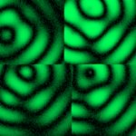
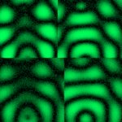

# [S=2_2x2_Z=4_CH=1.czi](https://zenodo.org/record/7015307/files/S%3D2_2x2_Z%3D4_CH%3D1.czi) report
 - **Autostitch** = true
 - ZeissCZIReader v6.14.0
 - ZeissQuickStartCZIReader v0.1.7-SNAPSHOT

# Images 

| Series            | Quick Start Reader | Size | Original Reader | Size |
|-------------------|--------------------|------|-----------------|------|
| Read time (all)   |75 ms|------|89 ms|------|
|0||X:486 Y:486 C:1 Z:4 T:1||X:486 Y:486 C:1 Z:4 T:1|
|1||X:243 Y:243 C:1 Z:4 T:1||X:243 Y:243 C:1 Z:4 T:1|
|2||X:486 Y:486 C:1 Z:4 T:1||X:486 Y:486 C:1 Z:4 T:1|
|3||X:243 Y:243 C:1 Z:4 T:1||X:243 Y:243 C:1 Z:4 T:1|

# Metadata

|  Method            | Parameters       | Quick Start Reader | Original Reader | Delta  |
| -------------------|------------------|--------------------|-----------------|------- |
| Initialization     |                  |19 ms|19 ms|        |
| Reader Size (Mb)     |                  |2.00|2.60|        |
| getStageLabelName| Image 0 | B2| Scene position #0| |
| getStageLabelX| Image 0 | 13488.480 um | 13500.000 um | 11.520 um |
| getStageLabelY| Image 0 | 17488.480 um | 17500.000 um | 11.520 um |
| getStageLabelName| Image 1 | B2| Scene position #1| |
| getStageLabelX| Image 1 | 13475.600 um | 13500.000 um | 24.400 um |
| getStageLabelY| Image 1 | 17475.600 um | 17500.000 um | 24.400 um |
| getStageLabelZ| Image 1 | | 1: ome.units.quantity.Length: value[0.0], unit[µm] stored as java.lang.Double| 2: null |
| getPixelsPhysicalSizeX| Image 1 | 0.200 um | 0.100 um | 0.100 um |
| getPixelsPhysicalSizeY| Image 1 | 0.200 um | 0.100 um | 0.100 um |
| getStageLabelName| Image 2 | B3| Scene position #2| |
| getStageLabelX| Image 2 | 22488.480 um | 22500.000 um | 11.520 um |
| getStageLabelY| Image 2 | 17488.480 um | 17500.000 um | 11.520 um |
| getStageLabelName| Image 3 | B3| Scene position #3| |
| getStageLabelX| Image 3 | 22475.600 um | 22500.000 um | 24.400 um |
| getStageLabelY| Image 3 | 17475.600 um | 17500.000 um | 24.400 um |
| getStageLabelZ| Image 3 | | 1: ome.units.quantity.Length: value[0.0], unit[µm] stored as java.lang.Double| 2: null |
| getPixelsPhysicalSizeX| Image 3 | 0.200 um | 0.100 um | 0.100 um |
| getPixelsPhysicalSizeY| Image 3 | 0.200 um | 0.100 um | 0.100 um |
| getPlanePositionX| Image 0 Plane 0 | 13488.480 um | 13500.000 um | 11.520 um |
| getPlanePositionY| Image 0 Plane 0 | 17488.480 um | 17500.000 um | 11.520 um |
| getPlaneDeltaT| Image 0 Plane 1 |  0.709 s |  0.760 s | 0.051 s |
| getPlanePositionX| Image 0 Plane 1 | 13488.480 um | 13500.000 um | 11.520 um |
| getPlanePositionY| Image 0 Plane 1 | 17488.480 um | 17500.000 um | 11.520 um |
| getPlaneDeltaT| Image 0 Plane 2 |  0.845 s |  0.946 s | 0.101 s |
| getPlanePositionX| Image 0 Plane 2 | 13488.480 um | 13500.000 um | 11.520 um |
| getPlanePositionY| Image 0 Plane 2 | 17488.480 um | 17500.000 um | 11.520 um |
| getPlaneDeltaT| Image 0 Plane 3 |  0.981 s |  1.117 s | 0.136 s |
| getPlanePositionX| Image 0 Plane 3 | 13488.480 um | 13500.000 um | 11.520 um |
| getPlanePositionY| Image 0 Plane 3 | 17488.480 um | 17500.000 um | 11.520 um |
| getPlaneDeltaT| Image 1 Plane 0 | | 1: null| 2: ome.units.quantity.Time: value[0.5726578], unit[s] stored as java.lang.Double |
| getPlaneExposureTime| Image 1 Plane 0 | | 1: null| 2: ome.units.quantity.Time: value[10.0], unit[s] stored as java.lang.Double |
| getPlanePositionX| Image 1 Plane 0 | | 1: null| 2: ome.units.quantity.Length: value[13500.0], unit[µm] stored as java.lang.Double |
| getPlanePositionY| Image 1 Plane 0 | | 1: null| 2: ome.units.quantity.Length: value[17500.0], unit[µm] stored as java.lang.Double |
| getPlaneDeltaT| Image 1 Plane 1 | | 1: null| 2: ome.units.quantity.Time: value[0.5726578], unit[s] stored as java.lang.Double |
| getPlaneExposureTime| Image 1 Plane 1 | | 1: null| 2: ome.units.quantity.Time: value[10.0], unit[s] stored as java.lang.Double |
| getPlanePositionX| Image 1 Plane 1 | | 1: null| 2: ome.units.quantity.Length: value[13500.0], unit[µm] stored as java.lang.Double |
| getPlanePositionY| Image 1 Plane 1 | | 1: null| 2: ome.units.quantity.Length: value[17500.0], unit[µm] stored as java.lang.Double |
| getPlaneDeltaT| Image 1 Plane 2 | | 1: null| 2: ome.units.quantity.Time: value[0.5726578], unit[s] stored as java.lang.Double |
| getPlaneExposureTime| Image 1 Plane 2 | | 1: null| 2: ome.units.quantity.Time: value[10.0], unit[s] stored as java.lang.Double |
| getPlanePositionX| Image 1 Plane 2 | | 1: null| 2: ome.units.quantity.Length: value[13500.0], unit[µm] stored as java.lang.Double |
| getPlanePositionY| Image 1 Plane 2 | | 1: null| 2: ome.units.quantity.Length: value[17500.0], unit[µm] stored as java.lang.Double |
| getPlaneDeltaT| Image 1 Plane 3 | | 1: null| 2: ome.units.quantity.Time: value[0.5726578], unit[s] stored as java.lang.Double |
| getPlaneExposureTime| Image 1 Plane 3 | | 1: null| 2: ome.units.quantity.Time: value[10.0], unit[s] stored as java.lang.Double |
| getPlanePositionX| Image 1 Plane 3 | | 1: null| 2: ome.units.quantity.Length: value[13500.0], unit[µm] stored as java.lang.Double |
| getPlanePositionY| Image 1 Plane 3 | | 1: null| 2: ome.units.quantity.Length: value[17500.0], unit[µm] stored as java.lang.Double |
| getPlanePositionX| Image 2 Plane 0 | 22488.480 um | 22500.000 um | 11.520 um |
| getPlanePositionY| Image 2 Plane 0 | 17488.480 um | 17500.000 um | 11.520 um |
| getPlaneDeltaT| Image 2 Plane 1 |  4.974 s |  5.032 s | 0.058 s |
| getPlanePositionX| Image 2 Plane 1 | 22488.480 um | 22500.000 um | 11.520 um |
| getPlanePositionY| Image 2 Plane 1 | 17488.480 um | 17500.000 um | 11.520 um |
| getPlaneDeltaT| Image 2 Plane 2 |  5.116 s |  5.216 s | 0.100 s |
| getPlanePositionX| Image 2 Plane 2 | 22488.480 um | 22500.000 um | 11.520 um |
| getPlanePositionY| Image 2 Plane 2 | 17488.480 um | 17500.000 um | 11.520 um |
| getPlaneDeltaT| Image 2 Plane 3 |  5.259 s |  5.401 s | 0.142 s |
| getPlanePositionX| Image 2 Plane 3 | 22488.480 um | 22500.000 um | 11.520 um |
| getPlanePositionY| Image 2 Plane 3 | 17488.480 um | 17500.000 um | 11.520 um |
| getPlaneDeltaT| Image 3 Plane 0 | | 1: null| 2: ome.units.quantity.Time: value[0.5726578], unit[s] stored as java.lang.Double |
| getPlaneExposureTime| Image 3 Plane 0 | | 1: null| 2: ome.units.quantity.Time: value[10.0], unit[s] stored as java.lang.Double |
| getPlanePositionX| Image 3 Plane 0 | | 1: null| 2: ome.units.quantity.Length: value[22500.0], unit[µm] stored as java.lang.Double |
| getPlanePositionY| Image 3 Plane 0 | | 1: null| 2: ome.units.quantity.Length: value[17500.0], unit[µm] stored as java.lang.Double |
| getPlaneDeltaT| Image 3 Plane 1 | | 1: null| 2: ome.units.quantity.Time: value[0.5726578], unit[s] stored as java.lang.Double |
| getPlaneExposureTime| Image 3 Plane 1 | | 1: null| 2: ome.units.quantity.Time: value[10.0], unit[s] stored as java.lang.Double |
| getPlanePositionX| Image 3 Plane 1 | | 1: null| 2: ome.units.quantity.Length: value[22500.0], unit[µm] stored as java.lang.Double |
| getPlanePositionY| Image 3 Plane 1 | | 1: null| 2: ome.units.quantity.Length: value[17500.0], unit[µm] stored as java.lang.Double |
| getPlaneDeltaT| Image 3 Plane 2 | | 1: null| 2: ome.units.quantity.Time: value[0.5726578], unit[s] stored as java.lang.Double |
| getPlaneExposureTime| Image 3 Plane 2 | | 1: null| 2: ome.units.quantity.Time: value[10.0], unit[s] stored as java.lang.Double |
| getPlanePositionX| Image 3 Plane 2 | | 1: null| 2: ome.units.quantity.Length: value[22500.0], unit[µm] stored as java.lang.Double |
| getPlanePositionY| Image 3 Plane 2 | | 1: null| 2: ome.units.quantity.Length: value[17500.0], unit[µm] stored as java.lang.Double |
| getPlaneDeltaT| Image 3 Plane 3 | | 1: null| 2: ome.units.quantity.Time: value[0.5726578], unit[s] stored as java.lang.Double |
| getPlaneExposureTime| Image 3 Plane 3 | | 1: null| 2: ome.units.quantity.Time: value[10.0], unit[s] stored as java.lang.Double |
| getPlanePositionX| Image 3 Plane 3 | | 1: null| 2: ome.units.quantity.Length: value[22500.0], unit[µm] stored as java.lang.Double |
| getPlanePositionY| Image 3 Plane 3 | | 1: null| 2: ome.units.quantity.Length: value[17500.0], unit[µm] stored as java.lang.Double |
