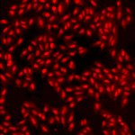

# [S=2_3x3_T=1_Z=4_CH=2.czi](https://zenodo.org/record/7015307/files/S%3D2_3x3_T%3D1_Z%3D4_CH%3D2.czi) report
 - **Autostitch** = false
 - ZeissCZIReader v6.13.0
 - ZeissQuickStartCZIReader v0.1.4-SNAPSHOT

# Images 

| Series            | Quick Start Reader | Size | Original Reader | Size |
|-------------------|--------------------|------|-----------------|------|
| Read time (all)   |356 ms|------|370 ms|------|
|0||X:640 Y:640 C:2 Z:4 T:1||X:640 Y:640 C:2 Z:4 T:1|
|1||X:640 Y:640 C:2 Z:4 T:1||X:640 Y:640 C:2 Z:4 T:1|
|2||X:640 Y:640 C:2 Z:4 T:1||X:640 Y:640 C:2 Z:4 T:1|
|3||X:640 Y:640 C:2 Z:4 T:1||X:640 Y:640 C:2 Z:4 T:1|
|4||X:640 Y:640 C:2 Z:4 T:1||X:640 Y:640 C:2 Z:4 T:1|
|5||X:640 Y:640 C:2 Z:4 T:1||X:640 Y:640 C:2 Z:4 T:1|
|6||X:640 Y:640 C:2 Z:4 T:1||X:640 Y:640 C:2 Z:4 T:1|
|7||X:640 Y:640 C:2 Z:4 T:1||X:640 Y:640 C:2 Z:4 T:1|
|8||X:640 Y:640 C:2 Z:4 T:1||X:640 Y:640 C:2 Z:4 T:1|
|9||X:640 Y:640 C:2 Z:4 T:1||X:640 Y:640 C:2 Z:4 T:1|
|10||X:640 Y:640 C:2 Z:4 T:1||X:640 Y:640 C:2 Z:4 T:1|
|11||X:640 Y:640 C:2 Z:4 T:1||X:640 Y:640 C:2 Z:4 T:1|
|12||X:640 Y:640 C:2 Z:4 T:1||X:640 Y:640 C:2 Z:4 T:1|
|13||X:640 Y:640 C:2 Z:4 T:1||X:640 Y:640 C:2 Z:4 T:1|
|14||X:640 Y:640 C:2 Z:4 T:1||X:640 Y:640 C:2 Z:4 T:1|
|15||X:640 Y:640 C:2 Z:4 T:1||X:640 Y:640 C:2 Z:4 T:1|
|16||X:640 Y:640 C:2 Z:4 T:1||X:640 Y:640 C:2 Z:4 T:1|
|17||X:640 Y:640 C:2 Z:4 T:1||X:640 Y:640 C:2 Z:4 T:1|

# Metadata

|  Method            | Parameters       | Quick Start Reader | Original Reader | Delta  |
| -------------------|------------------|--------------------|-----------------|------- |
| Initialization     |                  |30 ms|25 ms|        |
| getStageLabelName| Image 0 | D6| Scene position #0| |
| getStageLabelName| Image 1 | D6| Scene position #1| |
| getStageLabelName| Image 2 | D6| Scene position #2| |
| getStageLabelName| Image 3 | D6| Scene position #3| |
| getStageLabelName| Image 4 | D6| Scene position #4| |
| getStageLabelName| Image 5 | D6| Scene position #5| |
| getStageLabelName| Image 6 | D6| Scene position #6| |
| getStageLabelName| Image 7 | D6| Scene position #7| |
| getStageLabelName| Image 8 | D6| Scene position #8| |
| getStageLabelName| Image 9 | D7| Scene position #9| |
| getStageLabelName| Image 10 | D7| Scene position #10| |
| getStageLabelName| Image 11 | D7| Scene position #11| |
| getStageLabelName| Image 12 | D7| Scene position #12| |
| getStageLabelName| Image 13 | D7| Scene position #13| |
| getStageLabelName| Image 14 | D7| Scene position #14| |
| getStageLabelName| Image 15 | D7| Scene position #15| |
| getStageLabelName| Image 16 | D7| Scene position #16| |
| getStageLabelName| Image 17 | D7| Scene position #17| |
| getPlaneDeltaT| Image 0 Plane 2 |  2.410 s |  2.509 s | 0.100 s |
| getPlaneDeltaT| Image 0 Plane 3 |  2.484 s |  2.567 s | 0.084 s |
| getPlaneDeltaT| Image 0 Plane 4 |  2.639 s |  2.818 s | 0.179 s |
| getPlaneDeltaT| Image 0 Plane 5 |  2.703 s |  2.862 s | 0.159 s |
| getPlaneDeltaT| Image 0 Plane 6 |  2.869 s |  3.098 s | 0.229 s |
| getPlaneDeltaT| Image 0 Plane 7 |  2.923 s |  3.142 s | 0.219 s |
| getPlaneDeltaT| Image 1 Plane 2 |  3.908 s |  3.991 s | 0.083 s |
| getPlaneDeltaT| Image 1 Plane 3 |  3.964 s |  4.040 s | 0.076 s |
| getPlaneDeltaT| Image 1 Plane 4 |  4.128 s |  4.278 s | 0.151 s |
| getPlaneDeltaT| Image 1 Plane 5 |  4.180 s |  4.330 s | 0.150 s |
| getPlaneDeltaT| Image 1 Plane 6 |  4.347 s |  4.567 s | 0.220 s |
| getPlaneDeltaT| Image 1 Plane 7 |  4.397 s |  4.613 s | 0.217 s |
| getPlaneDeltaT| Image 2 Plane 2 |  5.367 s |  5.441 s | 0.074 s |
| getPlaneDeltaT| Image 2 Plane 3 |  5.415 s |  5.485 s | 0.070 s |
| getPlaneDeltaT| Image 2 Plane 4 |  5.580 s |  5.727 s | 0.147 s |
| getPlaneDeltaT| Image 2 Plane 5 |  5.627 s |  5.775 s | 0.148 s |
| getPlaneDeltaT| Image 2 Plane 6 |  5.793 s |  6.006 s | 0.213 s |
| getPlaneDeltaT| Image 2 Plane 7 |  5.838 s |  6.050 s | 0.212 s |
| getPlaneDeltaT| Image 3 Plane 2 |  6.819 s |  6.886 s | 0.067 s |
| getPlaneDeltaT| Image 3 Plane 3 |  6.865 s |  6.942 s | 0.077 s |
| getPlaneDeltaT| Image 3 Plane 4 |  7.030 s |  7.171 s | 0.141 s |
| getPlaneDeltaT| Image 3 Plane 5 |  7.074 s |  7.215 s | 0.141 s |
| getPlaneDeltaT| Image 3 Plane 6 |  7.240 s |  7.451 s | 0.211 s |
| getPlaneDeltaT| Image 3 Plane 7 |  7.283 s |  7.492 s | 0.209 s |
| getPlaneDeltaT| Image 4 Plane 2 |  8.245 s |  8.315 s | 0.070 s |
| getPlaneDeltaT| Image 4 Plane 3 |  8.291 s |  8.373 s | 0.083 s |
| getPlaneDeltaT| Image 4 Plane 4 |  8.463 s |  8.605 s | 0.142 s |
| getPlaneDeltaT| Image 4 Plane 5 |  8.506 s |  8.662 s | 0.156 s |
| getPlaneDeltaT| Image 4 Plane 6 |  8.680 s |  8.897 s | 0.217 s |
| getPlaneDeltaT| Image 4 Plane 7 |  8.722 s |  8.937 s | 0.215 s |
| getPlaneDeltaT| Image 5 Plane 2 |  9.693 s |  9.762 s | 0.069 s |
| getPlaneDeltaT| Image 5 Plane 3 |  9.735 s |  9.814 s | 0.079 s |
| getPlaneDeltaT| Image 5 Plane 4 |  9.906 s |  10.045 s | 0.139 s |
| getPlaneDeltaT| Image 5 Plane 5 |  9.950 s |  10.095 s | 0.145 s |
| getPlaneDeltaT| Image 5 Plane 6 |  10.120 s |  10.333 s | 0.214 s |
| getPlaneDeltaT| Image 5 Plane 7 |  10.164 s |  10.378 s | 0.214 s |
| getPlaneDeltaT| Image 6 Plane 2 |  11.150 s |  11.219 s | 0.069 s |
| getPlaneDeltaT| Image 6 Plane 3 |  11.198 s |  11.266 s | 0.068 s |
| getPlaneDeltaT| Image 6 Plane 4 |  11.361 s |  11.493 s | 0.132 s |
| getPlaneDeltaT| Image 6 Plane 5 |  11.413 s |  11.544 s | 0.131 s |
| getPlaneDeltaT| Image 6 Plane 6 |  11.572 s |  11.783 s | 0.211 s |
| getPlaneDeltaT| Image 6 Plane 7 |  11.628 s |  11.843 s | 0.215 s |
| getPlaneDeltaT| Image 7 Plane 2 |  12.596 s |  12.651 s | 0.055 s |
| getPlaneDeltaT| Image 7 Plane 3 |  12.643 s |  12.703 s | 0.061 s |
| getPlaneDeltaT| Image 7 Plane 4 |  12.816 s |  12.956 s | 0.140 s |
| getPlaneDeltaT| Image 7 Plane 5 |  12.864 s |  13.016 s | 0.152 s |
| getPlaneDeltaT| Image 7 Plane 6 |  13.035 s |  13.255 s | 0.220 s |
| getPlaneDeltaT| Image 7 Plane 7 |  13.086 s |  13.307 s | 0.222 s |
| getPlaneDeltaT| Image 8 Plane 2 |  14.067 s |  14.125 s | 0.058 s |
| getPlaneDeltaT| Image 8 Plane 3 |  14.116 s |  14.170 s | 0.054 s |
| getPlaneDeltaT| Image 8 Plane 4 |  14.287 s |  14.424 s | 0.137 s |
| getPlaneDeltaT| Image 8 Plane 5 |  14.337 s |  14.486 s | 0.150 s |
| getPlaneDeltaT| Image 8 Plane 6 |  14.508 s |  14.728 s | 0.220 s |
| getPlaneDeltaT| Image 8 Plane 7 |  14.557 s |  14.778 s | 0.221 s |
| getPlaneDeltaT| Image 9 Plane 2 |  15.579 s |  15.658 s | 0.079 s |
| getPlaneDeltaT| Image 9 Plane 3 |  15.639 s |  15.711 s | 0.072 s |
| getPlaneDeltaT| Image 9 Plane 4 |  15.808 s |  15.964 s | 0.156 s |
| getPlaneDeltaT| Image 9 Plane 5 |  15.870 s |  16.023 s | 0.153 s |
| getPlaneDeltaT| Image 9 Plane 6 |  16.036 s |  16.264 s | 0.228 s |
| getPlaneDeltaT| Image 9 Plane 7 |  16.100 s |  16.331 s | 0.231 s |
| getPlaneDeltaT| Image 10 Plane 2 |  17.134 s |  17.203 s | 0.069 s |
| getPlaneDeltaT| Image 10 Plane 3 |  17.190 s |  17.259 s | 0.069 s |
| getPlaneDeltaT| Image 10 Plane 4 |  17.365 s |  17.506 s | 0.141 s |
| getPlaneDeltaT| Image 10 Plane 5 |  17.423 s |  17.573 s | 0.151 s |
| getPlaneDeltaT| Image 10 Plane 6 |  17.596 s |  17.827 s | 0.231 s |
| getPlaneDeltaT| Image 10 Plane 7 |  17.655 s |  17.888 s | 0.233 s |
| getPlaneDeltaT| Image 11 Plane 2 |  18.669 s |  18.746 s | 0.077 s |
| getPlaneDeltaT| Image 11 Plane 3 |  18.723 s |  18.796 s | 0.073 s |
| getPlaneDeltaT| Image 11 Plane 4 |  18.890 s |  19.041 s | 0.151 s |
| getPlaneDeltaT| Image 11 Plane 5 |  18.942 s |  19.094 s | 0.152 s |
| getPlaneDeltaT| Image 11 Plane 6 |  19.111 s |  19.332 s | 0.221 s |
| getPlaneDeltaT| Image 11 Plane 7 |  19.160 s |  19.379 s | 0.219 s |
| getPlaneDeltaT| Image 12 Plane 2 |  20.172 s |  20.255 s | 0.083 s |
| getPlaneDeltaT| Image 12 Plane 3 |  20.228 s |  20.309 s | 0.081 s |
| getPlaneDeltaT| Image 12 Plane 4 |  20.396 s |  20.547 s | 0.152 s |
| getPlaneDeltaT| Image 12 Plane 5 |  20.452 s |  20.599 s | 0.147 s |
| getPlaneDeltaT| Image 12 Plane 6 |  20.619 s |  20.842 s | 0.223 s |
| getPlaneDeltaT| Image 12 Plane 7 |  20.675 s |  20.898 s | 0.223 s |
| getPlaneDeltaT| Image 13 Plane 2 |  21.667 s |  21.737 s | 0.070 s |
| getPlaneDeltaT| Image 13 Plane 3 |  21.718 s |  21.784 s | 0.066 s |
| getPlaneDeltaT| Image 13 Plane 4 |  21.883 s |  22.032 s | 0.149 s |
| getPlaneDeltaT| Image 13 Plane 5 |  21.937 s |  22.081 s | 0.145 s |
| getPlaneDeltaT| Image 13 Plane 6 |  22.100 s |  22.316 s | 0.216 s |
| getPlaneDeltaT| Image 13 Plane 7 |  22.155 s |  22.373 s | 0.218 s |
| getPlaneDeltaT| Image 14 Plane 2 |  23.138 s |  23.210 s | 0.072 s |
| getPlaneDeltaT| Image 14 Plane 3 |  23.190 s |  23.259 s | 0.069 s |
| getPlaneDeltaT| Image 14 Plane 4 |  23.355 s |  23.495 s | 0.141 s |
| getPlaneDeltaT| Image 14 Plane 5 |  23.409 s |  23.545 s | 0.136 s |
| getPlaneDeltaT| Image 14 Plane 6 |  23.571 s |  23.788 s | 0.217 s |
| getPlaneDeltaT| Image 14 Plane 7 |  23.628 s |  23.847 s | 0.219 s |
| getPlaneDeltaT| Image 15 Plane 2 |  24.616 s |  24.687 s | 0.071 s |
| getPlaneDeltaT| Image 15 Plane 3 |  24.666 s |  24.742 s | 0.076 s |
| getPlaneDeltaT| Image 15 Plane 4 |  24.836 s |  24.984 s | 0.148 s |
| getPlaneDeltaT| Image 15 Plane 5 |  24.887 s |  25.044 s | 0.157 s |
| getPlaneDeltaT| Image 15 Plane 6 |  25.055 s |  25.275 s | 0.220 s |
| getPlaneDeltaT| Image 15 Plane 7 |  25.108 s |  25.329 s | 0.221 s |
| getPlaneDeltaT| Image 16 Plane 2 |  26.088 s |  26.149 s | 0.062 s |
| getPlaneDeltaT| Image 16 Plane 3 |  26.137 s |  26.201 s | 0.064 s |
| getPlaneDeltaT| Image 16 Plane 4 |  26.302 s |  26.447 s | 0.145 s |
| getPlaneDeltaT| Image 16 Plane 5 |  26.354 s |  26.501 s | 0.147 s |
| getPlaneDeltaT| Image 16 Plane 6 |  26.517 s |  26.731 s | 0.215 s |
| getPlaneDeltaT| Image 16 Plane 7 |  26.572 s |  26.789 s | 0.217 s |
| getPlaneDeltaT| Image 17 Plane 2 |  27.558 s |  27.622 s | 0.064 s |
| getPlaneDeltaT| Image 17 Plane 3 |  27.609 s |  27.673 s | 0.065 s |
| getPlaneDeltaT| Image 17 Plane 4 |  27.781 s |  27.923 s | 0.143 s |
| getPlaneDeltaT| Image 17 Plane 5 |  27.833 s |  27.977 s | 0.144 s |
| getPlaneDeltaT| Image 17 Plane 6 |  28.003 s |  28.225 s | 0.222 s |
| getPlaneDeltaT| Image 17 Plane 7 |  28.058 s |  28.282 s | 0.225 s |
