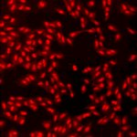

# [S=2_3x3_T=1_Z=4_CH=2.czi](https://zenodo.org/record/7015307/files/S%3D2_3x3_T%3D1_Z%3D4_CH%3D2.czi) report
 - **Autostitch** = false
 - ZeissCZIReader v6.14.0
 - ZeissQuickStartCZIReader v0.1.8-SNAPSHOT

# Images 

| Series            | Quick Start Reader | Size | Original Reader | Size | #Diffs |
|-------------------|--------------------|------|-----------------|------|--------|
| Read time (all)   |288 ms|------|317 ms|------|--------|
|0||X:640 Y:640 C:2 Z:4 T:1||X:640 Y:640 C:2 Z:4 T:1|0|
|1||X:640 Y:640 C:2 Z:4 T:1||X:640 Y:640 C:2 Z:4 T:1|0|
|2||X:640 Y:640 C:2 Z:4 T:1||X:640 Y:640 C:2 Z:4 T:1|0|
|3||X:640 Y:640 C:2 Z:4 T:1||X:640 Y:640 C:2 Z:4 T:1|0|
|4||X:640 Y:640 C:2 Z:4 T:1||X:640 Y:640 C:2 Z:4 T:1|0|
|5||X:640 Y:640 C:2 Z:4 T:1||X:640 Y:640 C:2 Z:4 T:1|0|
|6||X:640 Y:640 C:2 Z:4 T:1||X:640 Y:640 C:2 Z:4 T:1|0|
|7||X:640 Y:640 C:2 Z:4 T:1||X:640 Y:640 C:2 Z:4 T:1|0|
|8||X:640 Y:640 C:2 Z:4 T:1||X:640 Y:640 C:2 Z:4 T:1|0|
|9||X:640 Y:640 C:2 Z:4 T:1||X:640 Y:640 C:2 Z:4 T:1|0|
|10||X:640 Y:640 C:2 Z:4 T:1||X:640 Y:640 C:2 Z:4 T:1|0|
|11||X:640 Y:640 C:2 Z:4 T:1||X:640 Y:640 C:2 Z:4 T:1|0|
|12||X:640 Y:640 C:2 Z:4 T:1||X:640 Y:640 C:2 Z:4 T:1|0|
|13||X:640 Y:640 C:2 Z:4 T:1||X:640 Y:640 C:2 Z:4 T:1|0|
|14||X:640 Y:640 C:2 Z:4 T:1||X:640 Y:640 C:2 Z:4 T:1|0|
|15||X:640 Y:640 C:2 Z:4 T:1||X:640 Y:640 C:2 Z:4 T:1|0|
|16||X:640 Y:640 C:2 Z:4 T:1||X:640 Y:640 C:2 Z:4 T:1|0|
|17||X:640 Y:640 C:2 Z:4 T:1||X:640 Y:640 C:2 Z:4 T:1|0|

# Metadata

|  Method            | Parameters       | Quick Start Reader | Original Reader | Delta  |
| -------------------|------------------|--------------------|-----------------|------- |
| Initialization     |                  |29 ms|24 ms|        |
| Reader Size (Mb)     |                  |2.06|2.78|        |
| getStageLabelName| Image 0 | D6| Scene position #0| |
| getStageLabelX| Image 0 | 49500.000 um | 49442.400 um | 57.600 um |
| getStageLabelY| Image 0 | 35500.000 um | 35442.400 um | 57.600 um |
| getStageLabelName| Image 1 | D6| Scene position #1| |
| getStageLabelX| Image 1 | 49557.600 um | 49500.000 um | 57.600 um |
| getStageLabelY| Image 1 | 35500.000 um | 35442.400 um | 57.600 um |
| getStageLabelName| Image 2 | D6| Scene position #2| |
| getStageLabelX| Image 2 | 49615.200 um | 49557.600 um | 57.600 um |
| getStageLabelY| Image 2 | 35500.000 um | 35442.400 um | 57.600 um |
| getStageLabelName| Image 3 | D6| Scene position #3| |
| getStageLabelX| Image 3 | 49615.200 um | 49557.600 um | 57.600 um |
| getStageLabelY| Image 3 | 35557.600 um | 35500.000 um | 57.600 um |
| getStageLabelName| Image 4 | D6| Scene position #4| |
| getStageLabelX| Image 4 | 49557.600 um | 49500.000 um | 57.600 um |
| getStageLabelY| Image 4 | 35557.600 um | 35500.000 um | 57.600 um |
| getStageLabelName| Image 5 | D6| Scene position #5| |
| getStageLabelX| Image 5 | 49500.000 um | 49442.400 um | 57.600 um |
| getStageLabelY| Image 5 | 35557.600 um | 35500.000 um | 57.600 um |
| getStageLabelName| Image 6 | D6| Scene position #6| |
| getStageLabelX| Image 6 | 49500.000 um | 49442.400 um | 57.600 um |
| getStageLabelY| Image 6 | 35615.200 um | 35557.600 um | 57.600 um |
| getStageLabelName| Image 7 | D6| Scene position #7| |
| getStageLabelX| Image 7 | 49557.600 um | 49500.000 um | 57.600 um |
| getStageLabelY| Image 7 | 35615.200 um | 35557.600 um | 57.600 um |
| getStageLabelName| Image 8 | D6| Scene position #8| |
| getStageLabelX| Image 8 | 49615.200 um | 49557.600 um | 57.600 um |
| getStageLabelY| Image 8 | 35615.200 um | 35557.600 um | 57.600 um |
| getStageLabelName| Image 9 | D7| Scene position #9| |
| getStageLabelX| Image 9 | 58500.000 um | 58442.400 um | 57.600 um |
| getStageLabelY| Image 9 | 35500.000 um | 35442.400 um | 57.600 um |
| getStageLabelName| Image 10 | D7| Scene position #10| |
| getStageLabelX| Image 10 | 58557.600 um | 58500.000 um | 57.600 um |
| getStageLabelY| Image 10 | 35500.000 um | 35442.400 um | 57.600 um |
| getStageLabelName| Image 11 | D7| Scene position #11| |
| getStageLabelX| Image 11 | 58615.200 um | 58557.600 um | 57.600 um |
| getStageLabelY| Image 11 | 35500.000 um | 35442.400 um | 57.600 um |
| getStageLabelName| Image 12 | D7| Scene position #12| |
| getStageLabelX| Image 12 | 58615.200 um | 58557.600 um | 57.600 um |
| getStageLabelY| Image 12 | 35557.600 um | 35500.000 um | 57.600 um |
| getStageLabelName| Image 13 | D7| Scene position #13| |
| getStageLabelX| Image 13 | 58557.600 um | 58500.000 um | 57.600 um |
| getStageLabelY| Image 13 | 35557.600 um | 35500.000 um | 57.600 um |
| getStageLabelName| Image 14 | D7| Scene position #14| |
| getStageLabelX| Image 14 | 58500.000 um | 58442.400 um | 57.600 um |
| getStageLabelY| Image 14 | 35557.600 um | 35500.000 um | 57.600 um |
| getStageLabelName| Image 15 | D7| Scene position #15| |
| getStageLabelX| Image 15 | 58500.000 um | 58442.400 um | 57.600 um |
| getStageLabelY| Image 15 | 35615.200 um | 35557.600 um | 57.600 um |
| getStageLabelName| Image 16 | D7| Scene position #16| |
| getStageLabelX| Image 16 | 58557.600 um | 58500.000 um | 57.600 um |
| getStageLabelY| Image 16 | 35615.200 um | 35557.600 um | 57.600 um |
| getStageLabelName| Image 17 | D7| Scene position #17| |
| getStageLabelX| Image 17 | 58615.200 um | 58557.600 um | 57.600 um |
| getStageLabelY| Image 17 | 35615.200 um | 35557.600 um | 57.600 um |
| getPlanePositionX| Image 0 Plane 0 | 49500.000 um | 49442.400 um | 57.600 um |
| getPlanePositionY| Image 0 Plane 0 | 35500.000 um | 35442.400 um | 57.600 um |
| getPlanePositionX| Image 0 Plane 1 | 49500.000 um | 49442.400 um | 57.600 um |
| getPlanePositionY| Image 0 Plane 1 | 35500.000 um | 35442.400 um | 57.600 um |
| getPlanePositionX| Image 0 Plane 2 | 49500.000 um | 49442.400 um | 57.600 um |
| getPlanePositionY| Image 0 Plane 2 | 35500.000 um | 35442.400 um | 57.600 um |
| getPlanePositionX| Image 0 Plane 3 | 49500.000 um | 49442.400 um | 57.600 um |
| getPlanePositionY| Image 0 Plane 3 | 35500.000 um | 35442.400 um | 57.600 um |
| getPlanePositionX| Image 0 Plane 4 | 49500.000 um | 49442.400 um | 57.600 um |
| getPlanePositionY| Image 0 Plane 4 | 35500.000 um | 35442.400 um | 57.600 um |
| getPlanePositionX| Image 0 Plane 5 | 49500.000 um | 49442.400 um | 57.600 um |
| getPlanePositionY| Image 0 Plane 5 | 35500.000 um | 35442.400 um | 57.600 um |
| getPlanePositionX| Image 0 Plane 6 | 49500.000 um | 49442.400 um | 57.600 um |
| getPlanePositionY| Image 0 Plane 6 | 35500.000 um | 35442.400 um | 57.600 um |
| getPlanePositionX| Image 0 Plane 7 | 49500.000 um | 49442.400 um | 57.600 um |
| getPlanePositionY| Image 0 Plane 7 | 35500.000 um | 35442.400 um | 57.600 um |
| getPlanePositionX| Image 1 Plane 0 | 49557.600 um | 49500.000 um | 57.600 um |
| getPlanePositionY| Image 1 Plane 0 | 35500.000 um | 35442.400 um | 57.600 um |
| getPlanePositionX| Image 1 Plane 1 | 49557.600 um | 49500.000 um | 57.600 um |
| getPlanePositionY| Image 1 Plane 1 | 35500.000 um | 35442.400 um | 57.600 um |
| getPlanePositionX| Image 1 Plane 2 | 49557.600 um | 49500.000 um | 57.600 um |
| getPlanePositionY| Image 1 Plane 2 | 35500.000 um | 35442.400 um | 57.600 um |
| getPlanePositionX| Image 1 Plane 3 | 49557.600 um | 49500.000 um | 57.600 um |
| getPlanePositionY| Image 1 Plane 3 | 35500.000 um | 35442.400 um | 57.600 um |
| getPlanePositionX| Image 1 Plane 4 | 49557.600 um | 49500.000 um | 57.600 um |
| getPlanePositionY| Image 1 Plane 4 | 35500.000 um | 35442.400 um | 57.600 um |
| getPlanePositionX| Image 1 Plane 5 | 49557.600 um | 49500.000 um | 57.600 um |
| getPlanePositionY| Image 1 Plane 5 | 35500.000 um | 35442.400 um | 57.600 um |
| getPlanePositionX| Image 1 Plane 6 | 49557.600 um | 49500.000 um | 57.600 um |
| getPlanePositionY| Image 1 Plane 6 | 35500.000 um | 35442.400 um | 57.600 um |
| getPlanePositionX| Image 1 Plane 7 | 49557.600 um | 49500.000 um | 57.600 um |
| getPlanePositionY| Image 1 Plane 7 | 35500.000 um | 35442.400 um | 57.600 um |
| getPlanePositionX| Image 2 Plane 0 | 49615.200 um | 49557.600 um | 57.600 um |
| getPlanePositionY| Image 2 Plane 0 | 35500.000 um | 35442.400 um | 57.600 um |
| getPlanePositionX| Image 2 Plane 1 | 49615.200 um | 49557.600 um | 57.600 um |
| getPlanePositionY| Image 2 Plane 1 | 35500.000 um | 35442.400 um | 57.600 um |
| getPlanePositionX| Image 2 Plane 2 | 49615.200 um | 49557.600 um | 57.600 um |
| getPlanePositionY| Image 2 Plane 2 | 35500.000 um | 35442.400 um | 57.600 um |
| getPlanePositionX| Image 2 Plane 3 | 49615.200 um | 49557.600 um | 57.600 um |
| getPlanePositionY| Image 2 Plane 3 | 35500.000 um | 35442.400 um | 57.600 um |
| getPlanePositionX| Image 2 Plane 4 | 49615.200 um | 49557.600 um | 57.600 um |
| getPlanePositionY| Image 2 Plane 4 | 35500.000 um | 35442.400 um | 57.600 um |
| getPlanePositionX| Image 2 Plane 5 | 49615.200 um | 49557.600 um | 57.600 um |
| getPlanePositionY| Image 2 Plane 5 | 35500.000 um | 35442.400 um | 57.600 um |
| getPlanePositionX| Image 2 Plane 6 | 49615.200 um | 49557.600 um | 57.600 um |
| getPlanePositionY| Image 2 Plane 6 | 35500.000 um | 35442.400 um | 57.600 um |
| getPlanePositionX| Image 2 Plane 7 | 49615.200 um | 49557.600 um | 57.600 um |
| getPlanePositionY| Image 2 Plane 7 | 35500.000 um | 35442.400 um | 57.600 um |
| getPlanePositionX| Image 3 Plane 0 | 49615.200 um | 49557.600 um | 57.600 um |
| getPlanePositionY| Image 3 Plane 0 | 35557.600 um | 35500.000 um | 57.600 um |
| getPlanePositionX| Image 3 Plane 1 | 49615.200 um | 49557.600 um | 57.600 um |
| getPlanePositionY| Image 3 Plane 1 | 35557.600 um | 35500.000 um | 57.600 um |
| getPlanePositionX| Image 3 Plane 2 | 49615.200 um | 49557.600 um | 57.600 um |
| getPlanePositionY| Image 3 Plane 2 | 35557.600 um | 35500.000 um | 57.600 um |
| getPlanePositionX| Image 3 Plane 3 | 49615.200 um | 49557.600 um | 57.600 um |
| getPlanePositionY| Image 3 Plane 3 | 35557.600 um | 35500.000 um | 57.600 um |
| getPlanePositionX| Image 3 Plane 4 | 49615.200 um | 49557.600 um | 57.600 um |
| getPlanePositionY| Image 3 Plane 4 | 35557.600 um | 35500.000 um | 57.600 um |
| getPlanePositionX| Image 3 Plane 5 | 49615.200 um | 49557.600 um | 57.600 um |
| getPlanePositionY| Image 3 Plane 5 | 35557.600 um | 35500.000 um | 57.600 um |
| getPlanePositionX| Image 3 Plane 6 | 49615.200 um | 49557.600 um | 57.600 um |
| getPlanePositionY| Image 3 Plane 6 | 35557.600 um | 35500.000 um | 57.600 um |
| getPlanePositionX| Image 3 Plane 7 | 49615.200 um | 49557.600 um | 57.600 um |
| getPlanePositionY| Image 3 Plane 7 | 35557.600 um | 35500.000 um | 57.600 um |
| getPlanePositionX| Image 4 Plane 0 | 49557.600 um | 49500.000 um | 57.600 um |
| getPlanePositionY| Image 4 Plane 0 | 35557.600 um | 35500.000 um | 57.600 um |
| getPlanePositionX| Image 4 Plane 1 | 49557.600 um | 49500.000 um | 57.600 um |
| getPlanePositionY| Image 4 Plane 1 | 35557.600 um | 35500.000 um | 57.600 um |
| getPlanePositionX| Image 4 Plane 2 | 49557.600 um | 49500.000 um | 57.600 um |
| getPlanePositionY| Image 4 Plane 2 | 35557.600 um | 35500.000 um | 57.600 um |
| getPlanePositionX| Image 4 Plane 3 | 49557.600 um | 49500.000 um | 57.600 um |
| getPlanePositionY| Image 4 Plane 3 | 35557.600 um | 35500.000 um | 57.600 um |
| getPlanePositionX| Image 4 Plane 4 | 49557.600 um | 49500.000 um | 57.600 um |
| getPlanePositionY| Image 4 Plane 4 | 35557.600 um | 35500.000 um | 57.600 um |
| getPlanePositionX| Image 4 Plane 5 | 49557.600 um | 49500.000 um | 57.600 um |
| getPlanePositionY| Image 4 Plane 5 | 35557.600 um | 35500.000 um | 57.600 um |
| getPlanePositionX| Image 4 Plane 6 | 49557.600 um | 49500.000 um | 57.600 um |
| getPlanePositionY| Image 4 Plane 6 | 35557.600 um | 35500.000 um | 57.600 um |
| getPlanePositionX| Image 4 Plane 7 | 49557.600 um | 49500.000 um | 57.600 um |
| getPlanePositionY| Image 4 Plane 7 | 35557.600 um | 35500.000 um | 57.600 um |
| getPlanePositionX| Image 5 Plane 0 | 49500.000 um | 49442.400 um | 57.600 um |
| getPlanePositionY| Image 5 Plane 0 | 35557.600 um | 35500.000 um | 57.600 um |
| getPlanePositionX| Image 5 Plane 1 | 49500.000 um | 49442.400 um | 57.600 um |
| getPlanePositionY| Image 5 Plane 1 | 35557.600 um | 35500.000 um | 57.600 um |
| getPlanePositionX| Image 5 Plane 2 | 49500.000 um | 49442.400 um | 57.600 um |
| getPlanePositionY| Image 5 Plane 2 | 35557.600 um | 35500.000 um | 57.600 um |
| getPlanePositionX| Image 5 Plane 3 | 49500.000 um | 49442.400 um | 57.600 um |
| getPlanePositionY| Image 5 Plane 3 | 35557.600 um | 35500.000 um | 57.600 um |
| getPlanePositionX| Image 5 Plane 4 | 49500.000 um | 49442.400 um | 57.600 um |
| getPlanePositionY| Image 5 Plane 4 | 35557.600 um | 35500.000 um | 57.600 um |
| getPlanePositionX| Image 5 Plane 5 | 49500.000 um | 49442.400 um | 57.600 um |
| getPlanePositionY| Image 5 Plane 5 | 35557.600 um | 35500.000 um | 57.600 um |
| getPlanePositionX| Image 5 Plane 6 | 49500.000 um | 49442.400 um | 57.600 um |
| getPlanePositionY| Image 5 Plane 6 | 35557.600 um | 35500.000 um | 57.600 um |
| getPlanePositionX| Image 5 Plane 7 | 49500.000 um | 49442.400 um | 57.600 um |
| getPlanePositionY| Image 5 Plane 7 | 35557.600 um | 35500.000 um | 57.600 um |
| getPlanePositionX| Image 6 Plane 0 | 49500.000 um | 49442.400 um | 57.600 um |
| getPlanePositionY| Image 6 Plane 0 | 35615.200 um | 35557.600 um | 57.600 um |
| getPlanePositionX| Image 6 Plane 1 | 49500.000 um | 49442.400 um | 57.600 um |
| getPlanePositionY| Image 6 Plane 1 | 35615.200 um | 35557.600 um | 57.600 um |
| getPlanePositionX| Image 6 Plane 2 | 49500.000 um | 49442.400 um | 57.600 um |
| getPlanePositionY| Image 6 Plane 2 | 35615.200 um | 35557.600 um | 57.600 um |
| getPlanePositionX| Image 6 Plane 3 | 49500.000 um | 49442.400 um | 57.600 um |
| getPlanePositionY| Image 6 Plane 3 | 35615.200 um | 35557.600 um | 57.600 um |
| getPlanePositionX| Image 6 Plane 4 | 49500.000 um | 49442.400 um | 57.600 um |
| getPlanePositionY| Image 6 Plane 4 | 35615.200 um | 35557.600 um | 57.600 um |
| getPlanePositionX| Image 6 Plane 5 | 49500.000 um | 49442.400 um | 57.600 um |
| getPlanePositionY| Image 6 Plane 5 | 35615.200 um | 35557.600 um | 57.600 um |
| getPlanePositionX| Image 6 Plane 6 | 49500.000 um | 49442.400 um | 57.600 um |
| getPlanePositionY| Image 6 Plane 6 | 35615.200 um | 35557.600 um | 57.600 um |
| getPlanePositionX| Image 6 Plane 7 | 49500.000 um | 49442.400 um | 57.600 um |
| getPlanePositionY| Image 6 Plane 7 | 35615.200 um | 35557.600 um | 57.600 um |
| getPlanePositionX| Image 7 Plane 0 | 49557.600 um | 49500.000 um | 57.600 um |
| getPlanePositionY| Image 7 Plane 0 | 35615.200 um | 35557.600 um | 57.600 um |
| getPlanePositionX| Image 7 Plane 1 | 49557.600 um | 49500.000 um | 57.600 um |
| getPlanePositionY| Image 7 Plane 1 | 35615.200 um | 35557.600 um | 57.600 um |
| getPlanePositionX| Image 7 Plane 2 | 49557.600 um | 49500.000 um | 57.600 um |
| getPlanePositionY| Image 7 Plane 2 | 35615.200 um | 35557.600 um | 57.600 um |
| getPlanePositionX| Image 7 Plane 3 | 49557.600 um | 49500.000 um | 57.600 um |
| getPlanePositionY| Image 7 Plane 3 | 35615.200 um | 35557.600 um | 57.600 um |
| getPlanePositionX| Image 7 Plane 4 | 49557.600 um | 49500.000 um | 57.600 um |
| getPlanePositionY| Image 7 Plane 4 | 35615.200 um | 35557.600 um | 57.600 um |
| getPlanePositionX| Image 7 Plane 5 | 49557.600 um | 49500.000 um | 57.600 um |
| getPlanePositionY| Image 7 Plane 5 | 35615.200 um | 35557.600 um | 57.600 um |
| getPlanePositionX| Image 7 Plane 6 | 49557.600 um | 49500.000 um | 57.600 um |
| getPlanePositionY| Image 7 Plane 6 | 35615.200 um | 35557.600 um | 57.600 um |
| getPlanePositionX| Image 7 Plane 7 | 49557.600 um | 49500.000 um | 57.600 um |
| getPlanePositionY| Image 7 Plane 7 | 35615.200 um | 35557.600 um | 57.600 um |
| getPlanePositionX| Image 8 Plane 0 | 49615.200 um | 49557.600 um | 57.600 um |
| getPlanePositionY| Image 8 Plane 0 | 35615.200 um | 35557.600 um | 57.600 um |
| getPlanePositionX| Image 8 Plane 1 | 49615.200 um | 49557.600 um | 57.600 um |
| getPlanePositionY| Image 8 Plane 1 | 35615.200 um | 35557.600 um | 57.600 um |
| getPlanePositionX| Image 8 Plane 2 | 49615.200 um | 49557.600 um | 57.600 um |
| getPlanePositionY| Image 8 Plane 2 | 35615.200 um | 35557.600 um | 57.600 um |
| getPlanePositionX| Image 8 Plane 3 | 49615.200 um | 49557.600 um | 57.600 um |
| getPlanePositionY| Image 8 Plane 3 | 35615.200 um | 35557.600 um | 57.600 um |
| getPlanePositionX| Image 8 Plane 4 | 49615.200 um | 49557.600 um | 57.600 um |
| getPlanePositionY| Image 8 Plane 4 | 35615.200 um | 35557.600 um | 57.600 um |
| getPlanePositionX| Image 8 Plane 5 | 49615.200 um | 49557.600 um | 57.600 um |
| getPlanePositionY| Image 8 Plane 5 | 35615.200 um | 35557.600 um | 57.600 um |
| getPlanePositionX| Image 8 Plane 6 | 49615.200 um | 49557.600 um | 57.600 um |
| getPlanePositionY| Image 8 Plane 6 | 35615.200 um | 35557.600 um | 57.600 um |
| getPlanePositionX| Image 8 Plane 7 | 49615.200 um | 49557.600 um | 57.600 um |
| getPlanePositionY| Image 8 Plane 7 | 35615.200 um | 35557.600 um | 57.600 um |
| getPlanePositionX| Image 9 Plane 0 | 58500.000 um | 58442.400 um | 57.600 um |
| getPlanePositionY| Image 9 Plane 0 | 35500.000 um | 35442.400 um | 57.600 um |
| getPlanePositionX| Image 9 Plane 1 | 58500.000 um | 58442.400 um | 57.600 um |
| getPlanePositionY| Image 9 Plane 1 | 35500.000 um | 35442.400 um | 57.600 um |
| getPlanePositionX| Image 9 Plane 2 | 58500.000 um | 58442.400 um | 57.600 um |
| getPlanePositionY| Image 9 Plane 2 | 35500.000 um | 35442.400 um | 57.600 um |
| getPlanePositionX| Image 9 Plane 3 | 58500.000 um | 58442.400 um | 57.600 um |
| getPlanePositionY| Image 9 Plane 3 | 35500.000 um | 35442.400 um | 57.600 um |
| getPlanePositionX| Image 9 Plane 4 | 58500.000 um | 58442.400 um | 57.600 um |
| getPlanePositionY| Image 9 Plane 4 | 35500.000 um | 35442.400 um | 57.600 um |
| getPlanePositionX| Image 9 Plane 5 | 58500.000 um | 58442.400 um | 57.600 um |
| getPlanePositionY| Image 9 Plane 5 | 35500.000 um | 35442.400 um | 57.600 um |
| getPlanePositionX| Image 9 Plane 6 | 58500.000 um | 58442.400 um | 57.600 um |
| getPlanePositionY| Image 9 Plane 6 | 35500.000 um | 35442.400 um | 57.600 um |
| getPlanePositionX| Image 9 Plane 7 | 58500.000 um | 58442.400 um | 57.600 um |
| getPlanePositionY| Image 9 Plane 7 | 35500.000 um | 35442.400 um | 57.600 um |
| getPlanePositionX| Image 10 Plane 0 | 58557.600 um | 58500.000 um | 57.600 um |
| getPlanePositionY| Image 10 Plane 0 | 35500.000 um | 35442.400 um | 57.600 um |
| getPlanePositionX| Image 10 Plane 1 | 58557.600 um | 58500.000 um | 57.600 um |
| getPlanePositionY| Image 10 Plane 1 | 35500.000 um | 35442.400 um | 57.600 um |
| getPlanePositionX| Image 10 Plane 2 | 58557.600 um | 58500.000 um | 57.600 um |
| getPlanePositionY| Image 10 Plane 2 | 35500.000 um | 35442.400 um | 57.600 um |
| getPlanePositionX| Image 10 Plane 3 | 58557.600 um | 58500.000 um | 57.600 um |
| getPlanePositionY| Image 10 Plane 3 | 35500.000 um | 35442.400 um | 57.600 um |
| getPlanePositionX| Image 10 Plane 4 | 58557.600 um | 58500.000 um | 57.600 um |
| getPlanePositionY| Image 10 Plane 4 | 35500.000 um | 35442.400 um | 57.600 um |
| getPlanePositionX| Image 10 Plane 5 | 58557.600 um | 58500.000 um | 57.600 um |
| getPlanePositionY| Image 10 Plane 5 | 35500.000 um | 35442.400 um | 57.600 um |
| getPlanePositionX| Image 10 Plane 6 | 58557.600 um | 58500.000 um | 57.600 um |
| getPlanePositionY| Image 10 Plane 6 | 35500.000 um | 35442.400 um | 57.600 um |
| getPlanePositionX| Image 10 Plane 7 | 58557.600 um | 58500.000 um | 57.600 um |
| getPlanePositionY| Image 10 Plane 7 | 35500.000 um | 35442.400 um | 57.600 um |
| getPlanePositionX| Image 11 Plane 0 | 58615.200 um | 58557.600 um | 57.600 um |
| getPlanePositionY| Image 11 Plane 0 | 35500.000 um | 35442.400 um | 57.600 um |
| getPlanePositionX| Image 11 Plane 1 | 58615.200 um | 58557.600 um | 57.600 um |
| getPlanePositionY| Image 11 Plane 1 | 35500.000 um | 35442.400 um | 57.600 um |
| getPlanePositionX| Image 11 Plane 2 | 58615.200 um | 58557.600 um | 57.600 um |
| getPlanePositionY| Image 11 Plane 2 | 35500.000 um | 35442.400 um | 57.600 um |
| getPlanePositionX| Image 11 Plane 3 | 58615.200 um | 58557.600 um | 57.600 um |
| getPlanePositionY| Image 11 Plane 3 | 35500.000 um | 35442.400 um | 57.600 um |
| getPlanePositionX| Image 11 Plane 4 | 58615.200 um | 58557.600 um | 57.600 um |
| getPlanePositionY| Image 11 Plane 4 | 35500.000 um | 35442.400 um | 57.600 um |
| getPlanePositionX| Image 11 Plane 5 | 58615.200 um | 58557.600 um | 57.600 um |
| getPlanePositionY| Image 11 Plane 5 | 35500.000 um | 35442.400 um | 57.600 um |
| getPlanePositionX| Image 11 Plane 6 | 58615.200 um | 58557.600 um | 57.600 um |
| getPlanePositionY| Image 11 Plane 6 | 35500.000 um | 35442.400 um | 57.600 um |
| getPlanePositionX| Image 11 Plane 7 | 58615.200 um | 58557.600 um | 57.600 um |
| getPlanePositionY| Image 11 Plane 7 | 35500.000 um | 35442.400 um | 57.600 um |
| getPlanePositionX| Image 12 Plane 0 | 58615.200 um | 58557.600 um | 57.600 um |
| getPlanePositionY| Image 12 Plane 0 | 35557.600 um | 35500.000 um | 57.600 um |
| getPlanePositionX| Image 12 Plane 1 | 58615.200 um | 58557.600 um | 57.600 um |
| getPlanePositionY| Image 12 Plane 1 | 35557.600 um | 35500.000 um | 57.600 um |
| getPlanePositionX| Image 12 Plane 2 | 58615.200 um | 58557.600 um | 57.600 um |
| getPlanePositionY| Image 12 Plane 2 | 35557.600 um | 35500.000 um | 57.600 um |
| getPlanePositionX| Image 12 Plane 3 | 58615.200 um | 58557.600 um | 57.600 um |
| getPlanePositionY| Image 12 Plane 3 | 35557.600 um | 35500.000 um | 57.600 um |
| getPlanePositionX| Image 12 Plane 4 | 58615.200 um | 58557.600 um | 57.600 um |
| getPlanePositionY| Image 12 Plane 4 | 35557.600 um | 35500.000 um | 57.600 um |
| getPlanePositionX| Image 12 Plane 5 | 58615.200 um | 58557.600 um | 57.600 um |
| getPlanePositionY| Image 12 Plane 5 | 35557.600 um | 35500.000 um | 57.600 um |
| getPlanePositionX| Image 12 Plane 6 | 58615.200 um | 58557.600 um | 57.600 um |
| getPlanePositionY| Image 12 Plane 6 | 35557.600 um | 35500.000 um | 57.600 um |
| getPlanePositionX| Image 12 Plane 7 | 58615.200 um | 58557.600 um | 57.600 um |
| getPlanePositionY| Image 12 Plane 7 | 35557.600 um | 35500.000 um | 57.600 um |
| getPlanePositionX| Image 13 Plane 0 | 58557.600 um | 58500.000 um | 57.600 um |
| getPlanePositionY| Image 13 Plane 0 | 35557.600 um | 35500.000 um | 57.600 um |
| getPlanePositionX| Image 13 Plane 1 | 58557.600 um | 58500.000 um | 57.600 um |
| getPlanePositionY| Image 13 Plane 1 | 35557.600 um | 35500.000 um | 57.600 um |
| getPlanePositionX| Image 13 Plane 2 | 58557.600 um | 58500.000 um | 57.600 um |
| getPlanePositionY| Image 13 Plane 2 | 35557.600 um | 35500.000 um | 57.600 um |
| getPlanePositionX| Image 13 Plane 3 | 58557.600 um | 58500.000 um | 57.600 um |
| getPlanePositionY| Image 13 Plane 3 | 35557.600 um | 35500.000 um | 57.600 um |
| getPlanePositionX| Image 13 Plane 4 | 58557.600 um | 58500.000 um | 57.600 um |
| getPlanePositionY| Image 13 Plane 4 | 35557.600 um | 35500.000 um | 57.600 um |
| getPlanePositionX| Image 13 Plane 5 | 58557.600 um | 58500.000 um | 57.600 um |
| getPlanePositionY| Image 13 Plane 5 | 35557.600 um | 35500.000 um | 57.600 um |
| getPlanePositionX| Image 13 Plane 6 | 58557.600 um | 58500.000 um | 57.600 um |
| getPlanePositionY| Image 13 Plane 6 | 35557.600 um | 35500.000 um | 57.600 um |
| getPlanePositionX| Image 13 Plane 7 | 58557.600 um | 58500.000 um | 57.600 um |
| getPlanePositionY| Image 13 Plane 7 | 35557.600 um | 35500.000 um | 57.600 um |
| getPlanePositionX| Image 14 Plane 0 | 58500.000 um | 58442.400 um | 57.600 um |
| getPlanePositionY| Image 14 Plane 0 | 35557.600 um | 35500.000 um | 57.600 um |
| getPlanePositionX| Image 14 Plane 1 | 58500.000 um | 58442.400 um | 57.600 um |
| getPlanePositionY| Image 14 Plane 1 | 35557.600 um | 35500.000 um | 57.600 um |
| getPlanePositionX| Image 14 Plane 2 | 58500.000 um | 58442.400 um | 57.600 um |
| getPlanePositionY| Image 14 Plane 2 | 35557.600 um | 35500.000 um | 57.600 um |
| getPlanePositionX| Image 14 Plane 3 | 58500.000 um | 58442.400 um | 57.600 um |
| getPlanePositionY| Image 14 Plane 3 | 35557.600 um | 35500.000 um | 57.600 um |
| getPlanePositionX| Image 14 Plane 4 | 58500.000 um | 58442.400 um | 57.600 um |
| getPlanePositionY| Image 14 Plane 4 | 35557.600 um | 35500.000 um | 57.600 um |
| getPlanePositionX| Image 14 Plane 5 | 58500.000 um | 58442.400 um | 57.600 um |
| getPlanePositionY| Image 14 Plane 5 | 35557.600 um | 35500.000 um | 57.600 um |
| getPlanePositionX| Image 14 Plane 6 | 58500.000 um | 58442.400 um | 57.600 um |
| getPlanePositionY| Image 14 Plane 6 | 35557.600 um | 35500.000 um | 57.600 um |
| getPlanePositionX| Image 14 Plane 7 | 58500.000 um | 58442.400 um | 57.600 um |
| getPlanePositionY| Image 14 Plane 7 | 35557.600 um | 35500.000 um | 57.600 um |
| getPlanePositionX| Image 15 Plane 0 | 58500.000 um | 58442.400 um | 57.600 um |
| getPlanePositionY| Image 15 Plane 0 | 35615.200 um | 35557.600 um | 57.600 um |
| getPlanePositionX| Image 15 Plane 1 | 58500.000 um | 58442.400 um | 57.600 um |
| getPlanePositionY| Image 15 Plane 1 | 35615.200 um | 35557.600 um | 57.600 um |
| getPlanePositionX| Image 15 Plane 2 | 58500.000 um | 58442.400 um | 57.600 um |
| getPlanePositionY| Image 15 Plane 2 | 35615.200 um | 35557.600 um | 57.600 um |
| getPlanePositionX| Image 15 Plane 3 | 58500.000 um | 58442.400 um | 57.600 um |
| getPlanePositionY| Image 15 Plane 3 | 35615.200 um | 35557.600 um | 57.600 um |
| getPlanePositionX| Image 15 Plane 4 | 58500.000 um | 58442.400 um | 57.600 um |
| getPlanePositionY| Image 15 Plane 4 | 35615.200 um | 35557.600 um | 57.600 um |
| getPlanePositionX| Image 15 Plane 5 | 58500.000 um | 58442.400 um | 57.600 um |
| getPlanePositionY| Image 15 Plane 5 | 35615.200 um | 35557.600 um | 57.600 um |
| getPlanePositionX| Image 15 Plane 6 | 58500.000 um | 58442.400 um | 57.600 um |
| getPlanePositionY| Image 15 Plane 6 | 35615.200 um | 35557.600 um | 57.600 um |
| getPlanePositionX| Image 15 Plane 7 | 58500.000 um | 58442.400 um | 57.600 um |
| getPlanePositionY| Image 15 Plane 7 | 35615.200 um | 35557.600 um | 57.600 um |
| getPlanePositionX| Image 16 Plane 0 | 58557.600 um | 58500.000 um | 57.600 um |
| getPlanePositionY| Image 16 Plane 0 | 35615.200 um | 35557.600 um | 57.600 um |
| getPlanePositionX| Image 16 Plane 1 | 58557.600 um | 58500.000 um | 57.600 um |
| getPlanePositionY| Image 16 Plane 1 | 35615.200 um | 35557.600 um | 57.600 um |
| getPlanePositionX| Image 16 Plane 2 | 58557.600 um | 58500.000 um | 57.600 um |
| getPlanePositionY| Image 16 Plane 2 | 35615.200 um | 35557.600 um | 57.600 um |
| getPlanePositionX| Image 16 Plane 3 | 58557.600 um | 58500.000 um | 57.600 um |
| getPlanePositionY| Image 16 Plane 3 | 35615.200 um | 35557.600 um | 57.600 um |
| getPlanePositionX| Image 16 Plane 4 | 58557.600 um | 58500.000 um | 57.600 um |
| getPlanePositionY| Image 16 Plane 4 | 35615.200 um | 35557.600 um | 57.600 um |
| getPlanePositionX| Image 16 Plane 5 | 58557.600 um | 58500.000 um | 57.600 um |
| getPlanePositionY| Image 16 Plane 5 | 35615.200 um | 35557.600 um | 57.600 um |
| getPlanePositionX| Image 16 Plane 6 | 58557.600 um | 58500.000 um | 57.600 um |
| getPlanePositionY| Image 16 Plane 6 | 35615.200 um | 35557.600 um | 57.600 um |
| getPlanePositionX| Image 16 Plane 7 | 58557.600 um | 58500.000 um | 57.600 um |
| getPlanePositionY| Image 16 Plane 7 | 35615.200 um | 35557.600 um | 57.600 um |
| getPlanePositionX| Image 17 Plane 0 | 58615.200 um | 58557.600 um | 57.600 um |
| getPlanePositionY| Image 17 Plane 0 | 35615.200 um | 35557.600 um | 57.600 um |
| getPlanePositionX| Image 17 Plane 1 | 58615.200 um | 58557.600 um | 57.600 um |
| getPlanePositionY| Image 17 Plane 1 | 35615.200 um | 35557.600 um | 57.600 um |
| getPlanePositionX| Image 17 Plane 2 | 58615.200 um | 58557.600 um | 57.600 um |
| getPlanePositionY| Image 17 Plane 2 | 35615.200 um | 35557.600 um | 57.600 um |
| getPlanePositionX| Image 17 Plane 3 | 58615.200 um | 58557.600 um | 57.600 um |
| getPlanePositionY| Image 17 Plane 3 | 35615.200 um | 35557.600 um | 57.600 um |
| getPlanePositionX| Image 17 Plane 4 | 58615.200 um | 58557.600 um | 57.600 um |
| getPlanePositionY| Image 17 Plane 4 | 35615.200 um | 35557.600 um | 57.600 um |
| getPlanePositionX| Image 17 Plane 5 | 58615.200 um | 58557.600 um | 57.600 um |
| getPlanePositionY| Image 17 Plane 5 | 35615.200 um | 35557.600 um | 57.600 um |
| getPlanePositionX| Image 17 Plane 6 | 58615.200 um | 58557.600 um | 57.600 um |
| getPlanePositionY| Image 17 Plane 6 | 35615.200 um | 35557.600 um | 57.600 um |
| getPlanePositionX| Image 17 Plane 7 | 58615.200 um | 58557.600 um | 57.600 um |
| getPlanePositionY| Image 17 Plane 7 | 35615.200 um | 35557.600 um | 57.600 um |
