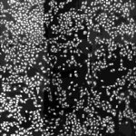
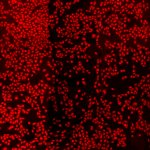
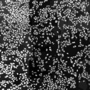
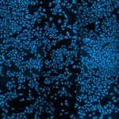
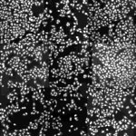
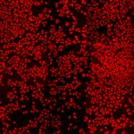

# [S=2_3x3_T=1_Z=4_CH=2.czi](https://zenodo.org/record/7015307/files/S%3D2_3x3_T%3D1_Z%3D4_CH%3D2.czi) report
 - **Autostitch** = true
 - ZeissCZIReader v6.14.0
 - ZeissQuickStartCZIReader v0.1.8-SNAPSHOT

# Images 

| Series            | Quick Start Reader | Size | Original Reader | Size | #Diffs |
|-------------------|--------------------|------|-----------------|------|--------|
| Read time (all)   |212 ms|------|241 ms|------|--------|
|0||X:1792 Y:1792 C:2 Z:4 T:1||X:1792 Y:1792 C:2 Z:4 T:1|0|
|1||X:896 Y:896 C:2 Z:4 T:1||X:896 Y:896 C:2 Z:4 T:1|0|
|2||X:1792 Y:1792 C:2 Z:4 T:1||X:1792 Y:1792 C:2 Z:4 T:1|0|
|3||X:896 Y:896 C:2 Z:4 T:1||X:896 Y:896 C:2 Z:4 T:1|0|

# Metadata

|  Method            | Parameters       | Quick Start Reader | Original Reader | Delta  |
| -------------------|------------------|--------------------|-----------------|------- |
| Initialization     |                  |18 ms|21 ms|        |
| Reader Size (Mb)     |                  |1.95|2.67|        |
| getStageLabelName| Image 0 | D6| Scene position #0| |
| getStageLabelName| Image 1 | D6| Scene position #1| |
| getPixelsPhysicalSizeX| Image 1 | 0.200 um | 0.100 um | 0.100 um |
| getPixelsPhysicalSizeY| Image 1 | 0.200 um | 0.100 um | 0.100 um |
| getStageLabelName| Image 2 | D7| Scene position #2| |
| getStageLabelName| Image 3 | D7| Scene position #3| |
| getPixelsPhysicalSizeX| Image 3 | 0.200 um | 0.100 um | 0.100 um |
| getPixelsPhysicalSizeY| Image 3 | 0.200 um | 0.100 um | 0.100 um |
| getPlaneDeltaT| Image 1 Plane 1 |  2.264 s |  2.180 s | 0.084 s |
| getPlaneDeltaT| Image 1 Plane 2 |  2.509 s |  2.180 s | 0.329 s |
| getPlaneDeltaT| Image 1 Plane 3 |  2.567 s |  2.180 s | 0.387 s |
| getPlaneDeltaT| Image 1 Plane 4 |  2.818 s |  2.180 s | 0.638 s |
| getPlaneDeltaT| Image 1 Plane 5 |  2.862 s |  2.180 s | 0.682 s |
| getPlaneDeltaT| Image 1 Plane 6 |  3.098 s |  2.180 s | 0.918 s |
| getPlaneDeltaT| Image 1 Plane 7 |  3.142 s |  2.180 s | 0.962 s |
| getPlaneDeltaT| Image 3 Plane 0 |  15.351 s |  2.180 s | 13.171 s |
| getPlaneDeltaT| Image 3 Plane 1 |  15.408 s |  2.180 s | 13.228 s |
| getPlaneDeltaT| Image 3 Plane 2 |  15.658 s |  2.180 s | 13.478 s |
| getPlaneDeltaT| Image 3 Plane 3 |  15.711 s |  2.180 s | 13.531 s |
| getPlaneDeltaT| Image 3 Plane 4 |  15.964 s |  2.180 s | 13.784 s |
| getPlaneDeltaT| Image 3 Plane 5 |  16.023 s |  2.180 s | 13.843 s |
| getPlaneDeltaT| Image 3 Plane 6 |  16.264 s |  2.180 s | 14.084 s |
| getPlaneDeltaT| Image 3 Plane 7 |  16.331 s |  2.180 s | 14.151 s |
