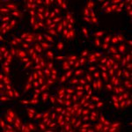
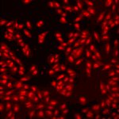

# [S=2_3x3_T=3_CH=2.czi](https://zenodo.org/record/7015307/files/S%3D2_3x3_T%3D3_CH%3D2.czi) report
 - **Autostitch** = false
 - ZeissCZIReader v6.14.0
 - ZeissQuickStartCZIReader v0.1.7-SNAPSHOT

# Images 

| Series            | Quick Start Reader | Size | Original Reader | Size |
|-------------------|--------------------|------|-----------------|------|
| Read time (all)   |425 ms|------|382 ms|------|
|0||X:640 Y:640 C:2 Z:1 T:3||X:640 Y:640 C:2 Z:1 T:3|
|1||X:640 Y:640 C:2 Z:1 T:3||X:640 Y:640 C:2 Z:1 T:3|
|2||X:640 Y:640 C:2 Z:1 T:3||X:640 Y:640 C:2 Z:1 T:3|
|3||X:640 Y:640 C:2 Z:1 T:3||X:640 Y:640 C:2 Z:1 T:3|
|4||X:640 Y:640 C:2 Z:1 T:3||X:640 Y:640 C:2 Z:1 T:3|
|5||X:640 Y:640 C:2 Z:1 T:3||X:640 Y:640 C:2 Z:1 T:3|
|6||X:640 Y:640 C:2 Z:1 T:3||X:640 Y:640 C:2 Z:1 T:3|
|7||X:640 Y:640 C:2 Z:1 T:3||X:640 Y:640 C:2 Z:1 T:3|
|8||X:640 Y:640 C:2 Z:1 T:3||X:640 Y:640 C:2 Z:1 T:3|
|9||X:640 Y:640 C:2 Z:1 T:3||X:640 Y:640 C:2 Z:1 T:3|
|10||X:640 Y:640 C:2 Z:1 T:3||X:640 Y:640 C:2 Z:1 T:3|
|11||X:640 Y:640 C:2 Z:1 T:3||X:640 Y:640 C:2 Z:1 T:3|
|12||X:640 Y:640 C:2 Z:1 T:3||X:640 Y:640 C:2 Z:1 T:3|
|13||X:640 Y:640 C:2 Z:1 T:3||X:640 Y:640 C:2 Z:1 T:3|
|14||X:640 Y:640 C:2 Z:1 T:3||X:640 Y:640 C:2 Z:1 T:3|
|15||X:640 Y:640 C:2 Z:1 T:3||X:640 Y:640 C:2 Z:1 T:3|
|16||X:640 Y:640 C:2 Z:1 T:3||X:640 Y:640 C:2 Z:1 T:3|
|17||X:640 Y:640 C:2 Z:1 T:3||X:640 Y:640 C:2 Z:1 T:3|

# Metadata

|  Method            | Parameters       | Quick Start Reader | Original Reader | Delta  |
| -------------------|------------------|--------------------|-----------------|------- |
| Initialization     |                  |37 ms|28 ms|        |
| Reader Size (Mb)     |                  |2.04|2.71|        |
| getStageLabelName| Image 0 | D6| Scene position #0| |
| getStageLabelName| Image 1 | D6| Scene position #1| |
| getStageLabelName| Image 2 | D6| Scene position #2| |
| getStageLabelName| Image 3 | D6| Scene position #3| |
| getStageLabelName| Image 4 | D6| Scene position #4| |
| getStageLabelName| Image 5 | D6| Scene position #5| |
| getStageLabelName| Image 6 | D6| Scene position #6| |
| getStageLabelName| Image 7 | D6| Scene position #7| |
| getStageLabelName| Image 8 | D6| Scene position #8| |
| getStageLabelName| Image 9 | D7| Scene position #9| |
| getStageLabelName| Image 10 | D7| Scene position #10| |
| getStageLabelName| Image 11 | D7| Scene position #11| |
| getStageLabelName| Image 12 | D7| Scene position #12| |
| getStageLabelName| Image 13 | D7| Scene position #13| |
| getStageLabelName| Image 14 | D7| Scene position #14| |
| getStageLabelName| Image 15 | D7| Scene position #15| |
| getStageLabelName| Image 16 | D7| Scene position #16| |
| getStageLabelName| Image 17 | D7| Scene position #17| |
| getPlaneDeltaT| Image 0 Plane 2 |  3.175 s |  4.579 s | 1.404 s |
| getPlaneDeltaT| Image 0 Plane 3 |  3.214 s |  4.612 s | 1.398 s |
| getPlaneDeltaT| Image 0 Plane 4 |  5.981 s |  8.788 s | 2.807 s |
| getPlaneDeltaT| Image 0 Plane 5 |  6.022 s |  8.831 s | 2.809 s |
| getPlaneDeltaT| Image 1 Plane 2 |  3.412 s |  4.808 s | 1.396 s |
| getPlaneDeltaT| Image 1 Plane 3 |  3.442 s |  4.847 s | 1.405 s |
| getPlaneDeltaT| Image 1 Plane 4 |  6.221 s |  9.031 s | 2.810 s |
| getPlaneDeltaT| Image 1 Plane 5 |  6.251 s |  9.061 s | 2.810 s |
| getPlaneDeltaT| Image 2 Plane 2 |  3.639 s |  5.038 s | 1.399 s |
| getPlaneDeltaT| Image 2 Plane 3 |  3.675 s |  5.066 s | 1.391 s |
| getPlaneDeltaT| Image 2 Plane 4 |  6.450 s |  9.262 s | 2.812 s |
| getPlaneDeltaT| Image 2 Plane 5 |  6.485 s |  9.296 s | 2.811 s |
| getPlaneDeltaT| Image 3 Plane 2 |  3.889 s |  5.282 s | 1.393 s |
| getPlaneDeltaT| Image 3 Plane 3 |  3.920 s |  5.308 s | 1.388 s |
| getPlaneDeltaT| Image 3 Plane 4 |  6.700 s |  9.510 s | 2.810 s |
| getPlaneDeltaT| Image 3 Plane 5 |  6.733 s |  9.545 s | 2.812 s |
| getPlaneDeltaT| Image 4 Plane 2 |  4.119 s |  5.513 s | 1.394 s |
| getPlaneDeltaT| Image 4 Plane 3 |  4.155 s |  5.545 s | 1.390 s |
| getPlaneDeltaT| Image 4 Plane 4 |  6.933 s |  9.748 s | 2.815 s |
| getPlaneDeltaT| Image 4 Plane 5 |  6.969 s |  9.784 s | 2.815 s |
| getPlaneDeltaT| Image 5 Plane 2 |  4.344 s |  5.747 s | 1.403 s |
| getPlaneDeltaT| Image 5 Plane 3 |  4.381 s |  5.783 s | 1.402 s |
| getPlaneDeltaT| Image 5 Plane 4 |  7.164 s |  9.985 s | 2.821 s |
| getPlaneDeltaT| Image 5 Plane 5 |  7.201 s |  10.020 s | 2.819 s |
| getPlaneDeltaT| Image 6 Plane 2 |  4.595 s |  5.984 s | 1.389 s |
| getPlaneDeltaT| Image 6 Plane 3 |  4.627 s |  6.022 s | 1.395 s |
| getPlaneDeltaT| Image 6 Plane 4 |  7.408 s |  10.221 s | 2.813 s |
| getPlaneDeltaT| Image 6 Plane 5 |  7.444 s |  10.260 s | 2.816 s |
| getPlaneDeltaT| Image 7 Plane 2 |  4.828 s |  6.213 s | 1.385 s |
| getPlaneDeltaT| Image 7 Plane 3 |  4.858 s |  6.248 s | 1.390 s |
| getPlaneDeltaT| Image 7 Plane 4 |  7.643 s |  10.458 s | 2.815 s |
| getPlaneDeltaT| Image 7 Plane 5 |  7.673 s |  10.489 s | 2.816 s |
| getPlaneDeltaT| Image 8 Plane 2 |  5.053 s |  6.438 s | 1.385 s |
| getPlaneDeltaT| Image 8 Plane 3 |  5.090 s |  6.480 s | 1.390 s |
| getPlaneDeltaT| Image 8 Plane 4 |  7.871 s |  10.688 s | 2.817 s |
| getPlaneDeltaT| Image 8 Plane 5 |  7.905 s |  10.721 s | 2.816 s |
| getPlaneDeltaT| Image 9 Plane 2 |  5.294 s |  6.683 s | 1.389 s |
| getPlaneDeltaT| Image 9 Plane 3 |  5.328 s |  6.719 s | 1.391 s |
| getPlaneDeltaT| Image 9 Plane 4 |  8.111 s |  10.929 s | 2.818 s |
| getPlaneDeltaT| Image 9 Plane 5 |  8.146 s |  10.963 s | 2.817 s |
| getPlaneDeltaT| Image 10 Plane 2 |  5.525 s |  6.919 s | 1.394 s |
| getPlaneDeltaT| Image 10 Plane 3 |  5.558 s |  6.953 s | 1.395 s |
| getPlaneDeltaT| Image 10 Plane 4 |  8.342 s |  11.159 s | 2.817 s |
| getPlaneDeltaT| Image 10 Plane 5 |  8.376 s |  11.195 s | 2.819 s |
| getPlaneDeltaT| Image 11 Plane 2 |  5.753 s |  7.152 s | 1.399 s |
| getPlaneDeltaT| Image 11 Plane 3 |  5.792 s |  7.185 s | 1.393 s |
| getPlaneDeltaT| Image 11 Plane 4 |  8.576 s |  11.399 s | 2.823 s |
| getPlaneDeltaT| Image 11 Plane 5 |  8.617 s |  11.442 s | 2.825 s |
| getPlaneDeltaT| Image 12 Plane 2 |  6.003 s |  7.392 s | 1.389 s |
| getPlaneDeltaT| Image 12 Plane 3 |  6.039 s |  7.426 s | 1.387 s |
| getPlaneDeltaT| Image 12 Plane 4 |  8.826 s |  11.650 s | 2.824 s |
| getPlaneDeltaT| Image 12 Plane 5 |  8.865 s |  11.690 s | 2.825 s |
| getPlaneDeltaT| Image 13 Plane 2 |  6.237 s |  7.625 s | 1.388 s |
| getPlaneDeltaT| Image 13 Plane 3 |  6.270 s |  7.658 s | 1.388 s |
| getPlaneDeltaT| Image 13 Plane 4 |  9.061 s |  11.886 s | 2.825 s |
| getPlaneDeltaT| Image 13 Plane 5 |  9.092 s |  11.915 s | 2.823 s |
| getPlaneDeltaT| Image 14 Plane 2 |  6.462 s |  7.853 s | 1.391 s |
| getPlaneDeltaT| Image 14 Plane 3 |  6.495 s |  7.889 s | 1.394 s |
| getPlaneDeltaT| Image 14 Plane 4 |  9.291 s |  12.119 s | 2.828 s |
| getPlaneDeltaT| Image 14 Plane 5 |  9.327 s |  12.158 s | 2.831 s |
| getPlaneDeltaT| Image 15 Plane 2 |  6.704 s |  8.093 s | 1.389 s |
| getPlaneDeltaT| Image 15 Plane 3 |  6.738 s |  8.129 s | 1.391 s |
| getPlaneDeltaT| Image 15 Plane 4 |  9.534 s |  12.365 s | 2.831 s |
| getPlaneDeltaT| Image 15 Plane 5 |  9.568 s |  12.397 s | 2.829 s |
| getPlaneDeltaT| Image 16 Plane 2 |  6.927 s |  8.326 s | 1.399 s |
| getPlaneDeltaT| Image 16 Plane 3 |  6.964 s |  8.358 s | 1.394 s |
| getPlaneDeltaT| Image 16 Plane 4 |  9.757 s |  12.586 s | 2.829 s |
| getPlaneDeltaT| Image 16 Plane 5 |  9.796 s |  12.629 s | 2.833 s |
| getPlaneDeltaT| Image 17 Plane 2 |  7.158 s |  8.557 s | 1.399 s |
| getPlaneDeltaT| Image 17 Plane 3 |  7.199 s |  8.590 s | 1.391 s |
| getPlaneDeltaT| Image 17 Plane 4 |  9.990 s |  12.822 s | 2.832 s |
| getPlaneDeltaT| Image 17 Plane 5 |  10.027 s |  12.854 s | 2.827 s |
