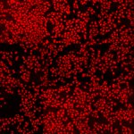

# [S=2_3x3_T=3_CH=2.czi](https://zenodo.org/record/7015307/files/S%3D2_3x3_T%3D3_CH%3D2.czi) report
 - **Autostitch** = true
 - ZeissCZIReader v6.14.0
 - ZeissQuickStartCZIReader v0.1.8-SNAPSHOT

# Images 

| Series            | Quick Start Reader | Size | Original Reader | Size | #Diffs |
|-------------------|--------------------|------|-----------------|------|--------|
| Read time (all)   |235 ms|------|267 ms|------|--------|
|0||X:1792 Y:1792 C:2 Z:1 T:3||X:1792 Y:1792 C:2 Z:1 T:3|0|
|1||X:896 Y:896 C:2 Z:1 T:3||X:896 Y:896 C:2 Z:1 T:3|0|
|2||X:1792 Y:1792 C:2 Z:1 T:3||X:1792 Y:1792 C:2 Z:1 T:3|0|
|3||X:896 Y:896 C:2 Z:1 T:3||X:896 Y:896 C:2 Z:1 T:3|0|

# Metadata

|  Method            | Parameters       | Quick Start Reader | Original Reader | Delta  |
| -------------------|------------------|--------------------|-----------------|------- |
| Initialization     |                  |21 ms|22 ms|        |
| Reader Size (Mb)     |                  |1.94|2.62|        |
| getStageLabelName| Image 0 | D6| Scene position #0| |
| getStageLabelX| Image 0 | 49442.400 um | 49500.000 um | 57.600 um |
| getStageLabelY| Image 0 | 35442.400 um | 35500.000 um | 57.600 um |
| getStageLabelName| Image 1 | D6| Scene position #1| |
| getStageLabelX| Image 1 | 49410.400 um | 49500.000 um | 89.600 um |
| getStageLabelY| Image 1 | 35410.400 um | 35500.000 um | 89.600 um |
| getPixelsPhysicalSizeX| Image 1 | 0.200 um | 0.100 um | 0.100 um |
| getPixelsPhysicalSizeY| Image 1 | 0.200 um | 0.100 um | 0.100 um |
| getStageLabelName| Image 2 | D7| Scene position #2| |
| getStageLabelX| Image 2 | 58442.400 um | 58500.000 um | 57.600 um |
| getStageLabelY| Image 2 | 35442.400 um | 35500.000 um | 57.600 um |
| getStageLabelName| Image 3 | D7| Scene position #3| |
| getStageLabelX| Image 3 | 58410.400 um | 58500.000 um | 89.600 um |
| getStageLabelY| Image 3 | 35410.400 um | 35500.000 um | 89.600 um |
| getPixelsPhysicalSizeX| Image 3 | 0.200 um | 0.100 um | 0.100 um |
| getPixelsPhysicalSizeY| Image 3 | 0.200 um | 0.100 um | 0.100 um |
| getPlanePositionX| Image 0 Plane 0 | 49442.400 um | 49500.000 um | 57.600 um |
| getPlanePositionY| Image 0 Plane 0 | 35442.400 um | 35500.000 um | 57.600 um |
| getPlanePositionX| Image 0 Plane 1 | 49442.400 um | 49500.000 um | 57.600 um |
| getPlanePositionY| Image 0 Plane 1 | 35442.400 um | 35500.000 um | 57.600 um |
| getPlaneDeltaT| Image 0 Plane 2 |  4.578 s |  4.579 s | 0.001 s |
| getPlanePositionX| Image 0 Plane 2 | 49442.400 um | 49500.000 um | 57.600 um |
| getPlanePositionY| Image 0 Plane 2 | 35442.400 um | 35500.000 um | 57.600 um |
| getPlaneDeltaT| Image 0 Plane 3 |  4.618 s |  4.612 s | 0.006 s |
| getPlanePositionX| Image 0 Plane 3 | 49442.400 um | 49500.000 um | 57.600 um |
| getPlanePositionY| Image 0 Plane 3 | 35442.400 um | 35500.000 um | 57.600 um |
| getPlanePositionX| Image 0 Plane 4 | 49442.400 um | 49500.000 um | 57.600 um |
| getPlanePositionY| Image 0 Plane 4 | 35442.400 um | 35500.000 um | 57.600 um |
| getPlanePositionX| Image 0 Plane 5 | 49442.400 um | 49500.000 um | 57.600 um |
| getPlanePositionY| Image 0 Plane 5 | 35442.400 um | 35500.000 um | 57.600 um |
| getPlaneDeltaT| Image 1 Plane 0 |  1: null| 2: ome.units.quantity.Time: value[0.3679864], unit[s] stored as java.lang.Double |
| getPlaneExposureTime| Image 1 Plane 0 |  1: null| 2: ome.units.quantity.Time: value[150.0], unit[s] stored as java.lang.Double |
| getPlanePositionX| Image 1 Plane 0 |  1: null| 2: ome.units.quantity.Length: value[49500.0], unit[µm] stored as java.lang.Double |
| getPlanePositionY| Image 1 Plane 0 |  1: null| 2: ome.units.quantity.Length: value[35500.0], unit[µm] stored as java.lang.Double |
| getPlaneDeltaT| Image 1 Plane 1 |  1: null| 2: ome.units.quantity.Time: value[0.3679864], unit[s] stored as java.lang.Double |
| getPlaneExposureTime| Image 1 Plane 1 |  1: null| 2: ome.units.quantity.Time: value[150.0], unit[s] stored as java.lang.Double |
| getPlanePositionX| Image 1 Plane 1 |  1: null| 2: ome.units.quantity.Length: value[49500.0], unit[µm] stored as java.lang.Double |
| getPlanePositionY| Image 1 Plane 1 |  1: null| 2: ome.units.quantity.Length: value[35500.0], unit[µm] stored as java.lang.Double |
| getPlaneDeltaT| Image 1 Plane 2 |  1: null| 2: ome.units.quantity.Time: value[4.5789909], unit[s] stored as java.lang.Double |
| getPlaneExposureTime| Image 1 Plane 2 |  1: null| 2: ome.units.quantity.Time: value[150.0], unit[s] stored as java.lang.Double |
| getPlanePositionX| Image 1 Plane 2 |  1: null| 2: ome.units.quantity.Length: value[49500.0], unit[µm] stored as java.lang.Double |
| getPlanePositionY| Image 1 Plane 2 |  1: null| 2: ome.units.quantity.Length: value[35500.0], unit[µm] stored as java.lang.Double |
| getPlaneDeltaT| Image 1 Plane 3 |  1: null| 2: ome.units.quantity.Time: value[4.5789909], unit[s] stored as java.lang.Double |
| getPlaneExposureTime| Image 1 Plane 3 |  1: null| 2: ome.units.quantity.Time: value[150.0], unit[s] stored as java.lang.Double |
| getPlanePositionX| Image 1 Plane 3 |  1: null| 2: ome.units.quantity.Length: value[49500.0], unit[µm] stored as java.lang.Double |
| getPlanePositionY| Image 1 Plane 3 |  1: null| 2: ome.units.quantity.Length: value[35500.0], unit[µm] stored as java.lang.Double |
| getPlaneDeltaT| Image 1 Plane 4 |  1: null| 2: ome.units.quantity.Time: value[8.7879879], unit[s] stored as java.lang.Double |
| getPlaneExposureTime| Image 1 Plane 4 |  1: null| 2: ome.units.quantity.Time: value[150.0], unit[s] stored as java.lang.Double |
| getPlanePositionX| Image 1 Plane 4 |  1: null| 2: ome.units.quantity.Length: value[49500.0], unit[µm] stored as java.lang.Double |
| getPlanePositionY| Image 1 Plane 4 |  1: null| 2: ome.units.quantity.Length: value[35500.0], unit[µm] stored as java.lang.Double |
| getPlaneDeltaT| Image 1 Plane 5 |  1: null| 2: ome.units.quantity.Time: value[8.7879879], unit[s] stored as java.lang.Double |
| getPlaneExposureTime| Image 1 Plane 5 |  1: null| 2: ome.units.quantity.Time: value[150.0], unit[s] stored as java.lang.Double |
| getPlanePositionX| Image 1 Plane 5 |  1: null| 2: ome.units.quantity.Length: value[49500.0], unit[µm] stored as java.lang.Double |
| getPlanePositionY| Image 1 Plane 5 |  1: null| 2: ome.units.quantity.Length: value[35500.0], unit[µm] stored as java.lang.Double |
| getPlanePositionX| Image 2 Plane 0 | 58442.400 um | 58500.000 um | 57.600 um |
| getPlanePositionY| Image 2 Plane 0 | 35442.400 um | 35500.000 um | 57.600 um |
| getPlanePositionX| Image 2 Plane 1 | 58442.400 um | 58500.000 um | 57.600 um |
| getPlanePositionY| Image 2 Plane 1 | 35442.400 um | 35500.000 um | 57.600 um |
| getPlaneDeltaT| Image 2 Plane 2 |  6.702 s |  6.683 s | 0.020 s |
| getPlanePositionX| Image 2 Plane 2 | 58442.400 um | 58500.000 um | 57.600 um |
| getPlanePositionY| Image 2 Plane 2 | 35442.400 um | 35500.000 um | 57.600 um |
| getPlaneDeltaT| Image 2 Plane 3 |  6.737 s |  6.719 s | 0.018 s |
| getPlanePositionX| Image 2 Plane 3 | 58442.400 um | 58500.000 um | 57.600 um |
| getPlanePositionY| Image 2 Plane 3 | 35442.400 um | 35500.000 um | 57.600 um |
| getPlanePositionX| Image 2 Plane 4 | 58442.400 um | 58500.000 um | 57.600 um |
| getPlanePositionY| Image 2 Plane 4 | 35442.400 um | 35500.000 um | 57.600 um |
| getPlanePositionX| Image 2 Plane 5 | 58442.400 um | 58500.000 um | 57.600 um |
| getPlanePositionY| Image 2 Plane 5 | 35442.400 um | 35500.000 um | 57.600 um |
| getPlaneDeltaT| Image 3 Plane 0 |  1: null| 2: ome.units.quantity.Time: value[0.3679864], unit[s] stored as java.lang.Double |
| getPlaneExposureTime| Image 3 Plane 0 |  1: null| 2: ome.units.quantity.Time: value[150.0], unit[s] stored as java.lang.Double |
| getPlanePositionX| Image 3 Plane 0 |  1: null| 2: ome.units.quantity.Length: value[58500.0], unit[µm] stored as java.lang.Double |
| getPlanePositionY| Image 3 Plane 0 |  1: null| 2: ome.units.quantity.Length: value[35500.0], unit[µm] stored as java.lang.Double |
| getPlaneDeltaT| Image 3 Plane 1 |  1: null| 2: ome.units.quantity.Time: value[0.3679864], unit[s] stored as java.lang.Double |
| getPlaneExposureTime| Image 3 Plane 1 |  1: null| 2: ome.units.quantity.Time: value[150.0], unit[s] stored as java.lang.Double |
| getPlanePositionX| Image 3 Plane 1 |  1: null| 2: ome.units.quantity.Length: value[58500.0], unit[µm] stored as java.lang.Double |
| getPlanePositionY| Image 3 Plane 1 |  1: null| 2: ome.units.quantity.Length: value[35500.0], unit[µm] stored as java.lang.Double |
| getPlaneDeltaT| Image 3 Plane 2 |  1: null| 2: ome.units.quantity.Time: value[4.5789909], unit[s] stored as java.lang.Double |
| getPlaneExposureTime| Image 3 Plane 2 |  1: null| 2: ome.units.quantity.Time: value[150.0], unit[s] stored as java.lang.Double |
| getPlanePositionX| Image 3 Plane 2 |  1: null| 2: ome.units.quantity.Length: value[58500.0], unit[µm] stored as java.lang.Double |
| getPlanePositionY| Image 3 Plane 2 |  1: null| 2: ome.units.quantity.Length: value[35500.0], unit[µm] stored as java.lang.Double |
| getPlaneDeltaT| Image 3 Plane 3 |  1: null| 2: ome.units.quantity.Time: value[4.5789909], unit[s] stored as java.lang.Double |
| getPlaneExposureTime| Image 3 Plane 3 |  1: null| 2: ome.units.quantity.Time: value[150.0], unit[s] stored as java.lang.Double |
| getPlanePositionX| Image 3 Plane 3 |  1: null| 2: ome.units.quantity.Length: value[58500.0], unit[µm] stored as java.lang.Double |
| getPlanePositionY| Image 3 Plane 3 |  1: null| 2: ome.units.quantity.Length: value[35500.0], unit[µm] stored as java.lang.Double |
| getPlaneDeltaT| Image 3 Plane 4 |  1: null| 2: ome.units.quantity.Time: value[8.7879879], unit[s] stored as java.lang.Double |
| getPlaneExposureTime| Image 3 Plane 4 |  1: null| 2: ome.units.quantity.Time: value[150.0], unit[s] stored as java.lang.Double |
| getPlanePositionX| Image 3 Plane 4 |  1: null| 2: ome.units.quantity.Length: value[58500.0], unit[µm] stored as java.lang.Double |
| getPlanePositionY| Image 3 Plane 4 |  1: null| 2: ome.units.quantity.Length: value[35500.0], unit[µm] stored as java.lang.Double |
| getPlaneDeltaT| Image 3 Plane 5 |  1: null| 2: ome.units.quantity.Time: value[8.7879879], unit[s] stored as java.lang.Double |
| getPlaneExposureTime| Image 3 Plane 5 |  1: null| 2: ome.units.quantity.Time: value[150.0], unit[s] stored as java.lang.Double |
| getPlanePositionX| Image 3 Plane 5 |  1: null| 2: ome.units.quantity.Length: value[58500.0], unit[µm] stored as java.lang.Double |
| getPlanePositionY| Image 3 Plane 5 |  1: null| 2: ome.units.quantity.Length: value[35500.0], unit[µm] stored as java.lang.Double |
