|  Method            | Parameters       | Quick Start Reader | Original Reader | Delta  |
| -------------------|------------------|--------------------|-----------------|------- |
| Initialization     |                  |46 ms|22 ms|        |
| Reader Size (Mb)     |                  |2.04|2.71|        |
| getStageLabelName| Image 0 | D6| Scene position #0| |
| getStageLabelName| Image 1 | D6| Scene position #1| |
| getStageLabelName| Image 2 | D6| Scene position #2| |
| getStageLabelName| Image 3 | D6| Scene position #3| |
| getStageLabelName| Image 4 | D6| Scene position #4| |
| getStageLabelName| Image 5 | D6| Scene position #5| |
| getStageLabelName| Image 6 | D6| Scene position #6| |
| getStageLabelName| Image 7 | D6| Scene position #7| |
| getStageLabelName| Image 8 | D6| Scene position #8| |
| getStageLabelName| Image 9 | D7| Scene position #9| |
| getStageLabelName| Image 10 | D7| Scene position #10| |
| getStageLabelName| Image 11 | D7| Scene position #11| |
| getStageLabelName| Image 12 | D7| Scene position #12| |
| getStageLabelName| Image 13 | D7| Scene position #13| |
| getStageLabelName| Image 14 | D7| Scene position #14| |
| getStageLabelName| Image 15 | D7| Scene position #15| |
| getStageLabelName| Image 16 | D7| Scene position #16| |
| getStageLabelName| Image 17 | D7| Scene position #17| |
# [S=2_3x3_T=3_Z=1_CH=2.czi](https://zenodo.org/record/7015307/files/S%3D2_3x3_T%3D3_Z%3D1_CH%3D2.czi) report
 - **Autostitch** = false
 - ZeissCZIReader v7.1.0
 - ZeissQuickStartCZIReader v0.2.4-SNAPSHOT

# Images 

| Series            | Quick Start Reader | Size | Original Reader | Size | #Diffs |
|-------------------|--------------------|------|-----------------|------|--------|
| Read time (all)   |287 ms|------|284 ms|------|--------|
|0||X:640 Y:640 C:2 Z:1 T:3|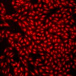|X:640 Y:640 C:2 Z:1 T:3|0|
|1||X:640 Y:640 C:2 Z:1 T:3||X:640 Y:640 C:2 Z:1 T:3|0|
|2||X:640 Y:640 C:2 Z:1 T:3||X:640 Y:640 C:2 Z:1 T:3|0|
|3||X:640 Y:640 C:2 Z:1 T:3||X:640 Y:640 C:2 Z:1 T:3|0|
|4|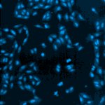|X:640 Y:640 C:2 Z:1 T:3||X:640 Y:640 C:2 Z:1 T:3|0|
|5|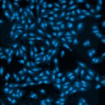|X:640 Y:640 C:2 Z:1 T:3|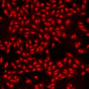|X:640 Y:640 C:2 Z:1 T:3|0|
|6|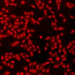|X:640 Y:640 C:2 Z:1 T:3|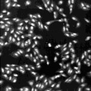|X:640 Y:640 C:2 Z:1 T:3|0|
|7||X:640 Y:640 C:2 Z:1 T:3||X:640 Y:640 C:2 Z:1 T:3|0|
|8||X:640 Y:640 C:2 Z:1 T:3||X:640 Y:640 C:2 Z:1 T:3|0|
|9|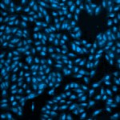|X:640 Y:640 C:2 Z:1 T:3|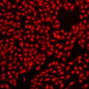|X:640 Y:640 C:2 Z:1 T:3|0|
|10||X:640 Y:640 C:2 Z:1 T:3||X:640 Y:640 C:2 Z:1 T:3|0|
|11|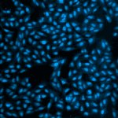|X:640 Y:640 C:2 Z:1 T:3||X:640 Y:640 C:2 Z:1 T:3|0|
|12|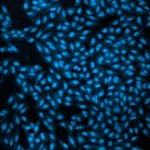|X:640 Y:640 C:2 Z:1 T:3|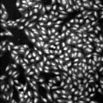|X:640 Y:640 C:2 Z:1 T:3|0|
|13|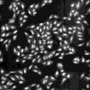|X:640 Y:640 C:2 Z:1 T:3||X:640 Y:640 C:2 Z:1 T:3|0|
|14||X:640 Y:640 C:2 Z:1 T:3||X:640 Y:640 C:2 Z:1 T:3|0|
|15||X:640 Y:640 C:2 Z:1 T:3||X:640 Y:640 C:2 Z:1 T:3|0|
|16||X:640 Y:640 C:2 Z:1 T:3||X:640 Y:640 C:2 Z:1 T:3|0|
|17||X:640 Y:640 C:2 Z:1 T:3||X:640 Y:640 C:2 Z:1 T:3|0|

# Metadata

