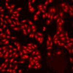

# [S=2_3x3_T=3_Z=1_CH=2.czi](https://zenodo.org/record/7015307/files/S%3D2_3x3_T%3D3_Z%3D1_CH%3D2.czi) report
 - **Autostitch** = false
 - ZeissCZIReader v6.14.0
 - ZeissQuickStartCZIReader v0.1.8-SNAPSHOT

# Images 

| Series            | Quick Start Reader | Size | Original Reader | Size | #Diffs |
|-------------------|--------------------|------|-----------------|------|--------|
| Read time (all)   |293 ms|------|318 ms|------|--------|
|0||X:640 Y:640 C:2 Z:1 T:3||X:640 Y:640 C:2 Z:1 T:3|0|
|1||X:640 Y:640 C:2 Z:1 T:3||X:640 Y:640 C:2 Z:1 T:3|0|
|2||X:640 Y:640 C:2 Z:1 T:3||X:640 Y:640 C:2 Z:1 T:3|0|
|3||X:640 Y:640 C:2 Z:1 T:3||X:640 Y:640 C:2 Z:1 T:3|0|
|4||X:640 Y:640 C:2 Z:1 T:3||X:640 Y:640 C:2 Z:1 T:3|0|
|5||X:640 Y:640 C:2 Z:1 T:3||X:640 Y:640 C:2 Z:1 T:3|0|
|6||X:640 Y:640 C:2 Z:1 T:3||X:640 Y:640 C:2 Z:1 T:3|0|
|7||X:640 Y:640 C:2 Z:1 T:3||X:640 Y:640 C:2 Z:1 T:3|0|
|8||X:640 Y:640 C:2 Z:1 T:3||X:640 Y:640 C:2 Z:1 T:3|0|
|9||X:640 Y:640 C:2 Z:1 T:3||X:640 Y:640 C:2 Z:1 T:3|0|
|10||X:640 Y:640 C:2 Z:1 T:3||X:640 Y:640 C:2 Z:1 T:3|0|
|11||X:640 Y:640 C:2 Z:1 T:3||X:640 Y:640 C:2 Z:1 T:3|0|
|12||X:640 Y:640 C:2 Z:1 T:3||X:640 Y:640 C:2 Z:1 T:3|0|
|13||X:640 Y:640 C:2 Z:1 T:3||X:640 Y:640 C:2 Z:1 T:3|0|
|14||X:640 Y:640 C:2 Z:1 T:3||X:640 Y:640 C:2 Z:1 T:3|0|
|15||X:640 Y:640 C:2 Z:1 T:3||X:640 Y:640 C:2 Z:1 T:3|0|
|16||X:640 Y:640 C:2 Z:1 T:3||X:640 Y:640 C:2 Z:1 T:3|0|
|17||X:640 Y:640 C:2 Z:1 T:3||X:640 Y:640 C:2 Z:1 T:3|0|

# Metadata

|  Method            | Parameters       | Quick Start Reader | Original Reader | Delta  |
| -------------------|------------------|--------------------|-----------------|------- |
| Initialization     |                  |26 ms|24 ms|        |
| Reader Size (Mb)     |                  |2.04|2.72|        |
| getStageLabelName| Image 0 | D6| Scene position #0| |
| getStageLabelName| Image 1 | D6| Scene position #1| |
| getStageLabelName| Image 2 | D6| Scene position #2| |
| getStageLabelName| Image 3 | D6| Scene position #3| |
| getStageLabelName| Image 4 | D6| Scene position #4| |
| getStageLabelName| Image 5 | D6| Scene position #5| |
| getStageLabelName| Image 6 | D6| Scene position #6| |
| getStageLabelName| Image 7 | D6| Scene position #7| |
| getStageLabelName| Image 8 | D6| Scene position #8| |
| getStageLabelName| Image 9 | D7| Scene position #9| |
| getStageLabelName| Image 10 | D7| Scene position #10| |
| getStageLabelName| Image 11 | D7| Scene position #11| |
| getStageLabelName| Image 12 | D7| Scene position #12| |
| getStageLabelName| Image 13 | D7| Scene position #13| |
| getStageLabelName| Image 14 | D7| Scene position #14| |
| getStageLabelName| Image 15 | D7| Scene position #15| |
| getStageLabelName| Image 16 | D7| Scene position #16| |
| getStageLabelName| Image 17 | D7| Scene position #17| |
| getPlaneDeltaT| Image 0 Plane 2 |  28.969 s |  28.843 s | 0.126 s |
| getPlaneDeltaT| Image 0 Plane 3 |  29.034 s |  28.892 s | 0.142 s |
| getPlaneDeltaT| Image 1 Plane 2 |  30.446 s |  30.317 s | 0.129 s |
| getPlaneDeltaT| Image 1 Plane 3 |  30.499 s |  30.357 s | 0.142 s |
| getPlaneDeltaT| Image 2 Plane 2 |  31.895 s |  31.773 s | 0.122 s |
| getPlaneDeltaT| Image 2 Plane 3 |  31.942 s |  31.821 s | 0.120 s |
| getPlaneDeltaT| Image 3 Plane 2 |  33.342 s |  33.225 s | 0.116 s |
| getPlaneDeltaT| Image 3 Plane 3 |  33.387 s |  33.272 s | 0.115 s |
| getPlaneDeltaT| Image 4 Plane 2 |  34.782 s |  34.699 s | 0.082 s |
| getPlaneDeltaT| Image 4 Plane 3 |  34.831 s |  34.749 s | 0.082 s |
| getPlaneDeltaT| Image 5 Plane 2 |  36.231 s |  36.165 s | 0.066 s |
| getPlaneDeltaT| Image 5 Plane 3 |  36.276 s |  36.210 s | 0.066 s |
| getPlaneDeltaT| Image 6 Plane 2 |  37.694 s |  37.658 s | 0.036 s |
| getPlaneDeltaT| Image 6 Plane 3 |  37.737 s |  37.702 s | 0.034 s |
| getPlaneDeltaT| Image 7 Plane 2 |  39.132 s |  39.140 s | 0.008 s |
| getPlaneDeltaT| Image 7 Plane 3 |  39.179 s |  39.187 s | 0.008 s |
| getPlaneDeltaT| Image 8 Plane 2 |  40.591 s |  40.645 s | 0.054 s |
| getPlaneDeltaT| Image 8 Plane 3 |  40.641 s |  40.701 s | 0.060 s |
| getPlaneDeltaT| Image 9 Plane 2 |  42.069 s |  42.173 s | 0.105 s |
| getPlaneDeltaT| Image 9 Plane 3 |  42.121 s |  42.227 s | 0.106 s |
| getPlaneDeltaT| Image 10 Plane 2 |  43.571 s |  43.661 s | 0.090 s |
| getPlaneDeltaT| Image 10 Plane 3 |  43.621 s |  43.709 s | 0.089 s |
| getPlaneDeltaT| Image 11 Plane 2 |  45.073 s |  45.191 s | 0.118 s |
| getPlaneDeltaT| Image 11 Plane 3 |  45.126 s |  45.244 s | 0.118 s |
| getPlaneDeltaT| Image 12 Plane 2 |  46.562 s |  46.725 s | 0.163 s |
| getPlaneDeltaT| Image 12 Plane 3 |  46.614 s |  46.784 s | 0.170 s |
| getPlaneDeltaT| Image 13 Plane 2 |  48.040 s |  48.247 s | 0.207 s |
| getPlaneDeltaT| Image 13 Plane 3 |  48.088 s |  48.291 s | 0.204 s |
| getPlaneDeltaT| Image 14 Plane 2 |  49.503 s |  49.794 s | 0.292 s |
| getPlaneDeltaT| Image 14 Plane 3 |  49.554 s |  49.857 s | 0.303 s |
| getPlaneDeltaT| Image 15 Plane 2 |  50.986 s |  51.342 s | 0.356 s |
| getPlaneDeltaT| Image 15 Plane 3 |  51.034 s |  51.400 s | 0.366 s |
| getPlaneDeltaT| Image 16 Plane 2 |  52.451 s |  52.826 s | 0.375 s |
| getPlaneDeltaT| Image 16 Plane 3 |  52.497 s |  52.883 s | 0.386 s |
| getPlaneDeltaT| Image 17 Plane 2 |  53.903 s |  54.300 s | 0.397 s |
| getPlaneDeltaT| Image 17 Plane 3 |  53.955 s |  54.347 s | 0.392 s |
