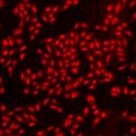

# [S=2_3x3_T=3_Z=1_CH=2.czi](https://zenodo.org/record/7015307/files/S%3D2_3x3_T%3D3_Z%3D1_CH%3D2.czi) report
 - **Autostitch** = false
 - ZeissCZIReader v6.14.0
 - ZeissQuickStartCZIReader v0.1.7-SNAPSHOT

# Images 

| Series            | Quick Start Reader | Size | Original Reader | Size |
|-------------------|--------------------|------|-----------------|------|
| Read time (all)   |410 ms|------|400 ms|------|
|0||X:640 Y:640 C:2 Z:1 T:3||X:640 Y:640 C:2 Z:1 T:3|
|1||X:640 Y:640 C:2 Z:1 T:3||X:640 Y:640 C:2 Z:1 T:3|
|2||X:640 Y:640 C:2 Z:1 T:3||X:640 Y:640 C:2 Z:1 T:3|
|3||X:640 Y:640 C:2 Z:1 T:3||X:640 Y:640 C:2 Z:1 T:3|
|4||X:640 Y:640 C:2 Z:1 T:3||X:640 Y:640 C:2 Z:1 T:3|
|5||X:640 Y:640 C:2 Z:1 T:3||X:640 Y:640 C:2 Z:1 T:3|
|6||X:640 Y:640 C:2 Z:1 T:3||X:640 Y:640 C:2 Z:1 T:3|
|7||X:640 Y:640 C:2 Z:1 T:3||X:640 Y:640 C:2 Z:1 T:3|
|8||X:640 Y:640 C:2 Z:1 T:3||X:640 Y:640 C:2 Z:1 T:3|
|9||X:640 Y:640 C:2 Z:1 T:3||X:640 Y:640 C:2 Z:1 T:3|
|10||X:640 Y:640 C:2 Z:1 T:3||X:640 Y:640 C:2 Z:1 T:3|
|11||X:640 Y:640 C:2 Z:1 T:3||X:640 Y:640 C:2 Z:1 T:3|
|12||X:640 Y:640 C:2 Z:1 T:3||X:640 Y:640 C:2 Z:1 T:3|
|13||X:640 Y:640 C:2 Z:1 T:3||X:640 Y:640 C:2 Z:1 T:3|
|14||X:640 Y:640 C:2 Z:1 T:3||X:640 Y:640 C:2 Z:1 T:3|
|15||X:640 Y:640 C:2 Z:1 T:3||X:640 Y:640 C:2 Z:1 T:3|
|16||X:640 Y:640 C:2 Z:1 T:3||X:640 Y:640 C:2 Z:1 T:3|
|17||X:640 Y:640 C:2 Z:1 T:3||X:640 Y:640 C:2 Z:1 T:3|

# Metadata

|  Method            | Parameters       | Quick Start Reader | Original Reader | Delta  |
| -------------------|------------------|--------------------|-----------------|------- |
| Initialization     |                  |29 ms|24 ms|        |
| Reader Size (Mb)     |                  |2.05|2.72|        |
| getStageLabelName| Image 0 | D6| Scene position #0| |
| getStageLabelName| Image 1 | D6| Scene position #1| |
| getStageLabelName| Image 2 | D6| Scene position #2| |
| getStageLabelName| Image 3 | D6| Scene position #3| |
| getStageLabelName| Image 4 | D6| Scene position #4| |
| getStageLabelName| Image 5 | D6| Scene position #5| |
| getStageLabelName| Image 6 | D6| Scene position #6| |
| getStageLabelName| Image 7 | D6| Scene position #7| |
| getStageLabelName| Image 8 | D6| Scene position #8| |
| getStageLabelName| Image 9 | D7| Scene position #9| |
| getStageLabelName| Image 10 | D7| Scene position #10| |
| getStageLabelName| Image 11 | D7| Scene position #11| |
| getStageLabelName| Image 12 | D7| Scene position #12| |
| getStageLabelName| Image 13 | D7| Scene position #13| |
| getStageLabelName| Image 14 | D7| Scene position #14| |
| getStageLabelName| Image 15 | D7| Scene position #15| |
| getStageLabelName| Image 16 | D7| Scene position #16| |
| getStageLabelName| Image 17 | D7| Scene position #17| |
| getPlaneDeltaT| Image 0 Plane 2 |  20.039 s |  28.843 s | 8.804 s |
| getPlaneDeltaT| Image 0 Plane 3 |  20.111 s |  28.892 s | 8.781 s |
| getPlaneDeltaT| Image 0 Plane 4 |  37.899 s |  55.758 s | 17.859 s |
| getPlaneDeltaT| Image 0 Plane 5 |  37.957 s |  55.804 s | 17.847 s |
| getPlaneDeltaT| Image 1 Plane 2 |  21.527 s |  30.317 s | 8.790 s |
| getPlaneDeltaT| Image 1 Plane 3 |  21.582 s |  30.357 s | 8.775 s |
| getPlaneDeltaT| Image 1 Plane 4 |  39.365 s |  57.204 s | 17.839 s |
| getPlaneDeltaT| Image 1 Plane 5 |  39.416 s |  57.251 s | 17.835 s |
| getPlaneDeltaT| Image 2 Plane 2 |  22.981 s |  31.773 s | 8.792 s |
| getPlaneDeltaT| Image 2 Plane 3 |  23.029 s |  31.821 s | 8.792 s |
| getPlaneDeltaT| Image 2 Plane 4 |  40.809 s |  58.636 s | 17.827 s |
| getPlaneDeltaT| Image 2 Plane 5 |  40.854 s |  58.680 s | 17.826 s |
| getPlaneDeltaT| Image 3 Plane 2 |  24.431 s |  33.225 s | 8.794 s |
| getPlaneDeltaT| Image 3 Plane 3 |  24.477 s |  33.272 s | 8.795 s |
| getPlaneDeltaT| Image 3 Plane 4 |  42.252 s |  60.074 s | 17.822 s |
| getPlaneDeltaT| Image 3 Plane 5 |  42.297 s |  60.118 s | 17.821 s |
| getPlaneDeltaT| Image 4 Plane 2 |  25.864 s |  34.699 s | 8.835 s |
| getPlaneDeltaT| Image 4 Plane 3 |  25.912 s |  34.749 s | 8.837 s |
| getPlaneDeltaT| Image 4 Plane 4 |  43.699 s |  61.535 s | 17.836 s |
| getPlaneDeltaT| Image 4 Plane 5 |  43.750 s |  61.587 s | 17.837 s |
| getPlaneDeltaT| Image 5 Plane 2 |  27.313 s |  36.165 s | 8.852 s |
| getPlaneDeltaT| Image 5 Plane 3 |  27.358 s |  36.210 s | 8.852 s |
| getPlaneDeltaT| Image 5 Plane 4 |  45.148 s |  62.982 s | 17.834 s |
| getPlaneDeltaT| Image 5 Plane 5 |  45.194 s |  63.031 s | 17.837 s |
| getPlaneDeltaT| Image 6 Plane 2 |  28.776 s |  37.658 s | 8.882 s |
| getPlaneDeltaT| Image 6 Plane 3 |  28.819 s |  37.702 s | 8.883 s |
| getPlaneDeltaT| Image 6 Plane 4 |  46.612 s |  64.449 s | 17.837 s |
| getPlaneDeltaT| Image 6 Plane 5 |  46.654 s |  64.490 s | 17.836 s |
| getPlaneDeltaT| Image 7 Plane 2 |  30.213 s |  39.140 s | 8.927 s |
| getPlaneDeltaT| Image 7 Plane 3 |  30.259 s |  39.187 s | 8.928 s |
| getPlaneDeltaT| Image 7 Plane 4 |  48.051 s |  65.888 s | 17.837 s |
| getPlaneDeltaT| Image 7 Plane 5 |  48.098 s |  65.936 s | 17.838 s |
| getPlaneDeltaT| Image 8 Plane 2 |  31.676 s |  40.645 s | 8.969 s |
| getPlaneDeltaT| Image 8 Plane 3 |  31.725 s |  40.701 s | 8.976 s |
| getPlaneDeltaT| Image 8 Plane 4 |  49.505 s |  67.335 s | 17.830 s |
| getPlaneDeltaT| Image 8 Plane 5 |  49.556 s |  67.386 s | 17.830 s |
| getPlaneDeltaT| Image 9 Plane 2 |  33.163 s |  42.173 s | 9.010 s |
| getPlaneDeltaT| Image 9 Plane 3 |  33.216 s |  42.227 s | 9.011 s |
| getPlaneDeltaT| Image 9 Plane 4 |  50.974 s |  68.786 s | 17.812 s |
| getPlaneDeltaT| Image 9 Plane 5 |  51.025 s |  68.833 s | 17.808 s |
| getPlaneDeltaT| Image 10 Plane 2 |  34.682 s |  43.661 s | 8.979 s |
| getPlaneDeltaT| Image 10 Plane 3 |  34.733 s |  43.709 s | 8.976 s |
| getPlaneDeltaT| Image 10 Plane 4 |  52.460 s |  70.239 s | 17.779 s |
| getPlaneDeltaT| Image 10 Plane 5 |  52.508 s |  70.284 s | 17.776 s |
| getPlaneDeltaT| Image 11 Plane 2 |  36.198 s |  45.191 s | 8.993 s |
| getPlaneDeltaT| Image 11 Plane 3 |  36.252 s |  45.244 s | 8.992 s |
| getPlaneDeltaT| Image 11 Plane 4 |  53.948 s |  71.698 s | 17.750 s |
| getPlaneDeltaT| Image 11 Plane 5 |  54.000 s |  71.748 s | 17.748 s |
| getPlaneDeltaT| Image 12 Plane 2 |  37.691 s |  46.725 s | 9.034 s |
| getPlaneDeltaT| Image 12 Plane 3 |  37.744 s |  46.784 s | 9.040 s |
| getPlaneDeltaT| Image 12 Plane 4 |  55.433 s |  73.175 s | 17.742 s |
| getPlaneDeltaT| Image 12 Plane 5 |  55.484 s |  73.223 s | 17.739 s |
| getPlaneDeltaT| Image 13 Plane 2 |  39.177 s |  48.247 s | 9.070 s |
| getPlaneDeltaT| Image 13 Plane 3 |  39.225 s |  48.291 s | 9.066 s |
| getPlaneDeltaT| Image 13 Plane 4 |  56.903 s |  74.630 s | 17.727 s |
| getPlaneDeltaT| Image 13 Plane 5 |  56.950 s |  74.675 s | 17.725 s |
| getPlaneDeltaT| Image 14 Plane 2 |  40.642 s |  49.794 s | 9.152 s |
| getPlaneDeltaT| Image 14 Plane 3 |  40.693 s |  49.857 s | 9.164 s |
| getPlaneDeltaT| Image 14 Plane 4 |  58.363 s |  76.084 s | 17.721 s |
| getPlaneDeltaT| Image 14 Plane 5 |  58.415 s |  76.137 s | 17.722 s |
| getPlaneDeltaT| Image 15 Plane 2 |  42.123 s |  51.342 s | 9.219 s |
| getPlaneDeltaT| Image 15 Plane 3 |  42.171 s |  51.400 s | 9.229 s |
| getPlaneDeltaT| Image 15 Plane 4 |  59.849 s |  77.576 s | 17.727 s |
| getPlaneDeltaT| Image 15 Plane 5 |  59.897 s |  77.623 s | 17.726 s |
| getPlaneDeltaT| Image 16 Plane 2 |  43.592 s |  52.826 s | 9.234 s |
| getPlaneDeltaT| Image 16 Plane 3 |  43.638 s |  52.883 s | 9.245 s |
| getPlaneDeltaT| Image 16 Plane 4 |  61.310 s |  79.029 s | 17.719 s |
| getPlaneDeltaT| Image 16 Plane 5 |  61.356 s |  79.075 s | 17.719 s |
| getPlaneDeltaT| Image 17 Plane 2 |  45.047 s |  54.300 s | 9.253 s |
| getPlaneDeltaT| Image 17 Plane 3 |  45.098 s |  54.347 s | 9.249 s |
| getPlaneDeltaT| Image 17 Plane 4 |  62.759 s |  80.470 s | 17.711 s |
| getPlaneDeltaT| Image 17 Plane 5 |  62.812 s |  80.526 s | 17.714 s |
