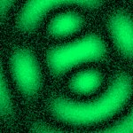

# [S=2_T=3_CH=1.czi](https://zenodo.org/record/7015307/files/S%3D2_T%3D3_CH%3D1.czi) report
 - **Autostitch** = false
 - ZeissCZIReader v6.14.0
 - ZeissQuickStartCZIReader v0.1.7-SNAPSHOT

# Images 

| Series            | Quick Start Reader | Size | Original Reader | Size |
|-------------------|--------------------|------|-----------------|------|
| Read time (all)   |51 ms|------|56 ms|------|
|0||X:256 Y:256 C:1 Z:1 T:3||X:256 Y:256 C:1 Z:1 T:3|
|1||X:256 Y:256 C:1 Z:1 T:3||X:256 Y:256 C:1 Z:1 T:3|

# Metadata

|  Method            | Parameters       | Quick Start Reader | Original Reader | Delta  |
| -------------------|------------------|--------------------|-----------------|------- |
| Initialization     |                  |19 ms|18 ms|        |
| Reader Size (Mb)     |                  |1.99|2.55|        |
| getStageLabelName| Image 0 | P1| Scene position #0| |
| getStageLabelName| Image 1 | P1| Scene position #1| |
| getPlaneDeltaT| Image 0 Plane 1 |  0.374 s |  0.522 s | 0.148 s |
| getPlaneDeltaT| Image 0 Plane 2 |  0.642 s |  0.909 s | 0.267 s |
| getPlaneDeltaT| Image 1 Plane 1 |  0.575 s |  0.722 s | 0.147 s |
| getPlaneDeltaT| Image 1 Plane 2 |  0.843 s |  1.111 s | 0.268 s |
