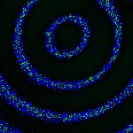

# [S=2_T=3_Z=5_CH=1.czi](https://zenodo.org/record/7015307/files/S%3D2_T%3D3_Z%3D5_CH%3D1.czi) report
 - **Autostitch** = false
 - ZeissCZIReader v6.14.0
 - ZeissQuickStartCZIReader v0.1.7-SNAPSHOT

# Images 

| Series            | Quick Start Reader | Size | Original Reader | Size |
|-------------------|--------------------|------|-----------------|------|
| Read time (all)   |75 ms|------|91 ms|------|
|0||X:256 Y:256 C:1 Z:5 T:3||X:256 Y:256 C:1 Z:5 T:3|
|1||X:256 Y:256 C:1 Z:5 T:3||X:256 Y:256 C:1 Z:5 T:3|

# Metadata

|  Method            | Parameters       | Quick Start Reader | Original Reader | Delta  |
| -------------------|------------------|--------------------|-----------------|------- |
| Initialization     |                  |26 ms|26 ms|        |
| Reader Size (Mb)     |                  |2.00|2.64|        |
| getStageLabelName| Image 0 | P1| Scene position #0| |
| getStageLabelName| Image 1 | P1| Scene position #1| |
| getPlaneDeltaT| Image 0 Plane 1 |  0.431 s |  0.475 s | 0.044 s |
| getPlaneDeltaT| Image 0 Plane 2 |  0.585 s |  0.674 s | 0.089 s |
| getPlaneDeltaT| Image 0 Plane 3 |  0.739 s |  0.861 s | 0.122 s |
| getPlaneDeltaT| Image 0 Plane 4 |  0.893 s |  1.047 s | 0.154 s |
| getPlaneDeltaT| Image 0 Plane 5 |  1.954 s |  2.809 s | 0.855 s |
| getPlaneDeltaT| Image 0 Plane 6 |  2.108 s |  3.008 s | 0.900 s |
| getPlaneDeltaT| Image 0 Plane 7 |  2.262 s |  3.192 s | 0.930 s |
| getPlaneDeltaT| Image 0 Plane 8 |  2.416 s |  3.375 s | 0.959 s |
| getPlaneDeltaT| Image 0 Plane 9 |  2.570 s |  3.560 s | 0.990 s |
| getPlaneDeltaT| Image 0 Plane 10 |  3.630 s |  5.307 s | 1.677 s |
| getPlaneDeltaT| Image 0 Plane 11 |  3.784 s |  5.508 s | 1.724 s |
| getPlaneDeltaT| Image 0 Plane 12 |  3.938 s |  5.694 s | 1.756 s |
| getPlaneDeltaT| Image 0 Plane 13 |  4.092 s |  5.882 s | 1.790 s |
| getPlaneDeltaT| Image 0 Plane 14 |  4.246 s |  6.069 s | 1.823 s |
| getPlaneDeltaT| Image 1 Plane 1 |  1.705 s |  1.743 s | 0.038 s |
| getPlaneDeltaT| Image 1 Plane 2 |  1.854 s |  1.928 s | 0.074 s |
| getPlaneDeltaT| Image 1 Plane 3 |  2.002 s |  2.113 s | 0.111 s |
| getPlaneDeltaT| Image 1 Plane 4 |  2.151 s |  2.299 s | 0.148 s |
| getPlaneDeltaT| Image 1 Plane 5 |  3.225 s |  4.054 s | 0.829 s |
| getPlaneDeltaT| Image 1 Plane 6 |  3.374 s |  4.241 s | 0.867 s |
| getPlaneDeltaT| Image 1 Plane 7 |  3.522 s |  4.426 s | 0.904 s |
| getPlaneDeltaT| Image 1 Plane 8 |  3.671 s |  4.612 s | 0.941 s |
| getPlaneDeltaT| Image 1 Plane 9 |  3.819 s |  4.812 s | 0.993 s |
| getPlaneDeltaT| Image 1 Plane 10 |  4.894 s |  6.562 s | 1.668 s |
| getPlaneDeltaT| Image 1 Plane 11 |  5.042 s |  6.762 s | 1.720 s |
| getPlaneDeltaT| Image 1 Plane 12 |  5.190 s |  6.947 s | 1.757 s |
| getPlaneDeltaT| Image 1 Plane 13 |  5.339 s |  7.133 s | 1.794 s |
| getPlaneDeltaT| Image 1 Plane 14 |  5.487 s |  7.317 s | 1.830 s |
