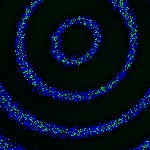
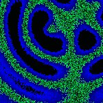
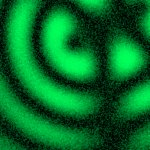

# [S=2_T=3_Z=5_CH=1.czi](https://zenodo.org/record/7015307/files/S%3D2_T%3D3_Z%3D5_CH%3D1.czi) report
 - **Autostitch** = true
 - ZeissCZIReader v6.14.0
 - ZeissQuickStartCZIReader v0.1.7-SNAPSHOT

# Images 

| Series            | Quick Start Reader | Size | Original Reader | Size |
|-------------------|--------------------|------|-----------------|------|
| Read time (all)   |56 ms|------|56 ms|------|
|0||X:256 Y:256 C:1 Z:5 T:3||X:256 Y:256 C:1 Z:5 T:3|
|1||X:256 Y:256 C:1 Z:5 T:3||X:256 Y:256 C:1 Z:5 T:3|

# Metadata

|  Method            | Parameters       | Quick Start Reader | Original Reader | Delta  |
| -------------------|------------------|--------------------|-----------------|------- |
| Initialization     |                  |18 ms|18 ms|        |
| Reader Size (Mb)     |                  |2.01|2.65|        |
| getStageLabelName| Image 0 | P1| Scene position #0| |
| getStageLabelName| Image 1 | P1| Scene position #1| |
| getPlaneDeltaT| Image 0 Plane 1 |  0.469 s |  0.475 s | 0.005 s |
| getPlaneDeltaT| Image 0 Plane 2 |  0.662 s |  0.674 s | 0.012 s |
| getPlaneDeltaT| Image 0 Plane 3 |  0.854 s |  0.861 s | 0.007 s |
| getPlaneDeltaT| Image 0 Plane 5 |  2.792 s |  2.809 s | 0.017 s |
| getPlaneDeltaT| Image 0 Plane 6 |  2.984 s |  3.008 s | 0.023 s |
| getPlaneDeltaT| Image 0 Plane 7 |  3.177 s |  3.192 s | 0.015 s |
| getPlaneDeltaT| Image 0 Plane 8 |  3.369 s |  3.375 s | 0.006 s |
| getPlaneDeltaT| Image 0 Plane 9 |  3.562 s |  3.560 s | 0.002 s |
| getPlaneDeltaT| Image 0 Plane 11 |  5.499 s |  5.508 s | 0.008 s |
| getPlaneDeltaT| Image 0 Plane 12 |  5.692 s |  5.694 s | 0.002 s |
| getPlaneDeltaT| Image 0 Plane 13 |  5.884 s |  5.882 s | 0.002 s |
| getPlaneDeltaT| Image 0 Plane 14 |  6.077 s |  6.069 s | 0.008 s |
| getPlaneDeltaT| Image 1 Plane 5 |  4.059 s |  4.054 s | 0.006 s |
| getPlaneDeltaT| Image 1 Plane 6 |  4.245 s |  4.241 s | 0.004 s |
| getPlaneDeltaT| Image 1 Plane 7 |  4.431 s |  4.426 s | 0.004 s |
| getPlaneDeltaT| Image 1 Plane 8 |  4.616 s |  4.612 s | 0.004 s |
| getPlaneDeltaT| Image 1 Plane 9 |  4.802 s |  4.812 s | 0.010 s |
| getPlaneDeltaT| Image 1 Plane 11 |  6.748 s |  6.762 s | 0.015 s |
| getPlaneDeltaT| Image 1 Plane 12 |  6.933 s |  6.947 s | 0.014 s |
| getPlaneDeltaT| Image 1 Plane 13 |  7.119 s |  7.133 s | 0.014 s |
| getPlaneDeltaT| Image 1 Plane 14 |  7.304 s |  7.317 s | 0.013 s |
