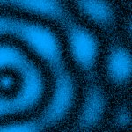
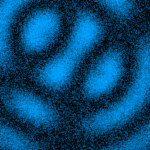
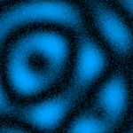
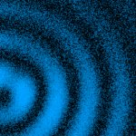
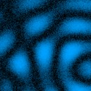
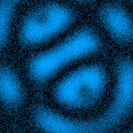
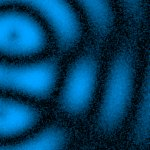
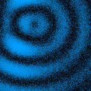
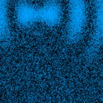

# [S=3_1Pos_2Mosaic_T=2=Z=3_CH=2.czi](https://zenodo.org/record/7015307/files/S%3D3_1Pos_2Mosaic_T%3D2%3DZ%3D3_CH%3D2.czi) report
 - **Autostitch** = false
 - ZeissCZIReader v6.14.0
 - ZeissQuickStartCZIReader v0.1.8-SNAPSHOT

# Images 

| Series            | Quick Start Reader | Size | Original Reader | Size | #Diffs |
|-------------------|--------------------|------|-----------------|------|--------|
| Read time (all)   |618 ms|------|993 ms|------|--------|
|0||X:256 Y:256 C:2 Z:3 T:2||X:256 Y:256 C:2 Z:3 T:2|0|
|1||X:256 Y:256 C:2 Z:3 T:2||X:256 Y:256 C:2 Z:3 T:2|0|
|2||X:256 Y:256 C:2 Z:3 T:2||X:256 Y:256 C:2 Z:3 T:2|0|
|3||X:256 Y:256 C:2 Z:3 T:2||X:256 Y:256 C:2 Z:3 T:2|0|
|4||X:256 Y:256 C:2 Z:3 T:2||X:256 Y:256 C:2 Z:3 T:2|0|
|5||X:256 Y:256 C:2 Z:3 T:2||X:256 Y:256 C:2 Z:3 T:2|0|
|6||X:256 Y:256 C:2 Z:3 T:2||X:256 Y:256 C:2 Z:3 T:2|0|
|7||X:256 Y:256 C:2 Z:3 T:2||X:256 Y:256 C:2 Z:3 T:2|0|
|8||X:256 Y:256 C:2 Z:3 T:2||X:256 Y:256 C:2 Z:3 T:2|0|
|9||X:256 Y:256 C:2 Z:3 T:2||X:256 Y:256 C:2 Z:3 T:2|0|
|10||X:256 Y:256 C:2 Z:3 T:2||X:256 Y:256 C:2 Z:3 T:2|22500|
|11||X:256 Y:256 C:2 Z:3 T:2||X:256 Y:256 C:2 Z:3 T:2|22500|
|12||X:256 Y:256 C:2 Z:3 T:2||X:256 Y:256 C:2 Z:3 T:2|22500|
|13||X:256 Y:256 C:2 Z:3 T:2||X:256 Y:256 C:2 Z:3 T:2|22500|
|14||X:256 Y:256 C:2 Z:3 T:2||X:256 Y:256 C:2 Z:3 T:2|22500|
|15||X:256 Y:256 C:2 Z:3 T:2||X:256 Y:256 C:2 Z:3 T:2|22500|
|16||X:256 Y:256 C:2 Z:3 T:2||X:256 Y:256 C:2 Z:3 T:2|22500|
|17||X:256 Y:256 C:2 Z:3 T:2||X:256 Y:256 C:2 Z:3 T:2|22499|
|18||X:256 Y:256 C:2 Z:3 T:2||X:256 Y:256 C:2 Z:3 T:2|22500|
|19||X:256 Y:256 C:2 Z:3 T:2||X:256 Y:256 C:2 Z:3 T:2|22500|
|20||X:256 Y:256 C:2 Z:3 T:2||X:256 Y:256 C:2 Z:3 T:2|22500|
|21||X:256 Y:256 C:2 Z:3 T:2||X:256 Y:256 C:2 Z:3 T:2|22500|
|22||X:256 Y:256 C:2 Z:3 T:2||X:256 Y:256 C:2 Z:3 T:2|22500|
|23||X:256 Y:256 C:2 Z:3 T:2||X:256 Y:256 C:2 Z:3 T:2|22500|
|24||X:256 Y:256 C:2 Z:3 T:2||X:256 Y:256 C:2 Z:3 T:2|22500|
|25||X:256 Y:256 C:2 Z:3 T:2||X:256 Y:256 C:2 Z:3 T:2|22500|
|26||X:256 Y:256 C:2 Z:3 T:2||X:256 Y:256 C:2 Z:3 T:2|22500|
|27||X:256 Y:256 C:2 Z:3 T:2||X:256 Y:256 C:2 Z:3 T:2|22500|
|28| | ||X:256 Y:256 C:2 Z:3 T:2|-1|
|29| | ||X:256 Y:256 C:2 Z:3 T:2|-1|
|30| | ||X:256 Y:256 C:2 Z:3 T:2|-1|
|31| | ||X:256 Y:256 C:2 Z:3 T:2|-1|
|32| | ||X:256 Y:256 C:2 Z:3 T:2|-1|
|33| | ||X:256 Y:256 C:2 Z:3 T:2|-1|
|34| | ||X:256 Y:256 C:2 Z:3 T:2|-1|
|35| | ||X:256 Y:256 C:2 Z:3 T:2|-1|
|36| | ||X:256 Y:256 C:2 Z:3 T:2|-1|
|37| | ||X:256 Y:256 C:2 Z:3 T:2|-1|
|38| | ||X:256 Y:256 C:2 Z:3 T:2|-1|
|39| | ||X:256 Y:256 C:2 Z:3 T:2|-1|
|40| | ||X:256 Y:256 C:2 Z:3 T:2|-1|
|41| | ||X:256 Y:256 C:2 Z:3 T:2|-1|
|42| | ||X:256 Y:256 C:2 Z:3 T:2|-1|
|43| | ||X:256 Y:256 C:2 Z:3 T:2|-1|
|44| | ||X:256 Y:256 C:2 Z:3 T:2|-1|
|45| | ||X:256 Y:256 C:2 Z:3 T:2|-1|
|46| | ||X:256 Y:256 C:2 Z:3 T:2|-1|
|47| | ||X:256 Y:256 C:2 Z:3 T:2|-1|
|48| | ||X:256 Y:256 C:2 Z:3 T:2|-1|
|49| | ||X:256 Y:256 C:2 Z:3 T:2|-1|
|50| | ||X:256 Y:256 C:2 Z:3 T:2|-1|

# Metadata

|  Method            | Parameters       | Quick Start Reader | Original Reader | Delta  |
| -------------------|------------------|--------------------|-----------------|------- |
| Initialization     |                  |92 ms|66 ms|        |
| Reader Size (Mb)     |                  |2.23|3.36|        |
| getImageCount|(No args)|28| 51| |
| getStageLabelName| Image 0 | TR1| Scene position #0| |
| getStageLabelName| Image 1 | TR1| Scene position #1| |
| getStageLabelX| Image 1 | 38305.376 um | 38305.136 um | 0.240 um |
| getStageLabelName| Image 2 | TR1| Scene position #2| |
| getStageLabelX| Image 2 | 38397.376 um | 38397.296 um | 0.080 um |
| getStageLabelName| Image 3 | TR1| Scene position #3| |
| getStageLabelX| Image 3 | 38489.776 um | 38489.456 um | 0.320 um |
| getStageLabelName| Image 4 | TR1| Scene position #4| |
| getStageLabelX| Image 4 | 38581.776 um | 38581.616 um | 0.160 um |
| getStageLabelName| Image 5 | TR1| Scene position #5| |
| getStageLabelX| Image 5 | 38581.776 um | 38581.616 um | 0.160 um |
| getStageLabelY| Image 5 | 12770.638 um | 12770.798 um | 0.160 um |
| getStageLabelName| Image 6 | TR1| Scene position #6| |
| getStageLabelX| Image 6 | 38489.776 um | 38489.456 um | 0.320 um |
| getStageLabelY| Image 6 | 12770.638 um | 12770.798 um | 0.160 um |
| getStageLabelName| Image 7 | TR1| Scene position #7| |
| getStageLabelX| Image 7 | 38397.376 um | 38397.296 um | 0.080 um |
| getStageLabelY| Image 7 | 12770.638 um | 12770.798 um | 0.160 um |
| getStageLabelName| Image 8 | TR1| Scene position #8| |
| getStageLabelX| Image 8 | 38305.376 um | 38305.136 um | 0.240 um |
| getStageLabelY| Image 8 | 12770.638 um | 12770.798 um | 0.160 um |
| getStageLabelName| Image 9 | TR1| Scene position #9| |
| getStageLabelY| Image 9 | 12770.638 um | 12770.798 um | 0.160 um |
| getStageLabelName| Image 10 |  error: false | error: true| |
| getStageLabelX| Image 10 |  error: false | error: true| |
| getStageLabelY| Image 10 |  error: false | error: true| |
| getStageLabelZ| Image 10 |  error: false | error: true| |
| getStageLabelName| Image 11 |  error: false | error: true| |
| getStageLabelX| Image 11 |  error: false | error: true| |
| getStageLabelY| Image 11 |  error: false | error: true| |
| getStageLabelZ| Image 11 |  error: false | error: true| |
| getStageLabelName| Image 12 |  error: false | error: true| |
| getStageLabelX| Image 12 |  error: false | error: true| |
| getStageLabelY| Image 12 |  error: false | error: true| |
| getStageLabelZ| Image 12 |  error: false | error: true| |
| getStageLabelName| Image 13 |  error: false | error: true| |
| getStageLabelX| Image 13 |  error: false | error: true| |
| getStageLabelY| Image 13 |  error: false | error: true| |
| getStageLabelZ| Image 13 |  error: false | error: true| |
| getStageLabelName| Image 14 |  error: false | error: true| |
| getStageLabelX| Image 14 |  error: false | error: true| |
| getStageLabelY| Image 14 |  error: false | error: true| |
| getStageLabelZ| Image 14 |  error: false | error: true| |
| getStageLabelName| Image 15 |  error: false | error: true| |
| getStageLabelX| Image 15 |  error: false | error: true| |
| getStageLabelY| Image 15 |  error: false | error: true| |
| getStageLabelZ| Image 15 |  error: false | error: true| |
| getStageLabelName| Image 16 |  error: false | error: true| |
| getStageLabelX| Image 16 |  error: false | error: true| |
| getStageLabelY| Image 16 |  error: false | error: true| |
| getStageLabelZ| Image 16 |  error: false | error: true| |
| getStageLabelName| Image 17 | TR2| Scene position #17| |
| getStageLabelX| Image 17 | 38541.376 um | 37980.000 um | 561.376 um |
| getStageLabelY| Image 17 | 13214.238 um | 13020.000 um | 194.238 um |
| getStageLabelName| Image 18 |  error: false | error: true| |
| getStageLabelX| Image 18 |  error: false | error: true| |
| getStageLabelY| Image 18 |  error: false | error: true| |
| getStageLabelZ| Image 18 |  error: false | error: true| |
| getStageLabelName| Image 19 |  error: false | error: true| |
| getStageLabelX| Image 19 |  error: false | error: true| |
| getStageLabelY| Image 19 |  error: false | error: true| |
| getStageLabelZ| Image 19 |  error: false | error: true| |
| getStageLabelName| Image 20 |  error: false | error: true| |
| getStageLabelX| Image 20 |  error: false | error: true| |
| getStageLabelY| Image 20 |  error: false | error: true| |
| getStageLabelZ| Image 20 |  error: false | error: true| |
| getStageLabelName| Image 21 |  error: false | error: true| |
| getStageLabelX| Image 21 |  error: false | error: true| |
| getStageLabelY| Image 21 |  error: false | error: true| |
| getStageLabelZ| Image 21 |  error: false | error: true| |
| getStageLabelName| Image 22 |  error: false | error: true| |
| getStageLabelX| Image 22 |  error: false | error: true| |
| getStageLabelY| Image 22 |  error: false | error: true| |
| getStageLabelZ| Image 22 |  error: false | error: true| |
| getStageLabelName| Image 23 |  error: false | error: true| |
| getStageLabelX| Image 23 |  error: false | error: true| |
| getStageLabelY| Image 23 |  error: false | error: true| |
| getStageLabelZ| Image 23 |  error: false | error: true| |
| getStageLabelName| Image 24 |  error: false | error: true| |
| getStageLabelX| Image 24 |  error: false | error: true| |
| getStageLabelY| Image 24 |  error: false | error: true| |
| getStageLabelZ| Image 24 |  error: false | error: true| |
| getStageLabelName| Image 25 |  error: false | error: true| |
| getStageLabelX| Image 25 |  error: false | error: true| |
| getStageLabelY| Image 25 |  error: false | error: true| |
| getStageLabelZ| Image 25 |  error: false | error: true| |
| getStageLabelName| Image 26 |  error: false | error: true| |
| getStageLabelX| Image 26 |  error: false | error: true| |
| getStageLabelY| Image 26 |  error: false | error: true| |
| getStageLabelZ| Image 26 |  error: false | error: true| |
| getStageLabelName| Image 27 |  error: false | error: true| |
| getStageLabelX| Image 27 |  error: false | error: true| |
| getStageLabelY| Image 27 |  error: false | error: true| |
| getStageLabelZ| Image 27 |  error: false | error: true| |
| getImageName| Image 28 |  error: true | error: false| |
| getImageAcquisitionDate| Image 28 |  error: true | error: false| |
| getImageAnnotationRefCount| Image 28 |  error: true | error: false| |
| getImageDescription| Image 28 |  error: true | error: false| |
| getImageExperimenterRef| Image 28 |  error: true | error: false| |
| getImageInstrumentRef| Image 28 |  error: true | error: false| |
| getImageID| Image 28 |  error: true | error: false| |
| getImageROIRefCount| Image 28 |  error: true | error: false| |
| getPlaneCount| Image 28 |  error: true | error: false| |
| getChannelCount| Image 28 |  error: true | error: false| |
| getImageROIRefCount| Image 28 |  error: true | error: false| |
| getPixelsBinDataCount| Image 28 |  error: true | error: false| |
| getMicrobeamManipulationRefCount| Image 28 |  error: true | error: false| |
| getTiffDataCount| Image 28 |  error: true | error: false| |
| getPixelsSizeX| Image 28 |  error: true | error: false| |
| getPixelsSizeY| Image 28 |  error: true | error: false| |
| getPixelsSizeZ| Image 28 |  error: true | error: false| |
| getPixelsSizeC| Image 28 |  error: true | error: false| |
| getPixelsSizeT| Image 28 |  error: true | error: false| |
| getPixelsPhysicalSizeX| Image 28 |  error: true | error: false| |
| getPixelsPhysicalSizeY| Image 28 |  error: true | error: false| |
| getPixelsPhysicalSizeZ| Image 28 |  error: true | error: false| |
| getPixelsInterleaved| Image 28 |  error: true | error: false| |
| getPixelsDimensionOrder| Image 28 |  error: true | error: false| |
| getPixelsBigEndian| Image 28 |  error: true | error: false| |
| getPixelsID| Image 28 |  error: true | error: false| |
| getImageName| Image 29 |  error: true | error: false| |
| getImageAcquisitionDate| Image 29 |  error: true | error: false| |
| getImageAnnotationRefCount| Image 29 |  error: true | error: false| |
| getImageDescription| Image 29 |  error: true | error: false| |
| getImageExperimenterRef| Image 29 |  error: true | error: false| |
| getImageInstrumentRef| Image 29 |  error: true | error: false| |
| getImageID| Image 29 |  error: true | error: false| |
| getImageROIRefCount| Image 29 |  error: true | error: false| |
| getPlaneCount| Image 29 |  error: true | error: false| |
| getChannelCount| Image 29 |  error: true | error: false| |
| getImageROIRefCount| Image 29 |  error: true | error: false| |
| getPixelsBinDataCount| Image 29 |  error: true | error: false| |
| getMicrobeamManipulationRefCount| Image 29 |  error: true | error: false| |
| getTiffDataCount| Image 29 |  error: true | error: false| |
| getPixelsSizeX| Image 29 |  error: true | error: false| |
| getPixelsSizeY| Image 29 |  error: true | error: false| |
| getPixelsSizeZ| Image 29 |  error: true | error: false| |
| getPixelsSizeC| Image 29 |  error: true | error: false| |
| getPixelsSizeT| Image 29 |  error: true | error: false| |
| getPixelsPhysicalSizeX| Image 29 |  error: true | error: false| |
| getPixelsPhysicalSizeY| Image 29 |  error: true | error: false| |
| getPixelsPhysicalSizeZ| Image 29 |  error: true | error: false| |
| getPixelsInterleaved| Image 29 |  error: true | error: false| |
| getPixelsDimensionOrder| Image 29 |  error: true | error: false| |
| getPixelsBigEndian| Image 29 |  error: true | error: false| |
| getPixelsID| Image 29 |  error: true | error: false| |
| getImageName| Image 30 |  error: true | error: false| |
| getImageAcquisitionDate| Image 30 |  error: true | error: false| |
| getImageAnnotationRefCount| Image 30 |  error: true | error: false| |
| getImageDescription| Image 30 |  error: true | error: false| |
| getImageExperimenterRef| Image 30 |  error: true | error: false| |
| getImageInstrumentRef| Image 30 |  error: true | error: false| |
| getImageID| Image 30 |  error: true | error: false| |
| getImageROIRefCount| Image 30 |  error: true | error: false| |
| getPlaneCount| Image 30 |  error: true | error: false| |
| getChannelCount| Image 30 |  error: true | error: false| |
| getImageROIRefCount| Image 30 |  error: true | error: false| |
| getPixelsBinDataCount| Image 30 |  error: true | error: false| |
| getMicrobeamManipulationRefCount| Image 30 |  error: true | error: false| |
| getTiffDataCount| Image 30 |  error: true | error: false| |
| getPixelsSizeX| Image 30 |  error: true | error: false| |
| getPixelsSizeY| Image 30 |  error: true | error: false| |
| getPixelsSizeZ| Image 30 |  error: true | error: false| |
| getPixelsSizeC| Image 30 |  error: true | error: false| |
| getPixelsSizeT| Image 30 |  error: true | error: false| |
| getPixelsPhysicalSizeX| Image 30 |  error: true | error: false| |
| getPixelsPhysicalSizeY| Image 30 |  error: true | error: false| |
| getPixelsPhysicalSizeZ| Image 30 |  error: true | error: false| |
| getPixelsInterleaved| Image 30 |  error: true | error: false| |
| getPixelsDimensionOrder| Image 30 |  error: true | error: false| |
| getPixelsBigEndian| Image 30 |  error: true | error: false| |
| getPixelsID| Image 30 |  error: true | error: false| |
| getImageName| Image 31 |  error: true | error: false| |
| getImageAcquisitionDate| Image 31 |  error: true | error: false| |
| getImageAnnotationRefCount| Image 31 |  error: true | error: false| |
| getImageDescription| Image 31 |  error: true | error: false| |
| getImageExperimenterRef| Image 31 |  error: true | error: false| |
| getImageInstrumentRef| Image 31 |  error: true | error: false| |
| getImageID| Image 31 |  error: true | error: false| |
| getImageROIRefCount| Image 31 |  error: true | error: false| |
| getPlaneCount| Image 31 |  error: true | error: false| |
| getChannelCount| Image 31 |  error: true | error: false| |
| getImageROIRefCount| Image 31 |  error: true | error: false| |
| getPixelsBinDataCount| Image 31 |  error: true | error: false| |
| getMicrobeamManipulationRefCount| Image 31 |  error: true | error: false| |
| getTiffDataCount| Image 31 |  error: true | error: false| |
| getPixelsSizeX| Image 31 |  error: true | error: false| |
| getPixelsSizeY| Image 31 |  error: true | error: false| |
| getPixelsSizeZ| Image 31 |  error: true | error: false| |
| getPixelsSizeC| Image 31 |  error: true | error: false| |
| getPixelsSizeT| Image 31 |  error: true | error: false| |
| getPixelsPhysicalSizeX| Image 31 |  error: true | error: false| |
| getPixelsPhysicalSizeY| Image 31 |  error: true | error: false| |
| getPixelsPhysicalSizeZ| Image 31 |  error: true | error: false| |
| getPixelsInterleaved| Image 31 |  error: true | error: false| |
| getPixelsDimensionOrder| Image 31 |  error: true | error: false| |
| getPixelsBigEndian| Image 31 |  error: true | error: false| |
| getPixelsID| Image 31 |  error: true | error: false| |
| getImageName| Image 32 |  error: true | error: false| |
| getImageAcquisitionDate| Image 32 |  error: true | error: false| |
| getImageAnnotationRefCount| Image 32 |  error: true | error: false| |
| getImageDescription| Image 32 |  error: true | error: false| |
| getImageExperimenterRef| Image 32 |  error: true | error: false| |
| getImageInstrumentRef| Image 32 |  error: true | error: false| |
| getImageID| Image 32 |  error: true | error: false| |
| getImageROIRefCount| Image 32 |  error: true | error: false| |
| getPlaneCount| Image 32 |  error: true | error: false| |
| getChannelCount| Image 32 |  error: true | error: false| |
| getImageROIRefCount| Image 32 |  error: true | error: false| |
| getPixelsBinDataCount| Image 32 |  error: true | error: false| |
| getMicrobeamManipulationRefCount| Image 32 |  error: true | error: false| |
| getTiffDataCount| Image 32 |  error: true | error: false| |
| getPixelsSizeX| Image 32 |  error: true | error: false| |
| getPixelsSizeY| Image 32 |  error: true | error: false| |
| getPixelsSizeZ| Image 32 |  error: true | error: false| |
| getPixelsSizeC| Image 32 |  error: true | error: false| |
| getPixelsSizeT| Image 32 |  error: true | error: false| |
| getPixelsPhysicalSizeX| Image 32 |  error: true | error: false| |
| getPixelsPhysicalSizeY| Image 32 |  error: true | error: false| |
| getPixelsPhysicalSizeZ| Image 32 |  error: true | error: false| |
| getPixelsInterleaved| Image 32 |  error: true | error: false| |
| getPixelsDimensionOrder| Image 32 |  error: true | error: false| |
| getPixelsBigEndian| Image 32 |  error: true | error: false| |
| getPixelsID| Image 32 |  error: true | error: false| |
| getImageName| Image 33 |  error: true | error: false| |
| getImageAcquisitionDate| Image 33 |  error: true | error: false| |
| getImageAnnotationRefCount| Image 33 |  error: true | error: false| |
| getImageDescription| Image 33 |  error: true | error: false| |
| getImageExperimenterRef| Image 33 |  error: true | error: false| |
| getImageInstrumentRef| Image 33 |  error: true | error: false| |
| getImageID| Image 33 |  error: true | error: false| |
| getImageROIRefCount| Image 33 |  error: true | error: false| |
| getPlaneCount| Image 33 |  error: true | error: false| |
| getChannelCount| Image 33 |  error: true | error: false| |
| getImageROIRefCount| Image 33 |  error: true | error: false| |
| getPixelsBinDataCount| Image 33 |  error: true | error: false| |
| getMicrobeamManipulationRefCount| Image 33 |  error: true | error: false| |
| getTiffDataCount| Image 33 |  error: true | error: false| |
| getPixelsSizeX| Image 33 |  error: true | error: false| |
| getPixelsSizeY| Image 33 |  error: true | error: false| |
| getPixelsSizeZ| Image 33 |  error: true | error: false| |
| getPixelsSizeC| Image 33 |  error: true | error: false| |
| getPixelsSizeT| Image 33 |  error: true | error: false| |
| getPixelsPhysicalSizeX| Image 33 |  error: true | error: false| |
| getPixelsPhysicalSizeY| Image 33 |  error: true | error: false| |
| getPixelsPhysicalSizeZ| Image 33 |  error: true | error: false| |
| getPixelsInterleaved| Image 33 |  error: true | error: false| |
| getPixelsDimensionOrder| Image 33 |  error: true | error: false| |
| getPixelsBigEndian| Image 33 |  error: true | error: false| |
| getPixelsID| Image 33 |  error: true | error: false| |
| getImageName| Image 34 |  error: true | error: false| |
| getImageAcquisitionDate| Image 34 |  error: true | error: false| |
| getImageAnnotationRefCount| Image 34 |  error: true | error: false| |
| getImageDescription| Image 34 |  error: true | error: false| |
| getImageExperimenterRef| Image 34 |  error: true | error: false| |
| getImageInstrumentRef| Image 34 |  error: true | error: false| |
| getImageID| Image 34 |  error: true | error: false| |
| getImageROIRefCount| Image 34 |  error: true | error: false| |
| getPlaneCount| Image 34 |  error: true | error: false| |
| getChannelCount| Image 34 |  error: true | error: false| |
| getImageROIRefCount| Image 34 |  error: true | error: false| |
| getPixelsBinDataCount| Image 34 |  error: true | error: false| |
| getMicrobeamManipulationRefCount| Image 34 |  error: true | error: false| |
| getTiffDataCount| Image 34 |  error: true | error: false| |
| getStageLabelName| Image 34 |  error: true | error: false| |
| getStageLabelX| Image 34 |  error: true | error: false| |
| getStageLabelY| Image 34 |  error: true | error: false| |
| getStageLabelZ| Image 34 |  error: true | error: false| |
| getPixelsSizeX| Image 34 |  error: true | error: false| |
| getPixelsSizeY| Image 34 |  error: true | error: false| |
| getPixelsSizeZ| Image 34 |  error: true | error: false| |
| getPixelsSizeC| Image 34 |  error: true | error: false| |
| getPixelsSizeT| Image 34 |  error: true | error: false| |
| getPixelsPhysicalSizeX| Image 34 |  error: true | error: false| |
| getPixelsPhysicalSizeY| Image 34 |  error: true | error: false| |
| getPixelsPhysicalSizeZ| Image 34 |  error: true | error: false| |
| getPixelsInterleaved| Image 34 |  error: true | error: false| |
| getPixelsDimensionOrder| Image 34 |  error: true | error: false| |
| getPixelsBigEndian| Image 34 |  error: true | error: false| |
| getPixelsID| Image 34 |  error: true | error: false| |
| getImageName| Image 35 |  error: true | error: false| |
| getImageAcquisitionDate| Image 35 |  error: true | error: false| |
| getImageAnnotationRefCount| Image 35 |  error: true | error: false| |
| getImageDescription| Image 35 |  error: true | error: false| |
| getImageExperimenterRef| Image 35 |  error: true | error: false| |
| getImageInstrumentRef| Image 35 |  error: true | error: false| |
| getImageID| Image 35 |  error: true | error: false| |
| getImageROIRefCount| Image 35 |  error: true | error: false| |
| getPlaneCount| Image 35 |  error: true | error: false| |
| getChannelCount| Image 35 |  error: true | error: false| |
| getImageROIRefCount| Image 35 |  error: true | error: false| |
| getPixelsBinDataCount| Image 35 |  error: true | error: false| |
| getMicrobeamManipulationRefCount| Image 35 |  error: true | error: false| |
| getTiffDataCount| Image 35 |  error: true | error: false| |
| getStageLabelName| Image 35 |  error: true | error: false| |
| getStageLabelX| Image 35 |  error: true | error: false| |
| getStageLabelY| Image 35 |  error: true | error: false| |
| getStageLabelZ| Image 35 |  error: true | error: false| |
| getPixelsSizeX| Image 35 |  error: true | error: false| |
| getPixelsSizeY| Image 35 |  error: true | error: false| |
| getPixelsSizeZ| Image 35 |  error: true | error: false| |
| getPixelsSizeC| Image 35 |  error: true | error: false| |
| getPixelsSizeT| Image 35 |  error: true | error: false| |
| getPixelsPhysicalSizeX| Image 35 |  error: true | error: false| |
| getPixelsPhysicalSizeY| Image 35 |  error: true | error: false| |
| getPixelsPhysicalSizeZ| Image 35 |  error: true | error: false| |
| getPixelsInterleaved| Image 35 |  error: true | error: false| |
| getPixelsDimensionOrder| Image 35 |  error: true | error: false| |
| getPixelsBigEndian| Image 35 |  error: true | error: false| |
| getPixelsID| Image 35 |  error: true | error: false| |
| getImageName| Image 36 |  error: true | error: false| |
| getImageAcquisitionDate| Image 36 |  error: true | error: false| |
| getImageAnnotationRefCount| Image 36 |  error: true | error: false| |
| getImageDescription| Image 36 |  error: true | error: false| |
| getImageExperimenterRef| Image 36 |  error: true | error: false| |
| getImageInstrumentRef| Image 36 |  error: true | error: false| |
| getImageID| Image 36 |  error: true | error: false| |
| getImageROIRefCount| Image 36 |  error: true | error: false| |
| getPlaneCount| Image 36 |  error: true | error: false| |
| getChannelCount| Image 36 |  error: true | error: false| |
| getImageROIRefCount| Image 36 |  error: true | error: false| |
| getPixelsBinDataCount| Image 36 |  error: true | error: false| |
| getMicrobeamManipulationRefCount| Image 36 |  error: true | error: false| |
| getTiffDataCount| Image 36 |  error: true | error: false| |
| getStageLabelName| Image 36 |  error: true | error: false| |
| getStageLabelX| Image 36 |  error: true | error: false| |
| getStageLabelY| Image 36 |  error: true | error: false| |
| getStageLabelZ| Image 36 |  error: true | error: false| |
| getPixelsSizeX| Image 36 |  error: true | error: false| |
| getPixelsSizeY| Image 36 |  error: true | error: false| |
| getPixelsSizeZ| Image 36 |  error: true | error: false| |
| getPixelsSizeC| Image 36 |  error: true | error: false| |
| getPixelsSizeT| Image 36 |  error: true | error: false| |
| getPixelsPhysicalSizeX| Image 36 |  error: true | error: false| |
| getPixelsPhysicalSizeY| Image 36 |  error: true | error: false| |
| getPixelsPhysicalSizeZ| Image 36 |  error: true | error: false| |
| getPixelsInterleaved| Image 36 |  error: true | error: false| |
| getPixelsDimensionOrder| Image 36 |  error: true | error: false| |
| getPixelsBigEndian| Image 36 |  error: true | error: false| |
| getPixelsID| Image 36 |  error: true | error: false| |
| getImageName| Image 37 |  error: true | error: false| |
| getImageAcquisitionDate| Image 37 |  error: true | error: false| |
| getImageAnnotationRefCount| Image 37 |  error: true | error: false| |
| getImageDescription| Image 37 |  error: true | error: false| |
| getImageExperimenterRef| Image 37 |  error: true | error: false| |
| getImageInstrumentRef| Image 37 |  error: true | error: false| |
| getImageID| Image 37 |  error: true | error: false| |
| getImageROIRefCount| Image 37 |  error: true | error: false| |
| getPlaneCount| Image 37 |  error: true | error: false| |
| getChannelCount| Image 37 |  error: true | error: false| |
| getImageROIRefCount| Image 37 |  error: true | error: false| |
| getPixelsBinDataCount| Image 37 |  error: true | error: false| |
| getMicrobeamManipulationRefCount| Image 37 |  error: true | error: false| |
| getTiffDataCount| Image 37 |  error: true | error: false| |
| getStageLabelName| Image 37 |  error: true | error: false| |
| getStageLabelX| Image 37 |  error: true | error: false| |
| getStageLabelY| Image 37 |  error: true | error: false| |
| getStageLabelZ| Image 37 |  error: true | error: false| |
| getPixelsSizeX| Image 37 |  error: true | error: false| |
| getPixelsSizeY| Image 37 |  error: true | error: false| |
| getPixelsSizeZ| Image 37 |  error: true | error: false| |
| getPixelsSizeC| Image 37 |  error: true | error: false| |
| getPixelsSizeT| Image 37 |  error: true | error: false| |
| getPixelsPhysicalSizeX| Image 37 |  error: true | error: false| |
| getPixelsPhysicalSizeY| Image 37 |  error: true | error: false| |
| getPixelsPhysicalSizeZ| Image 37 |  error: true | error: false| |
| getPixelsInterleaved| Image 37 |  error: true | error: false| |
| getPixelsDimensionOrder| Image 37 |  error: true | error: false| |
| getPixelsBigEndian| Image 37 |  error: true | error: false| |
| getPixelsID| Image 37 |  error: true | error: false| |
| getImageName| Image 38 |  error: true | error: false| |
| getImageAcquisitionDate| Image 38 |  error: true | error: false| |
| getImageAnnotationRefCount| Image 38 |  error: true | error: false| |
| getImageDescription| Image 38 |  error: true | error: false| |
| getImageExperimenterRef| Image 38 |  error: true | error: false| |
| getImageInstrumentRef| Image 38 |  error: true | error: false| |
| getImageID| Image 38 |  error: true | error: false| |
| getImageROIRefCount| Image 38 |  error: true | error: false| |
| getPlaneCount| Image 38 |  error: true | error: false| |
| getChannelCount| Image 38 |  error: true | error: false| |
| getImageROIRefCount| Image 38 |  error: true | error: false| |
| getPixelsBinDataCount| Image 38 |  error: true | error: false| |
| getMicrobeamManipulationRefCount| Image 38 |  error: true | error: false| |
| getTiffDataCount| Image 38 |  error: true | error: false| |
| getStageLabelName| Image 38 |  error: true | error: false| |
| getStageLabelX| Image 38 |  error: true | error: false| |
| getStageLabelY| Image 38 |  error: true | error: false| |
| getStageLabelZ| Image 38 |  error: true | error: false| |
| getPixelsSizeX| Image 38 |  error: true | error: false| |
| getPixelsSizeY| Image 38 |  error: true | error: false| |
| getPixelsSizeZ| Image 38 |  error: true | error: false| |
| getPixelsSizeC| Image 38 |  error: true | error: false| |
| getPixelsSizeT| Image 38 |  error: true | error: false| |
| getPixelsPhysicalSizeX| Image 38 |  error: true | error: false| |
| getPixelsPhysicalSizeY| Image 38 |  error: true | error: false| |
| getPixelsPhysicalSizeZ| Image 38 |  error: true | error: false| |
| getPixelsInterleaved| Image 38 |  error: true | error: false| |
| getPixelsDimensionOrder| Image 38 |  error: true | error: false| |
| getPixelsBigEndian| Image 38 |  error: true | error: false| |
| getPixelsID| Image 38 |  error: true | error: false| |
| getImageName| Image 39 |  error: true | error: false| |
| getImageAcquisitionDate| Image 39 |  error: true | error: false| |
| getImageAnnotationRefCount| Image 39 |  error: true | error: false| |
| getImageDescription| Image 39 |  error: true | error: false| |
| getImageExperimenterRef| Image 39 |  error: true | error: false| |
| getImageInstrumentRef| Image 39 |  error: true | error: false| |
| getImageID| Image 39 |  error: true | error: false| |
| getImageROIRefCount| Image 39 |  error: true | error: false| |
| getPlaneCount| Image 39 |  error: true | error: false| |
| getChannelCount| Image 39 |  error: true | error: false| |
| getImageROIRefCount| Image 39 |  error: true | error: false| |
| getPixelsBinDataCount| Image 39 |  error: true | error: false| |
| getMicrobeamManipulationRefCount| Image 39 |  error: true | error: false| |
| getTiffDataCount| Image 39 |  error: true | error: false| |
| getStageLabelName| Image 39 |  error: true | error: false| |
| getStageLabelX| Image 39 |  error: true | error: false| |
| getStageLabelY| Image 39 |  error: true | error: false| |
| getStageLabelZ| Image 39 |  error: true | error: false| |
| getPixelsSizeX| Image 39 |  error: true | error: false| |
| getPixelsSizeY| Image 39 |  error: true | error: false| |
| getPixelsSizeZ| Image 39 |  error: true | error: false| |
| getPixelsSizeC| Image 39 |  error: true | error: false| |
| getPixelsSizeT| Image 39 |  error: true | error: false| |
| getPixelsPhysicalSizeX| Image 39 |  error: true | error: false| |
| getPixelsPhysicalSizeY| Image 39 |  error: true | error: false| |
| getPixelsPhysicalSizeZ| Image 39 |  error: true | error: false| |
| getPixelsInterleaved| Image 39 |  error: true | error: false| |
| getPixelsDimensionOrder| Image 39 |  error: true | error: false| |
| getPixelsBigEndian| Image 39 |  error: true | error: false| |
| getPixelsID| Image 39 |  error: true | error: false| |
| getImageName| Image 40 |  error: true | error: false| |
| getImageAcquisitionDate| Image 40 |  error: true | error: false| |
| getImageAnnotationRefCount| Image 40 |  error: true | error: false| |
| getImageDescription| Image 40 |  error: true | error: false| |
| getImageExperimenterRef| Image 40 |  error: true | error: false| |
| getImageInstrumentRef| Image 40 |  error: true | error: false| |
| getImageID| Image 40 |  error: true | error: false| |
| getImageROIRefCount| Image 40 |  error: true | error: false| |
| getPlaneCount| Image 40 |  error: true | error: false| |
| getChannelCount| Image 40 |  error: true | error: false| |
| getImageROIRefCount| Image 40 |  error: true | error: false| |
| getPixelsBinDataCount| Image 40 |  error: true | error: false| |
| getMicrobeamManipulationRefCount| Image 40 |  error: true | error: false| |
| getTiffDataCount| Image 40 |  error: true | error: false| |
| getStageLabelName| Image 40 |  error: true | error: false| |
| getStageLabelX| Image 40 |  error: true | error: false| |
| getStageLabelY| Image 40 |  error: true | error: false| |
| getStageLabelZ| Image 40 |  error: true | error: false| |
| getPixelsSizeX| Image 40 |  error: true | error: false| |
| getPixelsSizeY| Image 40 |  error: true | error: false| |
| getPixelsSizeZ| Image 40 |  error: true | error: false| |
| getPixelsSizeC| Image 40 |  error: true | error: false| |
| getPixelsSizeT| Image 40 |  error: true | error: false| |
| getPixelsPhysicalSizeX| Image 40 |  error: true | error: false| |
| getPixelsPhysicalSizeY| Image 40 |  error: true | error: false| |
| getPixelsPhysicalSizeZ| Image 40 |  error: true | error: false| |
| getPixelsInterleaved| Image 40 |  error: true | error: false| |
| getPixelsDimensionOrder| Image 40 |  error: true | error: false| |
| getPixelsBigEndian| Image 40 |  error: true | error: false| |
| getPixelsID| Image 40 |  error: true | error: false| |
| getImageName| Image 41 |  error: true | error: false| |
| getImageAcquisitionDate| Image 41 |  error: true | error: false| |
| getImageAnnotationRefCount| Image 41 |  error: true | error: false| |
| getImageDescription| Image 41 |  error: true | error: false| |
| getImageExperimenterRef| Image 41 |  error: true | error: false| |
| getImageInstrumentRef| Image 41 |  error: true | error: false| |
| getImageID| Image 41 |  error: true | error: false| |
| getImageROIRefCount| Image 41 |  error: true | error: false| |
| getPlaneCount| Image 41 |  error: true | error: false| |
| getChannelCount| Image 41 |  error: true | error: false| |
| getImageROIRefCount| Image 41 |  error: true | error: false| |
| getPixelsBinDataCount| Image 41 |  error: true | error: false| |
| getMicrobeamManipulationRefCount| Image 41 |  error: true | error: false| |
| getTiffDataCount| Image 41 |  error: true | error: false| |
| getStageLabelName| Image 41 |  error: true | error: false| |
| getStageLabelX| Image 41 |  error: true | error: false| |
| getStageLabelY| Image 41 |  error: true | error: false| |
| getStageLabelZ| Image 41 |  error: true | error: false| |
| getPixelsSizeX| Image 41 |  error: true | error: false| |
| getPixelsSizeY| Image 41 |  error: true | error: false| |
| getPixelsSizeZ| Image 41 |  error: true | error: false| |
| getPixelsSizeC| Image 41 |  error: true | error: false| |
| getPixelsSizeT| Image 41 |  error: true | error: false| |
| getPixelsPhysicalSizeX| Image 41 |  error: true | error: false| |
| getPixelsPhysicalSizeY| Image 41 |  error: true | error: false| |
| getPixelsPhysicalSizeZ| Image 41 |  error: true | error: false| |
| getPixelsInterleaved| Image 41 |  error: true | error: false| |
| getPixelsDimensionOrder| Image 41 |  error: true | error: false| |
| getPixelsBigEndian| Image 41 |  error: true | error: false| |
| getPixelsID| Image 41 |  error: true | error: false| |
| getImageName| Image 42 |  error: true | error: false| |
| getImageAcquisitionDate| Image 42 |  error: true | error: false| |
| getImageAnnotationRefCount| Image 42 |  error: true | error: false| |
| getImageDescription| Image 42 |  error: true | error: false| |

 More than 500 differences.
