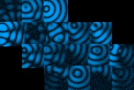

# [S=3_1Pos_2Mosaic_T=2=Z=3_CH=2.czi](https://zenodo.org/record/7015307/files/S%3D3_1Pos_2Mosaic_T%3D2%3DZ%3D3_CH%3D2.czi) report
 - **Autostitch** = true
 - ZeissCZIReader v6.14.0
 - ZeissQuickStartCZIReader v0.1.8-SNAPSHOT

# Images 

| Series            | Quick Start Reader | Size | Original Reader | Size | #Diffs |
|-------------------|--------------------|------|-----------------|------|--------|
| Read time (all)   |159 ms|------|198 ms|------|--------|
|0||X:1178 Y:486 C:2 Z:3 T:2||X:1178 Y:486 C:2 Z:3 T:2|0|
|1||X:589 Y:243 C:2 Z:3 T:2||X:589 Y:243 C:2 Z:3 T:2|0|
|2||X:256 Y:256 C:2 Z:3 T:2||X:256 Y:256 C:2 Z:3 T:2|0|
|3||X:1408 Y:947 C:2 Z:3 T:2||X:1408 Y:947 C:2 Z:3 T:2|0|
|4||X:704 Y:473 C:2 Z:3 T:2||X:704 Y:473 C:2 Z:3 T:2|0|

# Metadata

|  Method            | Parameters       | Quick Start Reader | Original Reader | Delta  |
| -------------------|------------------|--------------------|-----------------|------- |
| Initialization     |                  |23 ms|31 ms|        |
| Reader Size (Mb)     |                  |2.01|2.99|        |
| getStageLabelName| Image 0 | TR1| Scene position #0| |
| getStageLabelX| Image 0 | 38212.800 um | 38397.296 um | 184.496 um |
| getStageLabelName| Image 1 | TR1| Scene position #1| |
| getStageLabelX| Image 1 | 38212.800 um | 38397.296 um | 184.496 um |
| getPixelsPhysicalSizeX| Image 1 | 0.800 um | 0.400 um | 0.400 um |
| getPixelsPhysicalSizeY| Image 1 | 0.800 um | 0.400 um | 0.400 um |
| getStageLabelName| Image 2 | P1| Scene position #2| |
| getStageLabelY| Image 2 | 13065.918 um | 13020.000 um | 45.918 um |
| getStageLabelName| Image 3 | TR2| Scene position #3| |
| getStageLabelX| Image 3 | 38449.200 um | 38679.412 um | 230.212 um |
| getStageLabelY| Image 3 | 13167.918 um | 13260.298 um | 92.380 um |
| getStageLabelName| Image 4 | TR2| Scene position #4| |
| getStageLabelX| Image 4 | 38449.200 um | 38679.412 um | 230.212 um |
| getStageLabelY| Image 4 | 13167.918 um | 13260.298 um | 92.380 um |
| getPixelsPhysicalSizeX| Image 4 | 0.800 um | 0.400 um | 0.400 um |
| getPixelsPhysicalSizeY| Image 4 | 0.800 um | 0.400 um | 0.400 um |
| getPlanePositionX| Image 0 Plane 0 | 38212.800 um | 38397.296 um | 184.496 um |
| getPlanePositionX| Image 0 Plane 1 | 38212.800 um | 38397.296 um | 184.496 um |
| getPlanePositionX| Image 0 Plane 2 | 38212.800 um | 38397.296 um | 184.496 um |
| getPlanePositionX| Image 0 Plane 3 | 38212.800 um | 38397.296 um | 184.496 um |
| getPlanePositionX| Image 0 Plane 4 | 38212.800 um | 38397.296 um | 184.496 um |
| getPlanePositionX| Image 0 Plane 5 | 38212.800 um | 38397.296 um | 184.496 um |
| getPlanePositionX| Image 0 Plane 6 | 38212.800 um | 38397.296 um | 184.496 um |
| getPlanePositionX| Image 0 Plane 7 | 38212.800 um | 38397.296 um | 184.496 um |
| getPlanePositionX| Image 0 Plane 8 | 38212.800 um | 38397.296 um | 184.496 um |
| getPlanePositionX| Image 0 Plane 9 | 38212.800 um | 38397.296 um | 184.496 um |
| getPlanePositionX| Image 0 Plane 10 | 38212.800 um | 38397.296 um | 184.496 um |
| getPlanePositionX| Image 0 Plane 11 | 38212.800 um | 38397.296 um | 184.496 um |
| getPlanePositionX| Image 1 Plane 0 | 38212.800 um | 38397.296 um | 184.496 um |
| getPlaneDeltaT| Image 1 Plane 1 |  0.615 s |  0.544 s | 0.071 s |
| getPlanePositionX| Image 1 Plane 1 | 38212.800 um | 38397.296 um | 184.496 um |
| getPlaneDeltaT| Image 1 Plane 2 |  0.852 s |  0.544 s | 0.308 s |
| getPlanePositionX| Image 1 Plane 2 | 38212.800 um | 38397.296 um | 184.496 um |
| getPlaneDeltaT| Image 1 Plane 3 |  0.896 s |  0.544 s | 0.352 s |
| getPlanePositionX| Image 1 Plane 3 | 38212.800 um | 38397.296 um | 184.496 um |
| getPlaneDeltaT| Image 1 Plane 4 |  1.131 s |  0.544 s | 0.587 s |
| getPlanePositionX| Image 1 Plane 4 | 38212.800 um | 38397.296 um | 184.496 um |
| getPlaneDeltaT| Image 1 Plane 5 |  1.178 s |  0.544 s | 0.634 s |
| getPlanePositionX| Image 1 Plane 5 | 38212.800 um | 38397.296 um | 184.496 um |
| getPlanePositionX| Image 1 Plane 6 | 38212.800 um | 38397.296 um | 184.496 um |
| getPlaneDeltaT| Image 1 Plane 7 |  34.007 s |  33.956 s | 0.051 s |
| getPlanePositionX| Image 1 Plane 7 | 38212.800 um | 38397.296 um | 184.496 um |
| getPlaneDeltaT| Image 1 Plane 8 |  34.250 s |  33.956 s | 0.294 s |
| getPlanePositionX| Image 1 Plane 8 | 38212.800 um | 38397.296 um | 184.496 um |
| getPlaneDeltaT| Image 1 Plane 9 |  34.302 s |  33.956 s | 0.346 s |
| getPlanePositionX| Image 1 Plane 9 | 38212.800 um | 38397.296 um | 184.496 um |
| getPlaneDeltaT| Image 1 Plane 10 |  34.547 s |  33.956 s | 0.591 s |
| getPlanePositionX| Image 1 Plane 10 | 38212.800 um | 38397.296 um | 184.496 um |
| getPlaneDeltaT| Image 1 Plane 11 |  34.601 s |  33.956 s | 0.645 s |
| getPlanePositionX| Image 1 Plane 11 | 38212.800 um | 38397.296 um | 184.496 um |
| getPlanePositionY| Image 2 Plane 0 | 13065.918 um | 13020.000 um | 45.918 um |
| getPlanePositionY| Image 2 Plane 1 | 13065.918 um | 13020.000 um | 45.918 um |
| getPlanePositionY| Image 2 Plane 2 | 13065.918 um | 13020.000 um | 45.918 um |
| getPlanePositionY| Image 2 Plane 3 | 13065.918 um | 13020.000 um | 45.918 um |
| getPlanePositionY| Image 2 Plane 4 | 13065.918 um | 13020.000 um | 45.918 um |
| getPlanePositionY| Image 2 Plane 5 | 13065.918 um | 13020.000 um | 45.918 um |
| getPlanePositionY| Image 2 Plane 6 | 13065.918 um | 13020.000 um | 45.918 um |
| getPlanePositionY| Image 2 Plane 7 | 13065.918 um | 13020.000 um | 45.918 um |
| getPlanePositionY| Image 2 Plane 8 | 13065.918 um | 13020.000 um | 45.918 um |
| getPlanePositionY| Image 2 Plane 9 | 13065.918 um | 13020.000 um | 45.918 um |
| getPlanePositionY| Image 2 Plane 10 | 13065.918 um | 13020.000 um | 45.918 um |
| getPlanePositionY| Image 2 Plane 11 | 13065.918 um | 13020.000 um | 45.918 um |
| getPlanePositionX| Image 3 Plane 0 | 38449.200 um | 38679.412 um | 230.212 um |
| getPlanePositionY| Image 3 Plane 0 | 13167.918 um | 13260.298 um | 92.380 um |
| getPlanePositionX| Image 3 Plane 1 | 38449.200 um | 38679.412 um | 230.212 um |
| getPlanePositionY| Image 3 Plane 1 | 13167.918 um | 13260.298 um | 92.380 um |
| getPlanePositionX| Image 3 Plane 2 | 38449.200 um | 38679.412 um | 230.212 um |
| getPlanePositionY| Image 3 Plane 2 | 13167.918 um | 13260.298 um | 92.380 um |
| getPlanePositionX| Image 3 Plane 3 | 38449.200 um | 38679.412 um | 230.212 um |
| getPlanePositionY| Image 3 Plane 3 | 13167.918 um | 13260.298 um | 92.380 um |
| getPlanePositionX| Image 3 Plane 4 | 38449.200 um | 38679.412 um | 230.212 um |
| getPlanePositionY| Image 3 Plane 4 | 13167.918 um | 13260.298 um | 92.380 um |
| getPlanePositionX| Image 3 Plane 5 | 38449.200 um | 38679.412 um | 230.212 um |
| getPlanePositionY| Image 3 Plane 5 | 13167.918 um | 13260.298 um | 92.380 um |
| getPlanePositionX| Image 3 Plane 6 | 38449.200 um | 38679.412 um | 230.212 um |
| getPlanePositionY| Image 3 Plane 6 | 13167.918 um | 13260.298 um | 92.380 um |
| getPlanePositionX| Image 3 Plane 7 | 38449.200 um | 38679.412 um | 230.212 um |
| getPlanePositionY| Image 3 Plane 7 | 13167.918 um | 13260.298 um | 92.380 um |
| getPlanePositionX| Image 3 Plane 8 | 38449.200 um | 38679.412 um | 230.212 um |
| getPlanePositionY| Image 3 Plane 8 | 13167.918 um | 13260.298 um | 92.380 um |
| getPlanePositionX| Image 3 Plane 9 | 38449.200 um | 38679.412 um | 230.212 um |
| getPlanePositionY| Image 3 Plane 9 | 13167.918 um | 13260.298 um | 92.380 um |
| getPlanePositionX| Image 3 Plane 10 | 38449.200 um | 38679.412 um | 230.212 um |
| getPlanePositionY| Image 3 Plane 10 | 13167.918 um | 13260.298 um | 92.380 um |
| getPlanePositionX| Image 3 Plane 11 | 38449.200 um | 38679.412 um | 230.212 um |
| getPlanePositionY| Image 3 Plane 11 | 13167.918 um | 13260.298 um | 92.380 um |
| getPlaneDeltaT| Image 4 Plane 0 |  13.651 s |  0.544 s | 13.107 s |
| getPlanePositionX| Image 4 Plane 0 | 38449.200 um | 38679.412 um | 230.212 um |
| getPlanePositionY| Image 4 Plane 0 | 13167.918 um | 13260.298 um | 92.380 um |
| getPlaneDeltaT| Image 4 Plane 1 |  13.708 s |  0.544 s | 13.164 s |
| getPlanePositionX| Image 4 Plane 1 | 38449.200 um | 38679.412 um | 230.212 um |
| getPlanePositionY| Image 4 Plane 1 | 13167.918 um | 13260.298 um | 92.380 um |
| getPlaneDeltaT| Image 4 Plane 2 |  13.960 s |  0.544 s | 13.416 s |
| getPlanePositionX| Image 4 Plane 2 | 38449.200 um | 38679.412 um | 230.212 um |
| getPlanePositionY| Image 4 Plane 2 | 13167.918 um | 13260.298 um | 92.380 um |
| getPlaneDeltaT| Image 4 Plane 3 |  14.010 s |  0.544 s | 13.466 s |
| getPlanePositionX| Image 4 Plane 3 | 38449.200 um | 38679.412 um | 230.212 um |
| getPlanePositionY| Image 4 Plane 3 | 13167.918 um | 13260.298 um | 92.380 um |
| getPlaneDeltaT| Image 4 Plane 4 |  14.248 s |  0.544 s | 13.704 s |
| getPlanePositionX| Image 4 Plane 4 | 38449.200 um | 38679.412 um | 230.212 um |
| getPlanePositionY| Image 4 Plane 4 | 13167.918 um | 13260.298 um | 92.380 um |
| getPlaneDeltaT| Image 4 Plane 5 |  14.301 s |  0.544 s | 13.757 s |
| getPlanePositionX| Image 4 Plane 5 | 38449.200 um | 38679.412 um | 230.212 um |
| getPlanePositionY| Image 4 Plane 5 | 13167.918 um | 13260.298 um | 92.380 um |
| getPlaneDeltaT| Image 4 Plane 6 |  47.135 s |  33.956 s | 13.179 s |
| getPlanePositionX| Image 4 Plane 6 | 38449.200 um | 38679.412 um | 230.212 um |
| getPlanePositionY| Image 4 Plane 6 | 13167.918 um | 13260.298 um | 92.380 um |
| getPlaneDeltaT| Image 4 Plane 7 |  47.185 s |  33.956 s | 13.229 s |
| getPlanePositionX| Image 4 Plane 7 | 38449.200 um | 38679.412 um | 230.212 um |
| getPlanePositionY| Image 4 Plane 7 | 13167.918 um | 13260.298 um | 92.380 um |
| getPlaneDeltaT| Image 4 Plane 8 |  47.428 s |  33.956 s | 13.472 s |
| getPlanePositionX| Image 4 Plane 8 | 38449.200 um | 38679.412 um | 230.212 um |
| getPlanePositionY| Image 4 Plane 8 | 13167.918 um | 13260.298 um | 92.380 um |
| getPlaneDeltaT| Image 4 Plane 9 |  47.488 s |  33.956 s | 13.532 s |
| getPlanePositionX| Image 4 Plane 9 | 38449.200 um | 38679.412 um | 230.212 um |
| getPlanePositionY| Image 4 Plane 9 | 13167.918 um | 13260.298 um | 92.380 um |
| getPlaneDeltaT| Image 4 Plane 10 |  47.730 s |  33.956 s | 13.774 s |
| getPlanePositionX| Image 4 Plane 10 | 38449.200 um | 38679.412 um | 230.212 um |
| getPlanePositionY| Image 4 Plane 10 | 13167.918 um | 13260.298 um | 92.380 um |
| getPlaneDeltaT| Image 4 Plane 11 |  47.780 s |  33.956 s | 13.824 s |
| getPlanePositionX| Image 4 Plane 11 | 38449.200 um | 38679.412 um | 230.212 um |
| getPlanePositionY| Image 4 Plane 11 | 13167.918 um | 13260.298 um | 92.380 um |
