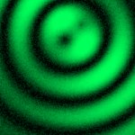
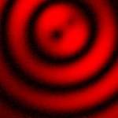
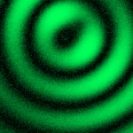
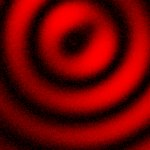
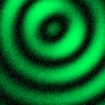
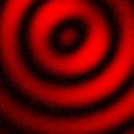

# [S=3_CH=2.czi](https://zenodo.org/record/7015307/files/S%3D3_CH%3D2.czi) report
 - **Autostitch** = true
 - ZeissCZIReader v6.14.0
 - ZeissQuickStartCZIReader v0.1.8-SNAPSHOT

# Images 

| Series            | Quick Start Reader | Size | Original Reader | Size | #Diffs |
|-------------------|--------------------|------|-----------------|------|--------|
| Read time (all)   |60 ms|------|66 ms|------|--------|
|0||X:256 Y:256 C:2 Z:1 T:1||X:256 Y:256 C:2 Z:1 T:1|0|
|1||X:256 Y:256 C:2 Z:1 T:1||X:256 Y:256 C:2 Z:1 T:1|0|
|2||X:256 Y:256 C:2 Z:1 T:1||X:256 Y:256 C:2 Z:1 T:1|0|

# Metadata

|  Method            | Parameters       | Quick Start Reader | Original Reader | Delta  |
| -------------------|------------------|--------------------|-----------------|------- |
| Initialization     |                  |17 ms|17 ms|        |
| Reader Size (Mb)     |                  |2.00|2.52|        |
| getStageLabelName| Image 0 | P1| Scene position #0| |
| getStageLabelX| Image 0 | 26987.200 um | 13500.000 um | 13487.200 um |
| getStageLabelY| Image 0 | 34987.200 um | 17500.000 um | 17487.200 um |
| getStageLabelName| Image 1 | P1| Scene position #1| |
| getStageLabelX| Image 1 | 35987.200 um | 22500.000 um | 13487.200 um |
| getStageLabelY| Image 1 | 34987.200 um | 17500.000 um | 17487.200 um |
| getStageLabelName| Image 2 | P1| Scene position #2| |
| getStageLabelX| Image 2 | 44987.200 um | 31500.000 um | 13487.200 um |
| getStageLabelY| Image 2 | 34987.200 um | 17500.000 um | 17487.200 um |
| getPlanePositionX| Image 0 Plane 0 | 26987.200 um | 13500.000 um | 13487.200 um |
| getPlanePositionY| Image 0 Plane 0 | 34987.200 um | 17500.000 um | 17487.200 um |
| getPlanePositionX| Image 0 Plane 1 | 26987.200 um | 13500.000 um | 13487.200 um |
| getPlanePositionY| Image 0 Plane 1 | 34987.200 um | 17500.000 um | 17487.200 um |
| getPlanePositionX| Image 1 Plane 0 | 35987.200 um | 22500.000 um | 13487.200 um |
| getPlanePositionY| Image 1 Plane 0 | 34987.200 um | 17500.000 um | 17487.200 um |
| getPlanePositionX| Image 1 Plane 1 | 35987.200 um | 22500.000 um | 13487.200 um |
| getPlanePositionY| Image 1 Plane 1 | 34987.200 um | 17500.000 um | 17487.200 um |
| getPlanePositionX| Image 2 Plane 0 | 44987.200 um | 31500.000 um | 13487.200 um |
| getPlanePositionY| Image 2 Plane 0 | 34987.200 um | 17500.000 um | 17487.200 um |
| getPlanePositionX| Image 2 Plane 1 | 44987.200 um | 31500.000 um | 13487.200 um |
| getPlanePositionY| Image 2 Plane 1 | 34987.200 um | 17500.000 um | 17487.200 um |
