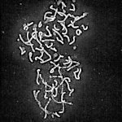
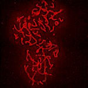

|  Method            | Parameters       | Quick Start Reader | Original Reader | Delta  |
| -------------------|------------------|--------------------|-----------------|------- |
| Initialization     |                  |6 ms|9 ms|        |
| Reader Size (Mb)     |                  |0.17|0.25|        |
# [SIM Synapsed homologs of meiotic mouse chromosomes full FOV.czi](https://zenodo.org/record/6865142/files/SIM%20Synapsed%20homologs%20of%20meiotic%20mouse%20chromosomes%20full%20FOV.czi) report
 - **Autostitch** = true
 - ZeissCZIReader v7.0.0
 - ZeissQuickStartCZIReader v0.2.2-SNAPSHOT

# Images 

| Series            | Quick Start Reader | Size | Original Reader | Size | #Diffs |
|-------------------|--------------------|------|-----------------|------|--------|
| Read time (all)   |180 ms|------|197 ms|------|--------|
|0||X:2560 Y:2560 C:1 Z:1 T:1||X:2560 Y:2560 C:1 Z:1 T:1|0|

# Metadata

