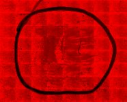

|  Method            | Parameters       | Quick Start Reader | Original Reader | Delta  |
| -------------------|------------------|--------------------|-----------------|------- |
| Initialization     |                  |18 ms|13 ms|        |
| Reader Size (Mb)     |                  |1.16|1.48|        |
| getStageLabelName| Image 0 | TR1| Scene position #0| |
| getStageLabelX| Image 0 | 46010.150 um | 53881.420 um | 7871.270 um |
| getStageLabelY| Image 0 | 16244.414 um | 22559.736 um | 6315.322 um |
| getPlanePositionX| Image 0 Plane 0 | 46010.150 um | 53881.420 um | 7871.270 um |
| getPlanePositionY| Image 0 Plane 0 | 16244.414 um | 22559.736 um | 6315.322 um |
# [Skin-Positive.czi](https://zenodo.org/record/7884760/files/Skin-Positive.czi) report
 - **Autostitch** = true
 - ZeissCZIReader v6.14.0
 - ZeissQuickStartCZIReader v0.2.2-SNAPSHOT

# Images 

| Series            | Quick Start Reader | Size | Original Reader | Size | #Diffs |
|-------------------|--------------------|------|-----------------|------|--------|
| Read time (all)   |23923 ms|------|21383 ms|------|--------|
|0||X:20090 Y:16119 C:3 Z:1 T:1||X:20090 Y:16119 C:3 Z:1 T:1|0|

# Metadata

