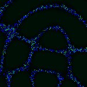
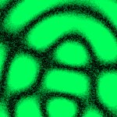

# [T=1_CH=2.czi](https://zenodo.org/record/7015307/files/T%3D1_CH%3D2.czi) report
 - **Autostitch** = true
 - ZeissCZIReader v6.13.0
 - ZeissQuickStartCZIReader v0.1.4-SNAPSHOT

# Images 

| Series            | Quick Start Reader | Size | Original Reader | Size |
|-------------------|--------------------|------|-----------------|------|
| Read time (all)   |44 ms|------|64 ms|------|
|0||X:256 Y:256 C:2 Z:1 T:1||X:256 Y:256 C:2 Z:1 T:1|

# Metadata

|  Method            | Parameters       | Quick Start Reader | Original Reader | Delta  |
| -------------------|------------------|--------------------|-----------------|------- |
| Initialization     |                  |17 ms|27 ms|        |
| getStageLabelName| Image 0 | Current-Position| Scene position #0| |
