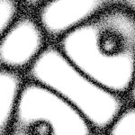

# [T=1_Z=5_CH=1.czi](https://zenodo.org/record/7015307/files/T%3D1_Z%3D5_CH%3D1.czi) report
 - **Autostitch** = true
 - ZeissCZIReader v6.14.0
 - ZeissQuickStartCZIReader v0.1.8-SNAPSHOT

# Images 

| Series            | Quick Start Reader | Size | Original Reader | Size | #Diffs |
|-------------------|--------------------|------|-----------------|------|--------|
| Read time (all)   |44 ms|------|50 ms|------|--------|
|0||X:256 Y:256 C:1 Z:5 T:1||X:256 Y:256 C:1 Z:5 T:1|0|

# Metadata

|  Method            | Parameters       | Quick Start Reader | Original Reader | Delta  |
| -------------------|------------------|--------------------|-----------------|------- |
| Initialization     |                  |17 ms|16 ms|        |
| Reader Size (Mb)     |                  |1.97|2.58|        |
| getPlaneDeltaT| Image 0 Plane 1 |  0.728 s |  0.737 s | 0.009 s |
| getPlaneDeltaT| Image 0 Plane 2 |  1.055 s |  1.061 s | 0.006 s |
| getPlaneDeltaT| Image 0 Plane 3 |  1.383 s |  1.384 s | 0.002 s |
