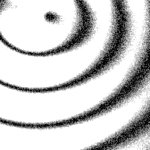

|  Method            | Parameters       | Quick Start Reader | Original Reader | Delta  |
| -------------------|------------------|--------------------|-----------------|------- |
| Initialization     |                  |20 ms|26 ms|        |
| Reader Size (Mb)     |                  |1.96|2.53|        |
# [T=2_CH=1.czi](https://zenodo.org/record/7015307/files/T%3D2_CH%3D1.czi) report
 - **Autostitch** = false
 - ZeissCZIReader v7.0.0
 - ZeissQuickStartCZIReader v0.2.2-SNAPSHOT

# Images 

| Series            | Quick Start Reader | Size | Original Reader | Size | #Diffs |
|-------------------|--------------------|------|-----------------|------|--------|
| Read time (all)   |45 ms|------|57 ms|------|--------|
|0||X:256 Y:256 C:1 Z:1 T:2||X:256 Y:256 C:1 Z:1 T:2|0|

# Metadata

