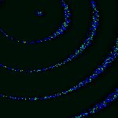

# [T=2_CH=1.czi](https://zenodo.org/record/7015307/files/T%3D2_CH%3D1.czi) report
 - **Autostitch** = true
 - ZeissCZIReader v6.13.0
 - ZeissQuickStartCZIReader v0.1.4-SNAPSHOT

# Images 

| Series            | Quick Start Reader | Size | Original Reader | Size |
|-------------------|--------------------|------|-----------------|------|
| Read time (all)   |41 ms|------|57 ms|------|
|0||X:256 Y:256 C:1 Z:1 T:2||X:256 Y:256 C:1 Z:1 T:2|

# Metadata

|  Method            | Parameters       | Quick Start Reader | Original Reader | Delta  |
| -------------------|------------------|--------------------|-----------------|------- |
| Initialization     |                  |17 ms|27 ms|        |
| getPlaneDeltaT| Image 0 Plane 1 |  0.317 s |  0.403 s | 0.086 s |
