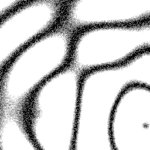

# [T=2_Z=5_CH=1.czi](https://zenodo.org/record/7015307/files/T%3D2_Z%3D5_CH%3D1.czi) report
 - **Autostitch** = false
 - ZeissCZIReader v6.14.0
 - ZeissQuickStartCZIReader v0.1.8-SNAPSHOT

# Images 

| Series            | Quick Start Reader | Size | Original Reader | Size | #Diffs |
|-------------------|--------------------|------|-----------------|------|--------|
| Read time (all)   |43 ms|------|46 ms|------|--------|
|0||X:256 Y:256 C:1 Z:5 T:2||X:256 Y:256 C:1 Z:5 T:2|0|

# Metadata

|  Method            | Parameters       | Quick Start Reader | Original Reader | Delta  |
| -------------------|------------------|--------------------|-----------------|------- |
| Initialization     |                  |17 ms|16 ms|        |
| Reader Size (Mb)     |                  |1.97|2.59|        |
| getPlaneDeltaT| Image 0 Plane 1 |  0.710 s |  0.709 s | 0.001 s |
| getPlaneDeltaT| Image 0 Plane 2 |  1.035 s |  1.049 s | 0.014 s |
| getPlaneDeltaT| Image 0 Plane 3 |  1.359 s |  1.374 s | 0.015 s |
| getPlaneDeltaT| Image 0 Plane 6 |  2.335 s |  2.348 s | 0.014 s |
| getPlaneDeltaT| Image 0 Plane 7 |  2.659 s |  2.688 s | 0.029 s |
| getPlaneDeltaT| Image 0 Plane 8 |  2.984 s |  3.011 s | 0.027 s |
| getPlaneDeltaT| Image 0 Plane 9 |  3.308 s |  3.336 s | 0.028 s |
