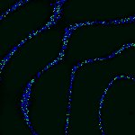
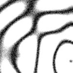

# [T=2_Z=5_CH=1.czi](https://zenodo.org/record/7015307/files/T%3D2_Z%3D5_CH%3D1.czi) report
 - **Autostitch** = true
 - ZeissCZIReader v6.14.0
 - ZeissQuickStartCZIReader v0.1.8-SNAPSHOT

# Images 

| Series            | Quick Start Reader | Size | Original Reader | Size | #Diffs |
|-------------------|--------------------|------|-----------------|------|--------|
| Read time (all)   |38 ms|------|45 ms|------|--------|
|0||X:256 Y:256 C:1 Z:5 T:2||X:256 Y:256 C:1 Z:5 T:2|0|

# Metadata

|  Method            | Parameters       | Quick Start Reader | Original Reader | Delta  |
| -------------------|------------------|--------------------|-----------------|------- |
| Initialization     |                  |16 ms|15 ms|        |
| Reader Size (Mb)     |                  |1.97|2.59|        |
| getStageLabelX| Image 0 | 98987.200 um | 49500.000 um | 49487.200 um |
| getStageLabelY| Image 0 | 70987.200 um | 35500.000 um | 35487.200 um |
| getPlanePositionX| Image 0 Plane 0 | 98987.200 um | 49500.000 um | 49487.200 um |
| getPlanePositionY| Image 0 Plane 0 | 70987.200 um | 35500.000 um | 35487.200 um |
| getPlanePositionX| Image 0 Plane 1 | 98987.200 um | 49500.000 um | 49487.200 um |
| getPlanePositionY| Image 0 Plane 1 | 70987.200 um | 35500.000 um | 35487.200 um |
| getPlanePositionX| Image 0 Plane 2 | 98987.200 um | 49500.000 um | 49487.200 um |
| getPlanePositionY| Image 0 Plane 2 | 70987.200 um | 35500.000 um | 35487.200 um |
| getPlanePositionX| Image 0 Plane 3 | 98987.200 um | 49500.000 um | 49487.200 um |
| getPlanePositionY| Image 0 Plane 3 | 70987.200 um | 35500.000 um | 35487.200 um |
| getPlanePositionX| Image 0 Plane 4 | 98987.200 um | 49500.000 um | 49487.200 um |
| getPlanePositionY| Image 0 Plane 4 | 70987.200 um | 35500.000 um | 35487.200 um |
| getPlanePositionX| Image 0 Plane 5 | 98987.200 um | 49500.000 um | 49487.200 um |
| getPlanePositionY| Image 0 Plane 5 | 70987.200 um | 35500.000 um | 35487.200 um |
| getPlanePositionX| Image 0 Plane 6 | 98987.200 um | 49500.000 um | 49487.200 um |
| getPlanePositionY| Image 0 Plane 6 | 70987.200 um | 35500.000 um | 35487.200 um |
| getPlanePositionX| Image 0 Plane 7 | 98987.200 um | 49500.000 um | 49487.200 um |
| getPlanePositionY| Image 0 Plane 7 | 70987.200 um | 35500.000 um | 35487.200 um |
| getPlanePositionX| Image 0 Plane 8 | 98987.200 um | 49500.000 um | 49487.200 um |
| getPlanePositionY| Image 0 Plane 8 | 70987.200 um | 35500.000 um | 35487.200 um |
| getPlanePositionX| Image 0 Plane 9 | 98987.200 um | 49500.000 um | 49487.200 um |
| getPlanePositionY| Image 0 Plane 9 | 70987.200 um | 35500.000 um | 35487.200 um |
