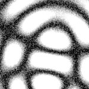
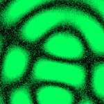

# [T=3_CH=2.czi](https://zenodo.org/record/7015307/files/T%3D3_CH%3D2.czi) report
 - **Autostitch** = false
 - ZeissCZIReader v6.14.0
 - ZeissQuickStartCZIReader v0.1.7-SNAPSHOT

# Images 

| Series            | Quick Start Reader | Size | Original Reader | Size |
|-------------------|--------------------|------|-----------------|------|
| Read time (all)   |41 ms|------|47 ms|------|
|0||X:256 Y:256 C:2 Z:1 T:3||X:256 Y:256 C:2 Z:1 T:3|

# Metadata

|  Method            | Parameters       | Quick Start Reader | Original Reader | Delta  |
| -------------------|------------------|--------------------|-----------------|------- |
| Initialization     |                  |17 ms|17 ms|        |
| Reader Size (Mb)     |                  |1.98|2.56|        |
| getStageLabelName| Image 0 | Current-Position| Scene position #0| |
| getPlaneDeltaT| Image 0 Plane 2 |  0.460 s |  0.572 s | 0.112 s |
| getPlaneDeltaT| Image 0 Plane 3 |  0.628 s |  0.741 s | 0.113 s |
| getPlaneDeltaT| Image 0 Plane 4 |  0.686 s |  0.912 s | 0.226 s |
| getPlaneDeltaT| Image 0 Plane 5 |  0.855 s |  1.081 s | 0.226 s |
