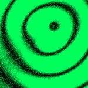
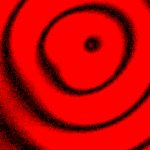

# [T=3_Z=5_CH=2.czi](https://zenodo.org/record/7015307/files/T%3D3_Z%3D5_CH%3D2.czi) report
 - **Autostitch** = false
 - ZeissCZIReader v6.14.0
 - ZeissQuickStartCZIReader v0.1.8-SNAPSHOT

# Images 

| Series            | Quick Start Reader | Size | Original Reader | Size | #Diffs |
|-------------------|--------------------|------|-----------------|------|--------|
| Read time (all)   |57 ms|------|74 ms|------|--------|
|0||X:256 Y:256 C:2 Z:5 T:3||X:256 Y:256 C:2 Z:5 T:3|0|

# Metadata

|  Method            | Parameters       | Quick Start Reader | Original Reader | Delta  |
| -------------------|------------------|--------------------|-----------------|------- |
| Initialization     |                  |24 ms|24 ms|        |
| Reader Size (Mb)     |                  |1.99|2.63|        |
| getStageLabelName| Image 0 | Current-Position| Scene position #0| |
| getPlaneDeltaT| Image 0 Plane 2 |  0.917 s |  0.941 s | 0.024 s |
| getPlaneDeltaT| Image 0 Plane 3 |  1.103 s |  1.111 s | 0.008 s |
| getPlaneDeltaT| Image 0 Plane 4 |  1.420 s |  1.436 s | 0.016 s |
| getPlaneDeltaT| Image 0 Plane 5 |  1.605 s |  1.607 s | 0.003 s |
| getPlaneDeltaT| Image 0 Plane 6 |  1.922 s |  1.931 s | 0.009 s |
| getPlaneDeltaT| Image 0 Plane 7 |  2.106 s |  2.103 s | 0.003 s |
| getPlaneDeltaT| Image 0 Plane 10 |  2.941 s |  2.947 s | 0.006 s |
| getPlaneDeltaT| Image 0 Plane 11 |  3.121 s |  3.131 s | 0.010 s |
| getPlaneDeltaT| Image 0 Plane 12 |  3.443 s |  3.456 s | 0.013 s |
| getPlaneDeltaT| Image 0 Plane 13 |  3.622 s |  3.640 s | 0.018 s |
| getPlaneDeltaT| Image 0 Plane 14 |  3.946 s |  3.979 s | 0.034 s |
| getPlaneDeltaT| Image 0 Plane 15 |  4.124 s |  4.150 s | 0.026 s |
| getPlaneDeltaT| Image 0 Plane 16 |  4.448 s |  4.488 s | 0.040 s |
| getPlaneDeltaT| Image 0 Plane 17 |  4.626 s |  4.672 s | 0.046 s |
| getPlaneDeltaT| Image 0 Plane 18 |  4.950 s |  4.983 s | 0.033 s |
| getPlaneDeltaT| Image 0 Plane 19 |  5.128 s |  5.155 s | 0.028 s |
| getPlaneDeltaT| Image 0 Plane 22 |  5.969 s |  5.981 s | 0.012 s |
| getPlaneDeltaT| Image 0 Plane 23 |  6.142 s |  6.152 s | 0.010 s |
| getPlaneDeltaT| Image 0 Plane 24 |  6.471 s |  6.463 s | 0.008 s |
| getPlaneDeltaT| Image 0 Plane 25 |  6.644 s |  6.634 s | 0.010 s |
| getPlaneDeltaT| Image 0 Plane 26 |  6.974 s |  6.959 s | 0.015 s |
| getPlaneDeltaT| Image 0 Plane 27 |  7.145 s |  7.142 s | 0.003 s |
| getPlaneDeltaT| Image 0 Plane 28 |  7.476 s |  7.479 s | 0.003 s |
| getPlaneDeltaT| Image 0 Plane 29 |  7.647 s |  7.663 s | 0.016 s |
