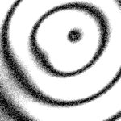

# [T=3_Z=5_CH=2.czi](https://zenodo.org/record/7015307/files/T%3D3_Z%3D5_CH%3D2.czi) report
 - **Autostitch** = true
 - ZeissCZIReader v6.14.0
 - ZeissQuickStartCZIReader v0.1.7-SNAPSHOT

# Images 

| Series            | Quick Start Reader | Size | Original Reader | Size |
|-------------------|--------------------|------|-----------------|------|
| Read time (all)   |60 ms|------|70 ms|------|
|0||X:256 Y:256 C:2 Z:5 T:3||X:256 Y:256 C:2 Z:5 T:3|

# Metadata

|  Method            | Parameters       | Quick Start Reader | Original Reader | Delta  |
| -------------------|------------------|--------------------|-----------------|------- |
| Initialization     |                  |26 ms|37 ms|        |
| Reader Size (Mb)     |                  |1.99|2.63|        |
| getStageLabelName| Image 0 | Current-Position| Scene position #0| |
| getPlaneDeltaT| Image 0 Plane 2 |  0.817 s |  0.941 s | 0.124 s |
| getPlaneDeltaT| Image 0 Plane 3 |  1.002 s |  1.111 s | 0.109 s |
| getPlaneDeltaT| Image 0 Plane 4 |  1.219 s |  1.436 s | 0.217 s |
| getPlaneDeltaT| Image 0 Plane 5 |  1.404 s |  1.607 s | 0.203 s |
| getPlaneDeltaT| Image 0 Plane 6 |  1.620 s |  1.931 s | 0.311 s |
| getPlaneDeltaT| Image 0 Plane 7 |  1.805 s |  2.103 s | 0.298 s |
| getPlaneDeltaT| Image 0 Plane 8 |  2.022 s |  2.424 s | 0.402 s |
| getPlaneDeltaT| Image 0 Plane 9 |  2.207 s |  2.608 s | 0.401 s |
| getPlaneDeltaT| Image 0 Plane 10 |  2.099 s |  2.947 s | 0.848 s |
| getPlaneDeltaT| Image 0 Plane 11 |  2.281 s |  3.131 s | 0.850 s |
| getPlaneDeltaT| Image 0 Plane 12 |  2.501 s |  3.456 s | 0.955 s |
| getPlaneDeltaT| Image 0 Plane 13 |  2.682 s |  3.640 s | 0.958 s |
| getPlaneDeltaT| Image 0 Plane 14 |  2.903 s |  3.979 s | 1.076 s |
| getPlaneDeltaT| Image 0 Plane 15 |  3.083 s |  4.150 s | 1.067 s |
| getPlaneDeltaT| Image 0 Plane 16 |  3.304 s |  4.488 s | 1.184 s |
| getPlaneDeltaT| Image 0 Plane 17 |  3.485 s |  4.672 s | 1.187 s |
| getPlaneDeltaT| Image 0 Plane 18 |  3.706 s |  4.983 s | 1.277 s |
| getPlaneDeltaT| Image 0 Plane 19 |  3.886 s |  5.155 s | 1.269 s |
| getPlaneDeltaT| Image 0 Plane 20 |  3.783 s |  5.467 s | 1.684 s |
| getPlaneDeltaT| Image 0 Plane 21 |  3.960 s |  5.640 s | 1.680 s |
| getPlaneDeltaT| Image 0 Plane 22 |  4.185 s |  5.981 s | 1.796 s |
| getPlaneDeltaT| Image 0 Plane 23 |  4.362 s |  6.152 s | 1.790 s |
| getPlaneDeltaT| Image 0 Plane 24 |  4.587 s |  6.463 s | 1.876 s |
| getPlaneDeltaT| Image 0 Plane 25 |  4.763 s |  6.634 s | 1.871 s |
| getPlaneDeltaT| Image 0 Plane 26 |  4.988 s |  6.959 s | 1.971 s |
| getPlaneDeltaT| Image 0 Plane 27 |  5.165 s |  7.142 s | 1.977 s |
| getPlaneDeltaT| Image 0 Plane 28 |  5.390 s |  7.479 s | 2.089 s |
| getPlaneDeltaT| Image 0 Plane 29 |  5.566 s |  7.663 s | 2.097 s |
