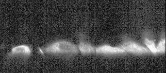

# [TL-03.czi](F:\czis\TL-03.czi) report
 - **Autostitch** = false
 - ZeissCZIReader v6.14.0
 - ZeissQuickStartCZIReader v0.2.1-SNAPSHOT

# Images 

| Series            | Quick Start Reader | Size | Original Reader | Size | #Diffs |
|-------------------|--------------------|------|-----------------|------|--------|
| Read time (all)   |54480 ms|------|80485 ms|------|--------|
|0||X:1026 Y:450 C:2 Z:2001 T:300||X:1024 Y:450 C:2 Z:2001 T:300|51128|

# Metadata

|  Method            | Parameters       | Quick Start Reader | Original Reader | Delta  |
| -------------------|------------------|--------------------|-----------------|------- |
| Initialization     |                  |8629 ms|47309 ms|        |
| Reader Size (Mb)     |                  |627.98|1704.84|        |
| getPixelsSizeX| Image 0 | 1026| 1024| |
| getPlanePositionX| Image 0 Plane 1 | 3380.825 um | 3380.875 um | 0.050 um |
| getPlanePositionZ| Image 0 Plane 1 | -928.334 um | -928.391 um | 0.057 um |
| getPlanePositionZ| Image 0 Plane 2 | -928.134 um | -928.334 um | 0.200 um |
| getPlanePositionX| Image 0 Plane 3 | 3380.825 um | 3380.875 um | 0.050 um |
| getPlanePositionZ| Image 0 Plane 3 | -928.134 um | -928.391 um | 0.257 um |
| getPlanePositionZ| Image 0 Plane 4 | -927.934 um | -928.334 um | 0.400 um |
| getPlanePositionX| Image 0 Plane 5 | 3380.825 um | 3380.875 um | 0.050 um |
| getPlanePositionZ| Image 0 Plane 5 | -927.934 um | -928.391 um | 0.457 um |
| getPlanePositionZ| Image 0 Plane 6 | -927.734 um | -928.334 um | 0.600 um |
| getPlanePositionX| Image 0 Plane 7 | 3380.825 um | 3380.875 um | 0.050 um |
| getPlanePositionZ| Image 0 Plane 7 | -927.734 um | -928.391 um | 0.657 um |
| getPlanePositionZ| Image 0 Plane 8 | -927.534 um | -928.334 um | 0.800 um |
| getPlanePositionX| Image 0 Plane 9 | 3380.825 um | 3380.875 um | 0.050 um |
| getPlanePositionZ| Image 0 Plane 9 | -927.534 um | -928.391 um | 0.857 um |
| getPlanePositionZ| Image 0 Plane 10 | -927.334 um | -928.334 um | 1.000 um |
| getPlanePositionX| Image 0 Plane 11 | 3380.825 um | 3380.875 um | 0.050 um |
| getPlanePositionZ| Image 0 Plane 11 | -927.334 um | -928.391 um | 1.057 um |
| getPlanePositionZ| Image 0 Plane 12 | -927.134 um | -928.334 um | 1.200 um |
| getPlanePositionX| Image 0 Plane 13 | 3380.825 um | 3380.875 um | 0.050 um |
| getPlanePositionZ| Image 0 Plane 13 | -927.134 um | -928.391 um | 1.257 um |
| getPlanePositionZ| Image 0 Plane 14 | -926.934 um | -928.334 um | 1.400 um |
| getPlanePositionX| Image 0 Plane 15 | 3380.825 um | 3380.875 um | 0.050 um |
| getPlanePositionZ| Image 0 Plane 15 | -926.934 um | -928.391 um | 1.457 um |
| getPlanePositionZ| Image 0 Plane 16 | -926.734 um | -928.334 um | 1.600 um |
| getPlanePositionX| Image 0 Plane 17 | 3380.825 um | 3380.875 um | 0.050 um |
| getPlanePositionZ| Image 0 Plane 17 | -926.734 um | -928.391 um | 1.657 um |
| getPlanePositionZ| Image 0 Plane 18 | -926.534 um | -928.334 um | 1.800 um |
| getPlanePositionX| Image 0 Plane 19 | 3380.825 um | 3380.875 um | 0.050 um |
| getPlanePositionZ| Image 0 Plane 19 | -926.534 um | -928.391 um | 1.857 um |
| getPlanePositionZ| Image 0 Plane 20 | -926.334 um | -928.334 um | 2.000 um |
| getPlanePositionX| Image 0 Plane 21 | 3380.825 um | 3380.875 um | 0.050 um |
| getPlanePositionZ| Image 0 Plane 21 | -926.334 um | -928.391 um | 2.057 um |
| getPlanePositionZ| Image 0 Plane 22 | -926.134 um | -928.334 um | 2.200 um |
| getPlanePositionX| Image 0 Plane 23 | 3380.825 um | 3380.875 um | 0.050 um |
| getPlanePositionZ| Image 0 Plane 23 | -926.134 um | -928.391 um | 2.257 um |
| getPlanePositionZ| Image 0 Plane 24 | -925.934 um | -928.334 um | 2.400 um |
| getPlanePositionX| Image 0 Plane 25 | 3380.825 um | 3380.875 um | 0.050 um |
| getPlanePositionZ| Image 0 Plane 25 | -925.934 um | -928.391 um | 2.457 um |
| getPlanePositionZ| Image 0 Plane 26 | -925.734 um | -928.334 um | 2.600 um |
| getPlanePositionX| Image 0 Plane 27 | 3380.825 um | 3380.875 um | 0.050 um |
| getPlanePositionZ| Image 0 Plane 27 | -925.734 um | -928.391 um | 2.657 um |
| getPlanePositionZ| Image 0 Plane 28 | -925.534 um | -928.334 um | 2.800 um |
| getPlanePositionX| Image 0 Plane 29 | 3380.825 um | 3380.875 um | 0.050 um |
| getPlanePositionZ| Image 0 Plane 29 | -925.534 um | -928.391 um | 2.857 um |
| getPlanePositionZ| Image 0 Plane 30 | -925.334 um | -928.334 um | 3.000 um |
| getPlanePositionX| Image 0 Plane 31 | 3380.825 um | 3380.875 um | 0.050 um |
| getPlanePositionZ| Image 0 Plane 31 | -925.334 um | -928.391 um | 3.057 um |
| getPlanePositionZ| Image 0 Plane 32 | -925.134 um | -928.334 um | 3.200 um |
| getPlanePositionX| Image 0 Plane 33 | 3380.825 um | 3380.875 um | 0.050 um |
| getPlanePositionZ| Image 0 Plane 33 | -925.134 um | -928.391 um | 3.257 um |
| getPlanePositionZ| Image 0 Plane 34 | -924.934 um | -928.334 um | 3.400 um |
| getPlanePositionX| Image 0 Plane 35 | 3380.825 um | 3380.875 um | 0.050 um |
| getPlanePositionZ| Image 0 Plane 35 | -924.934 um | -928.391 um | 3.457 um |
| getPlanePositionZ| Image 0 Plane 36 | -924.734 um | -928.334 um | 3.600 um |
| getPlanePositionX| Image 0 Plane 37 | 3380.825 um | 3380.875 um | 0.050 um |
| getPlanePositionZ| Image 0 Plane 37 | -924.734 um | -928.391 um | 3.657 um |
| getPlanePositionZ| Image 0 Plane 38 | -924.534 um | -928.334 um | 3.800 um |
| getPlanePositionX| Image 0 Plane 39 | 3380.825 um | 3380.875 um | 0.050 um |
| getPlanePositionZ| Image 0 Plane 39 | -924.534 um | -928.391 um | 3.857 um |
| getPlanePositionZ| Image 0 Plane 40 | -924.334 um | -928.334 um | 4.000 um |
| getPlanePositionX| Image 0 Plane 41 | 3380.825 um | 3380.875 um | 0.050 um |
| getPlanePositionZ| Image 0 Plane 41 | -924.334 um | -928.391 um | 4.057 um |
| getPlanePositionZ| Image 0 Plane 42 | -924.134 um | -928.334 um | 4.200 um |
| getPlanePositionX| Image 0 Plane 43 | 3380.825 um | 3380.875 um | 0.050 um |
| getPlanePositionZ| Image 0 Plane 43 | -924.134 um | -928.391 um | 4.257 um |
| getPlanePositionZ| Image 0 Plane 44 | -923.934 um | -928.334 um | 4.400 um |
| getPlanePositionX| Image 0 Plane 45 | 3380.825 um | 3380.875 um | 0.050 um |
| getPlanePositionZ| Image 0 Plane 45 | -923.934 um | -928.391 um | 4.457 um |
| getPlanePositionZ| Image 0 Plane 46 | -923.734 um | -928.334 um | 4.600 um |
| getPlanePositionX| Image 0 Plane 47 | 3380.825 um | 3380.875 um | 0.050 um |
| getPlanePositionZ| Image 0 Plane 47 | -923.734 um | -928.391 um | 4.657 um |
| getPlanePositionZ| Image 0 Plane 48 | -923.534 um | -928.334 um | 4.800 um |
| getPlanePositionX| Image 0 Plane 49 | 3380.825 um | 3380.875 um | 0.050 um |
| getPlanePositionZ| Image 0 Plane 49 | -923.534 um | -928.391 um | 4.857 um |
| getPlanePositionZ| Image 0 Plane 50 | -923.334 um | -928.334 um | 5.000 um |
| getPlanePositionX| Image 0 Plane 51 | 3380.825 um | 3380.875 um | 0.050 um |
| getPlanePositionZ| Image 0 Plane 51 | -923.334 um | -928.391 um | 5.057 um |
| getPlanePositionZ| Image 0 Plane 52 | -923.134 um | -928.334 um | 5.200 um |
| getPlanePositionX| Image 0 Plane 53 | 3380.825 um | 3380.875 um | 0.050 um |
| getPlanePositionZ| Image 0 Plane 53 | -923.134 um | -928.391 um | 5.257 um |
| getPlanePositionZ| Image 0 Plane 54 | -922.934 um | -928.334 um | 5.400 um |
| getPlanePositionX| Image 0 Plane 55 | 3380.825 um | 3380.875 um | 0.050 um |
| getPlanePositionZ| Image 0 Plane 55 | -922.934 um | -928.391 um | 5.457 um |
| getPlanePositionZ| Image 0 Plane 56 | -922.734 um | -928.334 um | 5.600 um |
| getPlanePositionX| Image 0 Plane 57 | 3380.825 um | 3380.875 um | 0.050 um |
| getPlanePositionZ| Image 0 Plane 57 | -922.734 um | -928.391 um | 5.657 um |
| getPlanePositionZ| Image 0 Plane 58 | -922.534 um | -928.334 um | 5.800 um |
| getPlanePositionX| Image 0 Plane 59 | 3380.825 um | 3380.875 um | 0.050 um |
| getPlanePositionZ| Image 0 Plane 59 | -922.534 um | -928.391 um | 5.857 um |
| getPlanePositionZ| Image 0 Plane 60 | -922.334 um | -928.334 um | 6.000 um |
| getPlanePositionX| Image 0 Plane 61 | 3380.825 um | 3380.875 um | 0.050 um |
| getPlanePositionZ| Image 0 Plane 61 | -922.334 um | -928.391 um | 6.057 um |
| getPlanePositionZ| Image 0 Plane 62 | -922.134 um | -928.334 um | 6.200 um |
| getPlanePositionX| Image 0 Plane 63 | 3380.825 um | 3380.875 um | 0.050 um |
| getPlanePositionZ| Image 0 Plane 63 | -922.134 um | -928.391 um | 6.257 um |
| getPlanePositionZ| Image 0 Plane 64 | -921.934 um | -928.334 um | 6.400 um |
| getPlanePositionX| Image 0 Plane 65 | 3380.825 um | 3380.875 um | 0.050 um |
| getPlanePositionZ| Image 0 Plane 65 | -921.934 um | -928.391 um | 6.457 um |
| getPlanePositionZ| Image 0 Plane 66 | -921.734 um | -928.334 um | 6.600 um |
| getPlanePositionX| Image 0 Plane 67 | 3380.825 um | 3380.875 um | 0.050 um |
| getPlanePositionZ| Image 0 Plane 67 | -921.734 um | -928.391 um | 6.657 um |
| getPlanePositionZ| Image 0 Plane 68 | -921.534 um | -928.334 um | 6.800 um |
| getPlanePositionX| Image 0 Plane 69 | 3380.825 um | 3380.875 um | 0.050 um |
| getPlanePositionZ| Image 0 Plane 69 | -921.534 um | -928.391 um | 6.857 um |
| getPlanePositionZ| Image 0 Plane 70 | -921.334 um | -928.334 um | 7.000 um |
| getPlanePositionX| Image 0 Plane 71 | 3380.825 um | 3380.875 um | 0.050 um |
| getPlanePositionZ| Image 0 Plane 71 | -921.334 um | -928.391 um | 7.057 um |
| getPlanePositionZ| Image 0 Plane 72 | -921.134 um | -928.334 um | 7.200 um |
| getPlanePositionX| Image 0 Plane 73 | 3380.825 um | 3380.875 um | 0.050 um |
| getPlanePositionZ| Image 0 Plane 73 | -921.134 um | -928.391 um | 7.257 um |
| getPlanePositionZ| Image 0 Plane 74 | -920.934 um | -928.334 um | 7.400 um |
| getPlanePositionX| Image 0 Plane 75 | 3380.825 um | 3380.875 um | 0.050 um |
| getPlanePositionZ| Image 0 Plane 75 | -920.934 um | -928.391 um | 7.457 um |
| getPlanePositionZ| Image 0 Plane 76 | -920.734 um | -928.334 um | 7.600 um |
| getPlanePositionX| Image 0 Plane 77 | 3380.825 um | 3380.875 um | 0.050 um |
| getPlanePositionZ| Image 0 Plane 77 | -920.734 um | -928.391 um | 7.657 um |
| getPlanePositionZ| Image 0 Plane 78 | -920.534 um | -928.334 um | 7.800 um |
| getPlanePositionX| Image 0 Plane 79 | 3380.825 um | 3380.875 um | 0.050 um |
| getPlanePositionZ| Image 0 Plane 79 | -920.534 um | -928.391 um | 7.857 um |
| getPlanePositionZ| Image 0 Plane 80 | -920.334 um | -928.334 um | 8.000 um |
| getPlanePositionX| Image 0 Plane 81 | 3380.825 um | 3380.875 um | 0.050 um |
| getPlanePositionZ| Image 0 Plane 81 | -920.334 um | -928.391 um | 8.057 um |
| getPlanePositionZ| Image 0 Plane 82 | -920.134 um | -928.334 um | 8.200 um |
| getPlanePositionX| Image 0 Plane 83 | 3380.825 um | 3380.875 um | 0.050 um |
| getPlanePositionZ| Image 0 Plane 83 | -920.134 um | -928.391 um | 8.257 um |
| getPlanePositionZ| Image 0 Plane 84 | -919.934 um | -928.334 um | 8.400 um |
| getPlanePositionX| Image 0 Plane 85 | 3380.825 um | 3380.875 um | 0.050 um |
| getPlanePositionZ| Image 0 Plane 85 | -919.934 um | -928.391 um | 8.457 um |
| getPlanePositionZ| Image 0 Plane 86 | -919.734 um | -928.334 um | 8.600 um |
| getPlanePositionX| Image 0 Plane 87 | 3380.825 um | 3380.875 um | 0.050 um |
| getPlanePositionZ| Image 0 Plane 87 | -919.734 um | -928.391 um | 8.657 um |
| getPlanePositionZ| Image 0 Plane 88 | -919.534 um | -928.334 um | 8.800 um |
| getPlanePositionX| Image 0 Plane 89 | 3380.825 um | 3380.875 um | 0.050 um |
| getPlanePositionZ| Image 0 Plane 89 | -919.534 um | -928.391 um | 8.857 um |
| getPlanePositionZ| Image 0 Plane 90 | -919.334 um | -928.334 um | 9.000 um |
| getPlanePositionX| Image 0 Plane 91 | 3380.825 um | 3380.875 um | 0.050 um |
| getPlanePositionZ| Image 0 Plane 91 | -919.334 um | -928.391 um | 9.057 um |
| getPlanePositionZ| Image 0 Plane 92 | -919.134 um | -928.334 um | 9.200 um |
| getPlanePositionX| Image 0 Plane 93 | 3380.825 um | 3380.875 um | 0.050 um |
| getPlanePositionZ| Image 0 Plane 93 | -919.134 um | -928.391 um | 9.257 um |
| getPlanePositionZ| Image 0 Plane 94 | -918.934 um | -928.334 um | 9.400 um |
| getPlanePositionX| Image 0 Plane 95 | 3380.825 um | 3380.875 um | 0.050 um |
| getPlanePositionZ| Image 0 Plane 95 | -918.934 um | -928.391 um | 9.457 um |
| getPlanePositionZ| Image 0 Plane 96 | -918.734 um | -928.334 um | 9.600 um |
| getPlanePositionX| Image 0 Plane 97 | 3380.825 um | 3380.875 um | 0.050 um |
| getPlanePositionZ| Image 0 Plane 97 | -918.734 um | -928.391 um | 9.657 um |
| getPlanePositionZ| Image 0 Plane 98 | -918.534 um | -928.334 um | 9.800 um |
| getPlanePositionX| Image 0 Plane 99 | 3380.825 um | 3380.875 um | 0.050 um |
| getPlanePositionZ| Image 0 Plane 99 | -918.534 um | -928.391 um | 9.857 um |
| getPlanePositionZ| Image 0 Plane 100 | -918.334 um | -928.334 um | 10.000 um |
| getPlanePositionX| Image 0 Plane 101 | 3380.825 um | 3380.875 um | 0.050 um |
| getPlanePositionZ| Image 0 Plane 101 | -918.334 um | -928.391 um | 10.057 um |
| getPlanePositionZ| Image 0 Plane 102 | -918.134 um | -928.334 um | 10.200 um |
| getPlanePositionX| Image 0 Plane 103 | 3380.825 um | 3380.875 um | 0.050 um |
| getPlanePositionZ| Image 0 Plane 103 | -918.134 um | -928.391 um | 10.257 um |
| getPlanePositionZ| Image 0 Plane 104 | -917.934 um | -928.334 um | 10.400 um |
| getPlanePositionX| Image 0 Plane 105 | 3380.825 um | 3380.875 um | 0.050 um |
| getPlanePositionZ| Image 0 Plane 105 | -917.934 um | -928.391 um | 10.457 um |
| getPlanePositionZ| Image 0 Plane 106 | -917.734 um | -928.334 um | 10.600 um |
| getPlanePositionX| Image 0 Plane 107 | 3380.825 um | 3380.875 um | 0.050 um |
| getPlanePositionZ| Image 0 Plane 107 | -917.734 um | -928.391 um | 10.657 um |
| getPlanePositionZ| Image 0 Plane 108 | -917.534 um | -928.334 um | 10.800 um |
| getPlanePositionX| Image 0 Plane 109 | 3380.825 um | 3380.875 um | 0.050 um |
| getPlanePositionZ| Image 0 Plane 109 | -917.534 um | -928.391 um | 10.857 um |
| getPlanePositionZ| Image 0 Plane 110 | -917.334 um | -928.334 um | 11.000 um |
| getPlanePositionX| Image 0 Plane 111 | 3380.825 um | 3380.875 um | 0.050 um |
| getPlanePositionZ| Image 0 Plane 111 | -917.334 um | -928.391 um | 11.057 um |
| getPlanePositionZ| Image 0 Plane 112 | -917.134 um | -928.334 um | 11.200 um |
| getPlanePositionX| Image 0 Plane 113 | 3380.825 um | 3380.875 um | 0.050 um |
| getPlanePositionZ| Image 0 Plane 113 | -917.134 um | -928.391 um | 11.257 um |
| getPlanePositionZ| Image 0 Plane 114 | -916.934 um | -928.334 um | 11.400 um |
| getPlanePositionX| Image 0 Plane 115 | 3380.825 um | 3380.875 um | 0.050 um |
| getPlanePositionZ| Image 0 Plane 115 | -916.934 um | -928.391 um | 11.457 um |
| getPlanePositionZ| Image 0 Plane 116 | -916.734 um | -928.334 um | 11.600 um |
| getPlanePositionX| Image 0 Plane 117 | 3380.825 um | 3380.875 um | 0.050 um |
| getPlanePositionZ| Image 0 Plane 117 | -916.734 um | -928.391 um | 11.657 um |
| getPlanePositionZ| Image 0 Plane 118 | -916.534 um | -928.334 um | 11.800 um |
| getPlanePositionX| Image 0 Plane 119 | 3380.825 um | 3380.875 um | 0.050 um |
| getPlanePositionZ| Image 0 Plane 119 | -916.534 um | -928.391 um | 11.857 um |
| getPlanePositionZ| Image 0 Plane 120 | -916.334 um | -928.334 um | 12.000 um |
| getPlanePositionX| Image 0 Plane 121 | 3380.825 um | 3380.875 um | 0.050 um |
| getPlanePositionZ| Image 0 Plane 121 | -916.334 um | -928.391 um | 12.057 um |
| getPlanePositionZ| Image 0 Plane 122 | -916.134 um | -928.334 um | 12.200 um |
| getPlanePositionX| Image 0 Plane 123 | 3380.825 um | 3380.875 um | 0.050 um |
| getPlanePositionZ| Image 0 Plane 123 | -916.134 um | -928.391 um | 12.257 um |
| getPlanePositionZ| Image 0 Plane 124 | -915.934 um | -928.334 um | 12.400 um |
| getPlanePositionX| Image 0 Plane 125 | 3380.825 um | 3380.875 um | 0.050 um |
| getPlanePositionZ| Image 0 Plane 125 | -915.934 um | -928.391 um | 12.457 um |
| getPlanePositionZ| Image 0 Plane 126 | -915.734 um | -928.334 um | 12.600 um |
| getPlanePositionX| Image 0 Plane 127 | 3380.825 um | 3380.875 um | 0.050 um |
| getPlanePositionZ| Image 0 Plane 127 | -915.734 um | -928.391 um | 12.657 um |
| getPlanePositionZ| Image 0 Plane 128 | -915.534 um | -928.334 um | 12.800 um |
| getPlanePositionX| Image 0 Plane 129 | 3380.825 um | 3380.875 um | 0.050 um |
| getPlanePositionZ| Image 0 Plane 129 | -915.534 um | -928.391 um | 12.857 um |
| getPlanePositionZ| Image 0 Plane 130 | -915.334 um | -928.334 um | 13.000 um |
| getPlanePositionX| Image 0 Plane 131 | 3380.825 um | 3380.875 um | 0.050 um |
| getPlanePositionZ| Image 0 Plane 131 | -915.334 um | -928.391 um | 13.057 um |
| getPlanePositionZ| Image 0 Plane 132 | -915.134 um | -928.334 um | 13.200 um |
| getPlanePositionX| Image 0 Plane 133 | 3380.825 um | 3380.875 um | 0.050 um |
| getPlanePositionZ| Image 0 Plane 133 | -915.134 um | -928.391 um | 13.257 um |
| getPlanePositionZ| Image 0 Plane 134 | -914.934 um | -928.334 um | 13.400 um |
| getPlanePositionX| Image 0 Plane 135 | 3380.825 um | 3380.875 um | 0.050 um |
| getPlanePositionZ| Image 0 Plane 135 | -914.934 um | -928.391 um | 13.457 um |
| getPlanePositionZ| Image 0 Plane 136 | -914.734 um | -928.334 um | 13.600 um |
| getPlanePositionX| Image 0 Plane 137 | 3380.825 um | 3380.875 um | 0.050 um |
| getPlanePositionZ| Image 0 Plane 137 | -914.734 um | -928.391 um | 13.657 um |
| getPlanePositionZ| Image 0 Plane 138 | -914.534 um | -928.334 um | 13.800 um |
| getPlanePositionX| Image 0 Plane 139 | 3380.825 um | 3380.875 um | 0.050 um |
| getPlanePositionZ| Image 0 Plane 139 | -914.534 um | -928.391 um | 13.857 um |
| getPlanePositionZ| Image 0 Plane 140 | -914.334 um | -928.334 um | 14.000 um |
| getPlanePositionX| Image 0 Plane 141 | 3380.825 um | 3380.875 um | 0.050 um |
| getPlanePositionZ| Image 0 Plane 141 | -914.334 um | -928.391 um | 14.057 um |
| getPlanePositionZ| Image 0 Plane 142 | -914.134 um | -928.334 um | 14.200 um |
| getPlanePositionX| Image 0 Plane 143 | 3380.825 um | 3380.875 um | 0.050 um |
| getPlanePositionZ| Image 0 Plane 143 | -914.134 um | -928.391 um | 14.257 um |
| getPlanePositionZ| Image 0 Plane 144 | -913.934 um | -928.334 um | 14.400 um |
| getPlanePositionX| Image 0 Plane 145 | 3380.825 um | 3380.875 um | 0.050 um |
| getPlanePositionZ| Image 0 Plane 145 | -913.934 um | -928.391 um | 14.457 um |
| getPlanePositionZ| Image 0 Plane 146 | -913.734 um | -928.334 um | 14.600 um |
| getPlanePositionX| Image 0 Plane 147 | 3380.825 um | 3380.875 um | 0.050 um |
| getPlanePositionZ| Image 0 Plane 147 | -913.734 um | -928.391 um | 14.657 um |
| getPlanePositionZ| Image 0 Plane 148 | -913.534 um | -928.334 um | 14.800 um |
| getPlanePositionX| Image 0 Plane 149 | 3380.825 um | 3380.875 um | 0.050 um |
| getPlanePositionZ| Image 0 Plane 149 | -913.534 um | -928.391 um | 14.857 um |
| getPlanePositionZ| Image 0 Plane 150 | -913.334 um | -928.334 um | 15.000 um |
| getPlanePositionX| Image 0 Plane 151 | 3380.825 um | 3380.875 um | 0.050 um |
| getPlanePositionZ| Image 0 Plane 151 | -913.334 um | -928.391 um | 15.057 um |
| getPlanePositionZ| Image 0 Plane 152 | -913.134 um | -928.334 um | 15.200 um |
| getPlanePositionX| Image 0 Plane 153 | 3380.825 um | 3380.875 um | 0.050 um |
| getPlanePositionZ| Image 0 Plane 153 | -913.134 um | -928.391 um | 15.257 um |
| getPlanePositionZ| Image 0 Plane 154 | -912.934 um | -928.334 um | 15.400 um |
| getPlanePositionX| Image 0 Plane 155 | 3380.825 um | 3380.875 um | 0.050 um |
| getPlanePositionZ| Image 0 Plane 155 | -912.934 um | -928.391 um | 15.457 um |
| getPlanePositionZ| Image 0 Plane 156 | -912.734 um | -928.334 um | 15.600 um |
| getPlanePositionX| Image 0 Plane 157 | 3380.825 um | 3380.875 um | 0.050 um |
| getPlanePositionZ| Image 0 Plane 157 | -912.734 um | -928.391 um | 15.657 um |
| getPlanePositionZ| Image 0 Plane 158 | -912.534 um | -928.334 um | 15.800 um |
| getPlanePositionX| Image 0 Plane 159 | 3380.825 um | 3380.875 um | 0.050 um |
| getPlanePositionZ| Image 0 Plane 159 | -912.534 um | -928.391 um | 15.857 um |
| getPlanePositionZ| Image 0 Plane 160 | -912.334 um | -928.334 um | 16.000 um |
| getPlanePositionX| Image 0 Plane 161 | 3380.825 um | 3380.875 um | 0.050 um |
| getPlanePositionZ| Image 0 Plane 161 | -912.334 um | -928.391 um | 16.057 um |
| getPlanePositionZ| Image 0 Plane 162 | -912.134 um | -928.334 um | 16.200 um |
| getPlanePositionX| Image 0 Plane 163 | 3380.825 um | 3380.875 um | 0.050 um |
| getPlanePositionZ| Image 0 Plane 163 | -912.134 um | -928.391 um | 16.257 um |
| getPlanePositionZ| Image 0 Plane 164 | -911.934 um | -928.334 um | 16.400 um |
| getPlanePositionX| Image 0 Plane 165 | 3380.825 um | 3380.875 um | 0.050 um |
| getPlanePositionZ| Image 0 Plane 165 | -911.934 um | -928.391 um | 16.457 um |
| getPlanePositionZ| Image 0 Plane 166 | -911.734 um | -928.334 um | 16.600 um |
| getPlanePositionX| Image 0 Plane 167 | 3380.825 um | 3380.875 um | 0.050 um |
| getPlanePositionZ| Image 0 Plane 167 | -911.734 um | -928.391 um | 16.657 um |
| getPlanePositionZ| Image 0 Plane 168 | -911.534 um | -928.334 um | 16.800 um |
| getPlanePositionX| Image 0 Plane 169 | 3380.825 um | 3380.875 um | 0.050 um |
| getPlanePositionZ| Image 0 Plane 169 | -911.534 um | -928.391 um | 16.857 um |
| getPlanePositionZ| Image 0 Plane 170 | -911.334 um | -928.334 um | 17.000 um |
| getPlanePositionX| Image 0 Plane 171 | 3380.825 um | 3380.875 um | 0.050 um |
| getPlanePositionZ| Image 0 Plane 171 | -911.334 um | -928.391 um | 17.057 um |
| getPlanePositionZ| Image 0 Plane 172 | -911.134 um | -928.334 um | 17.200 um |
| getPlanePositionX| Image 0 Plane 173 | 3380.825 um | 3380.875 um | 0.050 um |
| getPlanePositionZ| Image 0 Plane 173 | -911.134 um | -928.391 um | 17.257 um |
| getPlanePositionZ| Image 0 Plane 174 | -910.934 um | -928.334 um | 17.400 um |
| getPlanePositionX| Image 0 Plane 175 | 3380.825 um | 3380.875 um | 0.050 um |
| getPlanePositionZ| Image 0 Plane 175 | -910.934 um | -928.391 um | 17.457 um |
| getPlanePositionZ| Image 0 Plane 176 | -910.734 um | -928.334 um | 17.600 um |
| getPlanePositionX| Image 0 Plane 177 | 3380.825 um | 3380.875 um | 0.050 um |
| getPlanePositionZ| Image 0 Plane 177 | -910.734 um | -928.391 um | 17.657 um |
| getPlanePositionZ| Image 0 Plane 178 | -910.534 um | -928.334 um | 17.800 um |
| getPlanePositionX| Image 0 Plane 179 | 3380.825 um | 3380.875 um | 0.050 um |
| getPlanePositionZ| Image 0 Plane 179 | -910.534 um | -928.391 um | 17.857 um |
| getPlanePositionZ| Image 0 Plane 180 | -910.334 um | -928.334 um | 18.000 um |
| getPlanePositionX| Image 0 Plane 181 | 3380.825 um | 3380.875 um | 0.050 um |
| getPlanePositionZ| Image 0 Plane 181 | -910.334 um | -928.391 um | 18.057 um |
| getPlanePositionZ| Image 0 Plane 182 | -910.134 um | -928.334 um | 18.200 um |
| getPlanePositionX| Image 0 Plane 183 | 3380.825 um | 3380.875 um | 0.050 um |
| getPlanePositionZ| Image 0 Plane 183 | -910.134 um | -928.391 um | 18.257 um |
| getPlanePositionZ| Image 0 Plane 184 | -909.934 um | -928.334 um | 18.400 um |
| getPlanePositionX| Image 0 Plane 185 | 3380.825 um | 3380.875 um | 0.050 um |
| getPlanePositionZ| Image 0 Plane 185 | -909.934 um | -928.391 um | 18.457 um |
| getPlanePositionZ| Image 0 Plane 186 | -909.734 um | -928.334 um | 18.600 um |
| getPlanePositionX| Image 0 Plane 187 | 3380.825 um | 3380.875 um | 0.050 um |
| getPlanePositionZ| Image 0 Plane 187 | -909.734 um | -928.391 um | 18.657 um |
| getPlanePositionZ| Image 0 Plane 188 | -909.534 um | -928.334 um | 18.800 um |
| getPlanePositionX| Image 0 Plane 189 | 3380.825 um | 3380.875 um | 0.050 um |
| getPlanePositionZ| Image 0 Plane 189 | -909.534 um | -928.391 um | 18.857 um |
| getPlanePositionZ| Image 0 Plane 190 | -909.334 um | -928.334 um | 19.000 um |
| getPlanePositionX| Image 0 Plane 191 | 3380.825 um | 3380.875 um | 0.050 um |
| getPlanePositionZ| Image 0 Plane 191 | -909.334 um | -928.391 um | 19.057 um |
| getPlanePositionZ| Image 0 Plane 192 | -909.134 um | -928.334 um | 19.200 um |
| getPlanePositionX| Image 0 Plane 193 | 3380.825 um | 3380.875 um | 0.050 um |
| getPlanePositionZ| Image 0 Plane 193 | -909.134 um | -928.391 um | 19.257 um |
| getPlanePositionZ| Image 0 Plane 194 | -908.934 um | -928.334 um | 19.400 um |
| getPlanePositionX| Image 0 Plane 195 | 3380.825 um | 3380.875 um | 0.050 um |
| getPlanePositionZ| Image 0 Plane 195 | -908.934 um | -928.391 um | 19.457 um |
| getPlanePositionZ| Image 0 Plane 196 | -908.734 um | -928.334 um | 19.600 um |
| getPlanePositionX| Image 0 Plane 197 | 3380.825 um | 3380.875 um | 0.050 um |
| getPlanePositionZ| Image 0 Plane 197 | -908.734 um | -928.391 um | 19.657 um |
| getPlanePositionZ| Image 0 Plane 198 | -908.534 um | -928.334 um | 19.800 um |
| getPlanePositionX| Image 0 Plane 199 | 3380.825 um | 3380.875 um | 0.050 um |
| getPlanePositionZ| Image 0 Plane 199 | -908.534 um | -928.391 um | 19.857 um |
| getPlanePositionZ| Image 0 Plane 200 | -908.334 um | -928.334 um | 20.000 um |
| getPlanePositionX| Image 0 Plane 201 | 3380.825 um | 3380.875 um | 0.050 um |
| getPlanePositionZ| Image 0 Plane 201 | -908.334 um | -928.391 um | 20.057 um |
| getPlanePositionZ| Image 0 Plane 202 | -908.134 um | -928.334 um | 20.200 um |
| getPlanePositionX| Image 0 Plane 203 | 3380.825 um | 3380.875 um | 0.050 um |
| getPlanePositionZ| Image 0 Plane 203 | -908.134 um | -928.391 um | 20.257 um |
| getPlanePositionZ| Image 0 Plane 204 | -907.934 um | -928.334 um | 20.400 um |
| getPlanePositionX| Image 0 Plane 205 | 3380.825 um | 3380.875 um | 0.050 um |
| getPlanePositionZ| Image 0 Plane 205 | -907.934 um | -928.391 um | 20.457 um |
| getPlanePositionZ| Image 0 Plane 206 | -907.734 um | -928.334 um | 20.600 um |
| getPlanePositionX| Image 0 Plane 207 | 3380.825 um | 3380.875 um | 0.050 um |
| getPlanePositionZ| Image 0 Plane 207 | -907.734 um | -928.391 um | 20.657 um |
| getPlanePositionZ| Image 0 Plane 208 | -907.534 um | -928.334 um | 20.800 um |
| getPlanePositionX| Image 0 Plane 209 | 3380.825 um | 3380.875 um | 0.050 um |
| getPlanePositionZ| Image 0 Plane 209 | -907.534 um | -928.391 um | 20.857 um |
| getPlanePositionZ| Image 0 Plane 210 | -907.334 um | -928.334 um | 21.000 um |
| getPlanePositionX| Image 0 Plane 211 | 3380.825 um | 3380.875 um | 0.050 um |
| getPlanePositionZ| Image 0 Plane 211 | -907.334 um | -928.391 um | 21.057 um |
| getPlanePositionZ| Image 0 Plane 212 | -907.134 um | -928.334 um | 21.200 um |
| getPlanePositionX| Image 0 Plane 213 | 3380.825 um | 3380.875 um | 0.050 um |
| getPlanePositionZ| Image 0 Plane 213 | -907.134 um | -928.391 um | 21.257 um |
| getPlanePositionZ| Image 0 Plane 214 | -906.934 um | -928.334 um | 21.400 um |
| getPlanePositionX| Image 0 Plane 215 | 3380.825 um | 3380.875 um | 0.050 um |
| getPlanePositionZ| Image 0 Plane 215 | -906.934 um | -928.391 um | 21.457 um |
| getPlanePositionZ| Image 0 Plane 216 | -906.734 um | -928.334 um | 21.600 um |
| getPlanePositionX| Image 0 Plane 217 | 3380.825 um | 3380.875 um | 0.050 um |
| getPlanePositionZ| Image 0 Plane 217 | -906.734 um | -928.391 um | 21.657 um |
| getPlanePositionZ| Image 0 Plane 218 | -906.534 um | -928.334 um | 21.800 um |
| getPlanePositionX| Image 0 Plane 219 | 3380.825 um | 3380.875 um | 0.050 um |
| getPlanePositionZ| Image 0 Plane 219 | -906.534 um | -928.391 um | 21.857 um |
| getPlanePositionZ| Image 0 Plane 220 | -906.334 um | -928.334 um | 22.000 um |
| getPlanePositionX| Image 0 Plane 221 | 3380.825 um | 3380.875 um | 0.050 um |
| getPlanePositionZ| Image 0 Plane 221 | -906.334 um | -928.391 um | 22.057 um |
| getPlanePositionZ| Image 0 Plane 222 | -906.134 um | -928.334 um | 22.200 um |
| getPlanePositionX| Image 0 Plane 223 | 3380.825 um | 3380.875 um | 0.050 um |
| getPlanePositionZ| Image 0 Plane 223 | -906.134 um | -928.391 um | 22.257 um |
| getPlanePositionZ| Image 0 Plane 224 | -905.934 um | -928.334 um | 22.400 um |
| getPlanePositionX| Image 0 Plane 225 | 3380.825 um | 3380.875 um | 0.050 um |
| getPlanePositionZ| Image 0 Plane 225 | -905.934 um | -928.391 um | 22.457 um |
| getPlanePositionZ| Image 0 Plane 226 | -905.734 um | -928.334 um | 22.600 um |
| getPlanePositionX| Image 0 Plane 227 | 3380.825 um | 3380.875 um | 0.050 um |
| getPlanePositionZ| Image 0 Plane 227 | -905.734 um | -928.391 um | 22.657 um |
| getPlanePositionZ| Image 0 Plane 228 | -905.534 um | -928.334 um | 22.800 um |
| getPlanePositionX| Image 0 Plane 229 | 3380.825 um | 3380.875 um | 0.050 um |
| getPlanePositionZ| Image 0 Plane 229 | -905.534 um | -928.391 um | 22.857 um |
| getPlanePositionZ| Image 0 Plane 230 | -905.334 um | -928.334 um | 23.000 um |
| getPlanePositionX| Image 0 Plane 231 | 3380.825 um | 3380.875 um | 0.050 um |
| getPlanePositionZ| Image 0 Plane 231 | -905.334 um | -928.391 um | 23.057 um |
| getPlanePositionZ| Image 0 Plane 232 | -905.134 um | -928.334 um | 23.200 um |
| getPlanePositionX| Image 0 Plane 233 | 3380.825 um | 3380.875 um | 0.050 um |
| getPlanePositionZ| Image 0 Plane 233 | -905.134 um | -928.391 um | 23.257 um |
| getPlanePositionZ| Image 0 Plane 234 | -904.934 um | -928.334 um | 23.400 um |
| getPlanePositionX| Image 0 Plane 235 | 3380.825 um | 3380.875 um | 0.050 um |
| getPlanePositionZ| Image 0 Plane 235 | -904.934 um | -928.391 um | 23.457 um |
| getPlanePositionZ| Image 0 Plane 236 | -904.734 um | -928.334 um | 23.600 um |
| getPlanePositionX| Image 0 Plane 237 | 3380.825 um | 3380.875 um | 0.050 um |
| getPlanePositionZ| Image 0 Plane 237 | -904.734 um | -928.391 um | 23.657 um |
| getPlanePositionZ| Image 0 Plane 238 | -904.534 um | -928.334 um | 23.800 um |
| getPlanePositionX| Image 0 Plane 239 | 3380.825 um | 3380.875 um | 0.050 um |
| getPlanePositionZ| Image 0 Plane 239 | -904.534 um | -928.391 um | 23.857 um |
| getPlanePositionZ| Image 0 Plane 240 | -904.334 um | -928.334 um | 24.000 um |
| getPlanePositionX| Image 0 Plane 241 | 3380.825 um | 3380.875 um | 0.050 um |
| getPlanePositionZ| Image 0 Plane 241 | -904.334 um | -928.391 um | 24.057 um |
| getPlanePositionZ| Image 0 Plane 242 | -904.134 um | -928.334 um | 24.200 um |
| getPlanePositionX| Image 0 Plane 243 | 3380.825 um | 3380.875 um | 0.050 um |
| getPlanePositionZ| Image 0 Plane 243 | -904.134 um | -928.391 um | 24.257 um |
| getPlanePositionZ| Image 0 Plane 244 | -903.934 um | -928.334 um | 24.400 um |
| getPlanePositionX| Image 0 Plane 245 | 3380.825 um | 3380.875 um | 0.050 um |
| getPlanePositionZ| Image 0 Plane 245 | -903.934 um | -928.391 um | 24.457 um |
| getPlanePositionZ| Image 0 Plane 246 | -903.734 um | -928.334 um | 24.600 um |
| getPlanePositionX| Image 0 Plane 247 | 3380.825 um | 3380.875 um | 0.050 um |
| getPlanePositionZ| Image 0 Plane 247 | -903.734 um | -928.391 um | 24.657 um |
| getPlanePositionZ| Image 0 Plane 248 | -903.534 um | -928.334 um | 24.800 um |
| getPlanePositionX| Image 0 Plane 249 | 3380.825 um | 3380.875 um | 0.050 um |
| getPlanePositionZ| Image 0 Plane 249 | -903.534 um | -928.391 um | 24.857 um |
| getPlanePositionZ| Image 0 Plane 250 | -903.334 um | -928.334 um | 25.000 um |
| getPlanePositionX| Image 0 Plane 251 | 3380.825 um | 3380.875 um | 0.050 um |
| getPlanePositionZ| Image 0 Plane 251 | -903.334 um | -928.391 um | 25.057 um |
| getPlanePositionZ| Image 0 Plane 252 | -903.134 um | -928.334 um | 25.200 um |
| getPlanePositionX| Image 0 Plane 253 | 3380.825 um | 3380.875 um | 0.050 um |
| getPlanePositionZ| Image 0 Plane 253 | -903.134 um | -928.391 um | 25.257 um |
| getPlanePositionZ| Image 0 Plane 254 | -902.934 um | -928.334 um | 25.400 um |
| getPlanePositionX| Image 0 Plane 255 | 3380.825 um | 3380.875 um | 0.050 um |
| getPlanePositionZ| Image 0 Plane 255 | -902.934 um | -928.391 um | 25.457 um |
| getPlanePositionZ| Image 0 Plane 256 | -902.734 um | -928.334 um | 25.600 um |
| getPlanePositionX| Image 0 Plane 257 | 3380.825 um | 3380.875 um | 0.050 um |
| getPlanePositionZ| Image 0 Plane 257 | -902.734 um | -928.391 um | 25.657 um |
| getPlanePositionZ| Image 0 Plane 258 | -902.534 um | -928.334 um | 25.800 um |
| getPlanePositionX| Image 0 Plane 259 | 3380.825 um | 3380.875 um | 0.050 um |
| getPlanePositionZ| Image 0 Plane 259 | -902.534 um | -928.391 um | 25.857 um |
| getPlanePositionZ| Image 0 Plane 260 | -902.334 um | -928.334 um | 26.000 um |
| getPlanePositionX| Image 0 Plane 261 | 3380.825 um | 3380.875 um | 0.050 um |
| getPlanePositionZ| Image 0 Plane 261 | -902.334 um | -928.391 um | 26.057 um |
| getPlanePositionZ| Image 0 Plane 262 | -902.134 um | -928.334 um | 26.200 um |
| getPlanePositionX| Image 0 Plane 263 | 3380.825 um | 3380.875 um | 0.050 um |
| getPlanePositionZ| Image 0 Plane 263 | -902.134 um | -928.391 um | 26.257 um |
| getPlanePositionZ| Image 0 Plane 264 | -901.934 um | -928.334 um | 26.400 um |
| getPlanePositionX| Image 0 Plane 265 | 3380.825 um | 3380.875 um | 0.050 um |
| getPlanePositionZ| Image 0 Plane 265 | -901.934 um | -928.391 um | 26.457 um |
| getPlanePositionZ| Image 0 Plane 266 | -901.734 um | -928.334 um | 26.600 um |
| getPlanePositionX| Image 0 Plane 267 | 3380.825 um | 3380.875 um | 0.050 um |
| getPlanePositionZ| Image 0 Plane 267 | -901.734 um | -928.391 um | 26.657 um |
| getPlanePositionZ| Image 0 Plane 268 | -901.534 um | -928.334 um | 26.800 um |
| getPlanePositionX| Image 0 Plane 269 | 3380.825 um | 3380.875 um | 0.050 um |
| getPlanePositionZ| Image 0 Plane 269 | -901.534 um | -928.391 um | 26.857 um |
| getPlanePositionZ| Image 0 Plane 270 | -901.334 um | -928.334 um | 27.000 um |
| getPlanePositionX| Image 0 Plane 271 | 3380.825 um | 3380.875 um | 0.050 um |
| getPlanePositionZ| Image 0 Plane 271 | -901.334 um | -928.391 um | 27.057 um |
| getPlanePositionZ| Image 0 Plane 272 | -901.134 um | -928.334 um | 27.200 um |
| getPlanePositionX| Image 0 Plane 273 | 3380.825 um | 3380.875 um | 0.050 um |
| getPlanePositionZ| Image 0 Plane 273 | -901.134 um | -928.391 um | 27.257 um |
| getPlanePositionZ| Image 0 Plane 274 | -900.934 um | -928.334 um | 27.400 um |
| getPlanePositionX| Image 0 Plane 275 | 3380.825 um | 3380.875 um | 0.050 um |
| getPlanePositionZ| Image 0 Plane 275 | -900.934 um | -928.391 um | 27.457 um |
| getPlanePositionZ| Image 0 Plane 276 | -900.734 um | -928.334 um | 27.600 um |
| getPlanePositionX| Image 0 Plane 277 | 3380.825 um | 3380.875 um | 0.050 um |
| getPlanePositionZ| Image 0 Plane 277 | -900.734 um | -928.391 um | 27.657 um |
| getPlanePositionZ| Image 0 Plane 278 | -900.534 um | -928.334 um | 27.800 um |
| getPlanePositionX| Image 0 Plane 279 | 3380.825 um | 3380.875 um | 0.050 um |
| getPlanePositionZ| Image 0 Plane 279 | -900.534 um | -928.391 um | 27.857 um |
| getPlanePositionZ| Image 0 Plane 280 | -900.334 um | -928.334 um | 28.000 um |
| getPlanePositionX| Image 0 Plane 281 | 3380.825 um | 3380.875 um | 0.050 um |
| getPlanePositionZ| Image 0 Plane 281 | -900.334 um | -928.391 um | 28.057 um |
| getPlanePositionZ| Image 0 Plane 282 | -900.134 um | -928.334 um | 28.200 um |
| getPlanePositionX| Image 0 Plane 283 | 3380.825 um | 3380.875 um | 0.050 um |
| getPlanePositionZ| Image 0 Plane 283 | -900.134 um | -928.391 um | 28.257 um |
| getPlanePositionZ| Image 0 Plane 284 | -899.934 um | -928.334 um | 28.400 um |
| getPlanePositionX| Image 0 Plane 285 | 3380.825 um | 3380.875 um | 0.050 um |
| getPlanePositionZ| Image 0 Plane 285 | -899.934 um | -928.391 um | 28.457 um |
| getPlanePositionZ| Image 0 Plane 286 | -899.734 um | -928.334 um | 28.600 um |
| getPlanePositionX| Image 0 Plane 287 | 3380.825 um | 3380.875 um | 0.050 um |
| getPlanePositionZ| Image 0 Plane 287 | -899.734 um | -928.391 um | 28.657 um |
| getPlanePositionZ| Image 0 Plane 288 | -899.534 um | -928.334 um | 28.800 um |
| getPlanePositionX| Image 0 Plane 289 | 3380.825 um | 3380.875 um | 0.050 um |
| getPlanePositionZ| Image 0 Plane 289 | -899.534 um | -928.391 um | 28.857 um |
| getPlanePositionZ| Image 0 Plane 290 | -899.334 um | -928.334 um | 29.000 um |
| getPlanePositionX| Image 0 Plane 291 | 3380.825 um | 3380.875 um | 0.050 um |
| getPlanePositionZ| Image 0 Plane 291 | -899.334 um | -928.391 um | 29.057 um |
| getPlanePositionZ| Image 0 Plane 292 | -899.134 um | -928.334 um | 29.200 um |
| getPlanePositionX| Image 0 Plane 293 | 3380.825 um | 3380.875 um | 0.050 um |
| getPlanePositionZ| Image 0 Plane 293 | -899.134 um | -928.391 um | 29.257 um |
| getPlanePositionZ| Image 0 Plane 294 | -898.934 um | -928.334 um | 29.400 um |
| getPlanePositionX| Image 0 Plane 295 | 3380.825 um | 3380.875 um | 0.050 um |
| getPlanePositionZ| Image 0 Plane 295 | -898.934 um | -928.391 um | 29.457 um |
| getPlanePositionZ| Image 0 Plane 296 | -898.734 um | -928.334 um | 29.600 um |
| getPlanePositionX| Image 0 Plane 297 | 3380.825 um | 3380.875 um | 0.050 um |
| getPlanePositionZ| Image 0 Plane 297 | -898.734 um | -928.391 um | 29.657 um |
| getPlanePositionZ| Image 0 Plane 298 | -898.534 um | -928.334 um | 29.800 um |
| getPlanePositionX| Image 0 Plane 299 | 3380.825 um | 3380.875 um | 0.050 um |
| getPlanePositionZ| Image 0 Plane 299 | -898.534 um | -928.391 um | 29.857 um |
| getPlanePositionZ| Image 0 Plane 300 | -898.334 um | -928.334 um | 30.000 um |
| getPlanePositionX| Image 0 Plane 301 | 3380.825 um | 3380.875 um | 0.050 um |
| getPlanePositionZ| Image 0 Plane 301 | -898.334 um | -928.391 um | 30.057 um |
| getPlanePositionZ| Image 0 Plane 302 | -898.134 um | -928.334 um | 30.200 um |
| getPlanePositionX| Image 0 Plane 303 | 3380.825 um | 3380.875 um | 0.050 um |
| getPlanePositionZ| Image 0 Plane 303 | -898.134 um | -928.391 um | 30.257 um |
| getPlanePositionZ| Image 0 Plane 304 | -897.934 um | -928.334 um | 30.400 um |
| getPlanePositionX| Image 0 Plane 305 | 3380.825 um | 3380.875 um | 0.050 um |
| getPlanePositionZ| Image 0 Plane 305 | -897.934 um | -928.391 um | 30.457 um |
| getPlanePositionZ| Image 0 Plane 306 | -897.734 um | -928.334 um | 30.600 um |
| getPlanePositionX| Image 0 Plane 307 | 3380.825 um | 3380.875 um | 0.050 um |
| getPlanePositionZ| Image 0 Plane 307 | -897.734 um | -928.391 um | 30.657 um |
| getPlanePositionZ| Image 0 Plane 308 | -897.534 um | -928.334 um | 30.800 um |
| getPlanePositionX| Image 0 Plane 309 | 3380.825 um | 3380.875 um | 0.050 um |
| getPlanePositionZ| Image 0 Plane 309 | -897.534 um | -928.391 um | 30.857 um |
| getPlanePositionZ| Image 0 Plane 310 | -897.334 um | -928.334 um | 31.000 um |
| getPlanePositionX| Image 0 Plane 311 | 3380.825 um | 3380.875 um | 0.050 um |
| getPlanePositionZ| Image 0 Plane 311 | -897.334 um | -928.391 um | 31.057 um |
| getPlanePositionZ| Image 0 Plane 312 | -897.134 um | -928.334 um | 31.200 um |
| getPlanePositionX| Image 0 Plane 313 | 3380.825 um | 3380.875 um | 0.050 um |
| getPlanePositionZ| Image 0 Plane 313 | -897.134 um | -928.391 um | 31.257 um |
| getPlanePositionZ| Image 0 Plane 314 | -896.934 um | -928.334 um | 31.400 um |
| getPlanePositionX| Image 0 Plane 315 | 3380.825 um | 3380.875 um | 0.050 um |
| getPlanePositionZ| Image 0 Plane 315 | -896.934 um | -928.391 um | 31.457 um |
| getPlanePositionZ| Image 0 Plane 316 | -896.734 um | -928.334 um | 31.600 um |
| getPlanePositionX| Image 0 Plane 317 | 3380.825 um | 3380.875 um | 0.050 um |
| getPlanePositionZ| Image 0 Plane 317 | -896.734 um | -928.391 um | 31.657 um |
| getPlanePositionZ| Image 0 Plane 318 | -896.534 um | -928.334 um | 31.800 um |
| getPlanePositionX| Image 0 Plane 319 | 3380.825 um | 3380.875 um | 0.050 um |
| getPlanePositionZ| Image 0 Plane 319 | -896.534 um | -928.391 um | 31.857 um |
| getPlanePositionZ| Image 0 Plane 320 | -896.334 um | -928.334 um | 32.000 um |
| getPlanePositionX| Image 0 Plane 321 | 3380.825 um | 3380.875 um | 0.050 um |
| getPlanePositionZ| Image 0 Plane 321 | -896.334 um | -928.391 um | 32.057 um |
| getPlanePositionZ| Image 0 Plane 322 | -896.134 um | -928.334 um | 32.200 um |
| getPlanePositionX| Image 0 Plane 323 | 3380.825 um | 3380.875 um | 0.050 um |
| getPlanePositionZ| Image 0 Plane 323 | -896.134 um | -928.391 um | 32.257 um |
| getPlanePositionZ| Image 0 Plane 324 | -895.934 um | -928.334 um | 32.400 um |
| getPlanePositionX| Image 0 Plane 325 | 3380.825 um | 3380.875 um | 0.050 um |
| getPlanePositionZ| Image 0 Plane 325 | -895.934 um | -928.391 um | 32.457 um |
| getPlanePositionZ| Image 0 Plane 326 | -895.734 um | -928.334 um | 32.600 um |
| getPlanePositionX| Image 0 Plane 327 | 3380.825 um | 3380.875 um | 0.050 um |
| getPlanePositionZ| Image 0 Plane 327 | -895.734 um | -928.391 um | 32.657 um |
| getPlanePositionZ| Image 0 Plane 328 | -895.534 um | -928.334 um | 32.800 um |
| getPlanePositionX| Image 0 Plane 329 | 3380.825 um | 3380.875 um | 0.050 um |
| getPlanePositionZ| Image 0 Plane 329 | -895.534 um | -928.391 um | 32.857 um |

 More than 500 differences.
