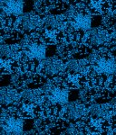

# [W96_B2+B4_S=2_T=1=Z=1_C=1_Tile=5x9.czi](https://zenodo.org/record/7015307/files/W96_B2%2BB4_S%3D2_T%3D1%3DZ%3D1_C%3D1_Tile%3D5x9.czi) report
 - **Autostitch** = true
 - ZeissCZIReader v6.14.0
 - ZeissQuickStartCZIReader v0.1.8-SNAPSHOT

# Images 

| Series            | Quick Start Reader | Size | Original Reader | Size | #Diffs |
|-------------------|--------------------|------|-----------------|------|--------|
| Read time (all)   |442 ms|------|487 ms|------|--------|
|0||X:2944 Y:3444 C:1 Z:1 T:1||X:2944 Y:3444 C:1 Z:1 T:1|0|
|1||X:1472 Y:1722 C:1 Z:1 T:1||X:1472 Y:1722 C:1 Z:1 T:1|0|
|2||X:736 Y:861 C:1 Z:1 T:1||X:736 Y:861 C:1 Z:1 T:1|0|
|3||X:2944 Y:3444 C:1 Z:1 T:1||X:2944 Y:3444 C:1 Z:1 T:1|0|
|4||X:1472 Y:1722 C:1 Z:1 T:1||X:1472 Y:1722 C:1 Z:1 T:1|0|
|5||X:736 Y:861 C:1 Z:1 T:1||X:736 Y:861 C:1 Z:1 T:1|0|

# Metadata

|  Method            | Parameters       | Quick Start Reader | Original Reader | Delta  |
| -------------------|------------------|--------------------|-----------------|------- |
| Initialization     |                  |23 ms|21 ms|        |
| Reader Size (Mb)     |                  |1.95|2.65|        |
| getStageLabelName| Image 0 | B2| Scene position #0| |
| getStageLabelX| Image 0 | 13039.200 um | 13500.000 um | 460.800 um |
| getStageLabelY| Image 0 | 16895.600 um | 17500.400 um | 604.800 um |
| getStageLabelName| Image 1 | B2| Scene position #1| |
| getStageLabelX| Image 1 |  1: null| 2: ome.units.quantity.Length: value[13500.0], unit[µm] stored as java.lang.Double |
| getStageLabelY| Image 1 |  1: null| 2: ome.units.quantity.Length: value[17500.4], unit[µm] stored as java.lang.Double |
| getStageLabelZ| Image 1 |  1: ome.units.quantity.Length: value[0.0], unit[µm] stored as java.lang.Double| 2: null |
| getPixelsPhysicalSizeX| Image 1 | 0.800 um | 0.400 um | 0.400 um |
| getPixelsPhysicalSizeY| Image 1 | 0.800 um | 0.400 um | 0.400 um |
| getStageLabelName| Image 2 | B2| Scene position #2| |
| getStageLabelX| Image 2 |  1: null| 2: ome.units.quantity.Length: value[13500.0], unit[µm] stored as java.lang.Double |
| getStageLabelY| Image 2 |  1: null| 2: ome.units.quantity.Length: value[17500.4], unit[µm] stored as java.lang.Double |
| getStageLabelZ| Image 2 |  1: ome.units.quantity.Length: value[0.0], unit[µm] stored as java.lang.Double| 2: null |
| getPixelsPhysicalSizeX| Image 2 | 1.600 um | 0.400 um | 1.200 um |
| getPixelsPhysicalSizeY| Image 2 | 1.600 um | 0.400 um | 1.200 um |
| getStageLabelName| Image 3 | B4| Scene position #3| |
| getStageLabelX| Image 3 | 31039.200 um | 31500.000 um | 460.800 um |
| getStageLabelY| Image 3 | 16895.600 um | 17500.400 um | 604.800 um |
| getStageLabelName| Image 4 | B4| Scene position #4| |
| getStageLabelX| Image 4 |  1: null| 2: ome.units.quantity.Length: value[31500.0], unit[µm] stored as java.lang.Double |
| getStageLabelY| Image 4 |  1: null| 2: ome.units.quantity.Length: value[17500.4], unit[µm] stored as java.lang.Double |
| getStageLabelZ| Image 4 |  1: ome.units.quantity.Length: value[0.0], unit[µm] stored as java.lang.Double| 2: null |
| getPixelsPhysicalSizeX| Image 4 | 0.800 um | 0.400 um | 0.400 um |
| getPixelsPhysicalSizeY| Image 4 | 0.800 um | 0.400 um | 0.400 um |
| getStageLabelName| Image 5 | B4| Scene position #5| |
| getStageLabelX| Image 5 |  1: null| 2: ome.units.quantity.Length: value[31500.0], unit[µm] stored as java.lang.Double |
| getStageLabelY| Image 5 |  1: null| 2: ome.units.quantity.Length: value[17500.4], unit[µm] stored as java.lang.Double |
| getStageLabelZ| Image 5 |  1: ome.units.quantity.Length: value[0.0], unit[µm] stored as java.lang.Double| 2: null |
| getPixelsPhysicalSizeX| Image 5 | 1.600 um | 0.400 um | 1.200 um |
| getPixelsPhysicalSizeY| Image 5 | 1.600 um | 0.400 um | 1.200 um |
| getPlanePositionX| Image 0 Plane 0 | 13039.200 um | 13500.000 um | 460.800 um |
| getPlanePositionY| Image 0 Plane 0 | 16895.600 um | 17500.400 um | 604.800 um |
| getPlaneDeltaT| Image 1 Plane 0 |  1: null| 2: ome.units.quantity.Time: value[0.9310193999999999], unit[s] stored as java.lang.Double |
| getPlaneExposureTime| Image 1 Plane 0 |  1: null| 2: ome.units.quantity.Time: value[150.0], unit[s] stored as java.lang.Double |
| getPlanePositionX| Image 1 Plane 0 |  1: null| 2: ome.units.quantity.Length: value[13500.0], unit[µm] stored as java.lang.Double |
| getPlanePositionY| Image 1 Plane 0 |  1: null| 2: ome.units.quantity.Length: value[17500.4], unit[µm] stored as java.lang.Double |
| getPlaneDeltaT| Image 2 Plane 0 |  1: null| 2: ome.units.quantity.Time: value[0.9310193999999999], unit[s] stored as java.lang.Double |
| getPlaneExposureTime| Image 2 Plane 0 |  1: null| 2: ome.units.quantity.Time: value[150.0], unit[s] stored as java.lang.Double |
| getPlanePositionX| Image 2 Plane 0 |  1: null| 2: ome.units.quantity.Length: value[13500.0], unit[µm] stored as java.lang.Double |
| getPlanePositionY| Image 2 Plane 0 |  1: null| 2: ome.units.quantity.Length: value[17500.4], unit[µm] stored as java.lang.Double |
| getPlanePositionX| Image 3 Plane 0 | 31039.200 um | 31500.000 um | 460.800 um |
| getPlanePositionY| Image 3 Plane 0 | 16895.600 um | 17500.400 um | 604.800 um |
| getPlaneDeltaT| Image 4 Plane 0 |  1: null| 2: ome.units.quantity.Time: value[0.9310193999999999], unit[s] stored as java.lang.Double |
| getPlaneExposureTime| Image 4 Plane 0 |  1: null| 2: ome.units.quantity.Time: value[150.0], unit[s] stored as java.lang.Double |
| getPlanePositionX| Image 4 Plane 0 |  1: null| 2: ome.units.quantity.Length: value[31500.0], unit[µm] stored as java.lang.Double |
| getPlanePositionY| Image 4 Plane 0 |  1: null| 2: ome.units.quantity.Length: value[17500.4], unit[µm] stored as java.lang.Double |
| getPlaneDeltaT| Image 5 Plane 0 |  1: null| 2: ome.units.quantity.Time: value[0.9310193999999999], unit[s] stored as java.lang.Double |
| getPlaneExposureTime| Image 5 Plane 0 |  1: null| 2: ome.units.quantity.Time: value[150.0], unit[s] stored as java.lang.Double |
| getPlanePositionX| Image 5 Plane 0 |  1: null| 2: ome.units.quantity.Length: value[31500.0], unit[µm] stored as java.lang.Double |
| getPlanePositionY| Image 5 Plane 0 |  1: null| 2: ome.units.quantity.Length: value[17500.4], unit[µm] stored as java.lang.Double |
