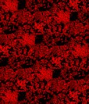

# [W96_B2+B4_S=2_T=2=Z=4_C=3_Tile=5x9.czi](https://zenodo.org/record/7015307/files/W96_B2%2BB4_S%3D2_T%3D2%3DZ%3D4_C%3D3_Tile%3D5x9.czi) report
 - **Autostitch** = true
 - ZeissCZIReader v6.14.0
 - ZeissQuickStartCZIReader v0.1.8-SNAPSHOT

# Images 

| Series            | Quick Start Reader | Size | Original Reader | Size | #Diffs |
|-------------------|--------------------|------|-----------------|------|--------|
| Read time (all)   |1197 ms|------|1380 ms|------|--------|
|0||X:2944 Y:3444 C:3 Z:4 T:2||X:2944 Y:3444 C:3 Z:4 T:2|0|
|1||X:1472 Y:1722 C:3 Z:4 T:2||X:1472 Y:1722 C:3 Z:4 T:2|0|
|2||X:736 Y:861 C:3 Z:4 T:2||X:736 Y:861 C:3 Z:4 T:2|0|
|3||X:2944 Y:3444 C:3 Z:4 T:2||X:2944 Y:3444 C:3 Z:4 T:2|0|
|4||X:1472 Y:1722 C:3 Z:4 T:2||X:1472 Y:1722 C:3 Z:4 T:2|0|
|5||X:736 Y:861 C:3 Z:4 T:2||X:736 Y:861 C:3 Z:4 T:2|0|

# Metadata

|  Method            | Parameters       | Quick Start Reader | Original Reader | Delta  |
| -------------------|------------------|--------------------|-----------------|------- |
| Initialization     |                  |47 ms|114 ms|        |
| Reader Size (Mb)     |                  |2.13|5.29|        |
| getStageLabelName| Image 0 | B2| Scene position #0| |
| getStageLabelX| Image 0 | 13039.200 um | 13500.000 um | 460.800 um |
| getStageLabelY| Image 0 | 16895.600 um | 17500.400 um | 604.800 um |
| getStageLabelName| Image 1 | B2| Scene position #1| |
| getStageLabelX| Image 1 | 12911.200 um | 13500.000 um | 588.800 um |
| getStageLabelY| Image 1 | 16811.200 um | 17500.400 um | 689.200 um |
| getStageLabelZ| Image 1 | | 1: ome.units.quantity.Length: value[0.0], unit[µm] stored as java.lang.Double| 2: null |
| getPixelsPhysicalSizeX| Image 1 | 0.800 um | 0.400 um | 0.400 um |
| getPixelsPhysicalSizeY| Image 1 | 0.800 um | 0.400 um | 0.400 um |
| getStageLabelName| Image 2 | B2| Scene position #2| |
| getStageLabelX| Image 2 | 12910.400 um | 13500.000 um | 589.600 um |
| getStageLabelY| Image 2 | 16811.200 um | 17500.400 um | 689.200 um |
| getStageLabelZ| Image 2 | | 1: ome.units.quantity.Length: value[0.0], unit[µm] stored as java.lang.Double| 2: null |
| getPixelsPhysicalSizeX| Image 2 | 1.600 um | 0.400 um | 1.200 um |
| getPixelsPhysicalSizeY| Image 2 | 1.600 um | 0.400 um | 1.200 um |
| getStageLabelName| Image 3 | B4| Scene position #3| |
| getStageLabelX| Image 3 | 31039.200 um | 31500.000 um | 460.800 um |
| getStageLabelY| Image 3 | 16895.600 um | 17500.400 um | 604.800 um |
| getStageLabelName| Image 4 | B4| Scene position #4| |
| getStageLabelX| Image 4 | 30911.200 um | 31500.000 um | 588.800 um |
| getStageLabelY| Image 4 | 16811.200 um | 17500.400 um | 689.200 um |
| getStageLabelZ| Image 4 | | 1: ome.units.quantity.Length: value[0.0], unit[µm] stored as java.lang.Double| 2: null |
| getPixelsPhysicalSizeX| Image 4 | 0.800 um | 0.400 um | 0.400 um |
| getPixelsPhysicalSizeY| Image 4 | 0.800 um | 0.400 um | 0.400 um |
| getStageLabelName| Image 5 | B4| Scene position #5| |
| getStageLabelX| Image 5 | 30910.400 um | 31500.000 um | 589.600 um |
| getStageLabelY| Image 5 | 16811.200 um | 17500.400 um | 689.200 um |
| getStageLabelZ| Image 5 | | 1: ome.units.quantity.Length: value[0.0], unit[µm] stored as java.lang.Double| 2: null |
| getPixelsPhysicalSizeX| Image 5 | 1.600 um | 0.400 um | 1.200 um |
| getPixelsPhysicalSizeY| Image 5 | 1.600 um | 0.400 um | 1.200 um |
| getPlanePositionX| Image 0 Plane 0 | 13039.200 um | 13500.000 um | 460.800 um |
| getPlanePositionY| Image 0 Plane 0 | 16895.600 um | 17500.400 um | 604.800 um |
| getPlanePositionX| Image 0 Plane 1 | 13039.200 um | 13500.000 um | 460.800 um |
| getPlanePositionY| Image 0 Plane 1 | 16895.600 um | 17500.400 um | 604.800 um |
| getPlanePositionX| Image 0 Plane 2 | 13039.200 um | 13500.000 um | 460.800 um |
| getPlanePositionY| Image 0 Plane 2 | 16895.600 um | 17500.400 um | 604.800 um |
| getPlaneDeltaT| Image 0 Plane 3 |  1.406 s |  1.416 s | 0.010 s |
| getPlanePositionX| Image 0 Plane 3 | 13039.200 um | 13500.000 um | 460.800 um |
| getPlanePositionY| Image 0 Plane 3 | 16895.600 um | 17500.400 um | 604.800 um |
| getPlaneDeltaT| Image 0 Plane 4 |  1.506 s |  1.503 s | 0.003 s |
| getPlanePositionX| Image 0 Plane 4 | 13039.200 um | 13500.000 um | 460.800 um |
| getPlanePositionY| Image 0 Plane 4 | 16895.600 um | 17500.400 um | 604.800 um |
| getPlaneDeltaT| Image 0 Plane 5 |  1.600 s |  1.595 s | 0.005 s |
| getPlanePositionX| Image 0 Plane 5 | 13039.200 um | 13500.000 um | 460.800 um |
| getPlanePositionY| Image 0 Plane 5 | 16895.600 um | 17500.400 um | 604.800 um |
| getPlaneDeltaT| Image 0 Plane 6 |  1.882 s |  1.883 s | 0.001 s |
| getPlanePositionX| Image 0 Plane 6 | 13039.200 um | 13500.000 um | 460.800 um |
| getPlanePositionY| Image 0 Plane 6 | 16895.600 um | 17500.400 um | 604.800 um |
| getPlaneDeltaT| Image 0 Plane 7 |  1.975 s |  1.973 s | 0.002 s |
| getPlanePositionX| Image 0 Plane 7 | 13039.200 um | 13500.000 um | 460.800 um |
| getPlanePositionY| Image 0 Plane 7 | 16895.600 um | 17500.400 um | 604.800 um |
| getPlaneDeltaT| Image 0 Plane 8 |  2.068 s |  2.070 s | 0.002 s |
| getPlanePositionX| Image 0 Plane 8 | 13039.200 um | 13500.000 um | 460.800 um |
| getPlanePositionY| Image 0 Plane 8 | 16895.600 um | 17500.400 um | 604.800 um |
| getPlanePositionX| Image 0 Plane 9 | 13039.200 um | 13500.000 um | 460.800 um |
| getPlanePositionY| Image 0 Plane 9 | 16895.600 um | 17500.400 um | 604.800 um |
| getPlanePositionX| Image 0 Plane 10 | 13039.200 um | 13500.000 um | 460.800 um |
| getPlanePositionY| Image 0 Plane 10 | 16895.600 um | 17500.400 um | 604.800 um |
| getPlanePositionX| Image 0 Plane 11 | 13039.200 um | 13500.000 um | 460.800 um |
| getPlanePositionY| Image 0 Plane 11 | 16895.600 um | 17500.400 um | 604.800 um |
| getPlanePositionX| Image 0 Plane 12 | 13039.200 um | 13500.000 um | 460.800 um |
| getPlanePositionY| Image 0 Plane 12 | 16895.600 um | 17500.400 um | 604.800 um |
| getPlanePositionX| Image 0 Plane 13 | 13039.200 um | 13500.000 um | 460.800 um |
| getPlanePositionY| Image 0 Plane 13 | 16895.600 um | 17500.400 um | 604.800 um |
| getPlanePositionX| Image 0 Plane 14 | 13039.200 um | 13500.000 um | 460.800 um |
| getPlanePositionY| Image 0 Plane 14 | 16895.600 um | 17500.400 um | 604.800 um |
| getPlaneDeltaT| Image 0 Plane 15 |  100.658 s |  100.665 s | 0.007 s |
| getPlanePositionX| Image 0 Plane 15 | 13039.200 um | 13500.000 um | 460.800 um |
| getPlanePositionY| Image 0 Plane 15 | 16895.600 um | 17500.400 um | 604.800 um |
| getPlanePositionX| Image 0 Plane 16 | 13039.200 um | 13500.000 um | 460.800 um |
| getPlanePositionY| Image 0 Plane 16 | 16895.600 um | 17500.400 um | 604.800 um |
| getPlaneDeltaT| Image 0 Plane 17 |  100.840 s |  100.837 s | 0.003 s |
| getPlanePositionX| Image 0 Plane 17 | 13039.200 um | 13500.000 um | 460.800 um |
| getPlanePositionY| Image 0 Plane 17 | 16895.600 um | 17500.400 um | 604.800 um |
| getPlaneDeltaT| Image 0 Plane 18 |  101.134 s |  101.118 s | 0.016 s |
| getPlanePositionX| Image 0 Plane 18 | 13039.200 um | 13500.000 um | 460.800 um |
| getPlanePositionY| Image 0 Plane 18 | 16895.600 um | 17500.400 um | 604.800 um |
| getPlaneDeltaT| Image 0 Plane 19 |  101.219 s |  101.207 s | 0.012 s |
| getPlanePositionX| Image 0 Plane 19 | 13039.200 um | 13500.000 um | 460.800 um |
| getPlanePositionY| Image 0 Plane 19 | 16895.600 um | 17500.400 um | 604.800 um |
| getPlaneDeltaT| Image 0 Plane 20 |  101.308 s |  101.295 s | 0.013 s |
| getPlanePositionX| Image 0 Plane 20 | 13039.200 um | 13500.000 um | 460.800 um |
| getPlanePositionY| Image 0 Plane 20 | 16895.600 um | 17500.400 um | 604.800 um |
| getPlaneDeltaT| Image 0 Plane 21 |  101.609 s |  101.575 s | 0.034 s |
| getPlanePositionX| Image 0 Plane 21 | 13039.200 um | 13500.000 um | 460.800 um |
| getPlanePositionY| Image 0 Plane 21 | 16895.600 um | 17500.400 um | 604.800 um |
| getPlaneDeltaT| Image 0 Plane 22 |  101.689 s |  101.665 s | 0.024 s |
| getPlanePositionX| Image 0 Plane 22 | 13039.200 um | 13500.000 um | 460.800 um |
| getPlanePositionY| Image 0 Plane 22 | 16895.600 um | 17500.400 um | 604.800 um |
| getPlaneDeltaT| Image 0 Plane 23 |  101.775 s |  101.754 s | 0.021 s |
| getPlanePositionX| Image 0 Plane 23 | 13039.200 um | 13500.000 um | 460.800 um |
| getPlanePositionY| Image 0 Plane 23 | 16895.600 um | 17500.400 um | 604.800 um |
| getPlaneDeltaT| Image 1 Plane 0 | | 1: null| 2: ome.units.quantity.Time: value[0.9310193999999999], unit[s] stored as java.lang.Double |
| getPlaneExposureTime| Image 1 Plane 0 | | 1: null| 2: ome.units.quantity.Time: value[150.0], unit[s] stored as java.lang.Double |
| getPlanePositionX| Image 1 Plane 0 | | 1: null| 2: ome.units.quantity.Length: value[13500.0], unit[µm] stored as java.lang.Double |
| getPlanePositionY| Image 1 Plane 0 | | 1: null| 2: ome.units.quantity.Length: value[17500.4], unit[µm] stored as java.lang.Double |
| getPlaneDeltaT| Image 1 Plane 1 | | 1: null| 2: ome.units.quantity.Time: value[0.9310193999999999], unit[s] stored as java.lang.Double |
| getPlaneExposureTime| Image 1 Plane 1 | | 1: null| 2: ome.units.quantity.Time: value[150.0], unit[s] stored as java.lang.Double |
| getPlanePositionX| Image 1 Plane 1 | | 1: null| 2: ome.units.quantity.Length: value[13500.0], unit[µm] stored as java.lang.Double |
| getPlanePositionY| Image 1 Plane 1 | | 1: null| 2: ome.units.quantity.Length: value[17500.4], unit[µm] stored as java.lang.Double |
| getPlaneDeltaT| Image 1 Plane 2 | | 1: null| 2: ome.units.quantity.Time: value[0.9310193999999999], unit[s] stored as java.lang.Double |
| getPlaneExposureTime| Image 1 Plane 2 | | 1: null| 2: ome.units.quantity.Time: value[150.0], unit[s] stored as java.lang.Double |
| getPlanePositionX| Image 1 Plane 2 | | 1: null| 2: ome.units.quantity.Length: value[13500.0], unit[µm] stored as java.lang.Double |
| getPlanePositionY| Image 1 Plane 2 | | 1: null| 2: ome.units.quantity.Length: value[17500.4], unit[µm] stored as java.lang.Double |
| getPlaneDeltaT| Image 1 Plane 3 | | 1: null| 2: ome.units.quantity.Time: value[0.9310193999999999], unit[s] stored as java.lang.Double |
| getPlaneExposureTime| Image 1 Plane 3 | | 1: null| 2: ome.units.quantity.Time: value[150.0], unit[s] stored as java.lang.Double |
| getPlanePositionX| Image 1 Plane 3 | | 1: null| 2: ome.units.quantity.Length: value[13500.0], unit[µm] stored as java.lang.Double |
| getPlanePositionY| Image 1 Plane 3 | | 1: null| 2: ome.units.quantity.Length: value[17500.4], unit[µm] stored as java.lang.Double |
| getPlaneDeltaT| Image 1 Plane 4 | | 1: null| 2: ome.units.quantity.Time: value[0.9310193999999999], unit[s] stored as java.lang.Double |
| getPlaneExposureTime| Image 1 Plane 4 | | 1: null| 2: ome.units.quantity.Time: value[150.0], unit[s] stored as java.lang.Double |
| getPlanePositionX| Image 1 Plane 4 | | 1: null| 2: ome.units.quantity.Length: value[13500.0], unit[µm] stored as java.lang.Double |
| getPlanePositionY| Image 1 Plane 4 | | 1: null| 2: ome.units.quantity.Length: value[17500.4], unit[µm] stored as java.lang.Double |
| getPlaneDeltaT| Image 1 Plane 5 | | 1: null| 2: ome.units.quantity.Time: value[0.9310193999999999], unit[s] stored as java.lang.Double |
| getPlaneExposureTime| Image 1 Plane 5 | | 1: null| 2: ome.units.quantity.Time: value[150.0], unit[s] stored as java.lang.Double |
| getPlanePositionX| Image 1 Plane 5 | | 1: null| 2: ome.units.quantity.Length: value[13500.0], unit[µm] stored as java.lang.Double |
| getPlanePositionY| Image 1 Plane 5 | | 1: null| 2: ome.units.quantity.Length: value[17500.4], unit[µm] stored as java.lang.Double |
| getPlaneDeltaT| Image 1 Plane 6 | | 1: null| 2: ome.units.quantity.Time: value[0.9310193999999999], unit[s] stored as java.lang.Double |
| getPlaneExposureTime| Image 1 Plane 6 | | 1: null| 2: ome.units.quantity.Time: value[150.0], unit[s] stored as java.lang.Double |
| getPlanePositionX| Image 1 Plane 6 | | 1: null| 2: ome.units.quantity.Length: value[13500.0], unit[µm] stored as java.lang.Double |
| getPlanePositionY| Image 1 Plane 6 | | 1: null| 2: ome.units.quantity.Length: value[17500.4], unit[µm] stored as java.lang.Double |
| getPlaneDeltaT| Image 1 Plane 7 | | 1: null| 2: ome.units.quantity.Time: value[0.9310193999999999], unit[s] stored as java.lang.Double |
| getPlaneExposureTime| Image 1 Plane 7 | | 1: null| 2: ome.units.quantity.Time: value[150.0], unit[s] stored as java.lang.Double |
| getPlanePositionX| Image 1 Plane 7 | | 1: null| 2: ome.units.quantity.Length: value[13500.0], unit[µm] stored as java.lang.Double |
| getPlanePositionY| Image 1 Plane 7 | | 1: null| 2: ome.units.quantity.Length: value[17500.4], unit[µm] stored as java.lang.Double |
| getPlaneDeltaT| Image 1 Plane 8 | | 1: null| 2: ome.units.quantity.Time: value[0.9310193999999999], unit[s] stored as java.lang.Double |
| getPlaneExposureTime| Image 1 Plane 8 | | 1: null| 2: ome.units.quantity.Time: value[150.0], unit[s] stored as java.lang.Double |
| getPlanePositionX| Image 1 Plane 8 | | 1: null| 2: ome.units.quantity.Length: value[13500.0], unit[µm] stored as java.lang.Double |
| getPlanePositionY| Image 1 Plane 8 | | 1: null| 2: ome.units.quantity.Length: value[17500.4], unit[µm] stored as java.lang.Double |
| getPlaneDeltaT| Image 1 Plane 9 | | 1: null| 2: ome.units.quantity.Time: value[0.9310193999999999], unit[s] stored as java.lang.Double |
| getPlaneExposureTime| Image 1 Plane 9 | | 1: null| 2: ome.units.quantity.Time: value[150.0], unit[s] stored as java.lang.Double |
| getPlanePositionX| Image 1 Plane 9 | | 1: null| 2: ome.units.quantity.Length: value[13500.0], unit[µm] stored as java.lang.Double |
| getPlanePositionY| Image 1 Plane 9 | | 1: null| 2: ome.units.quantity.Length: value[17500.4], unit[µm] stored as java.lang.Double |
| getPlaneDeltaT| Image 1 Plane 10 | | 1: null| 2: ome.units.quantity.Time: value[0.9310193999999999], unit[s] stored as java.lang.Double |
| getPlaneExposureTime| Image 1 Plane 10 | | 1: null| 2: ome.units.quantity.Time: value[150.0], unit[s] stored as java.lang.Double |
| getPlanePositionX| Image 1 Plane 10 | | 1: null| 2: ome.units.quantity.Length: value[13500.0], unit[µm] stored as java.lang.Double |
| getPlanePositionY| Image 1 Plane 10 | | 1: null| 2: ome.units.quantity.Length: value[17500.4], unit[µm] stored as java.lang.Double |
| getPlaneDeltaT| Image 1 Plane 11 | | 1: null| 2: ome.units.quantity.Time: value[0.9310193999999999], unit[s] stored as java.lang.Double |
| getPlaneExposureTime| Image 1 Plane 11 | | 1: null| 2: ome.units.quantity.Time: value[150.0], unit[s] stored as java.lang.Double |
| getPlanePositionX| Image 1 Plane 11 | | 1: null| 2: ome.units.quantity.Length: value[13500.0], unit[µm] stored as java.lang.Double |
| getPlanePositionY| Image 1 Plane 11 | | 1: null| 2: ome.units.quantity.Length: value[17500.4], unit[µm] stored as java.lang.Double |
| getPlaneDeltaT| Image 1 Plane 12 | | 1: null| 2: ome.units.quantity.Time: value[100.1833796], unit[s] stored as java.lang.Double |
| getPlaneExposureTime| Image 1 Plane 12 | | 1: null| 2: ome.units.quantity.Time: value[150.0], unit[s] stored as java.lang.Double |
| getPlanePositionX| Image 1 Plane 12 | | 1: null| 2: ome.units.quantity.Length: value[13500.0], unit[µm] stored as java.lang.Double |
| getPlanePositionY| Image 1 Plane 12 | | 1: null| 2: ome.units.quantity.Length: value[17500.4], unit[µm] stored as java.lang.Double |
| getPlaneDeltaT| Image 1 Plane 13 | | 1: null| 2: ome.units.quantity.Time: value[100.1833796], unit[s] stored as java.lang.Double |
| getPlaneExposureTime| Image 1 Plane 13 | | 1: null| 2: ome.units.quantity.Time: value[150.0], unit[s] stored as java.lang.Double |
| getPlanePositionX| Image 1 Plane 13 | | 1: null| 2: ome.units.quantity.Length: value[13500.0], unit[µm] stored as java.lang.Double |
| getPlanePositionY| Image 1 Plane 13 | | 1: null| 2: ome.units.quantity.Length: value[17500.4], unit[µm] stored as java.lang.Double |
| getPlaneDeltaT| Image 1 Plane 14 | | 1: null| 2: ome.units.quantity.Time: value[100.1833796], unit[s] stored as java.lang.Double |
| getPlaneExposureTime| Image 1 Plane 14 | | 1: null| 2: ome.units.quantity.Time: value[150.0], unit[s] stored as java.lang.Double |
| getPlanePositionX| Image 1 Plane 14 | | 1: null| 2: ome.units.quantity.Length: value[13500.0], unit[µm] stored as java.lang.Double |
| getPlanePositionY| Image 1 Plane 14 | | 1: null| 2: ome.units.quantity.Length: value[17500.4], unit[µm] stored as java.lang.Double |
| getPlaneDeltaT| Image 1 Plane 15 | | 1: null| 2: ome.units.quantity.Time: value[100.1833796], unit[s] stored as java.lang.Double |
| getPlaneExposureTime| Image 1 Plane 15 | | 1: null| 2: ome.units.quantity.Time: value[150.0], unit[s] stored as java.lang.Double |
| getPlanePositionX| Image 1 Plane 15 | | 1: null| 2: ome.units.quantity.Length: value[13500.0], unit[µm] stored as java.lang.Double |
| getPlanePositionY| Image 1 Plane 15 | | 1: null| 2: ome.units.quantity.Length: value[17500.4], unit[µm] stored as java.lang.Double |
| getPlaneDeltaT| Image 1 Plane 16 | | 1: null| 2: ome.units.quantity.Time: value[100.1833796], unit[s] stored as java.lang.Double |
| getPlaneExposureTime| Image 1 Plane 16 | | 1: null| 2: ome.units.quantity.Time: value[150.0], unit[s] stored as java.lang.Double |
| getPlanePositionX| Image 1 Plane 16 | | 1: null| 2: ome.units.quantity.Length: value[13500.0], unit[µm] stored as java.lang.Double |
| getPlanePositionY| Image 1 Plane 16 | | 1: null| 2: ome.units.quantity.Length: value[17500.4], unit[µm] stored as java.lang.Double |
| getPlaneDeltaT| Image 1 Plane 17 | | 1: null| 2: ome.units.quantity.Time: value[100.1833796], unit[s] stored as java.lang.Double |
| getPlaneExposureTime| Image 1 Plane 17 | | 1: null| 2: ome.units.quantity.Time: value[150.0], unit[s] stored as java.lang.Double |
| getPlanePositionX| Image 1 Plane 17 | | 1: null| 2: ome.units.quantity.Length: value[13500.0], unit[µm] stored as java.lang.Double |
| getPlanePositionY| Image 1 Plane 17 | | 1: null| 2: ome.units.quantity.Length: value[17500.4], unit[µm] stored as java.lang.Double |
| getPlaneDeltaT| Image 1 Plane 18 | | 1: null| 2: ome.units.quantity.Time: value[100.1833796], unit[s] stored as java.lang.Double |
| getPlaneExposureTime| Image 1 Plane 18 | | 1: null| 2: ome.units.quantity.Time: value[150.0], unit[s] stored as java.lang.Double |
| getPlanePositionX| Image 1 Plane 18 | | 1: null| 2: ome.units.quantity.Length: value[13500.0], unit[µm] stored as java.lang.Double |
| getPlanePositionY| Image 1 Plane 18 | | 1: null| 2: ome.units.quantity.Length: value[17500.4], unit[µm] stored as java.lang.Double |
| getPlaneDeltaT| Image 1 Plane 19 | | 1: null| 2: ome.units.quantity.Time: value[100.1833796], unit[s] stored as java.lang.Double |
| getPlaneExposureTime| Image 1 Plane 19 | | 1: null| 2: ome.units.quantity.Time: value[150.0], unit[s] stored as java.lang.Double |
| getPlanePositionX| Image 1 Plane 19 | | 1: null| 2: ome.units.quantity.Length: value[13500.0], unit[µm] stored as java.lang.Double |
| getPlanePositionY| Image 1 Plane 19 | | 1: null| 2: ome.units.quantity.Length: value[17500.4], unit[µm] stored as java.lang.Double |
| getPlaneDeltaT| Image 1 Plane 20 | | 1: null| 2: ome.units.quantity.Time: value[100.1833796], unit[s] stored as java.lang.Double |
| getPlaneExposureTime| Image 1 Plane 20 | | 1: null| 2: ome.units.quantity.Time: value[150.0], unit[s] stored as java.lang.Double |
| getPlanePositionX| Image 1 Plane 20 | | 1: null| 2: ome.units.quantity.Length: value[13500.0], unit[µm] stored as java.lang.Double |
| getPlanePositionY| Image 1 Plane 20 | | 1: null| 2: ome.units.quantity.Length: value[17500.4], unit[µm] stored as java.lang.Double |
| getPlaneDeltaT| Image 1 Plane 21 | | 1: null| 2: ome.units.quantity.Time: value[100.1833796], unit[s] stored as java.lang.Double |
| getPlaneExposureTime| Image 1 Plane 21 | | 1: null| 2: ome.units.quantity.Time: value[150.0], unit[s] stored as java.lang.Double |
| getPlanePositionX| Image 1 Plane 21 | | 1: null| 2: ome.units.quantity.Length: value[13500.0], unit[µm] stored as java.lang.Double |
| getPlanePositionY| Image 1 Plane 21 | | 1: null| 2: ome.units.quantity.Length: value[17500.4], unit[µm] stored as java.lang.Double |
| getPlaneDeltaT| Image 1 Plane 22 | | 1: null| 2: ome.units.quantity.Time: value[100.1833796], unit[s] stored as java.lang.Double |
| getPlaneExposureTime| Image 1 Plane 22 | | 1: null| 2: ome.units.quantity.Time: value[150.0], unit[s] stored as java.lang.Double |
| getPlanePositionX| Image 1 Plane 22 | | 1: null| 2: ome.units.quantity.Length: value[13500.0], unit[µm] stored as java.lang.Double |
| getPlanePositionY| Image 1 Plane 22 | | 1: null| 2: ome.units.quantity.Length: value[17500.4], unit[µm] stored as java.lang.Double |
| getPlaneDeltaT| Image 1 Plane 23 | | 1: null| 2: ome.units.quantity.Time: value[100.1833796], unit[s] stored as java.lang.Double |
| getPlaneExposureTime| Image 1 Plane 23 | | 1: null| 2: ome.units.quantity.Time: value[150.0], unit[s] stored as java.lang.Double |
| getPlanePositionX| Image 1 Plane 23 | | 1: null| 2: ome.units.quantity.Length: value[13500.0], unit[µm] stored as java.lang.Double |
| getPlanePositionY| Image 1 Plane 23 | | 1: null| 2: ome.units.quantity.Length: value[17500.4], unit[µm] stored as java.lang.Double |
| getPlaneDeltaT| Image 2 Plane 0 | | 1: null| 2: ome.units.quantity.Time: value[0.9310193999999999], unit[s] stored as java.lang.Double |
| getPlaneExposureTime| Image 2 Plane 0 | | 1: null| 2: ome.units.quantity.Time: value[150.0], unit[s] stored as java.lang.Double |
| getPlanePositionX| Image 2 Plane 0 | | 1: null| 2: ome.units.quantity.Length: value[13500.0], unit[µm] stored as java.lang.Double |
| getPlanePositionY| Image 2 Plane 0 | | 1: null| 2: ome.units.quantity.Length: value[17500.4], unit[µm] stored as java.lang.Double |
| getPlaneDeltaT| Image 2 Plane 1 | | 1: null| 2: ome.units.quantity.Time: value[0.9310193999999999], unit[s] stored as java.lang.Double |
| getPlaneExposureTime| Image 2 Plane 1 | | 1: null| 2: ome.units.quantity.Time: value[150.0], unit[s] stored as java.lang.Double |
| getPlanePositionX| Image 2 Plane 1 | | 1: null| 2: ome.units.quantity.Length: value[13500.0], unit[µm] stored as java.lang.Double |
| getPlanePositionY| Image 2 Plane 1 | | 1: null| 2: ome.units.quantity.Length: value[17500.4], unit[µm] stored as java.lang.Double |
| getPlaneDeltaT| Image 2 Plane 2 | | 1: null| 2: ome.units.quantity.Time: value[0.9310193999999999], unit[s] stored as java.lang.Double |
| getPlaneExposureTime| Image 2 Plane 2 | | 1: null| 2: ome.units.quantity.Time: value[150.0], unit[s] stored as java.lang.Double |
| getPlanePositionX| Image 2 Plane 2 | | 1: null| 2: ome.units.quantity.Length: value[13500.0], unit[µm] stored as java.lang.Double |
| getPlanePositionY| Image 2 Plane 2 | | 1: null| 2: ome.units.quantity.Length: value[17500.4], unit[µm] stored as java.lang.Double |
| getPlaneDeltaT| Image 2 Plane 3 | | 1: null| 2: ome.units.quantity.Time: value[0.9310193999999999], unit[s] stored as java.lang.Double |
| getPlaneExposureTime| Image 2 Plane 3 | | 1: null| 2: ome.units.quantity.Time: value[150.0], unit[s] stored as java.lang.Double |
| getPlanePositionX| Image 2 Plane 3 | | 1: null| 2: ome.units.quantity.Length: value[13500.0], unit[µm] stored as java.lang.Double |
| getPlanePositionY| Image 2 Plane 3 | | 1: null| 2: ome.units.quantity.Length: value[17500.4], unit[µm] stored as java.lang.Double |
| getPlaneDeltaT| Image 2 Plane 4 | | 1: null| 2: ome.units.quantity.Time: value[0.9310193999999999], unit[s] stored as java.lang.Double |
| getPlaneExposureTime| Image 2 Plane 4 | | 1: null| 2: ome.units.quantity.Time: value[150.0], unit[s] stored as java.lang.Double |
| getPlanePositionX| Image 2 Plane 4 | | 1: null| 2: ome.units.quantity.Length: value[13500.0], unit[µm] stored as java.lang.Double |
| getPlanePositionY| Image 2 Plane 4 | | 1: null| 2: ome.units.quantity.Length: value[17500.4], unit[µm] stored as java.lang.Double |
| getPlaneDeltaT| Image 2 Plane 5 | | 1: null| 2: ome.units.quantity.Time: value[0.9310193999999999], unit[s] stored as java.lang.Double |
| getPlaneExposureTime| Image 2 Plane 5 | | 1: null| 2: ome.units.quantity.Time: value[150.0], unit[s] stored as java.lang.Double |
| getPlanePositionX| Image 2 Plane 5 | | 1: null| 2: ome.units.quantity.Length: value[13500.0], unit[µm] stored as java.lang.Double |
| getPlanePositionY| Image 2 Plane 5 | | 1: null| 2: ome.units.quantity.Length: value[17500.4], unit[µm] stored as java.lang.Double |
| getPlaneDeltaT| Image 2 Plane 6 | | 1: null| 2: ome.units.quantity.Time: value[0.9310193999999999], unit[s] stored as java.lang.Double |
| getPlaneExposureTime| Image 2 Plane 6 | | 1: null| 2: ome.units.quantity.Time: value[150.0], unit[s] stored as java.lang.Double |
| getPlanePositionX| Image 2 Plane 6 | | 1: null| 2: ome.units.quantity.Length: value[13500.0], unit[µm] stored as java.lang.Double |
| getPlanePositionY| Image 2 Plane 6 | | 1: null| 2: ome.units.quantity.Length: value[17500.4], unit[µm] stored as java.lang.Double |
| getPlaneDeltaT| Image 2 Plane 7 | | 1: null| 2: ome.units.quantity.Time: value[0.9310193999999999], unit[s] stored as java.lang.Double |
| getPlaneExposureTime| Image 2 Plane 7 | | 1: null| 2: ome.units.quantity.Time: value[150.0], unit[s] stored as java.lang.Double |
| getPlanePositionX| Image 2 Plane 7 | | 1: null| 2: ome.units.quantity.Length: value[13500.0], unit[µm] stored as java.lang.Double |
| getPlanePositionY| Image 2 Plane 7 | | 1: null| 2: ome.units.quantity.Length: value[17500.4], unit[µm] stored as java.lang.Double |
| getPlaneDeltaT| Image 2 Plane 8 | | 1: null| 2: ome.units.quantity.Time: value[0.9310193999999999], unit[s] stored as java.lang.Double |
| getPlaneExposureTime| Image 2 Plane 8 | | 1: null| 2: ome.units.quantity.Time: value[150.0], unit[s] stored as java.lang.Double |
| getPlanePositionX| Image 2 Plane 8 | | 1: null| 2: ome.units.quantity.Length: value[13500.0], unit[µm] stored as java.lang.Double |
| getPlanePositionY| Image 2 Plane 8 | | 1: null| 2: ome.units.quantity.Length: value[17500.4], unit[µm] stored as java.lang.Double |
| getPlaneDeltaT| Image 2 Plane 9 | | 1: null| 2: ome.units.quantity.Time: value[0.9310193999999999], unit[s] stored as java.lang.Double |
| getPlaneExposureTime| Image 2 Plane 9 | | 1: null| 2: ome.units.quantity.Time: value[150.0], unit[s] stored as java.lang.Double |
| getPlanePositionX| Image 2 Plane 9 | | 1: null| 2: ome.units.quantity.Length: value[13500.0], unit[µm] stored as java.lang.Double |
| getPlanePositionY| Image 2 Plane 9 | | 1: null| 2: ome.units.quantity.Length: value[17500.4], unit[µm] stored as java.lang.Double |
| getPlaneDeltaT| Image 2 Plane 10 | | 1: null| 2: ome.units.quantity.Time: value[0.9310193999999999], unit[s] stored as java.lang.Double |
| getPlaneExposureTime| Image 2 Plane 10 | | 1: null| 2: ome.units.quantity.Time: value[150.0], unit[s] stored as java.lang.Double |
| getPlanePositionX| Image 2 Plane 10 | | 1: null| 2: ome.units.quantity.Length: value[13500.0], unit[µm] stored as java.lang.Double |
| getPlanePositionY| Image 2 Plane 10 | | 1: null| 2: ome.units.quantity.Length: value[17500.4], unit[µm] stored as java.lang.Double |
| getPlaneDeltaT| Image 2 Plane 11 | | 1: null| 2: ome.units.quantity.Time: value[0.9310193999999999], unit[s] stored as java.lang.Double |
| getPlaneExposureTime| Image 2 Plane 11 | | 1: null| 2: ome.units.quantity.Time: value[150.0], unit[s] stored as java.lang.Double |
| getPlanePositionX| Image 2 Plane 11 | | 1: null| 2: ome.units.quantity.Length: value[13500.0], unit[µm] stored as java.lang.Double |
| getPlanePositionY| Image 2 Plane 11 | | 1: null| 2: ome.units.quantity.Length: value[17500.4], unit[µm] stored as java.lang.Double |
| getPlaneDeltaT| Image 2 Plane 12 | | 1: null| 2: ome.units.quantity.Time: value[100.1833796], unit[s] stored as java.lang.Double |
| getPlaneExposureTime| Image 2 Plane 12 | | 1: null| 2: ome.units.quantity.Time: value[150.0], unit[s] stored as java.lang.Double |
| getPlanePositionX| Image 2 Plane 12 | | 1: null| 2: ome.units.quantity.Length: value[13500.0], unit[µm] stored as java.lang.Double |
| getPlanePositionY| Image 2 Plane 12 | | 1: null| 2: ome.units.quantity.Length: value[17500.4], unit[µm] stored as java.lang.Double |
| getPlaneDeltaT| Image 2 Plane 13 | | 1: null| 2: ome.units.quantity.Time: value[100.1833796], unit[s] stored as java.lang.Double |
| getPlaneExposureTime| Image 2 Plane 13 | | 1: null| 2: ome.units.quantity.Time: value[150.0], unit[s] stored as java.lang.Double |
| getPlanePositionX| Image 2 Plane 13 | | 1: null| 2: ome.units.quantity.Length: value[13500.0], unit[µm] stored as java.lang.Double |
| getPlanePositionY| Image 2 Plane 13 | | 1: null| 2: ome.units.quantity.Length: value[17500.4], unit[µm] stored as java.lang.Double |
| getPlaneDeltaT| Image 2 Plane 14 | | 1: null| 2: ome.units.quantity.Time: value[100.1833796], unit[s] stored as java.lang.Double |
| getPlaneExposureTime| Image 2 Plane 14 | | 1: null| 2: ome.units.quantity.Time: value[150.0], unit[s] stored as java.lang.Double |
| getPlanePositionX| Image 2 Plane 14 | | 1: null| 2: ome.units.quantity.Length: value[13500.0], unit[µm] stored as java.lang.Double |
| getPlanePositionY| Image 2 Plane 14 | | 1: null| 2: ome.units.quantity.Length: value[17500.4], unit[µm] stored as java.lang.Double |
| getPlaneDeltaT| Image 2 Plane 15 | | 1: null| 2: ome.units.quantity.Time: value[100.1833796], unit[s] stored as java.lang.Double |
| getPlaneExposureTime| Image 2 Plane 15 | | 1: null| 2: ome.units.quantity.Time: value[150.0], unit[s] stored as java.lang.Double |
| getPlanePositionX| Image 2 Plane 15 | | 1: null| 2: ome.units.quantity.Length: value[13500.0], unit[µm] stored as java.lang.Double |
| getPlanePositionY| Image 2 Plane 15 | | 1: null| 2: ome.units.quantity.Length: value[17500.4], unit[µm] stored as java.lang.Double |
| getPlaneDeltaT| Image 2 Plane 16 | | 1: null| 2: ome.units.quantity.Time: value[100.1833796], unit[s] stored as java.lang.Double |
| getPlaneExposureTime| Image 2 Plane 16 | | 1: null| 2: ome.units.quantity.Time: value[150.0], unit[s] stored as java.lang.Double |
| getPlanePositionX| Image 2 Plane 16 | | 1: null| 2: ome.units.quantity.Length: value[13500.0], unit[µm] stored as java.lang.Double |
| getPlanePositionY| Image 2 Plane 16 | | 1: null| 2: ome.units.quantity.Length: value[17500.4], unit[µm] stored as java.lang.Double |
| getPlaneDeltaT| Image 2 Plane 17 | | 1: null| 2: ome.units.quantity.Time: value[100.1833796], unit[s] stored as java.lang.Double |
| getPlaneExposureTime| Image 2 Plane 17 | | 1: null| 2: ome.units.quantity.Time: value[150.0], unit[s] stored as java.lang.Double |
| getPlanePositionX| Image 2 Plane 17 | | 1: null| 2: ome.units.quantity.Length: value[13500.0], unit[µm] stored as java.lang.Double |
| getPlanePositionY| Image 2 Plane 17 | | 1: null| 2: ome.units.quantity.Length: value[17500.4], unit[µm] stored as java.lang.Double |
| getPlaneDeltaT| Image 2 Plane 18 | | 1: null| 2: ome.units.quantity.Time: value[100.1833796], unit[s] stored as java.lang.Double |
| getPlaneExposureTime| Image 2 Plane 18 | | 1: null| 2: ome.units.quantity.Time: value[150.0], unit[s] stored as java.lang.Double |
| getPlanePositionX| Image 2 Plane 18 | | 1: null| 2: ome.units.quantity.Length: value[13500.0], unit[µm] stored as java.lang.Double |
| getPlanePositionY| Image 2 Plane 18 | | 1: null| 2: ome.units.quantity.Length: value[17500.4], unit[µm] stored as java.lang.Double |
| getPlaneDeltaT| Image 2 Plane 19 | | 1: null| 2: ome.units.quantity.Time: value[100.1833796], unit[s] stored as java.lang.Double |
| getPlaneExposureTime| Image 2 Plane 19 | | 1: null| 2: ome.units.quantity.Time: value[150.0], unit[s] stored as java.lang.Double |
| getPlanePositionX| Image 2 Plane 19 | | 1: null| 2: ome.units.quantity.Length: value[13500.0], unit[µm] stored as java.lang.Double |
| getPlanePositionY| Image 2 Plane 19 | | 1: null| 2: ome.units.quantity.Length: value[17500.4], unit[µm] stored as java.lang.Double |
| getPlaneDeltaT| Image 2 Plane 20 | | 1: null| 2: ome.units.quantity.Time: value[100.1833796], unit[s] stored as java.lang.Double |
| getPlaneExposureTime| Image 2 Plane 20 | | 1: null| 2: ome.units.quantity.Time: value[150.0], unit[s] stored as java.lang.Double |
| getPlanePositionX| Image 2 Plane 20 | | 1: null| 2: ome.units.quantity.Length: value[13500.0], unit[µm] stored as java.lang.Double |
| getPlanePositionY| Image 2 Plane 20 | | 1: null| 2: ome.units.quantity.Length: value[17500.4], unit[µm] stored as java.lang.Double |
| getPlaneDeltaT| Image 2 Plane 21 | | 1: null| 2: ome.units.quantity.Time: value[100.1833796], unit[s] stored as java.lang.Double |
| getPlaneExposureTime| Image 2 Plane 21 | | 1: null| 2: ome.units.quantity.Time: value[150.0], unit[s] stored as java.lang.Double |
| getPlanePositionX| Image 2 Plane 21 | | 1: null| 2: ome.units.quantity.Length: value[13500.0], unit[µm] stored as java.lang.Double |
| getPlanePositionY| Image 2 Plane 21 | | 1: null| 2: ome.units.quantity.Length: value[17500.4], unit[µm] stored as java.lang.Double |
| getPlaneDeltaT| Image 2 Plane 22 | | 1: null| 2: ome.units.quantity.Time: value[100.1833796], unit[s] stored as java.lang.Double |
| getPlaneExposureTime| Image 2 Plane 22 | | 1: null| 2: ome.units.quantity.Time: value[150.0], unit[s] stored as java.lang.Double |
| getPlanePositionX| Image 2 Plane 22 | | 1: null| 2: ome.units.quantity.Length: value[13500.0], unit[µm] stored as java.lang.Double |
| getPlanePositionY| Image 2 Plane 22 | | 1: null| 2: ome.units.quantity.Length: value[17500.4], unit[µm] stored as java.lang.Double |
| getPlaneDeltaT| Image 2 Plane 23 | | 1: null| 2: ome.units.quantity.Time: value[100.1833796], unit[s] stored as java.lang.Double |
| getPlaneExposureTime| Image 2 Plane 23 | | 1: null| 2: ome.units.quantity.Time: value[150.0], unit[s] stored as java.lang.Double |
| getPlanePositionX| Image 2 Plane 23 | | 1: null| 2: ome.units.quantity.Length: value[13500.0], unit[µm] stored as java.lang.Double |
| getPlanePositionY| Image 2 Plane 23 | | 1: null| 2: ome.units.quantity.Length: value[17500.4], unit[µm] stored as java.lang.Double |
| getPlanePositionX| Image 3 Plane 0 | 31039.200 um | 31500.000 um | 460.800 um |
| getPlanePositionY| Image 3 Plane 0 | 16895.600 um | 17500.400 um | 604.800 um |
| getPlanePositionX| Image 3 Plane 1 | 31039.200 um | 31500.000 um | 460.800 um |
| getPlanePositionY| Image 3 Plane 1 | 16895.600 um | 17500.400 um | 604.800 um |
| getPlanePositionX| Image 3 Plane 2 | 31039.200 um | 31500.000 um | 460.800 um |
| getPlanePositionY| Image 3 Plane 2 | 16895.600 um | 17500.400 um | 604.800 um |
| getPlaneDeltaT| Image 3 Plane 3 |  198.298 s |  198.309 s | 0.011 s |
| getPlanePositionX| Image 3 Plane 3 | 31039.200 um | 31500.000 um | 460.800 um |
| getPlanePositionY| Image 3 Plane 3 | 16895.600 um | 17500.400 um | 604.800 um |
| getPlaneDeltaT| Image 3 Plane 4 |  198.398 s |  198.402 s | 0.004 s |
| getPlanePositionX| Image 3 Plane 4 | 31039.200 um | 31500.000 um | 460.800 um |
| getPlanePositionY| Image 3 Plane 4 | 16895.600 um | 17500.400 um | 604.800 um |
| getPlaneDeltaT| Image 3 Plane 5 |  198.497 s |  198.498 s | 0.001 s |
| getPlanePositionX| Image 3 Plane 5 | 31039.200 um | 31500.000 um | 460.800 um |
| getPlanePositionY| Image 3 Plane 5 | 16895.600 um | 17500.400 um | 604.800 um |
| getPlaneDeltaT| Image 3 Plane 6 |  198.777 s |  198.780 s | 0.003 s |
| getPlanePositionX| Image 3 Plane 6 | 31039.200 um | 31500.000 um | 460.800 um |
| getPlanePositionY| Image 3 Plane 6 | 16895.600 um | 17500.400 um | 604.800 um |
| getPlaneDeltaT| Image 3 Plane 7 |  198.875 s |  198.871 s | 0.004 s |
| getPlanePositionX| Image 3 Plane 7 | 31039.200 um | 31500.000 um | 460.800 um |
| getPlanePositionY| Image 3 Plane 7 | 16895.600 um | 17500.400 um | 604.800 um |
| getPlaneDeltaT| Image 3 Plane 8 |  198.973 s |  198.971 s | 0.002 s |
| getPlanePositionX| Image 3 Plane 8 | 31039.200 um | 31500.000 um | 460.800 um |
| getPlanePositionY| Image 3 Plane 8 | 16895.600 um | 17500.400 um | 604.800 um |
| getPlanePositionX| Image 3 Plane 9 | 31039.200 um | 31500.000 um | 460.800 um |
| getPlanePositionY| Image 3 Plane 9 | 16895.600 um | 17500.400 um | 604.800 um |
| getPlanePositionX| Image 3 Plane 10 | 31039.200 um | 31500.000 um | 460.800 um |
| getPlanePositionY| Image 3 Plane 10 | 16895.600 um | 17500.400 um | 604.800 um |
| getPlanePositionX| Image 3 Plane 11 | 31039.200 um | 31500.000 um | 460.800 um |
| getPlanePositionY| Image 3 Plane 11 | 16895.600 um | 17500.400 um | 604.800 um |
| getPlanePositionX| Image 3 Plane 12 | 31039.200 um | 31500.000 um | 460.800 um |
| getPlanePositionY| Image 3 Plane 12 | 16895.600 um | 17500.400 um | 604.800 um |
| getPlanePositionX| Image 3 Plane 13 | 31039.200 um | 31500.000 um | 460.800 um |
| getPlanePositionY| Image 3 Plane 13 | 16895.600 um | 17500.400 um | 604.800 um |
| getPlanePositionX| Image 3 Plane 14 | 31039.200 um | 31500.000 um | 460.800 um |
| getPlanePositionY| Image 3 Plane 14 | 16895.600 um | 17500.400 um | 604.800 um |
| getPlaneDeltaT| Image 3 Plane 15 |  295.679 s |  295.666 s | 0.013 s |
| getPlanePositionX| Image 3 Plane 15 | 31039.200 um | 31500.000 um | 460.800 um |
| getPlanePositionY| Image 3 Plane 15 | 16895.600 um | 17500.400 um | 604.800 um |
| getPlaneDeltaT| Image 3 Plane 16 |  295.770 s |  295.753 s | 0.017 s |
| getPlanePositionX| Image 3 Plane 16 | 31039.200 um | 31500.000 um | 460.800 um |
| getPlanePositionY| Image 3 Plane 16 | 16895.600 um | 17500.400 um | 604.800 um |
| getPlaneDeltaT| Image 3 Plane 17 |  295.862 s |  295.848 s | 0.014 s |
| getPlanePositionX| Image 3 Plane 17 | 31039.200 um | 31500.000 um | 460.800 um |
| getPlanePositionY| Image 3 Plane 17 | 16895.600 um | 17500.400 um | 604.800 um |
| getPlaneDeltaT| Image 3 Plane 18 |  296.158 s |  296.134 s | 0.024 s |
| getPlanePositionX| Image 3 Plane 18 | 31039.200 um | 31500.000 um | 460.800 um |
| getPlanePositionY| Image 3 Plane 18 | 16895.600 um | 17500.400 um | 604.800 um |
| getPlaneDeltaT| Image 3 Plane 19 |  296.247 s |  296.235 s | 0.012 s |
| getPlanePositionX| Image 3 Plane 19 | 31039.200 um | 31500.000 um | 460.800 um |
| getPlanePositionY| Image 3 Plane 19 | 16895.600 um | 17500.400 um | 604.800 um |
| getPlaneDeltaT| Image 3 Plane 20 |  296.338 s |  296.323 s | 0.015 s |
| getPlanePositionX| Image 3 Plane 20 | 31039.200 um | 31500.000 um | 460.800 um |
| getPlanePositionY| Image 3 Plane 20 | 16895.600 um | 17500.400 um | 604.800 um |
| getPlaneDeltaT| Image 3 Plane 21 |  296.636 s |  296.603 s | 0.033 s |
| getPlanePositionX| Image 3 Plane 21 | 31039.200 um | 31500.000 um | 460.800 um |
| getPlanePositionY| Image 3 Plane 21 | 16895.600 um | 17500.400 um | 604.800 um |
| getPlaneDeltaT| Image 3 Plane 22 |  296.723 s |  296.691 s | 0.032 s |
| getPlanePositionX| Image 3 Plane 22 | 31039.200 um | 31500.000 um | 460.800 um |
| getPlanePositionY| Image 3 Plane 22 | 16895.600 um | 17500.400 um | 604.800 um |
| getPlaneDeltaT| Image 3 Plane 23 |  296.815 s |  296.786 s | 0.029 s |
| getPlanePositionX| Image 3 Plane 23 | 31039.200 um | 31500.000 um | 460.800 um |
| getPlanePositionY| Image 3 Plane 23 | 16895.600 um | 17500.400 um | 604.800 um |
| getPlaneDeltaT| Image 4 Plane 0 | | 1: null| 2: ome.units.quantity.Time: value[0.9310193999999999], unit[s] stored as java.lang.Double |
| getPlaneExposureTime| Image 4 Plane 0 | | 1: null| 2: ome.units.quantity.Time: value[150.0], unit[s] stored as java.lang.Double |
| getPlanePositionX| Image 4 Plane 0 | | 1: null| 2: ome.units.quantity.Length: value[31500.0], unit[µm] stored as java.lang.Double |
| getPlanePositionY| Image 4 Plane 0 | | 1: null| 2: ome.units.quantity.Length: value[17500.4], unit[µm] stored as java.lang.Double |
| getPlaneDeltaT| Image 4 Plane 1 | | 1: null| 2: ome.units.quantity.Time: value[0.9310193999999999], unit[s] stored as java.lang.Double |
| getPlaneExposureTime| Image 4 Plane 1 | | 1: null| 2: ome.units.quantity.Time: value[150.0], unit[s] stored as java.lang.Double |
| getPlanePositionX| Image 4 Plane 1 | | 1: null| 2: ome.units.quantity.Length: value[31500.0], unit[µm] stored as java.lang.Double |
| getPlanePositionY| Image 4 Plane 1 | | 1: null| 2: ome.units.quantity.Length: value[17500.4], unit[µm] stored as java.lang.Double |
| getPlaneDeltaT| Image 4 Plane 2 | | 1: null| 2: ome.units.quantity.Time: value[0.9310193999999999], unit[s] stored as java.lang.Double |
| getPlaneExposureTime| Image 4 Plane 2 | | 1: null| 2: ome.units.quantity.Time: value[150.0], unit[s] stored as java.lang.Double |
| getPlanePositionX| Image 4 Plane 2 | | 1: null| 2: ome.units.quantity.Length: value[31500.0], unit[µm] stored as java.lang.Double |
| getPlanePositionY| Image 4 Plane 2 | | 1: null| 2: ome.units.quantity.Length: value[17500.4], unit[µm] stored as java.lang.Double |
| getPlaneDeltaT| Image 4 Plane 3 | | 1: null| 2: ome.units.quantity.Time: value[0.9310193999999999], unit[s] stored as java.lang.Double |
| getPlaneExposureTime| Image 4 Plane 3 | | 1: null| 2: ome.units.quantity.Time: value[150.0], unit[s] stored as java.lang.Double |
| getPlanePositionX| Image 4 Plane 3 | | 1: null| 2: ome.units.quantity.Length: value[31500.0], unit[µm] stored as java.lang.Double |
| getPlanePositionY| Image 4 Plane 3 | | 1: null| 2: ome.units.quantity.Length: value[17500.4], unit[µm] stored as java.lang.Double |
| getPlaneDeltaT| Image 4 Plane 4 | | 1: null| 2: ome.units.quantity.Time: value[0.9310193999999999], unit[s] stored as java.lang.Double |
| getPlaneExposureTime| Image 4 Plane 4 | | 1: null| 2: ome.units.quantity.Time: value[150.0], unit[s] stored as java.lang.Double |
| getPlanePositionX| Image 4 Plane 4 | | 1: null| 2: ome.units.quantity.Length: value[31500.0], unit[µm] stored as java.lang.Double |
| getPlanePositionY| Image 4 Plane 4 | | 1: null| 2: ome.units.quantity.Length: value[17500.4], unit[µm] stored as java.lang.Double |
| getPlaneDeltaT| Image 4 Plane 5 | | 1: null| 2: ome.units.quantity.Time: value[0.9310193999999999], unit[s] stored as java.lang.Double |
| getPlaneExposureTime| Image 4 Plane 5 | | 1: null| 2: ome.units.quantity.Time: value[150.0], unit[s] stored as java.lang.Double |
| getPlanePositionX| Image 4 Plane 5 | | 1: null| 2: ome.units.quantity.Length: value[31500.0], unit[µm] stored as java.lang.Double |
| getPlanePositionY| Image 4 Plane 5 | | 1: null| 2: ome.units.quantity.Length: value[17500.4], unit[µm] stored as java.lang.Double |
| getPlaneDeltaT| Image 4 Plane 6 | | 1: null| 2: ome.units.quantity.Time: value[0.9310193999999999], unit[s] stored as java.lang.Double |
| getPlaneExposureTime| Image 4 Plane 6 | | 1: null| 2: ome.units.quantity.Time: value[150.0], unit[s] stored as java.lang.Double |
| getPlanePositionX| Image 4 Plane 6 | | 1: null| 2: ome.units.quantity.Length: value[31500.0], unit[µm] stored as java.lang.Double |
| getPlanePositionY| Image 4 Plane 6 | | 1: null| 2: ome.units.quantity.Length: value[17500.4], unit[µm] stored as java.lang.Double |
| getPlaneDeltaT| Image 4 Plane 7 | | 1: null| 2: ome.units.quantity.Time: value[0.9310193999999999], unit[s] stored as java.lang.Double |
| getPlaneExposureTime| Image 4 Plane 7 | | 1: null| 2: ome.units.quantity.Time: value[150.0], unit[s] stored as java.lang.Double |
| getPlanePositionX| Image 4 Plane 7 | | 1: null| 2: ome.units.quantity.Length: value[31500.0], unit[µm] stored as java.lang.Double |
| getPlanePositionY| Image 4 Plane 7 | | 1: null| 2: ome.units.quantity.Length: value[17500.4], unit[µm] stored as java.lang.Double |
| getPlaneDeltaT| Image 4 Plane 8 | | 1: null| 2: ome.units.quantity.Time: value[0.9310193999999999], unit[s] stored as java.lang.Double |
| getPlaneExposureTime| Image 4 Plane 8 | | 1: null| 2: ome.units.quantity.Time: value[150.0], unit[s] stored as java.lang.Double |
| getPlanePositionX| Image 4 Plane 8 | | 1: null| 2: ome.units.quantity.Length: value[31500.0], unit[µm] stored as java.lang.Double |
| getPlanePositionY| Image 4 Plane 8 | | 1: null| 2: ome.units.quantity.Length: value[17500.4], unit[µm] stored as java.lang.Double |
| getPlaneDeltaT| Image 4 Plane 9 | | 1: null| 2: ome.units.quantity.Time: value[0.9310193999999999], unit[s] stored as java.lang.Double |
| getPlaneExposureTime| Image 4 Plane 9 | | 1: null| 2: ome.units.quantity.Time: value[150.0], unit[s] stored as java.lang.Double |
| getPlanePositionX| Image 4 Plane 9 | | 1: null| 2: ome.units.quantity.Length: value[31500.0], unit[µm] stored as java.lang.Double |
| getPlanePositionY| Image 4 Plane 9 | | 1: null| 2: ome.units.quantity.Length: value[17500.4], unit[µm] stored as java.lang.Double |
| getPlaneDeltaT| Image 4 Plane 10 | | 1: null| 2: ome.units.quantity.Time: value[0.9310193999999999], unit[s] stored as java.lang.Double |
| getPlaneExposureTime| Image 4 Plane 10 | | 1: null| 2: ome.units.quantity.Time: value[150.0], unit[s] stored as java.lang.Double |
| getPlanePositionX| Image 4 Plane 10 | | 1: null| 2: ome.units.quantity.Length: value[31500.0], unit[µm] stored as java.lang.Double |
| getPlanePositionY| Image 4 Plane 10 | | 1: null| 2: ome.units.quantity.Length: value[17500.4], unit[µm] stored as java.lang.Double |
| getPlaneDeltaT| Image 4 Plane 11 | | 1: null| 2: ome.units.quantity.Time: value[0.9310193999999999], unit[s] stored as java.lang.Double |
| getPlaneExposureTime| Image 4 Plane 11 | | 1: null| 2: ome.units.quantity.Time: value[150.0], unit[s] stored as java.lang.Double |
| getPlanePositionX| Image 4 Plane 11 | | 1: null| 2: ome.units.quantity.Length: value[31500.0], unit[µm] stored as java.lang.Double |
| getPlanePositionY| Image 4 Plane 11 | | 1: null| 2: ome.units.quantity.Length: value[17500.4], unit[µm] stored as java.lang.Double |
| getPlaneDeltaT| Image 4 Plane 12 | | 1: null| 2: ome.units.quantity.Time: value[100.1833796], unit[s] stored as java.lang.Double |
| getPlaneExposureTime| Image 4 Plane 12 | | 1: null| 2: ome.units.quantity.Time: value[150.0], unit[s] stored as java.lang.Double |
| getPlanePositionX| Image 4 Plane 12 | | 1: null| 2: ome.units.quantity.Length: value[31500.0], unit[µm] stored as java.lang.Double |
| getPlanePositionY| Image 4 Plane 12 | | 1: null| 2: ome.units.quantity.Length: value[17500.4], unit[µm] stored as java.lang.Double |
| getPlaneDeltaT| Image 4 Plane 13 | | 1: null| 2: ome.units.quantity.Time: value[100.1833796], unit[s] stored as java.lang.Double |
| getPlaneExposureTime| Image 4 Plane 13 | | 1: null| 2: ome.units.quantity.Time: value[150.0], unit[s] stored as java.lang.Double |
| getPlanePositionX| Image 4 Plane 13 | | 1: null| 2: ome.units.quantity.Length: value[31500.0], unit[µm] stored as java.lang.Double |
| getPlanePositionY| Image 4 Plane 13 | | 1: null| 2: ome.units.quantity.Length: value[17500.4], unit[µm] stored as java.lang.Double |
| getPlaneDeltaT| Image 4 Plane 14 | | 1: null| 2: ome.units.quantity.Time: value[100.1833796], unit[s] stored as java.lang.Double |
| getPlaneExposureTime| Image 4 Plane 14 | | 1: null| 2: ome.units.quantity.Time: value[150.0], unit[s] stored as java.lang.Double |
| getPlanePositionX| Image 4 Plane 14 | | 1: null| 2: ome.units.quantity.Length: value[31500.0], unit[µm] stored as java.lang.Double |
| getPlanePositionY| Image 4 Plane 14 | | 1: null| 2: ome.units.quantity.Length: value[17500.4], unit[µm] stored as java.lang.Double |
| getPlaneDeltaT| Image 4 Plane 15 | | 1: null| 2: ome.units.quantity.Time: value[100.1833796], unit[s] stored as java.lang.Double |
| getPlaneExposureTime| Image 4 Plane 15 | | 1: null| 2: ome.units.quantity.Time: value[150.0], unit[s] stored as java.lang.Double |
| getPlanePositionX| Image 4 Plane 15 | | 1: null| 2: ome.units.quantity.Length: value[31500.0], unit[µm] stored as java.lang.Double |
| getPlanePositionY| Image 4 Plane 15 | | 1: null| 2: ome.units.quantity.Length: value[17500.4], unit[µm] stored as java.lang.Double |
| getPlaneDeltaT| Image 4 Plane 16 | | 1: null| 2: ome.units.quantity.Time: value[100.1833796], unit[s] stored as java.lang.Double |
| getPlaneExposureTime| Image 4 Plane 16 | | 1: null| 2: ome.units.quantity.Time: value[150.0], unit[s] stored as java.lang.Double |
| getPlanePositionX| Image 4 Plane 16 | | 1: null| 2: ome.units.quantity.Length: value[31500.0], unit[µm] stored as java.lang.Double |
| getPlanePositionY| Image 4 Plane 16 | | 1: null| 2: ome.units.quantity.Length: value[17500.4], unit[µm] stored as java.lang.Double |
| getPlaneDeltaT| Image 4 Plane 17 | | 1: null| 2: ome.units.quantity.Time: value[100.1833796], unit[s] stored as java.lang.Double |
| getPlaneExposureTime| Image 4 Plane 17 | | 1: null| 2: ome.units.quantity.Time: value[150.0], unit[s] stored as java.lang.Double |
| getPlanePositionX| Image 4 Plane 17 | | 1: null| 2: ome.units.quantity.Length: value[31500.0], unit[µm] stored as java.lang.Double |
| getPlanePositionY| Image 4 Plane 17 | | 1: null| 2: ome.units.quantity.Length: value[17500.4], unit[µm] stored as java.lang.Double |
| getPlaneDeltaT| Image 4 Plane 18 | | 1: null| 2: ome.units.quantity.Time: value[100.1833796], unit[s] stored as java.lang.Double |
| getPlaneExposureTime| Image 4 Plane 18 | | 1: null| 2: ome.units.quantity.Time: value[150.0], unit[s] stored as java.lang.Double |
| getPlanePositionX| Image 4 Plane 18 | | 1: null| 2: ome.units.quantity.Length: value[31500.0], unit[µm] stored as java.lang.Double |
| getPlanePositionY| Image 4 Plane 18 | | 1: null| 2: ome.units.quantity.Length: value[17500.4], unit[µm] stored as java.lang.Double |
| getPlaneDeltaT| Image 4 Plane 19 | | 1: null| 2: ome.units.quantity.Time: value[100.1833796], unit[s] stored as java.lang.Double |
| getPlaneExposureTime| Image 4 Plane 19 | | 1: null| 2: ome.units.quantity.Time: value[150.0], unit[s] stored as java.lang.Double |
| getPlanePositionX| Image 4 Plane 19 | | 1: null| 2: ome.units.quantity.Length: value[31500.0], unit[µm] stored as java.lang.Double |
| getPlanePositionY| Image 4 Plane 19 | | 1: null| 2: ome.units.quantity.Length: value[17500.4], unit[µm] stored as java.lang.Double |
| getPlaneDeltaT| Image 4 Plane 20 | | 1: null| 2: ome.units.quantity.Time: value[100.1833796], unit[s] stored as java.lang.Double |
| getPlaneExposureTime| Image 4 Plane 20 | | 1: null| 2: ome.units.quantity.Time: value[150.0], unit[s] stored as java.lang.Double |
| getPlanePositionX| Image 4 Plane 20 | | 1: null| 2: ome.units.quantity.Length: value[31500.0], unit[µm] stored as java.lang.Double |
| getPlanePositionY| Image 4 Plane 20 | | 1: null| 2: ome.units.quantity.Length: value[17500.4], unit[µm] stored as java.lang.Double |
| getPlaneDeltaT| Image 4 Plane 21 | | 1: null| 2: ome.units.quantity.Time: value[100.1833796], unit[s] stored as java.lang.Double |
| getPlaneExposureTime| Image 4 Plane 21 | | 1: null| 2: ome.units.quantity.Time: value[150.0], unit[s] stored as java.lang.Double |
| getPlanePositionX| Image 4 Plane 21 | | 1: null| 2: ome.units.quantity.Length: value[31500.0], unit[µm] stored as java.lang.Double |
| getPlanePositionY| Image 4 Plane 21 | | 1: null| 2: ome.units.quantity.Length: value[17500.4], unit[µm] stored as java.lang.Double |
| getPlaneDeltaT| Image 4 Plane 22 | | 1: null| 2: ome.units.quantity.Time: value[100.1833796], unit[s] stored as java.lang.Double |
| getPlaneExposureTime| Image 4 Plane 22 | | 1: null| 2: ome.units.quantity.Time: value[150.0], unit[s] stored as java.lang.Double |
| getPlanePositionX| Image 4 Plane 22 | | 1: null| 2: ome.units.quantity.Length: value[31500.0], unit[µm] stored as java.lang.Double |
| getPlanePositionY| Image 4 Plane 22 | | 1: null| 2: ome.units.quantity.Length: value[17500.4], unit[µm] stored as java.lang.Double |
| getPlaneDeltaT| Image 4 Plane 23 | | 1: null| 2: ome.units.quantity.Time: value[100.1833796], unit[s] stored as java.lang.Double |
| getPlaneExposureTime| Image 4 Plane 23 | | 1: null| 2: ome.units.quantity.Time: value[150.0], unit[s] stored as java.lang.Double |
| getPlanePositionX| Image 4 Plane 23 | | 1: null| 2: ome.units.quantity.Length: value[31500.0], unit[µm] stored as java.lang.Double |
| getPlanePositionY| Image 4 Plane 23 | | 1: null| 2: ome.units.quantity.Length: value[17500.4], unit[µm] stored as java.lang.Double |
| getPlaneDeltaT| Image 5 Plane 0 | | 1: null| 2: ome.units.quantity.Time: value[0.9310193999999999], unit[s] stored as java.lang.Double |
| getPlaneExposureTime| Image 5 Plane 0 | | 1: null| 2: ome.units.quantity.Time: value[150.0], unit[s] stored as java.lang.Double |
| getPlanePositionX| Image 5 Plane 0 | | 1: null| 2: ome.units.quantity.Length: value[31500.0], unit[µm] stored as java.lang.Double |
| getPlanePositionY| Image 5 Plane 0 | | 1: null| 2: ome.units.quantity.Length: value[17500.4], unit[µm] stored as java.lang.Double |
| getPlaneDeltaT| Image 5 Plane 1 | | 1: null| 2: ome.units.quantity.Time: value[0.9310193999999999], unit[s] stored as java.lang.Double |
| getPlaneExposureTime| Image 5 Plane 1 | | 1: null| 2: ome.units.quantity.Time: value[150.0], unit[s] stored as java.lang.Double |
| getPlanePositionX| Image 5 Plane 1 | | 1: null| 2: ome.units.quantity.Length: value[31500.0], unit[µm] stored as java.lang.Double |
| getPlanePositionY| Image 5 Plane 1 | | 1: null| 2: ome.units.quantity.Length: value[17500.4], unit[µm] stored as java.lang.Double |
| getPlaneDeltaT| Image 5 Plane 2 | | 1: null| 2: ome.units.quantity.Time: value[0.9310193999999999], unit[s] stored as java.lang.Double |
| getPlaneExposureTime| Image 5 Plane 2 | | 1: null| 2: ome.units.quantity.Time: value[150.0], unit[s] stored as java.lang.Double |
| getPlanePositionX| Image 5 Plane 2 | | 1: null| 2: ome.units.quantity.Length: value[31500.0], unit[µm] stored as java.lang.Double |
| getPlanePositionY| Image 5 Plane 2 | | 1: null| 2: ome.units.quantity.Length: value[17500.4], unit[µm] stored as java.lang.Double |
| getPlaneDeltaT| Image 5 Plane 3 | | 1: null| 2: ome.units.quantity.Time: value[0.9310193999999999], unit[s] stored as java.lang.Double |
| getPlaneExposureTime| Image 5 Plane 3 | | 1: null| 2: ome.units.quantity.Time: value[150.0], unit[s] stored as java.lang.Double |
| getPlanePositionX| Image 5 Plane 3 | | 1: null| 2: ome.units.quantity.Length: value[31500.0], unit[µm] stored as java.lang.Double |
| getPlanePositionY| Image 5 Plane 3 | | 1: null| 2: ome.units.quantity.Length: value[17500.4], unit[µm] stored as java.lang.Double |
| getPlaneDeltaT| Image 5 Plane 4 | | 1: null| 2: ome.units.quantity.Time: value[0.9310193999999999], unit[s] stored as java.lang.Double |
| getPlaneExposureTime| Image 5 Plane 4 | | 1: null| 2: ome.units.quantity.Time: value[150.0], unit[s] stored as java.lang.Double |
| getPlanePositionX| Image 5 Plane 4 | | 1: null| 2: ome.units.quantity.Length: value[31500.0], unit[µm] stored as java.lang.Double |
| getPlanePositionY| Image 5 Plane 4 | | 1: null| 2: ome.units.quantity.Length: value[17500.4], unit[µm] stored as java.lang.Double |
| getPlaneDeltaT| Image 5 Plane 5 | | 1: null| 2: ome.units.quantity.Time: value[0.9310193999999999], unit[s] stored as java.lang.Double |
| getPlaneExposureTime| Image 5 Plane 5 | | 1: null| 2: ome.units.quantity.Time: value[150.0], unit[s] stored as java.lang.Double |
| getPlanePositionX| Image 5 Plane 5 | | 1: null| 2: ome.units.quantity.Length: value[31500.0], unit[µm] stored as java.lang.Double |
| getPlanePositionY| Image 5 Plane 5 | | 1: null| 2: ome.units.quantity.Length: value[17500.4], unit[µm] stored as java.lang.Double |
| getPlaneDeltaT| Image 5 Plane 6 | | 1: null| 2: ome.units.quantity.Time: value[0.9310193999999999], unit[s] stored as java.lang.Double |
| getPlaneExposureTime| Image 5 Plane 6 | | 1: null| 2: ome.units.quantity.Time: value[150.0], unit[s] stored as java.lang.Double |
| getPlanePositionX| Image 5 Plane 6 | | 1: null| 2: ome.units.quantity.Length: value[31500.0], unit[µm] stored as java.lang.Double |
| getPlanePositionY| Image 5 Plane 6 | | 1: null| 2: ome.units.quantity.Length: value[17500.4], unit[µm] stored as java.lang.Double |
| getPlaneDeltaT| Image 5 Plane 7 | | 1: null| 2: ome.units.quantity.Time: value[0.9310193999999999], unit[s] stored as java.lang.Double |
| getPlaneExposureTime| Image 5 Plane 7 | | 1: null| 2: ome.units.quantity.Time: value[150.0], unit[s] stored as java.lang.Double |
| getPlanePositionX| Image 5 Plane 7 | | 1: null| 2: ome.units.quantity.Length: value[31500.0], unit[µm] stored as java.lang.Double |
| getPlanePositionY| Image 5 Plane 7 | | 1: null| 2: ome.units.quantity.Length: value[17500.4], unit[µm] stored as java.lang.Double |
| getPlaneDeltaT| Image 5 Plane 8 | | 1: null| 2: ome.units.quantity.Time: value[0.9310193999999999], unit[s] stored as java.lang.Double |
| getPlaneExposureTime| Image 5 Plane 8 | | 1: null| 2: ome.units.quantity.Time: value[150.0], unit[s] stored as java.lang.Double |
| getPlanePositionX| Image 5 Plane 8 | | 1: null| 2: ome.units.quantity.Length: value[31500.0], unit[µm] stored as java.lang.Double |
| getPlanePositionY| Image 5 Plane 8 | | 1: null| 2: ome.units.quantity.Length: value[17500.4], unit[µm] stored as java.lang.Double |
| getPlaneDeltaT| Image 5 Plane 9 | | 1: null| 2: ome.units.quantity.Time: value[0.9310193999999999], unit[s] stored as java.lang.Double |
| getPlaneExposureTime| Image 5 Plane 9 | | 1: null| 2: ome.units.quantity.Time: value[150.0], unit[s] stored as java.lang.Double |
| getPlanePositionX| Image 5 Plane 9 | | 1: null| 2: ome.units.quantity.Length: value[31500.0], unit[µm] stored as java.lang.Double |
| getPlanePositionY| Image 5 Plane 9 | | 1: null| 2: ome.units.quantity.Length: value[17500.4], unit[µm] stored as java.lang.Double |
| getPlaneDeltaT| Image 5 Plane 10 | | 1: null| 2: ome.units.quantity.Time: value[0.9310193999999999], unit[s] stored as java.lang.Double |
| getPlaneExposureTime| Image 5 Plane 10 | | 1: null| 2: ome.units.quantity.Time: value[150.0], unit[s] stored as java.lang.Double |
| getPlanePositionX| Image 5 Plane 10 | | 1: null| 2: ome.units.quantity.Length: value[31500.0], unit[µm] stored as java.lang.Double |
| getPlanePositionY| Image 5 Plane 10 | | 1: null| 2: ome.units.quantity.Length: value[17500.4], unit[µm] stored as java.lang.Double |
| getPlaneDeltaT| Image 5 Plane 11 | | 1: null| 2: ome.units.quantity.Time: value[0.9310193999999999], unit[s] stored as java.lang.Double |
| getPlaneExposureTime| Image 5 Plane 11 | | 1: null| 2: ome.units.quantity.Time: value[150.0], unit[s] stored as java.lang.Double |
| getPlanePositionX| Image 5 Plane 11 | | 1: null| 2: ome.units.quantity.Length: value[31500.0], unit[µm] stored as java.lang.Double |
| getPlanePositionY| Image 5 Plane 11 | | 1: null| 2: ome.units.quantity.Length: value[17500.4], unit[µm] stored as java.lang.Double |
| getPlaneDeltaT| Image 5 Plane 12 | | 1: null| 2: ome.units.quantity.Time: value[100.1833796], unit[s] stored as java.lang.Double |
| getPlaneExposureTime| Image 5 Plane 12 | | 1: null| 2: ome.units.quantity.Time: value[150.0], unit[s] stored as java.lang.Double |
| getPlanePositionX| Image 5 Plane 12 | | 1: null| 2: ome.units.quantity.Length: value[31500.0], unit[µm] stored as java.lang.Double |
| getPlanePositionY| Image 5 Plane 12 | | 1: null| 2: ome.units.quantity.Length: value[17500.4], unit[µm] stored as java.lang.Double |

 More than 500 differences.
