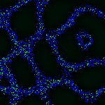

|  Method            | Parameters       | Quick Start Reader | Original Reader | Delta  |
| -------------------|------------------|--------------------|-----------------|------- |
| Initialization     |                  |16 ms|17 ms|        |
| Reader Size (Mb)     |                  |1.98|2.55|        |
# [Z=5_CH=1.czi](https://zenodo.org/record/7015307/files/Z%3D5_CH%3D1.czi) report
 - **Autostitch** = false
 - ZeissCZIReader v6.14.0
 - ZeissQuickStartCZIReader v0.2.1-SNAPSHOT

# Images 

| Series            | Quick Start Reader | Size | Original Reader | Size | #Diffs |
|-------------------|--------------------|------|-----------------|------|--------|
| Read time (all)   |36 ms|------|42 ms|------|--------|
|0||X:256 Y:256 C:1 Z:5 T:1||X:256 Y:256 C:1 Z:5 T:1|0|

# Metadata

