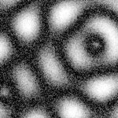
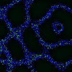

# [Z=5_CH=1.czi](https://zenodo.org/record/7015307/files/Z%3D5_CH%3D1.czi) report
 - **Autostitch** = true
 - ZeissCZIReader v6.14.0
 - ZeissQuickStartCZIReader v0.1.7-SNAPSHOT

# Images 

| Series            | Quick Start Reader | Size | Original Reader | Size |
|-------------------|--------------------|------|-----------------|------|
| Read time (all)   |37 ms|------|45 ms|------|
|0||X:256 Y:256 C:1 Z:5 T:1||X:256 Y:256 C:1 Z:5 T:1|

# Metadata

|  Method            | Parameters       | Quick Start Reader | Original Reader | Delta  |
| -------------------|------------------|--------------------|-----------------|------- |
| Initialization     |                  |16 ms|16 ms|        |
| Reader Size (Mb)     |                  |1.98|2.55|        |
| getPlaneDeltaT| Image 0 Plane 1 |  0.396 s |  0.447 s | 0.051 s |
| getPlaneDeltaT| Image 0 Plane 2 |  0.544 s |  0.633 s | 0.089 s |
| getPlaneDeltaT| Image 0 Plane 3 |  0.693 s |  0.819 s | 0.126 s |
| getPlaneDeltaT| Image 0 Plane 4 |  0.841 s |  0.990 s | 0.149 s |
