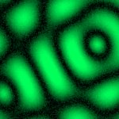

# [Z=5_CH=2.czi](https://zenodo.org/record/7015307/files/Z%3D5_CH%3D2.czi) report
 - **Autostitch** = false
 - ZeissCZIReader v6.14.0
 - ZeissQuickStartCZIReader v0.1.7-SNAPSHOT

# Images 

| Series            | Quick Start Reader | Size | Original Reader | Size |
|-------------------|--------------------|------|-----------------|------|
| Read time (all)   |59 ms|------|49 ms|------|
|0||X:256 Y:256 C:2 Z:5 T:1||X:256 Y:256 C:2 Z:5 T:1|

# Metadata

|  Method            | Parameters       | Quick Start Reader | Original Reader | Delta  |
| -------------------|------------------|--------------------|-----------------|------- |
| Initialization     |                  |19 ms|18 ms|        |
| Reader Size (Mb)     |                  |1.98|2.56|        |
| getStageLabelName| Image 0 | Current-Position| Scene position #0| |
| getPlaneDeltaT| Image 0 Plane 2 |  0.437 s |  0.509 s | 0.072 s |
| getPlaneDeltaT| Image 0 Plane 3 |  0.480 s |  0.541 s | 0.061 s |
| getPlaneDeltaT| Image 0 Plane 4 |  0.611 s |  0.726 s | 0.115 s |
| getPlaneDeltaT| Image 0 Plane 5 |  0.651 s |  0.757 s | 0.106 s |
| getPlaneDeltaT| Image 0 Plane 6 |  0.784 s |  0.929 s | 0.145 s |
| getPlaneDeltaT| Image 0 Plane 7 |  0.821 s |  0.960 s | 0.139 s |
| getPlaneDeltaT| Image 0 Plane 8 |  0.958 s |  1.132 s | 0.174 s |
| getPlaneDeltaT| Image 0 Plane 9 |  0.992 s |  1.163 s | 0.171 s |
