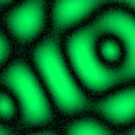
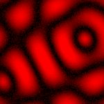

# [Z=5_CH=2.czi](https://zenodo.org/record/7015307/files/Z%3D5_CH%3D2.czi) report
 - **Autostitch** = true
 - ZeissCZIReader v6.14.0
 - ZeissQuickStartCZIReader v0.1.8-SNAPSHOT

# Images 

| Series            | Quick Start Reader | Size | Original Reader | Size | #Diffs |
|-------------------|--------------------|------|-----------------|------|--------|
| Read time (all)   |52 ms|------|59 ms|------|--------|
|0||X:256 Y:256 C:2 Z:5 T:1||X:256 Y:256 C:2 Z:5 T:1|0|

# Metadata

|  Method            | Parameters       | Quick Start Reader | Original Reader | Delta  |
| -------------------|------------------|--------------------|-----------------|------- |
| Initialization     |                  |20 ms|21 ms|        |
| Reader Size (Mb)     |                  |1.98|2.56|        |
| getStageLabelName| Image 0 | Current-Position| Scene position #0| |
| getPlaneDeltaT| Image 0 Plane 2 |  0.480 s |  0.509 s | 0.029 s |
| getPlaneDeltaT| Image 0 Plane 3 |  0.523 s |  0.541 s | 0.018 s |
| getPlaneDeltaT| Image 0 Plane 4 |  0.697 s |  0.726 s | 0.029 s |
| getPlaneDeltaT| Image 0 Plane 5 |  0.736 s |  0.757 s | 0.021 s |
| getPlaneDeltaT| Image 0 Plane 6 |  0.915 s |  0.929 s | 0.014 s |
| getPlaneDeltaT| Image 0 Plane 7 |  0.950 s |  0.960 s | 0.010 s |
