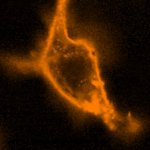
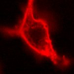

|  Method            | Parameters       | Quick Start Reader | Original Reader | Delta  |
| -------------------|------------------|--------------------|-----------------|------- |
| Initialization     |                  |11 ms|10 ms|        |
| Reader Size (Mb)     |                  |1.44|2.08|        |
# [dO 30 min nr 13.czi](https://zenodo.org/record/5714530/files/dO%2030%20min%20nr%2013.czi) report
 - **Autostitch** = true
 - ZeissCZIReader v7.1.0
 - ZeissQuickStartCZIReader v0.2.4-SNAPSHOT

# Images 

| Series            | Quick Start Reader | Size | Original Reader | Size | #Diffs |
|-------------------|--------------------|------|-----------------|------|--------|
| Read time (all)   |44 ms|------|52 ms|------|--------|
|0||X:506 Y:506 C:5 Z:1 T:1||X:506 Y:506 C:5 Z:1 T:1|0|

# Metadata

