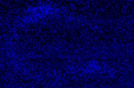

|  Method            | Parameters       | Quick Start Reader | Original Reader | Delta  |
| -------------------|------------------|--------------------|-----------------|------- |
| Initialization     |                  |12 ms|5 ms|        |
| Reader Size (Mb)     |                  |0.22|0.40|        |
# [daf-12 L1 1.czi](https://zenodo.org/record/5602160/files/daf-12%20L1%201.czi) report
 - **Autostitch** = false
 - ZeissCZIReader v6.14.0
 - ZeissQuickStartCZIReader v0.2.1-SNAPSHOT

# Images 

| Series            | Quick Start Reader | Size | Original Reader | Size | #Diffs |
|-------------------|--------------------|------|-----------------|------|--------|
| Read time (all)   |51 ms|------|69 ms|------|--------|
|0||X:932 Y:612 C:6 Z:19 T:1||X:932 Y:612 C:6 Z:19 T:1|0|

# Metadata

