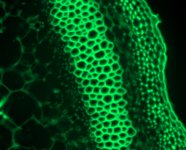

|  Method            | Parameters       | Quick Start Reader | Original Reader | Delta  |
| -------------------|------------------|--------------------|-----------------|------- |
| Initialization     |                  |7 ms|8 ms|        |
| Reader Size (Mb)     |                  |1.01|1.25|        |
# [example_image_2c_1z_1t_.czi](https://zenodo.org/record/5172827/files/example_image_2c_1z_1t_.czi) report
 - **Autostitch** = true
 - ZeissCZIReader v7.1.0
 - ZeissQuickStartCZIReader v0.2.4-SNAPSHOT

# Images 

| Series            | Quick Start Reader | Size | Original Reader | Size | #Diffs |
|-------------------|--------------------|------|-----------------|------|--------|
| Read time (all)   |190 ms|------|193 ms|------|--------|
|0||X:2752 Y:2208 C:2 Z:1 T:1||X:2752 Y:2208 C:2 Z:1 T:1|0|

# Metadata

