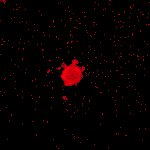
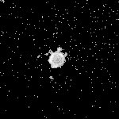

|  Method            | Parameters       | Quick Start Reader | Original Reader | Delta  |
| -------------------|------------------|--------------------|-----------------|------- |
| Initialization     |                  |12 ms|12 ms|        |
| Reader Size (Mb)     |                  |1.04|2.01|        |
# [group1-08.czi](https://zenodo.org/record/7240927/files/group1-08.czi) report
 - **Autostitch** = true
 - ZeissCZIReader v6.14.0
 - ZeissQuickStartCZIReader v0.2.1-SNAPSHOT

# Images 

| Series            | Quick Start Reader | Size | Original Reader | Size | #Diffs |
|-------------------|--------------------|------|-----------------|------|--------|
| Read time (all)   |42 ms|------|50 ms|------|--------|
|0||X:1024 Y:1024 C:2 Z:30 T:1||X:1024 Y:1024 C:2 Z:30 T:1|0|

# Metadata

