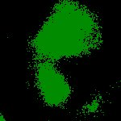
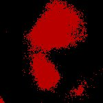

|  Method            | Parameters       | Quick Start Reader | Original Reader | Delta  |
| -------------------|------------------|--------------------|-----------------|------- |
| Initialization     |                  |23 ms|23 ms|        |
| Reader Size (Mb)     |                  |0.36|0.78|        |
| getStageLabelX| Image 0 | -4168.941 um | -429.424 um | 3739.517 um |
| getStageLabelY| Image 0 | 1450.507 um | -2289.010 um | 3739.517 um |
| getPlanePositionX| Image 0 Plane 0 | -4168.941 um | -429.424 um | 3739.517 um |
| getPlanePositionY| Image 0 Plane 0 | 1450.507 um | -2289.010 um | 3739.517 um |
| getPlanePositionX| Image 0 Plane 1 | -4168.941 um | -429.424 um | 3739.517 um |
| getPlanePositionY| Image 0 Plane 1 | 1450.507 um | -2289.010 um | 3739.517 um |
| getPlanePositionX| Image 0 Plane 2 | -4168.941 um | -429.424 um | 3739.517 um |
| getPlanePositionY| Image 0 Plane 2 | 1450.507 um | -2289.010 um | 3739.517 um |
| getPlanePositionX| Image 0 Plane 3 | -4168.941 um | -429.424 um | 3739.517 um |
| getPlanePositionY| Image 0 Plane 3 | 1450.507 um | -2289.010 um | 3739.517 um |
| getPlanePositionX| Image 0 Plane 4 | -4168.941 um | -429.424 um | 3739.517 um |
| getPlanePositionY| Image 0 Plane 4 | 1450.507 um | -2289.010 um | 3739.517 um |
| getPlanePositionX| Image 0 Plane 5 | -4168.941 um | -429.424 um | 3739.517 um |
| getPlanePositionY| Image 0 Plane 5 | 1450.507 um | -2289.010 um | 3739.517 um |
| getPlanePositionX| Image 0 Plane 6 | -4168.941 um | -429.424 um | 3739.517 um |
| getPlanePositionY| Image 0 Plane 6 | 1450.507 um | -2289.010 um | 3739.517 um |
| getPlanePositionX| Image 0 Plane 7 | -4168.941 um | -429.424 um | 3739.517 um |
| getPlanePositionY| Image 0 Plane 7 | 1450.507 um | -2289.010 um | 3739.517 um |
| getPlanePositionX| Image 0 Plane 8 | -4168.941 um | -429.424 um | 3739.517 um |
| getPlanePositionY| Image 0 Plane 8 | 1450.507 um | -2289.010 um | 3739.517 um |
| getPlanePositionX| Image 0 Plane 9 | -4168.941 um | -429.424 um | 3739.517 um |
| getPlanePositionY| Image 0 Plane 9 | 1450.507 um | -2289.010 um | 3739.517 um |
| getPlanePositionX| Image 0 Plane 10 | -4168.941 um | -429.424 um | 3739.517 um |
| getPlanePositionY| Image 0 Plane 10 | 1450.507 um | -2289.010 um | 3739.517 um |
| getPlanePositionX| Image 0 Plane 11 | -4168.941 um | -429.424 um | 3739.517 um |
| getPlanePositionY| Image 0 Plane 11 | 1450.507 um | -2289.010 um | 3739.517 um |
| getPlanePositionX| Image 0 Plane 12 | -4168.941 um | -429.424 um | 3739.517 um |
| getPlanePositionY| Image 0 Plane 12 | 1450.507 um | -2289.010 um | 3739.517 um |
| getPlanePositionX| Image 0 Plane 13 | -4168.941 um | -429.424 um | 3739.517 um |
| getPlanePositionY| Image 0 Plane 13 | 1450.507 um | -2289.010 um | 3739.517 um |
| getPlanePositionX| Image 0 Plane 14 | -4168.941 um | -429.424 um | 3739.517 um |
| getPlanePositionY| Image 0 Plane 14 | 1450.507 um | -2289.010 um | 3739.517 um |
| getPlanePositionX| Image 0 Plane 15 | -4168.941 um | -429.424 um | 3739.517 um |
| getPlanePositionY| Image 0 Plane 15 | 1450.507 um | -2289.010 um | 3739.517 um |
| getPlanePositionX| Image 0 Plane 16 | -4168.941 um | -429.424 um | 3739.517 um |
| getPlanePositionY| Image 0 Plane 16 | 1450.507 um | -2289.010 um | 3739.517 um |
| getPlanePositionX| Image 0 Plane 17 | -4168.941 um | -429.424 um | 3739.517 um |
| getPlanePositionY| Image 0 Plane 17 | 1450.507 um | -2289.010 um | 3739.517 um |
| getPlanePositionX| Image 0 Plane 18 | -4168.941 um | -429.424 um | 3739.517 um |
| getPlanePositionY| Image 0 Plane 18 | 1450.507 um | -2289.010 um | 3739.517 um |
| getPlanePositionX| Image 0 Plane 19 | -4168.941 um | -429.424 um | 3739.517 um |
| getPlanePositionY| Image 0 Plane 19 | 1450.507 um | -2289.010 um | 3739.517 um |
| getPlanePositionX| Image 0 Plane 20 | -4168.941 um | -429.424 um | 3739.517 um |
| getPlanePositionY| Image 0 Plane 20 | 1450.507 um | -2289.010 um | 3739.517 um |
| getPlanePositionX| Image 0 Plane 21 | -4168.941 um | -429.424 um | 3739.517 um |
| getPlanePositionY| Image 0 Plane 21 | 1450.507 um | -2289.010 um | 3739.517 um |
| getPlanePositionX| Image 0 Plane 22 | -4168.941 um | -429.424 um | 3739.517 um |
| getPlanePositionY| Image 0 Plane 22 | 1450.507 um | -2289.010 um | 3739.517 um |
| getPlanePositionX| Image 0 Plane 23 | -4168.941 um | -429.424 um | 3739.517 um |
| getPlanePositionY| Image 0 Plane 23 | 1450.507 um | -2289.010 um | 3739.517 um |
| getPlanePositionX| Image 0 Plane 24 | -4168.941 um | -429.424 um | 3739.517 um |
| getPlanePositionY| Image 0 Plane 24 | 1450.507 um | -2289.010 um | 3739.517 um |
| getPlanePositionX| Image 0 Plane 25 | -4168.941 um | -429.424 um | 3739.517 um |
| getPlanePositionY| Image 0 Plane 25 | 1450.507 um | -2289.010 um | 3739.517 um |
| getPlanePositionX| Image 0 Plane 26 | -4168.941 um | -429.424 um | 3739.517 um |
| getPlanePositionY| Image 0 Plane 26 | 1450.507 um | -2289.010 um | 3739.517 um |
| getPlanePositionX| Image 0 Plane 27 | -4168.941 um | -429.424 um | 3739.517 um |
| getPlanePositionY| Image 0 Plane 27 | 1450.507 um | -2289.010 um | 3739.517 um |
| getPlanePositionX| Image 0 Plane 28 | -4168.941 um | -429.424 um | 3739.517 um |
| getPlanePositionY| Image 0 Plane 28 | 1450.507 um | -2289.010 um | 3739.517 um |
| getPlanePositionX| Image 0 Plane 29 | -4168.941 um | -429.424 um | 3739.517 um |
| getPlanePositionY| Image 0 Plane 29 | 1450.507 um | -2289.010 um | 3739.517 um |
| getPlanePositionX| Image 0 Plane 30 | -4168.941 um | -429.424 um | 3739.517 um |
| getPlanePositionY| Image 0 Plane 30 | 1450.507 um | -2289.010 um | 3739.517 um |
| getPlanePositionX| Image 0 Plane 31 | -4168.941 um | -429.424 um | 3739.517 um |
| getPlanePositionY| Image 0 Plane 31 | 1450.507 um | -2289.010 um | 3739.517 um |
| getPlanePositionX| Image 0 Plane 32 | -4168.941 um | -429.424 um | 3739.517 um |
| getPlanePositionY| Image 0 Plane 32 | 1450.507 um | -2289.010 um | 3739.517 um |
| getPlanePositionX| Image 0 Plane 33 | -4168.941 um | -429.424 um | 3739.517 um |
| getPlanePositionY| Image 0 Plane 33 | 1450.507 um | -2289.010 um | 3739.517 um |
| getPlanePositionX| Image 0 Plane 34 | -4168.941 um | -429.424 um | 3739.517 um |
| getPlanePositionY| Image 0 Plane 34 | 1450.507 um | -2289.010 um | 3739.517 um |
| getPlanePositionX| Image 0 Plane 35 | -4168.941 um | -429.424 um | 3739.517 um |
| getPlanePositionY| Image 0 Plane 35 | 1450.507 um | -2289.010 um | 3739.517 um |
| getPlanePositionX| Image 0 Plane 36 | -4168.941 um | -429.424 um | 3739.517 um |
| getPlanePositionY| Image 0 Plane 36 | 1450.507 um | -2289.010 um | 3739.517 um |
| getPlanePositionX| Image 0 Plane 37 | -4168.941 um | -429.424 um | 3739.517 um |
| getPlanePositionY| Image 0 Plane 37 | 1450.507 um | -2289.010 um | 3739.517 um |
| getPlanePositionX| Image 0 Plane 38 | -4168.941 um | -429.424 um | 3739.517 um |
| getPlanePositionY| Image 0 Plane 38 | 1450.507 um | -2289.010 um | 3739.517 um |
| getPlanePositionX| Image 0 Plane 39 | -4168.941 um | -429.424 um | 3739.517 um |
| getPlanePositionY| Image 0 Plane 39 | 1450.507 um | -2289.010 um | 3739.517 um |
| getPlanePositionX| Image 0 Plane 40 | -4168.941 um | -429.424 um | 3739.517 um |
| getPlanePositionY| Image 0 Plane 40 | 1450.507 um | -2289.010 um | 3739.517 um |
| getPlanePositionX| Image 0 Plane 41 | -4168.941 um | -429.424 um | 3739.517 um |
| getPlanePositionY| Image 0 Plane 41 | 1450.507 um | -2289.010 um | 3739.517 um |
| getPlanePositionX| Image 0 Plane 42 | -4168.941 um | -429.424 um | 3739.517 um |
| getPlanePositionY| Image 0 Plane 42 | 1450.507 um | -2289.010 um | 3739.517 um |
| getPlanePositionX| Image 0 Plane 43 | -4168.941 um | -429.424 um | 3739.517 um |
| getPlanePositionY| Image 0 Plane 43 | 1450.507 um | -2289.010 um | 3739.517 um |
| getPlanePositionX| Image 0 Plane 44 | -4168.941 um | -429.424 um | 3739.517 um |
| getPlanePositionY| Image 0 Plane 44 | 1450.507 um | -2289.010 um | 3739.517 um |
| getPlanePositionX| Image 0 Plane 45 | -4168.941 um | -429.424 um | 3739.517 um |
| getPlanePositionY| Image 0 Plane 45 | 1450.507 um | -2289.010 um | 3739.517 um |
| getPlanePositionX| Image 0 Plane 46 | -4168.941 um | -429.424 um | 3739.517 um |
| getPlanePositionY| Image 0 Plane 46 | 1450.507 um | -2289.010 um | 3739.517 um |
| getPlanePositionX| Image 0 Plane 47 | -4168.941 um | -429.424 um | 3739.517 um |
| getPlanePositionY| Image 0 Plane 47 | 1450.507 um | -2289.010 um | 3739.517 um |
| getPlanePositionX| Image 0 Plane 48 | -4168.941 um | -429.424 um | 3739.517 um |
| getPlanePositionY| Image 0 Plane 48 | 1450.507 um | -2289.010 um | 3739.517 um |
| getPlanePositionX| Image 0 Plane 49 | -4168.941 um | -429.424 um | 3739.517 um |
| getPlanePositionY| Image 0 Plane 49 | 1450.507 um | -2289.010 um | 3739.517 um |
| getPlanePositionX| Image 0 Plane 50 | -4168.941 um | -429.424 um | 3739.517 um |
| getPlanePositionY| Image 0 Plane 50 | 1450.507 um | -2289.010 um | 3739.517 um |
| getPlanePositionX| Image 0 Plane 51 | -4168.941 um | -429.424 um | 3739.517 um |
| getPlanePositionY| Image 0 Plane 51 | 1450.507 um | -2289.010 um | 3739.517 um |
| getPlanePositionX| Image 0 Plane 52 | -4168.941 um | -429.424 um | 3739.517 um |
| getPlanePositionY| Image 0 Plane 52 | 1450.507 um | -2289.010 um | 3739.517 um |
| getPlanePositionX| Image 0 Plane 53 | -4168.941 um | -429.424 um | 3739.517 um |
| getPlanePositionY| Image 0 Plane 53 | 1450.507 um | -2289.010 um | 3739.517 um |
| getPlanePositionX| Image 0 Plane 54 | -4168.941 um | -429.424 um | 3739.517 um |
| getPlanePositionY| Image 0 Plane 54 | 1450.507 um | -2289.010 um | 3739.517 um |
| getPlanePositionX| Image 0 Plane 55 | -4168.941 um | -429.424 um | 3739.517 um |
| getPlanePositionY| Image 0 Plane 55 | 1450.507 um | -2289.010 um | 3739.517 um |
| getPlanePositionX| Image 0 Plane 56 | -4168.941 um | -429.424 um | 3739.517 um |
| getPlanePositionY| Image 0 Plane 56 | 1450.507 um | -2289.010 um | 3739.517 um |
| getPlanePositionX| Image 0 Plane 57 | -4168.941 um | -429.424 um | 3739.517 um |
| getPlanePositionY| Image 0 Plane 57 | 1450.507 um | -2289.010 um | 3739.517 um |
| getPlanePositionX| Image 0 Plane 58 | -4168.941 um | -429.424 um | 3739.517 um |
| getPlanePositionY| Image 0 Plane 58 | 1450.507 um | -2289.010 um | 3739.517 um |
| getPlanePositionX| Image 0 Plane 59 | -4168.941 um | -429.424 um | 3739.517 um |
| getPlanePositionY| Image 0 Plane 59 | 1450.507 um | -2289.010 um | 3739.517 um |
| getPlanePositionX| Image 0 Plane 60 | -4168.941 um | -429.424 um | 3739.517 um |
| getPlanePositionY| Image 0 Plane 60 | 1450.507 um | -2289.010 um | 3739.517 um |
| getPlanePositionX| Image 0 Plane 61 | -4168.941 um | -429.424 um | 3739.517 um |
| getPlanePositionY| Image 0 Plane 61 | 1450.507 um | -2289.010 um | 3739.517 um |
| getPlanePositionX| Image 0 Plane 62 | -4168.941 um | -429.424 um | 3739.517 um |
| getPlanePositionY| Image 0 Plane 62 | 1450.507 um | -2289.010 um | 3739.517 um |
| getPlanePositionX| Image 0 Plane 63 | -4168.941 um | -429.424 um | 3739.517 um |
| getPlanePositionY| Image 0 Plane 63 | 1450.507 um | -2289.010 um | 3739.517 um |
| getPlanePositionX| Image 0 Plane 64 | -4168.941 um | -429.424 um | 3739.517 um |
| getPlanePositionY| Image 0 Plane 64 | 1450.507 um | -2289.010 um | 3739.517 um |
| getPlanePositionX| Image 0 Plane 65 | -4168.941 um | -429.424 um | 3739.517 um |
| getPlanePositionY| Image 0 Plane 65 | 1450.507 um | -2289.010 um | 3739.517 um |
| getPlanePositionX| Image 0 Plane 66 | -4168.941 um | -429.424 um | 3739.517 um |
| getPlanePositionY| Image 0 Plane 66 | 1450.507 um | -2289.010 um | 3739.517 um |
| getPlanePositionX| Image 0 Plane 67 | -4168.941 um | -429.424 um | 3739.517 um |
| getPlanePositionY| Image 0 Plane 67 | 1450.507 um | -2289.010 um | 3739.517 um |
| getPlanePositionX| Image 0 Plane 68 | -4168.941 um | -429.424 um | 3739.517 um |
| getPlanePositionY| Image 0 Plane 68 | 1450.507 um | -2289.010 um | 3739.517 um |
| getPlanePositionX| Image 0 Plane 69 | -4168.941 um | -429.424 um | 3739.517 um |
| getPlanePositionY| Image 0 Plane 69 | 1450.507 um | -2289.010 um | 3739.517 um |
| getPlanePositionX| Image 0 Plane 70 | -4168.941 um | -429.424 um | 3739.517 um |
| getPlanePositionY| Image 0 Plane 70 | 1450.507 um | -2289.010 um | 3739.517 um |
| getPlanePositionX| Image 0 Plane 71 | -4168.941 um | -429.424 um | 3739.517 um |
| getPlanePositionY| Image 0 Plane 71 | 1450.507 um | -2289.010 um | 3739.517 um |
| getPlanePositionX| Image 0 Plane 72 | -4168.941 um | -429.424 um | 3739.517 um |
| getPlanePositionY| Image 0 Plane 72 | 1450.507 um | -2289.010 um | 3739.517 um |
| getPlanePositionX| Image 0 Plane 73 | -4168.941 um | -429.424 um | 3739.517 um |
| getPlanePositionY| Image 0 Plane 73 | 1450.507 um | -2289.010 um | 3739.517 um |
| getPlanePositionX| Image 0 Plane 74 | -4168.941 um | -429.424 um | 3739.517 um |
| getPlanePositionY| Image 0 Plane 74 | 1450.507 um | -2289.010 um | 3739.517 um |
| getPlanePositionX| Image 0 Plane 75 | -4168.941 um | -429.424 um | 3739.517 um |
| getPlanePositionY| Image 0 Plane 75 | 1450.507 um | -2289.010 um | 3739.517 um |
| getPlanePositionX| Image 0 Plane 76 | -4168.941 um | -429.424 um | 3739.517 um |
| getPlanePositionY| Image 0 Plane 76 | 1450.507 um | -2289.010 um | 3739.517 um |
| getPlanePositionX| Image 0 Plane 77 | -4168.941 um | -429.424 um | 3739.517 um |
| getPlanePositionY| Image 0 Plane 77 | 1450.507 um | -2289.010 um | 3739.517 um |
| getPlanePositionX| Image 0 Plane 78 | -4168.941 um | -429.424 um | 3739.517 um |
| getPlanePositionY| Image 0 Plane 78 | 1450.507 um | -2289.010 um | 3739.517 um |
| getPlanePositionX| Image 0 Plane 79 | -4168.941 um | -429.424 um | 3739.517 um |
| getPlanePositionY| Image 0 Plane 79 | 1450.507 um | -2289.010 um | 3739.517 um |
| getPlanePositionX| Image 0 Plane 80 | -4168.941 um | -429.424 um | 3739.517 um |
| getPlanePositionY| Image 0 Plane 80 | 1450.507 um | -2289.010 um | 3739.517 um |
| getPlanePositionX| Image 0 Plane 81 | -4168.941 um | -429.424 um | 3739.517 um |
| getPlanePositionY| Image 0 Plane 81 | 1450.507 um | -2289.010 um | 3739.517 um |
| getPlanePositionX| Image 0 Plane 82 | -4168.941 um | -429.424 um | 3739.517 um |
| getPlanePositionY| Image 0 Plane 82 | 1450.507 um | -2289.010 um | 3739.517 um |
| getPlanePositionX| Image 0 Plane 83 | -4168.941 um | -429.424 um | 3739.517 um |
| getPlanePositionY| Image 0 Plane 83 | 1450.507 um | -2289.010 um | 3739.517 um |
| getPlanePositionX| Image 0 Plane 84 | -4168.941 um | -429.424 um | 3739.517 um |
| getPlanePositionY| Image 0 Plane 84 | 1450.507 um | -2289.010 um | 3739.517 um |
| getPlanePositionX| Image 0 Plane 85 | -4168.941 um | -429.424 um | 3739.517 um |
| getPlanePositionY| Image 0 Plane 85 | 1450.507 um | -2289.010 um | 3739.517 um |
| getPlanePositionX| Image 0 Plane 86 | -4168.941 um | -429.424 um | 3739.517 um |
| getPlanePositionY| Image 0 Plane 86 | 1450.507 um | -2289.010 um | 3739.517 um |
| getPlanePositionX| Image 0 Plane 87 | -4168.941 um | -429.424 um | 3739.517 um |
| getPlanePositionY| Image 0 Plane 87 | 1450.507 um | -2289.010 um | 3739.517 um |
| getPlanePositionX| Image 0 Plane 88 | -4168.941 um | -429.424 um | 3739.517 um |
| getPlanePositionY| Image 0 Plane 88 | 1450.507 um | -2289.010 um | 3739.517 um |
| getPlanePositionX| Image 0 Plane 89 | -4168.941 um | -429.424 um | 3739.517 um |
| getPlanePositionY| Image 0 Plane 89 | 1450.507 um | -2289.010 um | 3739.517 um |
| getPlanePositionX| Image 0 Plane 90 | -4168.941 um | -429.424 um | 3739.517 um |
| getPlanePositionY| Image 0 Plane 90 | 1450.507 um | -2289.010 um | 3739.517 um |
| getPlanePositionX| Image 0 Plane 91 | -4168.941 um | -429.424 um | 3739.517 um |
| getPlanePositionY| Image 0 Plane 91 | 1450.507 um | -2289.010 um | 3739.517 um |
| getPlanePositionX| Image 0 Plane 92 | -4168.941 um | -429.424 um | 3739.517 um |
| getPlanePositionY| Image 0 Plane 92 | 1450.507 um | -2289.010 um | 3739.517 um |
| getPlanePositionX| Image 0 Plane 93 | -4168.941 um | -429.424 um | 3739.517 um |
| getPlanePositionY| Image 0 Plane 93 | 1450.507 um | -2289.010 um | 3739.517 um |
| getPlanePositionX| Image 0 Plane 94 | -4168.941 um | -429.424 um | 3739.517 um |
| getPlanePositionY| Image 0 Plane 94 | 1450.507 um | -2289.010 um | 3739.517 um |
| getPlanePositionX| Image 0 Plane 95 | -4168.941 um | -429.424 um | 3739.517 um |
| getPlanePositionY| Image 0 Plane 95 | 1450.507 um | -2289.010 um | 3739.517 um |
| getPlanePositionX| Image 0 Plane 96 | -4168.941 um | -429.424 um | 3739.517 um |
| getPlanePositionY| Image 0 Plane 96 | 1450.507 um | -2289.010 um | 3739.517 um |
| getPlanePositionX| Image 0 Plane 97 | -4168.941 um | -429.424 um | 3739.517 um |
| getPlanePositionY| Image 0 Plane 97 | 1450.507 um | -2289.010 um | 3739.517 um |
| getPlanePositionX| Image 0 Plane 98 | -4168.941 um | -429.424 um | 3739.517 um |
| getPlanePositionY| Image 0 Plane 98 | 1450.507 um | -2289.010 um | 3739.517 um |
| getPlanePositionX| Image 0 Plane 99 | -4168.941 um | -429.424 um | 3739.517 um |
| getPlanePositionY| Image 0 Plane 99 | 1450.507 um | -2289.010 um | 3739.517 um |
| getPlanePositionX| Image 0 Plane 100 | -4168.941 um | -429.424 um | 3739.517 um |
| getPlanePositionY| Image 0 Plane 100 | 1450.507 um | -2289.010 um | 3739.517 um |
| getPlanePositionX| Image 0 Plane 101 | -4168.941 um | -429.424 um | 3739.517 um |
| getPlanePositionY| Image 0 Plane 101 | 1450.507 um | -2289.010 um | 3739.517 um |
| getPlanePositionX| Image 0 Plane 102 | -4168.941 um | -429.424 um | 3739.517 um |
| getPlanePositionY| Image 0 Plane 102 | 1450.507 um | -2289.010 um | 3739.517 um |
| getPlanePositionX| Image 0 Plane 103 | -4168.941 um | -429.424 um | 3739.517 um |
| getPlanePositionY| Image 0 Plane 103 | 1450.507 um | -2289.010 um | 3739.517 um |
| getPlanePositionX| Image 0 Plane 104 | -4168.941 um | -429.424 um | 3739.517 um |
| getPlanePositionY| Image 0 Plane 104 | 1450.507 um | -2289.010 um | 3739.517 um |
| getPlanePositionX| Image 0 Plane 105 | -4168.941 um | -429.424 um | 3739.517 um |
| getPlanePositionY| Image 0 Plane 105 | 1450.507 um | -2289.010 um | 3739.517 um |
| getPlanePositionX| Image 0 Plane 106 | -4168.941 um | -429.424 um | 3739.517 um |
| getPlanePositionY| Image 0 Plane 106 | 1450.507 um | -2289.010 um | 3739.517 um |
| getPlanePositionX| Image 0 Plane 107 | -4168.941 um | -429.424 um | 3739.517 um |
| getPlanePositionY| Image 0 Plane 107 | 1450.507 um | -2289.010 um | 3739.517 um |
| getPlanePositionX| Image 0 Plane 108 | -4168.941 um | -429.424 um | 3739.517 um |
| getPlanePositionY| Image 0 Plane 108 | 1450.507 um | -2289.010 um | 3739.517 um |
| getPlanePositionX| Image 0 Plane 109 | -4168.941 um | -429.424 um | 3739.517 um |
| getPlanePositionY| Image 0 Plane 109 | 1450.507 um | -2289.010 um | 3739.517 um |
| getPlanePositionX| Image 0 Plane 110 | -4168.941 um | -429.424 um | 3739.517 um |
| getPlanePositionY| Image 0 Plane 110 | 1450.507 um | -2289.010 um | 3739.517 um |
| getPlanePositionX| Image 0 Plane 111 | -4168.941 um | -429.424 um | 3739.517 um |
| getPlanePositionY| Image 0 Plane 111 | 1450.507 um | -2289.010 um | 3739.517 um |
| getPlanePositionX| Image 0 Plane 112 | -4168.941 um | -429.424 um | 3739.517 um |
| getPlanePositionY| Image 0 Plane 112 | 1450.507 um | -2289.010 um | 3739.517 um |
| getPlanePositionX| Image 0 Plane 113 | -4168.941 um | -429.424 um | 3739.517 um |
| getPlanePositionY| Image 0 Plane 113 | 1450.507 um | -2289.010 um | 3739.517 um |
| getPlanePositionX| Image 0 Plane 114 | -4168.941 um | -429.424 um | 3739.517 um |
| getPlanePositionY| Image 0 Plane 114 | 1450.507 um | -2289.010 um | 3739.517 um |
| getPlanePositionX| Image 0 Plane 115 | -4168.941 um | -429.424 um | 3739.517 um |
| getPlanePositionY| Image 0 Plane 115 | 1450.507 um | -2289.010 um | 3739.517 um |
| getPlanePositionX| Image 0 Plane 116 | -4168.941 um | -429.424 um | 3739.517 um |
| getPlanePositionY| Image 0 Plane 116 | 1450.507 um | -2289.010 um | 3739.517 um |
| getPlanePositionX| Image 0 Plane 117 | -4168.941 um | -429.424 um | 3739.517 um |
| getPlanePositionY| Image 0 Plane 117 | 1450.507 um | -2289.010 um | 3739.517 um |
| getPlanePositionX| Image 0 Plane 118 | -4168.941 um | -429.424 um | 3739.517 um |
| getPlanePositionY| Image 0 Plane 118 | 1450.507 um | -2289.010 um | 3739.517 um |
| getPlanePositionX| Image 0 Plane 119 | -4168.941 um | -429.424 um | 3739.517 um |
| getPlanePositionY| Image 0 Plane 119 | 1450.507 um | -2289.010 um | 3739.517 um |
| getPlanePositionX| Image 0 Plane 120 | -4168.941 um | -429.424 um | 3739.517 um |
| getPlanePositionY| Image 0 Plane 120 | 1450.507 um | -2289.010 um | 3739.517 um |
| getPlanePositionX| Image 0 Plane 121 | -4168.941 um | -429.424 um | 3739.517 um |
| getPlanePositionY| Image 0 Plane 121 | 1450.507 um | -2289.010 um | 3739.517 um |
| getPlanePositionX| Image 0 Plane 122 | -4168.941 um | -429.424 um | 3739.517 um |
| getPlanePositionY| Image 0 Plane 122 | 1450.507 um | -2289.010 um | 3739.517 um |
| getPlanePositionX| Image 0 Plane 123 | -4168.941 um | -429.424 um | 3739.517 um |
| getPlanePositionY| Image 0 Plane 123 | 1450.507 um | -2289.010 um | 3739.517 um |
| getPlanePositionX| Image 0 Plane 124 | -4168.941 um | -429.424 um | 3739.517 um |
| getPlanePositionY| Image 0 Plane 124 | 1450.507 um | -2289.010 um | 3739.517 um |
| getPlanePositionX| Image 0 Plane 125 | -4168.941 um | -429.424 um | 3739.517 um |
| getPlanePositionY| Image 0 Plane 125 | 1450.507 um | -2289.010 um | 3739.517 um |
| getPlanePositionX| Image 0 Plane 126 | -4168.941 um | -429.424 um | 3739.517 um |
| getPlanePositionY| Image 0 Plane 126 | 1450.507 um | -2289.010 um | 3739.517 um |
| getPlanePositionX| Image 0 Plane 127 | -4168.941 um | -429.424 um | 3739.517 um |
| getPlanePositionY| Image 0 Plane 127 | 1450.507 um | -2289.010 um | 3739.517 um |
| getPlanePositionX| Image 0 Plane 128 | -4168.941 um | -429.424 um | 3739.517 um |
| getPlanePositionY| Image 0 Plane 128 | 1450.507 um | -2289.010 um | 3739.517 um |
| getPlanePositionX| Image 0 Plane 129 | -4168.941 um | -429.424 um | 3739.517 um |
| getPlanePositionY| Image 0 Plane 129 | 1450.507 um | -2289.010 um | 3739.517 um |
| getPlanePositionX| Image 0 Plane 130 | -4168.941 um | -429.424 um | 3739.517 um |
| getPlanePositionY| Image 0 Plane 130 | 1450.507 um | -2289.010 um | 3739.517 um |
| getPlanePositionX| Image 0 Plane 131 | -4168.941 um | -429.424 um | 3739.517 um |
| getPlanePositionY| Image 0 Plane 131 | 1450.507 um | -2289.010 um | 3739.517 um |
| getPlanePositionX| Image 0 Plane 132 | -4168.941 um | -429.424 um | 3739.517 um |
| getPlanePositionY| Image 0 Plane 132 | 1450.507 um | -2289.010 um | 3739.517 um |
| getPlanePositionX| Image 0 Plane 133 | -4168.941 um | -429.424 um | 3739.517 um |
| getPlanePositionY| Image 0 Plane 133 | 1450.507 um | -2289.010 um | 3739.517 um |
| getPlanePositionX| Image 0 Plane 134 | -4168.941 um | -429.424 um | 3739.517 um |
| getPlanePositionY| Image 0 Plane 134 | 1450.507 um | -2289.010 um | 3739.517 um |
| getPlanePositionX| Image 0 Plane 135 | -4168.941 um | -429.424 um | 3739.517 um |
| getPlanePositionY| Image 0 Plane 135 | 1450.507 um | -2289.010 um | 3739.517 um |
| getPlanePositionX| Image 0 Plane 136 | -4168.941 um | -429.424 um | 3739.517 um |
| getPlanePositionY| Image 0 Plane 136 | 1450.507 um | -2289.010 um | 3739.517 um |
| getPlanePositionX| Image 0 Plane 137 | -4168.941 um | -429.424 um | 3739.517 um |
| getPlanePositionY| Image 0 Plane 137 | 1450.507 um | -2289.010 um | 3739.517 um |
| getPlanePositionX| Image 0 Plane 138 | -4168.941 um | -429.424 um | 3739.517 um |
| getPlanePositionY| Image 0 Plane 138 | 1450.507 um | -2289.010 um | 3739.517 um |
| getPlanePositionX| Image 0 Plane 139 | -4168.941 um | -429.424 um | 3739.517 um |
| getPlanePositionY| Image 0 Plane 139 | 1450.507 um | -2289.010 um | 3739.517 um |
| getPlanePositionX| Image 0 Plane 140 | -4168.941 um | -429.424 um | 3739.517 um |
| getPlanePositionY| Image 0 Plane 140 | 1450.507 um | -2289.010 um | 3739.517 um |
| getPlanePositionX| Image 0 Plane 141 | -4168.941 um | -429.424 um | 3739.517 um |
| getPlanePositionY| Image 0 Plane 141 | 1450.507 um | -2289.010 um | 3739.517 um |
| getPlanePositionX| Image 0 Plane 142 | -4168.941 um | -429.424 um | 3739.517 um |
| getPlanePositionY| Image 0 Plane 142 | 1450.507 um | -2289.010 um | 3739.517 um |
| getPlanePositionX| Image 0 Plane 143 | -4168.941 um | -429.424 um | 3739.517 um |
| getPlanePositionY| Image 0 Plane 143 | 1450.507 um | -2289.010 um | 3739.517 um |
| getPlanePositionX| Image 0 Plane 144 | -4168.941 um | -429.424 um | 3739.517 um |
| getPlanePositionY| Image 0 Plane 144 | 1450.507 um | -2289.010 um | 3739.517 um |
| getPlanePositionX| Image 0 Plane 145 | -4168.941 um | -429.424 um | 3739.517 um |
| getPlanePositionY| Image 0 Plane 145 | 1450.507 um | -2289.010 um | 3739.517 um |
| getPlanePositionX| Image 0 Plane 146 | -4168.941 um | -429.424 um | 3739.517 um |
| getPlanePositionY| Image 0 Plane 146 | 1450.507 um | -2289.010 um | 3739.517 um |
| getPlanePositionX| Image 0 Plane 147 | -4168.941 um | -429.424 um | 3739.517 um |
| getPlanePositionY| Image 0 Plane 147 | 1450.507 um | -2289.010 um | 3739.517 um |
| getPlanePositionX| Image 0 Plane 148 | -4168.941 um | -429.424 um | 3739.517 um |
| getPlanePositionY| Image 0 Plane 148 | 1450.507 um | -2289.010 um | 3739.517 um |
| getPlanePositionX| Image 0 Plane 149 | -4168.941 um | -429.424 um | 3739.517 um |
| getPlanePositionY| Image 0 Plane 149 | 1450.507 um | -2289.010 um | 3739.517 um |
| getPlanePositionX| Image 0 Plane 150 | -4168.941 um | -429.424 um | 3739.517 um |
| getPlanePositionY| Image 0 Plane 150 | 1450.507 um | -2289.010 um | 3739.517 um |
| getPlanePositionX| Image 0 Plane 151 | -4168.941 um | -429.424 um | 3739.517 um |
| getPlanePositionY| Image 0 Plane 151 | 1450.507 um | -2289.010 um | 3739.517 um |
| getPlanePositionX| Image 0 Plane 152 | -4168.941 um | -429.424 um | 3739.517 um |
| getPlanePositionY| Image 0 Plane 152 | 1450.507 um | -2289.010 um | 3739.517 um |
| getPlanePositionX| Image 0 Plane 153 | -4168.941 um | -429.424 um | 3739.517 um |
| getPlanePositionY| Image 0 Plane 153 | 1450.507 um | -2289.010 um | 3739.517 um |
| getPlanePositionX| Image 0 Plane 154 | -4168.941 um | -429.424 um | 3739.517 um |
| getPlanePositionY| Image 0 Plane 154 | 1450.507 um | -2289.010 um | 3739.517 um |
| getPlanePositionX| Image 0 Plane 155 | -4168.941 um | -429.424 um | 3739.517 um |
| getPlanePositionY| Image 0 Plane 155 | 1450.507 um | -2289.010 um | 3739.517 um |
| getPlanePositionX| Image 0 Plane 156 | -4168.941 um | -429.424 um | 3739.517 um |
| getPlanePositionY| Image 0 Plane 156 | 1450.507 um | -2289.010 um | 3739.517 um |
| getPlanePositionX| Image 0 Plane 157 | -4168.941 um | -429.424 um | 3739.517 um |
| getPlanePositionY| Image 0 Plane 157 | 1450.507 um | -2289.010 um | 3739.517 um |
| getPlanePositionX| Image 0 Plane 158 | -4168.941 um | -429.424 um | 3739.517 um |
| getPlanePositionY| Image 0 Plane 158 | 1450.507 um | -2289.010 um | 3739.517 um |
| getPlanePositionX| Image 0 Plane 159 | -4168.941 um | -429.424 um | 3739.517 um |
| getPlanePositionY| Image 0 Plane 159 | 1450.507 um | -2289.010 um | 3739.517 um |
| getPlanePositionX| Image 0 Plane 160 | -4168.941 um | -429.424 um | 3739.517 um |
| getPlanePositionY| Image 0 Plane 160 | 1450.507 um | -2289.010 um | 3739.517 um |
| getPlanePositionX| Image 0 Plane 161 | -4168.941 um | -429.424 um | 3739.517 um |
| getPlanePositionY| Image 0 Plane 161 | 1450.507 um | -2289.010 um | 3739.517 um |
| getPlanePositionX| Image 0 Plane 162 | -4168.941 um | -429.424 um | 3739.517 um |
| getPlanePositionY| Image 0 Plane 162 | 1450.507 um | -2289.010 um | 3739.517 um |
| getPlanePositionX| Image 0 Plane 163 | -4168.941 um | -429.424 um | 3739.517 um |
| getPlanePositionY| Image 0 Plane 163 | 1450.507 um | -2289.010 um | 3739.517 um |
| getPlanePositionX| Image 0 Plane 164 | -4168.941 um | -429.424 um | 3739.517 um |
| getPlanePositionY| Image 0 Plane 164 | 1450.507 um | -2289.010 um | 3739.517 um |
| getPlanePositionX| Image 0 Plane 165 | -4168.941 um | -429.424 um | 3739.517 um |
| getPlanePositionY| Image 0 Plane 165 | 1450.507 um | -2289.010 um | 3739.517 um |
| getPlanePositionX| Image 0 Plane 166 | -4168.941 um | -429.424 um | 3739.517 um |
| getPlanePositionY| Image 0 Plane 166 | 1450.507 um | -2289.010 um | 3739.517 um |
| getPlanePositionX| Image 0 Plane 167 | -4168.941 um | -429.424 um | 3739.517 um |
| getPlanePositionY| Image 0 Plane 167 | 1450.507 um | -2289.010 um | 3739.517 um |
| getPlanePositionX| Image 0 Plane 168 | -4168.941 um | -429.424 um | 3739.517 um |
| getPlanePositionY| Image 0 Plane 168 | 1450.507 um | -2289.010 um | 3739.517 um |
| getPlanePositionX| Image 0 Plane 169 | -4168.941 um | -429.424 um | 3739.517 um |
| getPlanePositionY| Image 0 Plane 169 | 1450.507 um | -2289.010 um | 3739.517 um |
| getPlanePositionX| Image 0 Plane 170 | -4168.941 um | -429.424 um | 3739.517 um |
| getPlanePositionY| Image 0 Plane 170 | 1450.507 um | -2289.010 um | 3739.517 um |
| getPlanePositionX| Image 0 Plane 171 | -4168.941 um | -429.424 um | 3739.517 um |
| getPlanePositionY| Image 0 Plane 171 | 1450.507 um | -2289.010 um | 3739.517 um |
| getPlanePositionX| Image 0 Plane 172 | -4168.941 um | -429.424 um | 3739.517 um |
| getPlanePositionY| Image 0 Plane 172 | 1450.507 um | -2289.010 um | 3739.517 um |
| getPlanePositionX| Image 0 Plane 173 | -4168.941 um | -429.424 um | 3739.517 um |
| getPlanePositionY| Image 0 Plane 173 | 1450.507 um | -2289.010 um | 3739.517 um |
| getPlanePositionX| Image 0 Plane 174 | -4168.941 um | -429.424 um | 3739.517 um |
| getPlanePositionY| Image 0 Plane 174 | 1450.507 um | -2289.010 um | 3739.517 um |
| getPlanePositionX| Image 0 Plane 175 | -4168.941 um | -429.424 um | 3739.517 um |
| getPlanePositionY| Image 0 Plane 175 | 1450.507 um | -2289.010 um | 3739.517 um |
| getPlanePositionX| Image 0 Plane 176 | -4168.941 um | -429.424 um | 3739.517 um |
| getPlanePositionY| Image 0 Plane 176 | 1450.507 um | -2289.010 um | 3739.517 um |
| getPlanePositionX| Image 0 Plane 177 | -4168.941 um | -429.424 um | 3739.517 um |
| getPlanePositionY| Image 0 Plane 177 | 1450.507 um | -2289.010 um | 3739.517 um |
| getPlanePositionX| Image 0 Plane 178 | -4168.941 um | -429.424 um | 3739.517 um |
| getPlanePositionY| Image 0 Plane 178 | 1450.507 um | -2289.010 um | 3739.517 um |
| getPlanePositionX| Image 0 Plane 179 | -4168.941 um | -429.424 um | 3739.517 um |
| getPlanePositionY| Image 0 Plane 179 | 1450.507 um | -2289.010 um | 3739.517 um |
| getPlanePositionX| Image 0 Plane 180 | -4168.941 um | -429.424 um | 3739.517 um |
| getPlanePositionY| Image 0 Plane 180 | 1450.507 um | -2289.010 um | 3739.517 um |
| getPlanePositionX| Image 0 Plane 181 | -4168.941 um | -429.424 um | 3739.517 um |
| getPlanePositionY| Image 0 Plane 181 | 1450.507 um | -2289.010 um | 3739.517 um |
| getPlanePositionX| Image 0 Plane 182 | -4168.941 um | -429.424 um | 3739.517 um |
| getPlanePositionY| Image 0 Plane 182 | 1450.507 um | -2289.010 um | 3739.517 um |
| getPlanePositionX| Image 0 Plane 183 | -4168.941 um | -429.424 um | 3739.517 um |
| getPlanePositionY| Image 0 Plane 183 | 1450.507 um | -2289.010 um | 3739.517 um |
| getPlanePositionX| Image 0 Plane 184 | -4168.941 um | -429.424 um | 3739.517 um |
| getPlanePositionY| Image 0 Plane 184 | 1450.507 um | -2289.010 um | 3739.517 um |
| getPlanePositionX| Image 0 Plane 185 | -4168.941 um | -429.424 um | 3739.517 um |
| getPlanePositionY| Image 0 Plane 185 | 1450.507 um | -2289.010 um | 3739.517 um |
| getPlanePositionX| Image 0 Plane 186 | -4168.941 um | -429.424 um | 3739.517 um |
| getPlanePositionY| Image 0 Plane 186 | 1450.507 um | -2289.010 um | 3739.517 um |
| getPlanePositionX| Image 0 Plane 187 | -4168.941 um | -429.424 um | 3739.517 um |
| getPlanePositionY| Image 0 Plane 187 | 1450.507 um | -2289.010 um | 3739.517 um |
| getPlanePositionX| Image 0 Plane 188 | -4168.941 um | -429.424 um | 3739.517 um |
| getPlanePositionY| Image 0 Plane 188 | 1450.507 um | -2289.010 um | 3739.517 um |
| getPlanePositionX| Image 0 Plane 189 | -4168.941 um | -429.424 um | 3739.517 um |
| getPlanePositionY| Image 0 Plane 189 | 1450.507 um | -2289.010 um | 3739.517 um |
| getPlanePositionX| Image 0 Plane 190 | -4168.941 um | -429.424 um | 3739.517 um |
| getPlanePositionY| Image 0 Plane 190 | 1450.507 um | -2289.010 um | 3739.517 um |
| getPlanePositionX| Image 0 Plane 191 | -4168.941 um | -429.424 um | 3739.517 um |
| getPlanePositionY| Image 0 Plane 191 | 1450.507 um | -2289.010 um | 3739.517 um |
| getPlanePositionX| Image 0 Plane 192 | -4168.941 um | -429.424 um | 3739.517 um |
| getPlanePositionY| Image 0 Plane 192 | 1450.507 um | -2289.010 um | 3739.517 um |
| getPlanePositionX| Image 0 Plane 193 | -4168.941 um | -429.424 um | 3739.517 um |
| getPlanePositionY| Image 0 Plane 193 | 1450.507 um | -2289.010 um | 3739.517 um |
| getPlanePositionX| Image 0 Plane 194 | -4168.941 um | -429.424 um | 3739.517 um |
| getPlanePositionY| Image 0 Plane 194 | 1450.507 um | -2289.010 um | 3739.517 um |
| getPlanePositionX| Image 0 Plane 195 | -4168.941 um | -429.424 um | 3739.517 um |
| getPlanePositionY| Image 0 Plane 195 | 1450.507 um | -2289.010 um | 3739.517 um |
| getPlanePositionX| Image 0 Plane 196 | -4168.941 um | -429.424 um | 3739.517 um |
| getPlanePositionY| Image 0 Plane 196 | 1450.507 um | -2289.010 um | 3739.517 um |
| getPlanePositionX| Image 0 Plane 197 | -4168.941 um | -429.424 um | 3739.517 um |
| getPlanePositionY| Image 0 Plane 197 | 1450.507 um | -2289.010 um | 3739.517 um |
| getPlanePositionX| Image 0 Plane 198 | -4168.941 um | -429.424 um | 3739.517 um |
| getPlanePositionY| Image 0 Plane 198 | 1450.507 um | -2289.010 um | 3739.517 um |
| getPlanePositionX| Image 0 Plane 199 | -4168.941 um | -429.424 um | 3739.517 um |
| getPlanePositionY| Image 0 Plane 199 | 1450.507 um | -2289.010 um | 3739.517 um |
| getPlanePositionX| Image 0 Plane 200 | -4168.941 um | -429.424 um | 3739.517 um |
| getPlanePositionY| Image 0 Plane 200 | 1450.507 um | -2289.010 um | 3739.517 um |
| getPlanePositionX| Image 0 Plane 201 | -4168.941 um | -429.424 um | 3739.517 um |
| getPlanePositionY| Image 0 Plane 201 | 1450.507 um | -2289.010 um | 3739.517 um |
| getPlanePositionX| Image 0 Plane 202 | -4168.941 um | -429.424 um | 3739.517 um |
| getPlanePositionY| Image 0 Plane 202 | 1450.507 um | -2289.010 um | 3739.517 um |
| getPlanePositionX| Image 0 Plane 203 | -4168.941 um | -429.424 um | 3739.517 um |
| getPlanePositionY| Image 0 Plane 203 | 1450.507 um | -2289.010 um | 3739.517 um |
| getPlanePositionX| Image 0 Plane 204 | -4168.941 um | -429.424 um | 3739.517 um |
| getPlanePositionY| Image 0 Plane 204 | 1450.507 um | -2289.010 um | 3739.517 um |
| getPlanePositionX| Image 0 Plane 205 | -4168.941 um | -429.424 um | 3739.517 um |
| getPlanePositionY| Image 0 Plane 205 | 1450.507 um | -2289.010 um | 3739.517 um |
| getPlanePositionX| Image 0 Plane 206 | -4168.941 um | -429.424 um | 3739.517 um |
| getPlanePositionY| Image 0 Plane 206 | 1450.507 um | -2289.010 um | 3739.517 um |
| getPlanePositionX| Image 0 Plane 207 | -4168.941 um | -429.424 um | 3739.517 um |
| getPlanePositionY| Image 0 Plane 207 | 1450.507 um | -2289.010 um | 3739.517 um |
| getPlanePositionX| Image 0 Plane 208 | -4168.941 um | -429.424 um | 3739.517 um |
| getPlanePositionY| Image 0 Plane 208 | 1450.507 um | -2289.010 um | 3739.517 um |
| getPlanePositionX| Image 0 Plane 209 | -4168.941 um | -429.424 um | 3739.517 um |
| getPlanePositionY| Image 0 Plane 209 | 1450.507 um | -2289.010 um | 3739.517 um |
| getPlanePositionX| Image 0 Plane 210 | -4168.941 um | -429.424 um | 3739.517 um |
| getPlanePositionY| Image 0 Plane 210 | 1450.507 um | -2289.010 um | 3739.517 um |
| getPlanePositionX| Image 0 Plane 211 | -4168.941 um | -429.424 um | 3739.517 um |
| getPlanePositionY| Image 0 Plane 211 | 1450.507 um | -2289.010 um | 3739.517 um |
| getPlanePositionX| Image 0 Plane 212 | -4168.941 um | -429.424 um | 3739.517 um |
| getPlanePositionY| Image 0 Plane 212 | 1450.507 um | -2289.010 um | 3739.517 um |
| getPlanePositionX| Image 0 Plane 213 | -4168.941 um | -429.424 um | 3739.517 um |
| getPlanePositionY| Image 0 Plane 213 | 1450.507 um | -2289.010 um | 3739.517 um |
| getPlanePositionX| Image 0 Plane 214 | -4168.941 um | -429.424 um | 3739.517 um |
| getPlanePositionY| Image 0 Plane 214 | 1450.507 um | -2289.010 um | 3739.517 um |
| getPlanePositionX| Image 0 Plane 215 | -4168.941 um | -429.424 um | 3739.517 um |
| getPlanePositionY| Image 0 Plane 215 | 1450.507 um | -2289.010 um | 3739.517 um |
| getPlanePositionX| Image 0 Plane 216 | -4168.941 um | -429.424 um | 3739.517 um |
| getPlanePositionY| Image 0 Plane 216 | 1450.507 um | -2289.010 um | 3739.517 um |
| getPlanePositionX| Image 0 Plane 217 | -4168.941 um | -429.424 um | 3739.517 um |
| getPlanePositionY| Image 0 Plane 217 | 1450.507 um | -2289.010 um | 3739.517 um |
| getPlanePositionX| Image 0 Plane 218 | -4168.941 um | -429.424 um | 3739.517 um |
| getPlanePositionY| Image 0 Plane 218 | 1450.507 um | -2289.010 um | 3739.517 um |
| getPlanePositionX| Image 0 Plane 219 | -4168.941 um | -429.424 um | 3739.517 um |
| getPlanePositionY| Image 0 Plane 219 | 1450.507 um | -2289.010 um | 3739.517 um |
| getPlanePositionX| Image 0 Plane 220 | -4168.941 um | -429.424 um | 3739.517 um |
| getPlanePositionY| Image 0 Plane 220 | 1450.507 um | -2289.010 um | 3739.517 um |
| getPlanePositionX| Image 0 Plane 221 | -4168.941 um | -429.424 um | 3739.517 um |
| getPlanePositionY| Image 0 Plane 221 | 1450.507 um | -2289.010 um | 3739.517 um |
| getPlanePositionX| Image 0 Plane 222 | -4168.941 um | -429.424 um | 3739.517 um |
| getPlanePositionY| Image 0 Plane 222 | 1450.507 um | -2289.010 um | 3739.517 um |
| getPlanePositionX| Image 0 Plane 223 | -4168.941 um | -429.424 um | 3739.517 um |
| getPlanePositionY| Image 0 Plane 223 | 1450.507 um | -2289.010 um | 3739.517 um |
| getPlanePositionX| Image 0 Plane 224 | -4168.941 um | -429.424 um | 3739.517 um |
| getPlanePositionY| Image 0 Plane 224 | 1450.507 um | -2289.010 um | 3739.517 um |
| getPlanePositionX| Image 0 Plane 225 | -4168.941 um | -429.424 um | 3739.517 um |
| getPlanePositionY| Image 0 Plane 225 | 1450.507 um | -2289.010 um | 3739.517 um |
| getPlanePositionX| Image 0 Plane 226 | -4168.941 um | -429.424 um | 3739.517 um |
| getPlanePositionY| Image 0 Plane 226 | 1450.507 um | -2289.010 um | 3739.517 um |
| getPlanePositionX| Image 0 Plane 227 | -4168.941 um | -429.424 um | 3739.517 um |
| getPlanePositionY| Image 0 Plane 227 | 1450.507 um | -2289.010 um | 3739.517 um |
| getPlanePositionX| Image 0 Plane 228 | -4168.941 um | -429.424 um | 3739.517 um |
| getPlanePositionY| Image 0 Plane 228 | 1450.507 um | -2289.010 um | 3739.517 um |
| getPlanePositionX| Image 0 Plane 229 | -4168.941 um | -429.424 um | 3739.517 um |
| getPlanePositionY| Image 0 Plane 229 | 1450.507 um | -2289.010 um | 3739.517 um |
| getPlanePositionX| Image 0 Plane 230 | -4168.941 um | -429.424 um | 3739.517 um |
| getPlanePositionY| Image 0 Plane 230 | 1450.507 um | -2289.010 um | 3739.517 um |
| getPlanePositionX| Image 0 Plane 231 | -4168.941 um | -429.424 um | 3739.517 um |
| getPlanePositionY| Image 0 Plane 231 | 1450.507 um | -2289.010 um | 3739.517 um |
| getPlanePositionX| Image 0 Plane 232 | -4168.941 um | -429.424 um | 3739.517 um |
| getPlanePositionY| Image 0 Plane 232 | 1450.507 um | -2289.010 um | 3739.517 um |
| getPlanePositionX| Image 0 Plane 233 | -4168.941 um | -429.424 um | 3739.517 um |
| getPlanePositionY| Image 0 Plane 233 | 1450.507 um | -2289.010 um | 3739.517 um |
| getPlanePositionX| Image 0 Plane 234 | -4168.941 um | -429.424 um | 3739.517 um |
| getPlanePositionY| Image 0 Plane 234 | 1450.507 um | -2289.010 um | 3739.517 um |
| getPlanePositionX| Image 0 Plane 235 | -4168.941 um | -429.424 um | 3739.517 um |
| getPlanePositionY| Image 0 Plane 235 | 1450.507 um | -2289.010 um | 3739.517 um |
| getPlanePositionX| Image 0 Plane 236 | -4168.941 um | -429.424 um | 3739.517 um |
| getPlanePositionY| Image 0 Plane 236 | 1450.507 um | -2289.010 um | 3739.517 um |
| getPlanePositionX| Image 0 Plane 237 | -4168.941 um | -429.424 um | 3739.517 um |
| getPlanePositionY| Image 0 Plane 237 | 1450.507 um | -2289.010 um | 3739.517 um |
| getPlanePositionX| Image 0 Plane 238 | -4168.941 um | -429.424 um | 3739.517 um |
| getPlanePositionY| Image 0 Plane 238 | 1450.507 um | -2289.010 um | 3739.517 um |
| getPlanePositionX| Image 0 Plane 239 | -4168.941 um | -429.424 um | 3739.517 um |
| getPlanePositionY| Image 0 Plane 239 | 1450.507 um | -2289.010 um | 3739.517 um |
| getPlanePositionX| Image 0 Plane 240 | -4168.941 um | -429.424 um | 3739.517 um |
| getPlanePositionY| Image 0 Plane 240 | 1450.507 um | -2289.010 um | 3739.517 um |
| getPlanePositionX| Image 0 Plane 241 | -4168.941 um | -429.424 um | 3739.517 um |
| getPlanePositionY| Image 0 Plane 241 | 1450.507 um | -2289.010 um | 3739.517 um |
| getPlanePositionX| Image 0 Plane 242 | -4168.941 um | -429.424 um | 3739.517 um |
| getPlanePositionY| Image 0 Plane 242 | 1450.507 um | -2289.010 um | 3739.517 um |
| getPlanePositionX| Image 0 Plane 243 | -4168.941 um | -429.424 um | 3739.517 um |
| getPlanePositionY| Image 0 Plane 243 | 1450.507 um | -2289.010 um | 3739.517 um |
| getPlanePositionX| Image 0 Plane 244 | -4168.941 um | -429.424 um | 3739.517 um |
| getPlanePositionY| Image 0 Plane 244 | 1450.507 um | -2289.010 um | 3739.517 um |
| getPlanePositionX| Image 0 Plane 245 | -4168.941 um | -429.424 um | 3739.517 um |
| getPlanePositionY| Image 0 Plane 245 | 1450.507 um | -2289.010 um | 3739.517 um |
| getPlanePositionX| Image 0 Plane 246 | -4168.941 um | -429.424 um | 3739.517 um |

 More than 500 differences.
# [mf20_NF_sox9_Paroedura_PO18_2.czi](https://zenodo.org/record/5911450/files/mf20_NF_sox9_Paroedura_PO18_2.czi) report
 - **Autostitch** = true
 - ZeissCZIReader v6.14.0
 - ZeissQuickStartCZIReader v0.2.2-SNAPSHOT

# Images 

| Series            | Quick Start Reader | Size | Original Reader | Size | #Diffs |
|-------------------|--------------------|------|-----------------|------|--------|
| Read time (all)   |93 ms|------|121 ms|------|--------|
|0||X:1254 Y:1254 C:3 Z:150 T:1||X:1254 Y:1254 C:3 Z:150 T:1|0|

# Metadata

