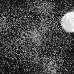
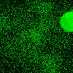

|  Method            | Parameters       | Quick Start Reader | Original Reader | Delta  |
| -------------------|------------------|--------------------|-----------------|------- |
| Initialization     |                  |7 ms|8 ms|        |
| Reader Size (Mb)     |                  |0.22|0.43|        |
# [qDII-CLV3-DR5-E27-LD-SAM11-T10.czi](https://zenodo.org/record/3737795/files/qDII-CLV3-DR5-E27-LD-SAM11-T10.czi) report
 - **Autostitch** = true
 - ZeissCZIReader v7.0.0
 - ZeissQuickStartCZIReader v0.2.2-SNAPSHOT

# Images 

| Series            | Quick Start Reader | Size | Original Reader | Size | #Diffs |
|-------------------|--------------------|------|-----------------|------|--------|
| Read time (all)   |86 ms|------|96 ms|------|--------|
|0||X:1024 Y:1024 C:4 Z:45 T:1||X:1024 Y:1024 C:4 Z:45 T:1|0|

# Metadata

